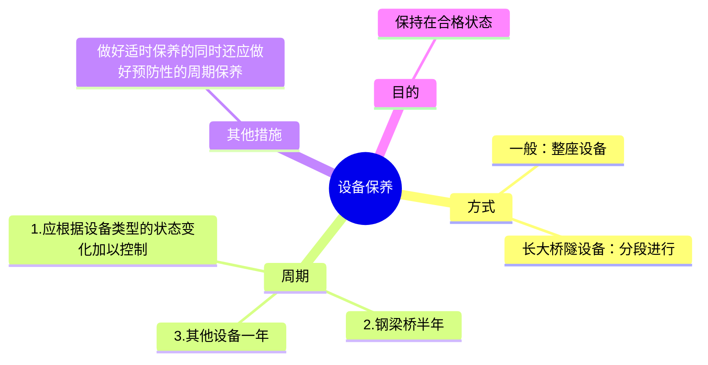
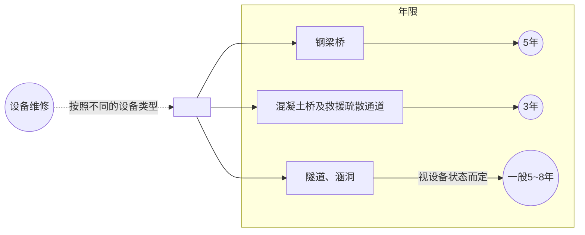

## 2024 年 7 月份业务学习

:::tip 学习内容
理论知识 124~133
:::

## 2024 年 7 月 9 日

### 124.桥隧建筑物保养周期是如何规定的？

:::details 答案
周期性保养工作一般应以整座设备进行，长大桥隧设备也可分区段进行。保养周期应按不同设备类型的状态变化加以控制，钢桥(含混合桥钢梁、钢拱桥、钢箱拱、钢管混凝土拱，钢-混凝土结合梁等)半年，其他设备一年。在做好适时保养的同时，还应加强预防性的周期保养，使设备经常保持在合格状态。

:::

### 125.高速铁路桥隧建筑物综合维修周期是如何规定的？

:::details 答案
按照不同设备类型确定桥隧建筑物综合维修周期:钢梁桥(含混合桥钢梁、钢拱)3 年，混凝土桥及救援疏散通道 5 年，隧道、涵洞等视设备状态而定，一般 5 ～ 8 年。

:::

### 126.什么情况下混凝土施工应按冬期施工处理？

:::details 答案
当环境昼夜平均气温（最高和最低气温的平均值或当地时间 6 时、14 时及 21 时室外气温的平均值）连续 3d 低于 5℃ 或最低气温低于-3℃ 时，混凝土施工应按冬期施工处理。
:::

## 2024 年 7 月 10 日

### 127.隧道内排水应达到什么要求？

:::details 答案
（1）拱部不滴水，边墙不淌水，安装设备之孔眼不渗水；

（2）隧道不冒水，道床不积水；

（3）在有冻害地段的隧道，拱部和边墙基本上不渗水，衬砌背后不积水。
:::

### 128.对运营中的钢梁禁止使用哪些方式增加检查和安全设施？

:::details 答案
对运营中的钢梁，禁止使用电焊加固或采用电焊联结主梁的方式增加检查和安全设施。
:::

### 129.高速铁路灾害监测系统设置的原则是什么？

:::details 答案
灾害监测系统工程设计应根据铁路沿线气象、地形地貌、地质等自然条件及工程特点合理确定灾害监测系统的监测对象和设置原则。设计速度 200km/h 及以上区段应设置风、雨、雪、地震及上跨铁路的道路桥梁异物侵限监测系统。设计速度 200km/h 以下区段应设置雨量监测系统。
:::

## 2024 年 7 月 13 日

### 130.地震设防地段梁端或墩台顶应设置防落梁挡块，防落梁挡块的设置要求是什么？

:::details 答案
防落梁挡块采用Q235焊接工型钢，高度不宜小于50cm，挡块中心与支座中心一致，连接螺栓应满足抗震要求。
:::

### 131.轨道铺设完成后，预应力混凝土梁竖向残余徐变变形应满足那些限值？

:::details 答案
- 对有砟轨道桥面，梁体的竖向变形不应大于20mm。
- 对无砟桥面，跨度50m及以下，梁体的竖向变形不应大于10mm；跨度大于50m，梁体的竖向变形不应大于跨度的1/5000，且不大于20mm。
:::

### 132.施工（维修）作业“三清点、一确认”制度内容是什么？

:::details 答案
上道作业实行“三清点”：入网前、下道后、出网前要对工机具、材料、人员进行清点。“一确认”：作业完毕，施工负责人对设备状态、工机具清理、人员撤离、防护撤除等进行检查，确认开通条件，并将照片传递到驻站联络员，驻站联络员确认后方可销记。
:::

### 133.高强度螺栓连接副应怎样组装？

:::details 答案
组装时，螺栓头一侧及螺母一侧应各置一个垫圈，垫圈有内倒角的一侧应朝向螺栓头、螺母支承面。
:::