# 第二部分如何编写 HTTP 模块

-   第 3 章开发一个简单的 HTTP 模块
-   第 4 章配置、error 日志和请求上下文
-   第 5 章访问第三方服务
-   第 6 章开发一个简单的 HTTP 过滤模块
-   第 7 章 Nginx 提供的高级数据结构

## 第 3 章开发一个简单的 HTTP 模块

当通过开发 HTTP 模块来实现产品功能时，是可以完全享用 Nginx 的优秀设计所带来的、与官方模块相同的高并发特性的。不过，如何开发一个充满异步调用、无阻塞的 HTTP 模块呢？首先，需要把程序嵌入到 Nginx 中，也就是说，最终编译出的二进制程序 Nginx 要包含我们的代码（见 [3.3 节](#_3-3-如何将自己的-http-模块编译进-nginx)）；其次，这个全新的 HTTP 模块要能介入到 HTTP 请求的处理流程中（具体参见 [3.1 节](#_3-1-如何调用-http-模块)、[3.4 节](#_3-4-http-模块的数据结构)、[3.5 节](#_3-5-定义自己的-http-模块)）。满足上述两个前提后，我们的模块才能开始处理 HTTP 请求，但在开始处理请求前还需要先了解一些 Nginx 框架定义的数据结构（见 [3.2 节](#_3-2-准备工作)），这是后面必须要用到的；正式处理请求时，还要可以获得 Nginx 框架接收、解析后的用户请求信息（见 [3.6 节](#_3-6-处理用户请求)）；业务执行完毕后，则要考虑发送响应给用户（见 [3.7 节](#_3-7-发送响应)），包括将磁盘中的文件以 HTTP 包体的形式发送给用户（见 [3.8 节](#_3-8-将磁盘文件作为包体发送)）。

本章最后会讨论如何用 C++语言来编写 HTTP 模块，这虽然不是 Nginx 官方倡导的方式，但 C++向前兼容 C 语言，使用 C++语言开发的模块还是可以很容易地嵌入到 Nginx 中。本章不会深入探讨 HTTP 模块与 Nginx 的各个核心模块是如何配合工作的，而且这部分提到的每个接口将只涉及用法而不涉及实现原理，在第 3 部分我们才会进一步阐述本章提到的许多接口是如何实现异步访问的。

### 3.1 如何调用 HTTP 模块

在开发 HTTP 模块前，首先需要了解典型的 HTTP 模块是如何介入 Nginx 处理用户请求流程的。图 3-1 是一个简化的时序图，这里省略了许多异步调用，忽略了多个不同的 HTTP 处理阶段，仅标识了在一个典型请求的处理过程中主要模块被调用的流程，以此帮助读者理解 HTTP 模块如何处理用户请求。完整的流程将在第 11 章中详细介绍。

图 3-1 Nginx HTTP 模块调用的简化流程

```mermaid
graph LR
    subgraph 主循环
        direction TB
        A[worker 进程主循环] -->|调用事件模块| B[事件模块]
        B -->|建立TCP连接| C[HTTP框架]
    end
    subgraph HTTP处理
        direction TB
        C -->|接收请求的HTTP包头| D[HTTP处理模块]
        D -->|根据 location 配置调用 HTTP 模块处理请求| E[HTTP过滤模块链表]
        E -->|处理请求| F[其他HTTP处理模块]
    end
    subgraph 响应处理
        direction TB
        F -->|发送 HTTP响应时依次调用所有HTTP过滤模块| G[客户端]
        G -->|所有 HTTP过滤模块返回| H[处理后返回]
        H -->|控制权交还| I[worker 进程主循环]
    end
```



从图 3-1 中看到，worker 进程会在一个 for 循环语句里反复调用事件模块检测网络事件。

当事件模块检测到某个客户端发起的 TCP 请求时（接收到 SYN 包），将会为它建立 TCP 连接，成功建立连接后根据 nginx.conf 文件中的配置会交由 HTTP 框架处理。HTTP 框架会试图接收完整的 HTTP 头部，并在接收到完整的 HTTP 头部后将请求分发到具体的 HTTP 模块中处理。这种分发策略是多样化的，其中最常见的是根据请求的 URI 和 nginx.conf 里 location 配置项的匹配度来决定如何分发（本章的例子正是应用这种分发策略，在第 10 章中会介绍其他分发策略）。HTTP 模块在处理请求的结束时，大多会向客户端发送响应，此时会自动地依次调用所有的 HTTP 过滤模块，每个过滤模块可以根据配置文件决定自己的行为。例如，gzip 过滤模块根据配置文件中的 gzip on|off 来决定是否压缩响应。HTTP 处理模块在返回时会将控制权交还给 HTTP 框架，如果在返回前设置了 subrequest，那么 HTTP 框架还会继续异步地调用适合的 HTTP 模块处理子请求。

开发 HTTP 模块时，首先要注意的就是 HTTP 框架到具体的 HTTP 模块间数据流的传递，以及开发的 HTTP 模块如何与诸多的过滤模块协同工作（第 10 章、第 11 章会详细介绍 HTTP 框架）。下面正式进入 HTTP 模块的开发环节。

### 3.2 准备工作

Nginx 模块需要使用 C（或者 C++）语言编写代码来实现，每个模块都要有自己的名字。

按照 Nginx 约定俗成的命名规则，我们把第一个 HTTP 模块命名为 ngx_http_mytest_module。由于第一个模块非常简单，一个 C 源文件就可以完成，所以这里按照官方惯例，将唯一的源代码文件命名为 ngx_http_mytest_module.c。

实际上，我们还需要定义一个名称，以便在编译前的 configure 命令执行时显示是否执行成功（即 configure 脚本执行时的 ngx_addon_name 变量）。为方便理解，仍然使用同一个模块名来表示，如 ngx_http_mytest_module。

为了让 HTTP 模块正常工作，首先需要把它编译进 Nginx（3.3 节会探讨编译新增模块的两种方式）。其次需要设定模块如何在运行中生效，比如在图 3-1 描述的典型方式中，配置文件中的 location 块决定了匹配某种 URI 的请求将会由相应的 HTTP 模块处理，因此，运行时 HTTP 框架会在接收完毕 HTTP 请求的头部后，将请求的 URI 与配置文件中的所有 location 进行匹配（事实上会优先匹配虚拟主机，第 11 章会详细说明该流程），匹配后再根据 location{}内的配置项选择 HTTP 模块来调用。这是一种最典型的 HTTP 模块调用方式。3.4 节将解释 HTTP 模块定义嵌入方式时用到的数据结构，3.5 节将定义我们的第一个 HTTP 模块，3.6 节中介绍如何使用上述模块调用方式来处理请求。

既然有典型的调用方式，自然也有非典型的调用方式，比如 ngx_http_access_module 模块，它是根据 IP 地址决定某个客户端是否可以访问服务的，因此，这个模块需要在 NGX_HTTP_ACCESS_PHASE 阶段（在第 10 章中会详述 HTTP 框架定义的 11 个阶段）生效，它会比本章介绍的 mytest 模块更早地介入请求的处理中，同时它的流程与图 3-1 中的不同，它可以对所有请求产生作用。也就是说，任何 HTTP 请求都会调用 ngx_http_access_module 模块处理，只是该模块会根据它感兴趣的配置项及所在的配置块来决定行为方式，这与 mytest 模块不同，在 mytest 模块中，只有在配置了 location/uri{mytest;}后，HTTP 框架才会在某个请求匹配了/uri 后调用它处理请求。如果某个匹配了 URI 请求的 location 中没有配置 mytest 配置项， mytest 模块依然是不会被调用的。

为了做到跨平台，Nginx 定义、封装了一些基本的数据结构。由于 Nginx 对内存分配比较“吝啬”（只有保证低内存消耗，才可能实现十万甚至百万级别的同时并发连接数），所以这些 Nginx 数据结构天生都是尽可能少占用内存。下面介绍本章中将要用到的 Nginx 定义的几个基本数据结构和方法，在第 7 章还会介绍一些复杂的容器，读者可以从中体会到如何才能有效地利用内存。

#### 3.2.1 整型的封装

Nginx 使用 ngx_int_t 封装有符号整型，使用 ngx_uint_t 封装无符号整型。Nginx 各模块的变量定义都是如此使用的，建议读者沿用 Nginx 的习惯，以此替代 int 和 unsigned int。

在 Linux 平台下，Nginx 对 ngx_int_t 和 ngx_uint_t 的定义如下：

```c
typedef intptr_t ngx_int_t;
typedef uintptr_t ngx_uint_t;
```

#### 3.2.2 ngx_str_t 数据结构

在 Nginx 的领域中，ngx_str_t 结构就是字符串。ngx_str_t 的定义如下：

```c
typedef struct {
    size_t len;
    u_char *data;
} ngx_str_t;
```

ngx_str_t 只有两个成员，其中 data 指针指向字符串起始地址，len 表示字符串的有效长度。注意，ngx_str_t 的 data 成员指向的并不是普通的字符串，因为这段字符串未必会以'\0'作为结尾，所以使用时必须根据长度 len 来使用 data 成员。例如，在 3.7.2 节中，我们会看到 r->method_name 就是一个 ngx_str_t 类型的变量，比较 method_name 时必须如下这样使用：

```c
if (0 == ngx_strncmp(
    r->method_name.data,
    "PUT",
    r->method_name.len)
)
```

这里，ngx_strncmp 其实就是 strncmp 函数，为了跨平台 Nginx 习惯性地对其进行了名称上的封装，下面看一下它的定义：

```c
#define ngx_strncmp(s1, s2, n) strncmp((const char *) s1, (const char *) s2, n)
```

任何试图将 ngx_str_t 的 data 成员当做字符串来使用的情况，都可能导致内存越界！Nginx 使用 ngx_str_t 可以有效地降低内存使用量。例如，用户请求“GET/testa=1 HTTP/1.1\r\n”存储到内存地址 0x1d0b0110 上，这时只需要把 r->method_name 设置为{len=3,data=0x1d0b0110}就可以表示方法名“GET”，而不需要单独为 method_name 再分配内存冗余的存储字符串。

#### 3.2.3 ngx_list_t 数据结构

ngx_list_t 是 Nginx 封装的链表容器，它在 Nginx 中使用得很频繁，例如 HTTP 的头部就是用 ngx_list_t 来存储的。当然，C 语言封装的链表没有 C++或 Java 等面向对象语言那么容易理解。

先看一下 ngx_list_t 相关成员的定义：

```c
typedef struct ngx_list_part_s  ngx_list_part_t;

struct ngx_list_part_s {
    void             *elts;
    ngx_uint_t        nelts;
    ngx_list_part_t  *next;
};

typedef struct {
    ngx_list_part_t  *last;
    ngx_list_part_t   part;
    size_t            size;
    ngx_uint_t        nalloc;
    ngx_pool_t       *pool;
} ngx_list_t;
```

ngx_list_t 描述整个链表，而 ngx_list_part_t 只描述链表的一个元素。这里要注意的是，ngx_list_t 不是一个单纯的链表，为了便于理解，我们姑且称它为存储数组的链表，什么意思呢？抽象地说，就是每个链表元素 ngx_list_part_t 又是一个数组，拥有连续的内存，它既依赖于 ngx_list_t 里的 size 和 nalloc 来表示数组的容量，同时又依靠每个 ngx_list_part_t 成员中的 nelts 来表示数组当前已使用了多少容量。因此，ngx_list_t 是一个链表容器，而链表中的元素又是一个数组。事实上，ngx_list_part_t 数组中的元素才是用户想要存储的东西，ngx_list_t 链表能够容纳的元素数量由 ngx_list_part_t 数组元素的个数与每个数组所能容纳的元素相乘得到。

这样设计有什么好处呢？

-   链表中存储的元素是灵活的，它可以是任何一种数据结构。
-   链表元素需要占用的内存由 ngx_list_t 管理，它已经通过数组分配好了。
-   小块的内存使用链表访问效率是低下的，使用数组通过偏移量来直接访问内存则要高效得多。

下面详述每个成员的意义。

（1）ngx_list_t

-   part：链表的首个数组元素。
-   last：指向链表的最后一个数组元素。
-   size：前面讲过，链表中的每个 ngx_list_part_t 元素都是一个数组。因为数组存储的是某种类型的数据结构，且 ngx_list_t 是非常灵活的数据结构，所以它不会限制存储什么样的数据，只是通过 size 限制每一个数组元素的占用的空间大小，也就是用户要存储的一个数据所占用的字节数必须小于或等于 size。
-   nalloc：链表的数组元素一旦分配后是不可更改的。nalloc 表示每个 ngx_list_part_t 数组的容量，即最多可存储多少个数据。
-   pool：链表中管理内存分配的内存池对象。用户要存放的数据占用的内存都是由 pool 分配的，下文中会详细介绍。

（2）ngx_list_part_t

-   elts：指向数组的起始地址。
-   nelts：表示数组中已经使用了多少个元素。当然，nelts 必须小于 ngx_list_t 结构体中的 nalloc。
-   next：下一个链表元素 ngx_list_part_t 的地址。

事实上，ngx_list_t 中的所有数据都是由 ngx_pool_t 类型的 pool 内存池分配的，它们通常都是连续的内存（在由一个 pool 内存池分配的情况下）。下面以图 3-2 为例来看一下 ngx_list_t 的内存分布情况。


图 3-2 中是由 3 个 ngx_list_part_t 数组元素组成的 ngx_list_t 链表可能拥有的一种内存分布结构，读者可以从这种较为常见的内存分布中看到 ngx_list_t 链表的用法。这里，pool 内存池为其分配了连续的内存，最前端内存存储的是 ngx_list_t 结构中的成员，紧接着是第一个 ngx_list_part_t 结构占用的内存，然后是 ngx_list_part_t 结构指向的数组，它们一共占用 size\*nalloc 字节，表示数组中拥有 nalloc 个大小为 size 的元素。其后面是第 2 个 ngx_list_part_t 结构以及它所指向的数组，依此类推。

对于链表，Nginx 提供的接口包括：ngx_list_create 接口用于创建新的链表，ngx_list_init 接口用于初始化一个已有的链表，ngx_list_push 接口用于添加新的元素，如下所示：

```c
ngx_list_t *ngx_list_create(ngx_pool_t *pool, ngx_uint_t n, size_t size);

static ngx_inline ngx_int_t
ngx_list_init(ngx_list_t *list, ngx_pool_t *pool, ngx_uint_t n, size_t size)
{
    list->part.elts = ngx_palloc(pool, n * size);
    if (list->part.elts == NULL) {
        return NGX_ERROR;
    }

    list->part.nelts = 0;
    list->part.next = NULL;
    list->last = &list->part;
    list->size = size;
    list->nalloc = n;
    list->pool = pool;

    return NGX_OK;
}


/*
 *
 *  the iteration through the list:
 *
 *  part = &list.part;
 *  data = part->elts;
 *
 *  for (i = 0 ;; i++) {
 *
 *      if (i >= part->nelts) {
 *          if (part->next == NULL) {
 *              break;
 *          }
 *
 *          part = part->next;
 *          data = part->elts;
 *          i = 0;
 *      }
 *
 *      ...  data[i] ...
 *
 *  }
 */


void *ngx_list_push(ngx_list_t *list);
```

调用 ngx_list_create 创建元素时，pool 参数是内存池对象（参见 3.7.2 节），size 是每个元素的大小，n 是每个链表数组可容纳元素的个数（相当于 ngx_list_t 结构中的 nalloc 成员）。

ngx_list_create 返回新创建的链表地址，如果创建失败，则返回 NULL 空指针。ngx_list_init 的使用方法与 ngx_list_create 非常类似，需要注意的是，这时链表数据结构已经创建好了，若 ngx_list_init 返回 NGX_OK，则表示初始化成功，若返回 NGX_ERROR，则表示失败。

调用 ngx_list_push 表示添加新的元素，传入的参数是 ngx_list_t 链表。正常情况下，返回的是新分配的元素首地址。如果返回 NULL 空指针，则表示添加失败。在使用它时通常先调用 ngx_list_push 得到返回的元素地址，再对返回的地址进行赋值。例如：

```c
ngx_str_t* str = ngx_list_push(testlist);
if (str == NULL) {
    return NGX_ERROR;
}
str->len= sizeof("Hello world");
str->data = "Hello world";
```

遍历链表时 Nginx 没有提供相应的接口，实际上也不需要。我们可以用以下方法遍历链表中的元素：

```c
// part 用于指向链表中的每一个ngx_list_part_t 数组
ngx_list_part_t* part = &testlist.part; // 根据链表中的数据类型，把数组里的 elts 转化为该类型使用
ngx_str_t* str = part->elts; // i 表示元素在链表的每个 ngx_list_part_t 数组里的序号
for (i = 0; /* void */; i++) {
    if (i >= part->nelts) {
        if (part->next == NULL) {
        // 如果某个 ngx_list_part_t 数组的 next 指针为空，
        // 则说明已经遍历完链表
        break;
        }
        // 访问下一个 ngx_list_part_t
        part = part->next;
        str = part->elts;
        // 将 i 序号置为0，准备重新访问下一个数组
        i = 0;
    }

    // 这里可以很方便地取到当前遍历到的链表元素
    printf("list element: %*s\n",str[i].len, str[i].data);
}
```

#### 3.2.4 ngx_table_elt_t 数据结构

ngx_table_elt_t 数据结构如下所示：

```c
typedef struct {
  ngx_uint_t hash;
  ngx_str_t key;
  ngx_str_t value;
  u_char *lowcase_key;
} ngx_table_elt_t;
```

可以看到，ngx_table_elt_t 就是一个 key/value 对，ngx_str_t 类型的 key、value 成员分别存储的是名字、值字符串。hash 成员表明 ngx_table_elt_t 也可以是某个散列表数据结构（ngx_hash_t 类型）中的成员。ngx_uint_t 类型的 hash 成员可以在 ngx_hash_t 中更快地找到相同 key 的 ngx_table_elt_t 数据。lowcase_key 指向的是全小写的 key 字符串。

显而易见，ngx_table_elt_t 是为 HTTP 头部“量身订制”的，其中 key 存储头部名称（如 Content-Length），value 存储对应的值（如“1024”），lowcase_key 是为了忽略 HTTP 头部名称的大小写（例如，有些客户端发来的 HTTP 请求头部是 content-length，Nginx 希望它与大小写敏感的 Content-Length 做相同处理，有了全小写的 lowcase_key 成员后就可以快速达成目的了），hash 用于快速检索头部（它的用法在 3.6.3 节中进行详述）。

#### 3.2.5 ngx_buf_t 数据结构

缓冲区 ngx_buf_t 是 Nginx 处理大数据的关键数据结构，它既应用于内存数据也应用于磁盘数据。下面主要介绍 ngx_buf_t 结构体本身，而描述磁盘文件的 ngx_file_t 结构体则在 3.8.1 节中说明。下面来看一下相关代码：

```c
typedef struct ngx_buf_s ngx_buf_t;
typedef void * ngx_buf_tag_t;
struct ngx_buf_s {
/* pos 通常是用来告诉使用者本次应该从 pos 这个位置开始处理内存中的数据，这样设置是因为同一个 ngx_buf_t 可能被多次反复处理。当然， pos 的含义是由使用它的模块定义的 */
u_char _pos;
/*last 通常表示有效的内容到此为止，注意， pos 与 last 之间的内存是希望 nginx 处理的内容 */
u*char *last;
/*处理文件时， file_pos 与 file_last 的含义与处理内存时的pos 与 last 相同， file_pos 表示将要处理的文件位置，file_last 表示截止的文件位置 */
off_t file_pos;
off_t file_last;
// 如果 ngx_buf_t 缓冲区用于内存，那么 start 指向这段内存的起始地址 u_char *start;与 start 成员对应，指向缓冲区内存的末尾
u_char *end;
/*表示当前缓冲区的类型，例如由哪个模块使用就指向这个模块 ngx_module_t 变量的地址 */
ngx_buf_tag_t tag;
// 引用的文件
ngx_file_t *file;
/*当前缓冲区的影子缓冲区，该成员很少用到，仅仅在 12.8 节描述的使用缓冲区转发上游服务器的响应时才使用了 shadow 成员，这是因为 Nginx 太节约内存了，分配一块内存并使用 ngx*buf_t 表示接收到的上游服务器响应后，在向下游客户端转发时可能会把这块内存存储到文件中，也可能直接向下游发送，此时 Nginx 绝不会重新复制一份内存用于新的目的，而是再次建立一个 ngx_buf_t 结构体指向原内存，这样多个 ngx_buf_t 结构体指向了同一块内存，它们之间的关系就通过 shadow 成员来引用。这种设计过于复杂，通常不建议使用 */
ngx_buf_t *shadow;
// 临时内存标志位，为 1 时表示数据在内存中且这段内存可以修改
 unsigned temporary:1;
// 标志位，为 1 时表示数据在内存中且这段内存不可以被修改
unsigned memory:1;
// 标志位，为 1 时表示这段内存是用 mmap 系统调用映射过来的，不可以被修改
unsigned mmap:1;
// 标志位，为 1 时表示可回收
unsigned recycled:1;
// 标志位，为 1 时表示这段缓冲区处理的是文件而不是内存
unsigned in_file:1;
// 标志位，为 1 时表示需要执行 flush 操作
unsigned flush:1;
/*标志位，对于操作这块缓冲区时是否使用同步方式，需谨慎考虑，这可能会阻塞 Nginx 进程， Nginx 中所有操作几乎都是异步的，这是它支持高并发的关键。有些框架代码在 sync 为 1 时可能会有阻塞的方式进行 I/O 操作，它的意义视使用它的 Nginx 模块而定 */
unsigned sync:1;
/*标志位，表示是否是最后一块缓冲区，因为 ngx_buf_t 可以由 ngx_chain_t 链表串联起来，因此，当 last_buf 为 1 时，表示当前是最后一块待处理的缓冲区 */
unsigned last_buf:1;
// 标志位，表示是否是 ngx_chain_t 中的最后一块缓冲区
unsigned last_in_chain:1;
/*标志位，表示是否是最后一个影子缓冲区，与 shadow 域配合使用。通常不建议使用它 */
unsigned last_shadow:1;
// 标志位，表示当前缓冲区是否属于临时文件
unsigned temp_file:1;
};

```

关于使用 ngx_buf_t 的案例参见 3.7.2 节。ngx_buf_t 是一种基本数据结构，本质上它提供的仅仅是一些指针成员和标志位。对于 HTTP 模块来说，需要注意 HTTP 框架、事件框架是如何设置和使用 pos、last 等指针以及如何处理这些标志位的，上述说明只是最常见的用法。（如果我们自定义一个 ngx_buf_t 结构体，不应当受限于上述用法，而应该根据业务需求自行定义。例如，在 13.7 节中用一个 ngx_buf_t 缓冲区转发上下游 TCP 流时，pos 会指向将要发送到下游的 TCP 流起始地址，而 last 会指向预备接收上游 TCP 流的缓冲区起始地址。）

#### 3.2.6 ngx_chain_t 数据结构

ngx_chain_t 是与 ngx_buf_t 配合使用的链表数据结构，下面看一下它的定义：

```c
typedef struct ngx_chain_s ngx_chain_t;
struct ngx_chain_s {
  ngx_buf_t *buf;
  ngx_chain_t *next;
};
```

buf 指向当前的 ngx_buf_t 缓冲区，next 则用来指向下一个 ngx_chain_t。如果这是最后一个 ngx_chain_t，则需要把 next 置为 NULL。

在向用户发送 HTTP 包体时，就要传入 ngx_chain_t 链表对象，注意，如果是最后一个 ngx_chain_t，那么必须将 next 置为 NULL，否则永远不会发送成功，而且这个请求将一直不会结束（Nginx 框架的要求）。

### 3.3 如何将自己的 HTTP 模块编译进 Nginx

Nginx 提供了一种简单的方式将第三方的模块编译到 Nginx 中。首先把源代码文件全部放到一个目录下，同时在该目录中编写一个文件用于通知 Nginx 如何编译本模块，这个文件名必须为 config。它的格式将在 3.3.1 节中说明。

这样，只要在 configure 脚本执行时加入参数--add-module=PATH（PATH 就是上面我们给定的源代码、config 文件的保存目录），就可以在执行正常编译安装流程时完成 Nginx 编译工作。

有时，Nginx 提供的这种方式可能无法满足我们的需求，其实，在执行完 configure 脚本后 Nginx 会生成 objs/Makefile 和 objs/ngx_modules.c 文件，完全可以自己去修改这两个文件，这是一种更强大也复杂得多的方法，我们将在 3.3.3 节中说明如何直接修改它们。

#### 3.3.1 config 文件的写法

config 文件其实是一个可执行的 Shell 脚本。如果只想开发一个 HTTP 模块，那么 config 文件中需要定义以下 3 个变量：

-   ngx_addon_name：仅在 configure 执行时使用，一般设置为模块名称。

-   HTTP_MODULES：保存所有的 HTTP 模块名称，每个 HTTP 模块间由空格符相连。在
    重新设置 HTTP_MODULES 变量时，不要直接覆盖它，因为 configure 调用到自定义的 config 脚
    本前，已经将各个 HTTP 模块设置到 HTTP_MODULES 变量中了，因此，要像如下这样设
    置：
    "$HTTP_MODULES ngx_http_mytest_module"
-   NGX_ADDON_SRCS：用于指定新增模块的源代码，多个待编译的源代码间以空格
    符相连。注意，在设置 NGX_ADDON_SRCS 时可以使用$ngx_addon_dir 变量，它等价于
    configure 执行时--add-module=PATH 的 PATH 参数。

因此，对于 mytest 模块，可以这样编写 config 文件：

```ini
ngx_addon_name=ngx_http_mytest_module
HTTP_MODULES="$HTTP_MODULES ngx_http_mytest_module"
NGX_ADDON_SRCS="$NGX_ADDON_SRCS $ngx_addon_dir/ngx_http_mytest_module.c"
```

注意以上 3 个变量并不是唯一可以在 config 文件中自定义的部分。如果我们不是开发 HTTP 模块，而是开发一个 HTTP 过滤模块，那么就要用 HTTP_FILTER_MODULES 替代上面的 HTTP_MODULES 变量。事实上，包括$CORE_MODULES、$EVENT_MODULES、$HTTP_MODULES、$HTTP_FILTER_MODULES、$HTTP_HEADERS_FILTER_MODULE 等模块变量都可以重定义，它们分别对应着 Nginx 的核心模块、事件模块、HTTP 模块、HTTP过滤模块、HTTP 头部过滤模块。除了 NGX_ADDON_SRCS 变量，或许还有一个变量我们会用到，即$NGX_ADDON_DEPS 变量，它指定了模块依赖的路径，同样可以在 config 中设置。

#### 3.3.2 利用 configure 脚本将定制的模块加入到 Nginx 中

在 1.6 节提到的 configure 执行流程中，其中有两行脚本负责将第三方模块加入到 Nginx 中，如下所示。

```zsh
. auto/modules
. auto/make
```

下面完整地解释一下 configure 脚本是如何与 3.3.1 节中提到的 config 文件配合起来把定制的第三方模块加入到 Nginx 中的。

在执行 configure--add-module=PATH 命令时，PATH 就是第三方模块所在的路径。在 configure 中，通过 auto/options 脚本设置了 NGX_ADDONS 变量：

```zsh
--add-module=\*) NGX_ADDONS="$NGX_ADDONS $value" ;;
```

在 configure 命令执行到 auto/modules 脚本时，将在生成的 ngx_modules.c 文件中加入定制的第三方模块。

```ini
if test -n "$NGX_ADDONS"; then
echo configuring additional modules
for ngx_addon_dir in $NGX_ADDONS
do
echo "adding module in $ngx_addon_dir"
if test -f $ngx_addon_dir/config; then
在这里执行自定义的
config脚本
. $ngx_addon_dir/config
echo " + $ngx_addon_name was configured"
else
echo "$0: error: no $ngx_addon_dir/config was found"
exit 1
fi
done
fi
```

可以看到，$NGX_ADDONS 可以包含多个目录，对于每个目录，如果其中存在 config 文件就会执行，也就是说，在 config 中重新定义的变量都会生效。之后，auto/modules 脚本开始创建 ngx_modules.c 文件，这个文件的关键点就是定义了 ngx_module_t\*ngx_modules[]数组，这个数组存储了 Nginx 中的所有模块。Nginx 在初始化、处理请求时，都会循环访问 ngx_modules 数组，确定该用哪一个模块来处理。下面来看一下 auto/modules 是如何生成数组的，代码如下所示：

```zsh
modules="$CORE_MODULES $EVENT_MODULES"
if [ $USE_OPENSSL = YES ]; then
modules="$modules $OPENSSL_MODULE"
CORE_DEPS="$CORE_DEPS $OPENSSL_DEPS"
CORE_SRCS="$CORE_SRCS $OPENSSL_SRCS"
fi
if [ $HTTP = YES ]; then
modules="$modules $HTTP_MODULES $HTTP_FILTER_MODULES \
$HTTP_HEADERS_FILTER_MODULE \
$HTTP_AUX_FILTER_MODULES \
$HTTP_COPY_FILTER_MODULE \
$HTTP_RANGE_BODY_FILTER_MODULE \
$HTTP_NOT_MODIFIED_FILTER_MODULE"
NGX_ADDON_DEPS="$NGX_ADDON_DEPS \$(HTTP_DEPS)"
fi
```

首先，auto/modules 会按顺序生成 modules 变量。注意，这里的$HTTP_MODULES 等已经在 config 文件中重定义了。这时，modules 变量是包含所有模块的。然后，开始生成 ngx_modules.c 文件：

```zsh
// cat << END > $NGX_MODULES_C
include <ngx_config.h>
include <ngx_core.h>
$NGX_PRAGMA
END
for mod in $modules
do
echo "extern ngx_module_t $mod;" \>\> $NGX_MODULES_C
done
echo \>\> $NGX_MODULES_C
echo 'ngx_module_t *ngx_modules[] = {' \>\> $NGX_MODULES_C
for mod in $modules
do
向 ngx_modules数组里添加 Nginx模块
echo " &$mod," >> $NGX_MODULES_C
done
cat << END >> $NGX_MODULES_C
NULL
};
END
```

这样就已经确定了 Nginx 在运行时会调用自定义的模块，而 auto/make 脚本负责把相关模
块编译进 Nginx。

在 Makefile 中生成编译第三方模块的源代码如下：

```Makefile
if test -n "$NGX_ADDON_SRCS"; then
ngx_cc="\$(CC) $ngx_compile_opt \$(CFLAGS) $ngx_use_pch \$(ALL_INCS)"
for ngx_src in $NGX_ADDON_SRCS
do
ngx_obj="addon/`basename \`dirname $ngx_src\``"
ngx_obj=`echo $ngx_obj/\`basename $ngx_src\` \
| sed -e "s/\// $ngx_regex_dirsep/g"`
ngx_obj=`echo $ngx_obj \
| sed -e
"s#^\(.*\.\)cpp\\$#$ngx_objs_dir\1$ngx*objext#g" \
-e
"s#^\(.*\.\)cc\\$#$ngx*objs_dir\1$ngx_objext#g" \
-e
"s#^\(.*\.\)c\\$#$ngx_objs_dir\1$ngx_objext#g" \
-e
"s#^\(.*\.\)S\\$#$ngx_objs_dir\1$ngx_objext#g"`
ngx_src=`echo $ngx_src | sed -e "s/\// $ngx_regex_dirsep/g"`
cat \<\< END \>\> $NGX_MAKEFILE
$ngx_obj: \$(ADDON_DEPS)$ngx_cont$ngx_src
$ngx_cc$ngx_tab$ngx_objout$ngx_obj$ngx_tab$ngx_src$NGX_AUX
END
done
fi
```

下面这段代码用于将各个模块的目标文件设置到 ngx_obj 变量中，紧接着会生成 Makefile 里的链接代码，并将所有的目标文件、库文件链接成二进制程序。

```zsh
for ngx_src in $NGX_ADDON_SRCS
do
ngx_obj="addon/`basename \`dirname $ngx_src\``"
test -d $NGX_OBJS/$ngx_obj || mkdir -p $NGX_OBJS/$ngx_obj
ngx_obj=`echo $ngx_obj/\`basename $ngx_src\` \
| sed -e "s/\// $ngx_regex_dirsep/g"`
ngx_all_srcs="$ngx_all_srcs $ngx_obj"
done…
cat \<\< END \>\> $NGX_MAKEFILE
$NGX_OBJS${ngx_dirsep}nginx${ngx_binext}:
$ngx_deps$ngx_spacer \$(LINK)
${ngx_long_start}${ngx_binout}$NGX_OBJS${ngx_dirsep}nginx$ngx_long_cont$ngx
objs$ngxlibs$ngx_link
$ngx_rcc
${ngx_long_end}
END
```

综上可知，第三方模块就是这样嵌入到 Nginx 程序中的。

#### 3.3.3 直接修改 Makefile 文件

3.3.2 节中介绍的方法毫无疑问是最方便的，因为大量的工作已由 Nginx 中的 configure 脚本帮我们做好了。在使用其他第三方模块时，一般也推荐使用该方法。

我们有时可能需要更灵活的方式，比如重新决定 ngx_module_t\*ngx_modules[]数组中各个模块的顺序，或者在编译源代码时需要加入一些独特的编译选项，那么可以在执行完 configure 后，对生成的 objs/ngx_modules.c 和 objs/Makefile 文件直接进行修改。

在修改 objs/ngx_modules.c 时，首先要添加新增的第三方模块的声明，如下所示。

```c

extern ngx_module_t ngx_http_mytest_module;
```

其次，在合适的地方将模块加入到 ngx_modules 数组中。

```c
ngx_module_t \*ngx_modules[] = {
…
&ngx_http_upstream_ip_hash_module,
&ngx_http_mytest_module,
&ngx_http_write_filter_module,
…
NULL
};
```

注意，模块的顺序很重要。如果同时有两个模块表示对同一个请求感兴趣，那么只有顺序在前的模块会被调用。

修改 objs/Makefile 时需要增加编译源代码的部分，例如：

```Makefile
objs/addon/httpmodule/ngx_http_mytest_module.o: $(ADDON_DEPS) \
../sample/httpmodule// ngx_http_mytest_module.c
$(CC) -c $(CFLAGS) $(ALL_INCS) \
-o objs/addon/httpmodule/ngx_http_mytest_module.o \
../sample/httpmodule// ngx_http_mytest_module.c
```

还需要把目标文件链接到 Nginx 中，例如：

```Makefile
objs/nginx: objs/src/core/nginx.o \
...
objs/addon/httpmodule/ngx_http_mytest_module.o \
objs/ngx_modules.o
$(LINK) -o objs/nginx \
objs/src/core/nginx.o \
...
objs/addon/httpmodule/ngx_http_mytest_module.o \
objs/ngx_modules.o \
-lpthread -lcrypt -lpcre -lcrypto -lcrypto -lz
```

请慎用这种直接修改 Makefile 和 ngx_modules.c 的方法，不正确的修改可能导致 Nginx 工作
不正常。

### 3.4 HTTP 模块的数据结构

定义 HTTP 模块方式很简单，例如：

```c
ngx_module_t ngx_http_mytest_module;
```

其中，ngx_module_t 是一个 Nginx 模块的数据结构（详见 8.2 节）。下面来分析一下 Nginx 模块中所有的成员，如下所示：

```c
typedef struct ngx_module_s ngx_module_t;

struct ngx_module_s {
/* 下面的 ctx_index、 index、 spare0、 spare1、 spare2、 spare3、 version 变量不需要在定义时赋值，可以用 Nginx 准备好的宏 NGX_MODULE_V1 来定义，它已经定义好了这 7 个值。 #define NGX_MODULE_V1 0, 0, 0, 0, 0, 0, 1 对于一类模块（由下面的 type 成员决定类别）而言， ctx_index 表示当前模块在这类模块中的序号。这个成员常常是由管理这类模块的一个 Nginx 核心模块设置的，对于所有的 HTTP 模块而言， ctx_index 是由核心模块 ngx_http_module 设置的。 ctx_index 非常重要， Nginx 的模块化设计非常依赖于各个模块的顺序，它们既用于表达优先级，也用于表明每个模块的位置，借以帮助 Nginx 框架快速获得某个模块的数据（ HTTP 框架设置 ctx_index 的过程参见 10.7 节） */
ngx_uint_t ctx_index;

/*index 表示当前模块在 ngx_modules 数组中的序号。注意， ctx_index 表示的是当前模块在一类模块中的序号，而 index 表示当前模块在所有模块中的序号，它同样关键。 Nginx 启动时会根据 ngx*modules 数组设置各模块的 index 值。例如： ngx_max_module = 0;
for (i = 0; ngx_modules[i]; i++) {
ngx_modules[i]-\>index = ngx_max_module++; }
*/
ngx_uint_t index;

// spare 系列的保留变量，暂未使用
ngx_uint_t spare0;
ngx_uint_t spare1;
ngx_uint_t spare2;
ngx_uint_t spare3;

// 模块的版本，便于将来的扩展。目前只有一种，默认为 1
ngx_uint_t version;

/*ctx 用于指向一类模块的上下文结构体，为什么需要 ctx 呢？因为前面说过， Nginx 模块有许多种类，不同类模块之间的功能差别很大。例如，事件类型的模块主要处理 I/O 事件相关的功能， HTTP 类型的模块主要处理 HTTP 应用层的功能。这样，每个模块都有了自己的特性，而 ctx 将会指向特定类型模块的公共接口。例如，在 HTTP 模块中， ctx 需要指向 ngx_http_module_t 结构体 */
void *ctx;

// commands 将处理 nginx.conf 中的配置项，详见第 4 章
ngx_command_t *commands;

/*type 表示该模块的类型，它与 ctx 指针是紧密相关的。在官方 Nginx 中，它的取值范围是以下 5 种：
NGX_HTTP_MODULE、
NGX_CORE_MODULE、
NGX_CONF_MODULE、
NGX_EVENT_MODULE、
NGX_MAIL_MODULE。这 5 种模块间的关系参考图 8-2。实际上，还可以自定义新的模块类型
*/
ngx_uint_t type;
/*在 Nginx 的启动、停止过程中，以下 7 个函数指针表示有 7 个执行点会分别调用这 7 种方法（参见 8.4 节~ 8.6 节）。对于任一个方法而言，如果不需要 Nginx 在某个时刻执行它，那么简单地把它设为 NULL 空指针即可 */
/*虽然从字面上理解应当在 master 进程启动时回调 init_master，但到目前为止，框架代码从来不会调用它，因此，可将 init_master 设为 NULL */
ngx_int_t (*init_master)(ngx_log_t *log);

/*init_module 回调方法在初始化所有模块时被调用。在 master/worker 模式下，这个阶段将在启动 worker 子进程前完成 */
ngx_int_t (_init_module)(ngx_cycle_t *cycle);

/* init*process 回调方法在正常服务前被调用。在 master/worker 模式下，多个 worker 子进程已经产生，在每个 worker 进程的初始化过程会调用所有模块的 init_process 函数 */
ngx_int_t (_init_process)(ngx_cycle_t *cycle);

/* 由于 Nginx 暂不支持多线程模式，所以 init*thread 在框架代码中没有被调用过，设为 NULL*/
ngx_int_t (*init_thread)(ngx_cycle_t *cycle);

// 同上， exit_thread 也不支持，设为 NULL
void (_exit_thread)(ngx_cycle_t *cycle);

/* exit_process 回调方法在服务停止前调用。在 master/worker 模式下， worker 进程会在退出前调用它 */
void (*exit_process)(ngx_cycle_t *cycle);

// exit_master 回调方法将在 master 进程退出前被调用
void (*exit_master)(ngx_cycle_t *cycle);

/*以下 8 个 spare_hook 变量也是保留字段，目前没有使用，但可用 Nginx 提供的 NGX_MODULE_V1_PADDING 宏来填充。看一下该宏的定义：
define NGX_MODULE_V1_PADDING 0, 0, 0, 0, 0, 0, 0, 0\*/
uintptr_t spare_hook0;
uintptr_t spare_hook1;
uintptr_t spare_hook2;
uintptr_t spare_hook3;
uintptr_t spare_hook4;
uintptr_t spare_hook5;
uintptr_t spare_hook6;
uintptr_t spare_hook7;
};
```

定义一个 HTTP 模块时，务必把 type 字段设为 NGX_HTTP_MODULE。

对于下列回调方法：init_module、init_process、exit_process、exit_master，调用它们的是 Nginx 的框架代码。换句话说，这 4 个回调方法与 HTTP 框架无关，即使 nginx.conf 中没有配置 http{...}这种开启 HTTP 功能的配置项，这些回调方法仍然会被调用。因此，通常开发 HTTP 模块时都把它们设为 NULL 空指针。这样，当 Nginx 不作为 Web 服务器使用时，不会执行 HTTP 模块的任何代码。

定义 HTTP 模块时，最重要的是要设置 ctx 和 commands 这两个成员。对于 HTTP 类型的模块来说，ngx_module_t 中的 ctx 指针必须指向 ngx_http_module_t 接口（HTTP 框架的要求）。下面先来分析 ngx_http_module_t 结构体的成员。

HTTP 框架在读取、重载配置文件时定义了由 ngx_http_module_t 接口描述的 8 个阶段，HTTP 框架在启动过程中会在每个阶段中调用 ngx_http_module_t 中相应的方法。当然，如果 ngx_http_module_t 中的某个回调方法设为 NULL 空指针，那么 HTTP 框架是不会调用它的。

```c
typedef struct {
// 解析配置文件前调用
ngx_int_t (*preconfiguration)(ngx_conf_t *cf);

// 完成配置文件的解析后调用
ngx_int_t (*postconfiguration)(ngx_conf_t *cf);

/*当需要创建数据结构用于存储 main 级别（直属于 http{...}块的配置项）的全局配置项时，可以通过create*main_conf 回调方法创建存储全局配置项的结构体 */
void *(*create_main_conf)(ngx_conf_t *cf);

// 常用于初始化main 级别配置项
char *(*init_main_conf)(ngx_conf_t *cf, void *conf);

/*当需要创建数据结构用于存储 srv 级别（直属于虚拟主机server{...}块的配置项）的配置项时，可以通过实现 create*srv_conf 回调方法创建存储 srv 级别配置项的结构体 */
void *(*create_srv_conf)(ngx_conf_t *cf);

// merge*srv_conf 回调方法主要用于合并 main 级别和 srv 级别下的同名配置项
char *(*merge_srv_conf)(ngx_conf_t cf, void prev, void *conf);

/*当需要创建数据结构用于存储 loc 级别（直属于 location{...}块的配置项）的配置项时，可以实现 create_loc_conf 回调方法 */
void *(*create_loc_conf)(ngx_conf_t *cf);

//merge_loc_conf 回调方法主要用于合并 srv 级别和 loc 级别下的同名配置项
char *(*merge_loc_conf)(ngx_conf_t cf, void prev, void *conf);
} ngx_http_module_t;
```

不过，这 8 个阶段的调用顺序与上述定义的顺序是不同的。在 Nginx 启动过程中，HTTP 框架调用这些回调方法的实际顺序有可能是这样的（与 nginx.conf 配置项有关）：

> 1）create_main_conf
> 2）create_srv_conf
> 3）create_loc_conf
> 4）preconfiguration
> 5）init_main_conf
> 6）merge_srv_conf
> 7）merge_loc_conf
> 8）postconfiguration commands

数组用于定义模块的配置文件参数，每一个数组元素都是 ngx_command_t 类型，数组的结尾用 ngx_null_command 表示。Nginx 在解析配置文件中的一个配置项时首先会遍历所有的模块，对于每一个模块而言，即通过遍历 commands 数组进行，另外，在数组中检查到 ngx_null_command 时，会停止使用当前模块解析该配置项。每一个 ngx_command_t 结构体定义了自己感兴趣的一个配置项：

```c
typedef struct ngx_command_s ngx_command_t;
struct ngx_command_s
{

    // 配置项名称，如 "gzip"
    ngx_str_t name;

    /*配置项类型， type 将指定配置项可以出现的位置。
    例如，出现在 server{}或 location{}中，以及它可以携带的参数个数 */
    ngx *uint_t type;

    // 出现了 name 中指定的配置项后，将会调用 set 方法处理配置项的参数
    char *(*set)(ngx_conf_t *cf, ngx_command_t *cmd, void *conf);

    // 在配置文件中的偏移量
    ngx *uint_t conf;

    /*通常用于使用预设的解析方法解析配置项，这是配置模块的一个优秀设计。
    它需要与 conf 配合使用，在第 4 章中详细介绍 */
    ngx_uint_t offset;

    // 配置项读取后的处理方法，必须是 ngx_conf_post_t 结构的指针
    void *post;
};
```

ngx_null_command 只是一个空的 ngx_command_t，如下所示：

```c
#define ngx_null_command { ngx_null_string, 0, NULL, 0, 0, NULL }
```

### 3.5 定义自己的 HTTP 模块

上文中我们了解了定义 HTTP 模块时需要定义哪些成员以及实现哪些方法，但在定义 HTTP 模块前，首先需要确定自定义的模块应当在什么样的场景下开始处理用户请求，也就是说，先要弄清楚我们的模块是如何介入到 Nginx 处理用户请求的流程中的。从 2.4 节中的 HTTP 配置项意义可知，一个 HTTP 请求会被许多个配置项控制，实际上这是因为一个 HTTP 请求可以被许多个 HTTP 模块同时处理。这样一来，肯定会有一个先后问题，也就是说，谁先处理请求谁的“权力”就更大。例如，ngx_http_access_module 模块的 deny 选项一旦得到满足后，Nginx 就会决定拒绝来自某个 IP 的请求，后面的诸如 root 这种访问静态文件的处理方式是得不到执行的。另外，由于同一个配置项可以从属于许多个 server、location 配置块，那么这个配置项将会针对不同的请求起作用。因此，现在面临的问题是，我们希望自己的模块在哪个时刻开始处理请求？是希望自己的模块对到达 Nginx 的所有请求都起作用，还是希望只对某一类请求（如 URI 匹配了 location 后表达式的请求）起作用？Nginx 的 HTTP 框架定义了非常多的用法，我们有很大的自由来定义自己的模块如何介入 HTTP 请求的处理，但本章只想说明最简单、最常见的 HTTP 模块应当如何编写，因此，我们这样定义第一个 HTTP 模块介入 Nginx 的方式： 1）不希望模块对所有的 HTTP 请求起作用。 2）在 nginx.conf 文件中的 http{}、server{}或者 location{}块内定义 mytest 配置项，如果一个用户请求通过主机域名、URI 等匹配上了相应的配置块，而这个配置块下又具有 mytest 配置项，那么希望 mytest 模块开始处理请求。在这种介入方式下，模块处理请求的顺序是固定的，即必须在 HTTP 框架定义的 NGX_HTTP_CONTENT_PHASE 阶段开始处理请求，具体内容下文详述。

下面开始按照这种方式定义 mytest 模块。首先，定义 mytest 配置项的处理。从上文中关于 ngx_command_t 结构的说明来看，只需要定义一个 ngx_command_t 数组，并设置在出现 mytest 配置后的解析方法由 ngx_http_mytest“担当”，如下所示：

```c
static ngx_command_t ngx_http_mytest_commands[] = {
  { ngx_string("mytest"),
  NGX_HTTP_MAIN_CONF|NGX_HTTP_SRV_CONF|NGX_HTTP_LOC_CONF|NGX_HTTP_LMT_CONF|NGX_CONF_NOARGS, ngx_http_mytest,
  NGX_HTTP_LOC_CONF_OFFSET,
  0,
  NULL },
  ngx_null_command
};
```

其中，ngx_http_mytest 是 ngx_command_t 结构体中的 set 成员（完整定义为 char*(\*set) (ngx_conf_t\*cf,ngx_command_t*cmd,void\*conf);），当在某个配置块中出现 mytest 配置项时，Nginx 将会调用 ngx_http_mytest 方法。下面看一下如何实现 ngx_http_mytest 方法。

```c
static char *
ngx_http_mytest(ngx_conf_t *cf, ngx_command_t *cmd, void *conf) {
  ngx_http_core_loc_conf_t *clcf;

  /*首先找到 mytest 配置项所属的配置块， clcf 看上去像是 location 块内的数据结构，其实不然，它可以是 main、 srv 或者 loc 级别配置项，也就是说，在每个 http{}和 server{}内也都有一个 ngx_http_core_loc_conf_t 结构体 */
  clcf = ngx_http_conf_get_module_loc_conf(cf, ngx_http_core_module);

  /*HTTP 框架在处理用户请求进行到 NGX_HTTP_CONTENT_PHASE 阶段时，如果请求的主机域名、 URI 与 mytest 配置项所在的配置块相匹配，就将调用我们实现的 ngx_http_mytest_handler 方法处理这个请求 */
  clcf->handler = ngx_http_mytest_handler;
  return NGX_CONF_OK;
}
```

当 Nginx 接收完 HTTP 请求的头部信息时，就会调用 HTTP 框架处理请求，另外在 11.6 节描述的 NGX_HTTP_CONTENT_PHASE 阶段将有可能调用 mytest 模块处理请求。在 ngx_http_mytest 方法中，我们定义了请求的处理方法为 ngx_http_mytest_handler，举个例子来说，如果用户的请求 URI 是/test/example，而在配置文件中有这样的 location 块：

```bash
Location /test {
  mytest;
}
```

那么，HTTP 框架在 NGX_HTTP_CONTENT_PHASE 阶段就会调用到我们实现的 ngx_http_mytest_handler 方法来处理这个用户请求。事实上，HTTP 框架共定义了 11 个阶段（第三方 HTTP 模块只能介入其中的 7 个阶段，详见 10.6 节），本章只关注 NGX_HTTP_CONTENT_PHASE 处理阶段，多数 HTTP 模块都在此阶段实现相关功能。下面简
单说明一下这 11 个阶段。

```c
typedef enum {
// 在接收到完整的 HTTP 头部后处理的 HTTP 阶段
NGX_HTTP_POST_READ_PHASE = 0,

/*在还没有查询到 URI 匹配的 location 前，这时 rewrite 重写 URL 也作为一个独立的 HTTP 阶段 */
NGX_HTTP_SERVER_REWRITE_PHASE,

/*根据 URI 寻找匹配的 location，这个阶段通常由 ngx_http_core_module 模块实现，不建议其他 HTTP 模块重新定义这一阶段的行为 */
NGX_HTTP_FIND_CONFIG_PHASE,

/*在 NGX_HTTP_FIND_CONFIG_PHASE 阶段之后重写 URL 的意义与 NGX_HTTP_SERVER_REWRITE_PHASE 阶段显然是不同的，因为这两者会导致查找到不同的 location 块（ location 是与 URI 进行匹配的） */
NGX_HTTP_REWRITE_PHASE,

/*这一阶段是用于在 rewrite 重写 URL 后重新跳到 NGX_HTTP_FIND_CONFIG_PHASE 阶段，找到与新的 URI 匹配的 location。所以，这一阶段是无法由第三方 HTTP 模块处理的，而仅由 ngx_http_core_module 模块使用 */
NGX_HTTP_POST_REWRITE_PHASE,

// 处理 NGX_HTTP_ACCESS_PHASE 阶段前， HTTP 模块可以介入的处理阶段
NGX_HTTP_PREACCESS_PHASE,

//这个阶段用于让 HTTP 模块判断是否允许这个请求访问 Nginx 服务器
NGX_HTTP_ACCESS_PHASE,

/*当 NGX_HTTP_ACCESS_PHASE 阶段中 HTTP 模块的 handler 处理方法返回不允许访问的错误码时（实际是 NGX_HTTP_FORBIDDEN 或者 NGX_HTTP_UNAUTHORIZED），这个阶段将负责构造拒绝服务的用户响应。所以，这个阶段实际上用于给 NGX_HTTP_ACCESS_PHASE 阶段收尾 */
NGX_HTTP_POST_ACCESS_PHASE,

/*这个阶段完全是为了 try_files 配置项而设立的。当 HTTP 请求访问静态文件资源时， try_files 配置项可以使这个请求顺序地访问多个静态文件资源，如果某一次访问失败，则继续访问 try_files 中指定的下一个静态资源。另外，这个功能完全是在 NGX_HTTP_TRY_FILES_PHASE 阶段中实现的 */
NGX_HTTP_TRY_FILES_PHASE,

// 用于处理 HTTP 请求内容的阶段，这是大部分 HTTP 模块最喜欢介入的阶段
NGX_HTTP_CONTENT_PHASE,

/*处理完请求后记录日志的阶段。例如， ngx_http_log_module 模块就在这个阶段中加入了一个 handler 处理方法，使得每个 HTTP 请求处理完毕后会记录 access_log 日志 */
NGX_HTTP_LOG_PHASE
} ngx_http_phases;
```

当然，用户可以在以上 11 个阶段中任意选择一个阶段让 mytest 模块介入，但这需要学习完第 10 章、第 11 章的内容，完全熟悉了 HTTP 框架的处理流程后才可以做到。

暂且不管如何实现处理请求的 ngx_http_mytest_handler 方法，如果没有什么工作是必须在 HTTP 框架初始化时完成的，那就不必实现 ngx_http_module_t 的 8 个回调方法，可以像下面这样定义 ngx_http_module_t 接口。

```c
static ngx*http_module_t ngx_http_mytest_module_ctx = {
NULL, /* preconfiguration */
NULL, /* postconfiguration */
NULL, /* create main configuration */
NULL, /* init main configuration */
NULL, /* create server configuration */
NULL, /* merge server configuration */
NULL, /* create location configuration */
NULL  /* merge location configuration */
};
```

最后，定义 mytest 模块：

```c
ngx_module_t ngx_http_mytest_module = {
  NGX_MODULE_V1,
  &ngx_http_mytest_module_ctx, /* 模块上下文 */
  ngx_http_mytest_commands, /* 模块指令 */
  NGX_HTTP_MODULE, /* 模块类型 */
  NULL, /* 初始化主机*/
  NULL, /* 初始化模块 */
  NULL, /* 初始化进程 */
  NULL, /* 初始化线程 */
  NULL, /* 退出线程 */
  NULL, /* 退出流程 */
  NULL, /* exit master */
  NGX_MODULE_V1_PADDING
};
```

这样，mytest 模块在编译时将会被加入到 ngx_modules 全局数组中。Nginx 在启动时，会调用所有模块的初始化回调方法，当然，这个例子中我们没有实现它们（也没有实现 HTTP 框架初始化时会调用的 ngx_http_module_t 中的 8 个方法）。

### 3.6 处理用户请求

本节介绍如何处理一个实际的 HTTP 请求。回顾一下上文，在出现 mytest 配置项时， ngx_http_mytest 方法会被调用，这时将 ngx_http_core_loc_conf_t 结构的 handler 成员指定为 ngx_http_mytest_handler，另外，HTTP 框架在接收完 HTTP 请求的头部后，会调用 handler 指向的方法。下面看一下 handler 成员的原型 ngx_http_handler_pt：

```c
typedef ngx_int_t (*ngx_http_handler_pt)(ngx_http_request_t *r);
```

从上面这段代码可以看出，实际处理请求的方法 ngx_http_mytest_handler 将接收一个 ngx_http_request_t 类型的参数 r，返回一个 ngx_int_t（参见 3.2.1 节）类型的结果。下面先探讨一下 ngx_http_mytest_handler 方法可以返回什么，再看一下参数 r 包含了哪些 Nginx 已经解析完的用户请求信息。

#### 3.6.1 处理方法的返回值

这个返回值可以是 HTTP 中响应包的返回码，其中包括了 HTTP 框架已经在/src/http/ngx_http_request.h 文件中定义好的宏，如下所示。

```c
#define NGX_HTTP_OK 200
#define NGX_HTTP_CREATED 201
#define NGX_HTTP_ACCEPTED 202
#define NGX_HTTP_NO_CONTENT 204
#define NGX_HTTP_PARTIAL_CONTENT 206
#define NGX_HTTP_SPECIAL_RESPONSE 300
#define NGX_HTTP_MOVED_PERMANENTLY 301
#define NGX_HTTP_MOVED_TEMPORARILY 302
#define NGX_HTTP_SEE_OTHER 303
#define NGX_HTTP_NOT_MODIFIED 304
#define NGX_HTTP_TEMPORARY_REDIRECT 307
#define NGX_HTTP_BAD_REQUEST 400
#define NGX_HTTP_UNAUTHORIZED 401
#define NGX_HTTP_FORBIDDEN 403
#define NGX_HTTP_NOT_FOUND 404
#define NGX_HTTP_NOT_ALLOWED 405
#define NGX_HTTP_REQUEST_TIME_OUT 408
#define NGX_HTTP_CONFLICT 409
#define NGX_HTTP_LENGTH_REQUIRED 411
#define NGX_HTTP_PRECONDITION_FAILED 412
#define NGX_HTTP_REQUEST_ENTITY_TOO_LARGE 413
#define NGX_HTTP_REQUEST_URI_TOO_LARGE 414
#define NGX_HTTP_UNSUPPORTED_MEDIA_TYPE 415
#define NGX_HTTP_RANGE_NOT_SATISFIABLE 416
/* The special code to close connection without any response */
#define NGX_HTTP_CLOSE 444
#define NGX_HTTP_NGINX_CODES 494
#define NGX_HTTP_REQUEST_HEADER_TOO_LARGE 494
#define NGX_HTTPS_CERT_ERROR 495
#define NGX_HTTPS_NO_CERT 496
#define NGX_HTTP_TO_HTTPS 497
#define NGX_HTTP_CLIENT_CLOSED_REQUEST 499
#define NGX_HTTP_INTERNAL_SERVER_ERROR 500
#define NGX_HTTP_NOT_IMPLEMENTED 501
#define NGX_HTTP_BAD_GATEWAY 502
#define NGX_HTTP_SERVICE_UNAVAILABLE 503
#define NGX_HTTP_GATEWAY_TIME_OUT 504
#define NGX_HTTP_INSUFFICIENT_STORAGE 507
```

注意以上返回值除了 RFC2616 规范中定义的返回码外，还有 Nginx 自身定义的 HTTP 返回码。例如，NGX_HTTP_CLOSE 就是用于要求 HTTP 框架直接关闭用户连接的。

在 ngx_http_mytest_handler 的返回值中，如果是正常的 HTTP 返回码，Nginx 就会按照规范构造合法的响应包发送给用户。例如，假设对于 PUT 方法暂不支持，那么，在处理方法中发现方法名是 PUT 时，返回 NGX_HTTP_NOT_ALLOWED，这样 Nginx 也就会构造类似下面的响应包给用户。

```html
http/1.1 405 Not Allowed Server: nginx/1.0.14 Date: Sat, 28 Apr 2012 06:07:17
GMT Content-Type: text/html Content-Length: 173 Connection: keepalive
<html>
    <head>
        \
        <title>405 Not Allowed\</title>
    </head>
    <body bgcolor="white">
        <center><h1>405 Not Allowed\</h1></center>
        <hr />
        <center>nginx/1.0.14</center>
    </body>
</html>
```

在处理方法中除了返回 HTTP 响应码外，还可以返回 Nginx 全局定义的几个错误码，包
括： define NGX_OK 0 define NGX_ERROR -1 define NGX_AGAIN -2 define NGX_BUSY -3
define NGX_DONE -4 define NGX_DECLINED -5 define NGX_ABORT -6

这些错误码对于 Nginx 自身提供的大部分方法来说都是通用的。所以，当我们最后调用 ngx_http_output_filter（参见 3.7 节）向用户发送响应包时，可以将 ngx_http_output_filter 的返回值作为 ngx_http_mytest_handler 方法的返回值使用。例如：

```c
static ngx_int_t ngx_http_mytest_handler(ngx_http_request_t *r) {
  ...
  ngx_int_t rc = ngx_http_send_header(r);
  if (rc == NGX_ERROR || rc > NGX_OK || r->header_only) {
    return rc;
  }
  return ngx_http_output_filter(r, &out);
}
```

当然，直接返回以上 7 个通用值也是可以的。在不同的场景下，这 7 个通用返回值代表的含义不尽相同。在 mytest 的例子中，HTTP 框架在 NGX_HTTP_CONTENT_PHASE 阶段调用 ngx_http_mytest_handler 后，会将 ngx_http_mytest_handler 的返回值作为参数传给 ngx_http_finalize_request 方法，如下所示。

```c
if (r->content_handler) {
  r->write_event_handler = ngx_http_request_empty_handler;
  ngx_http_finalize_request(r, r->content_handler(r));
  return NGX_OK;
}
```

上面的 r-\>content_handler 会指向 ngx_http_mytest_handler 处理方法。也就是说，事实上 ngx_http_finalize_request 决定了 ngx_http_mytest_handler 如何起作用。本章不探讨 ngx_http_finalize_request 的实现（详见 11.10 节），只简单地说明一下 4 个通用返回码，另外，在 11.10 节中介绍这 4 个返回码引发的 Nginx 一系列动作。

-   NGX_OK：表示成功。Nginx 将会继续执行该请求的后续动作（如执行 subrequest 或撤销这个请求）。
-   NGX_DECLINED：继续在 NGX_HTTP_CONTENT_PHASE 阶段寻找下一个对于该请求感兴趣的 HTTP 模块来再次处理这个请求。
-   NGX_DONE：表示到此为止，同时 HTTP 框架将暂时不再继续执行这个请求的后续部分。事实上，这时会检查连接的类型，如果是 keepalive 类型的用户请求，就会保持住 HTTP 连接，然后把控制权交给 Nginx。这个返回码很有用，考虑以下场景：在一个请求中我们必须访问一个耗时极长的操作（比如某个网络调用），这样会阻塞住 Nginx，又因为我们没有把控制权交还给 Nginx，而是在 ngx_http_mytest_handler 中让 Nginx worker 进程休眠了（如等待网络的回包），所以，这就会导致 Nginx 出现性能问题，该进程上的其他用户请求也得不到响应。可如果我们把这个耗时极长的操作分为上下两个部分（就像 Linux 内核中对中断处理的划分），上半部分和下半部分都是无阻塞的（耗时很少的操作），这样，在 ngx_http_mytest_handler 进入时调用上半部分，然后返回 NGX_DONE，把控制交还给 Nginx， 从而让 Nginx 继续处理其他请求。在下半部分被触发时（这里不探讨具体的实现方式，事实上使用 upstream 方式做反向代理时用的就是这种思想），再回调下半部分处理方法，这样就可以保证 Nginx 的高性能特性了。如果需要彻底了解 NGX_DONE 的意义，那么必须学习第 11 章内容，其中还涉及请求的引用计数内容。
-   NGX_ERROR：表示错误。这时会调用 ngx_http_terminate_request 终止请求。如果还有 POST 子请求，那么将会在执行完 POST 请求后再终止本次请求。

#### 3.6.2 获取 URI 和参数

请求的所有信息（如方法、URI、协议版本号和头部等）都可以在传入的 ngx_http_request_t 类型参数 r 中取得。ngx_http_request_t 结构体的内容很多，本节不会探讨 ngx_http_request_t 中所有成员的意义（ngx_http_request_t 结构体中的许多成员只有 HTTP 框架才感兴趣，在 11.3.1 节会更详细的说明），只介绍一下获取 URI 和参数的方法，这非常简单，因为 Nginx 提供了多种方法得到这些信息。下面先介绍相关成员的定义。

```c
typedef struct ngx_http_request_s ngx_http_request_t;
struct ngx_http_request_s {
  …
  ngx_uint_t method;
  ngx_uint_t http_version;
  ngx_str_t request_line;
  ngx_str_t uri;
  ngx_str_t args;
  ngx_str_t exten;
  ngx_str_t unparsed_uri;
  ngx_str_t method_name;
  ngx_str_t http_protocol;
  u_char *uri_start;
  u_char *uri_end;
  u_char *uri_ext;
  u_char *args_start;
  u_char *request_start;
  u_char *request_end;
  u_char *method_end;
  u_char *schema_start;
  u_char *schema_end;
};
```

在对一个用户请求行进行解析时，可以得到下列 4 类信息。

（1）方法名
method 的类型是 ngx_uint_t（无符号整型），它是 Nginx 忽略大小写等情形时解析完用户请求后得到的方法类型，其取值范围如下所示。

```c
#define NGX_HTTP_UNKNOWN 0x0001
#define NGX_HTTP_GET 0x0002
#define NGX_HTTP_HEAD 0x0004
#define NGX_HTTP_POST 0x0008
#define NGX_HTTP_PUT 0x0010
#define NGX_HTTP_DELETE 0x0020
#define NGX_HTTP_MKCOL 0x0040
#define NGX_HTTP_COPY 0x0080
#define NGX_HTTP_MOVE 0x0100
#define NGX_HTTP_OPTIONS 0x0200
#define NGX_HTTP_PROPFIND 0x0400
#define NGX_HTTP_PROPPATCH 0x0800
#define NGX_HTTP_LOCK 0x1000
#define NGX_HTTP_UNLOCK 0x2000
#define NGX_HTTP_TRACE 0x4000
```

当需要了解用户请求中的 HTTP 方法时，应该使用 r-\>method 这个整型成员与以上 15 个宏进行比较，这样速度是最快的（如果使用 method_name 成员与字符串做比较，那么效率会差很多），大部分情况下推荐使用这种方式。除此之外，还可以用 method_name 取得用户请求中的方法名字符串，或者联合 request_start 与 method_end 指针取得方法名。method_name 是 ngx_str_t 类型，按照 3.2.2 节中介绍的方法使用即可。

request_start 与 method_end 的用法也很简单，其中 request_start 指向用户请求的首地址，同时也是方法名的地址，method_end 指向方法名的最后一个字符（注意，这点与其他 xxx_end 指针不同）。获取方法名时可以从 request_start 开始向后遍历，直到地址与 method_end 相同为止，这段内存存储着方法名。

注意 Nginx 中对内存的控制相当严格，为了避免不必要的内存开销，许多需要用到的成员都不是重新分配内存后存储的，而是直接指向用户请求中的相应地址。例如， method_name.data、request_start 这两个指针实际指向的都是同一个地址。而且，因为它们是简单的内存指针，不是指向字符串的指针，所以，在大部分情况下，都不能将这些 u_char\*指针当做字符串使用。

（2）URI
ngx_str_t 类型的 uri 成员指向用户请求中的 URI。同理，u_char\*类型的 uri_start 和 uri_end 也与 request_start、method_end 的用法相似，唯一不同的是，method_end 指向方法名的最后一个字符，而 uri_end 指向 URI 结束后的下一个地址，也就是最后一个字符的下一个字符地址（HTTP 框架的行为），这是大部分 u_char\*类型指针对“xxx_start”和“xxx_end”变量的用法。

ngx_str_t 类型的 exten 成员指向用户请求的文件扩展名。例如，在访问“GET/a.txt HTTP/1.1”时，exten 的值是{len=3,data="txt"}，而在访问“GET/a HTTP/1.1”时，exten 的值为空，也就是{len=0,data=0x0}。

uri_ext 指针指向的地址与 exten.data 相同。

unparsed_uri 表示没有进行 URL 解码的原始请求。例如，当 uri 为“a b”时，unparsed_uri 是“a%20b”（空格字符做完编码后是%20）。

（3）URL 参数
args 指向用户请求中的 URL 参数。

args_start 指向 URL 参数的起始地址，配合 uri_end 使用也可以获得 URL 参数。

（4）协议版本
http_protocol 的 data 成员指向用户请求中 HTTP 协议版本字符串的起始地址，len 成员为协议版本字符串长度。

http_version 是 Nginx 解析过的协议版本，它的取值范围如下：

```c
#define NGX_HTTP_VERSION_9 9
#define NGX_HTTP_VERSION_10 1000
#define NGX_HTTP_VERSION_11 1001
```

建议使用 http_version 分析 HTTP 的协议版本。

最后，使用 request_start 和 request_end 可以获取原始的用户请求行。

#### 3.6.3 获取 HTTP 头部

在 ngx_http_request_t\*r 中就可以取到请求中的 HTTP 头部，比如使用下面的成员：

```c
struct ngx_http_request_s {
  …
  ngx_buf_t *header_in;
  ngx_http_headers_in_t headers_in;
  …
};

```

其中，header_in 指向 Nginx 收到的未经解析的 HTTP 头部，这里暂不关注它（在第 11 章中可以看到，header_in 就是接收 HTTP 头部的缓冲区）。ngx_http_headers_in_t 类型的 headers_in 则存储已经解析过的 HTTP 头部。下面介绍 ngx_http_headers_in_t 结构体中的成员。

```c
typedef struct {
/*所有解析过的 HTTP 头部都在 headers 链表中，可以使用 3.2.3 节中介绍的遍历链表的方法来获取所有的 HTTP 头部。注意，这里 headers 链表的每一个元素都是 3.2.4 节介绍过的 ngx_table_elt_t 成员 */
ngx_list_t headers;

/*以下每个 ngx_table_elt_t 成员都是 RFC2616 规范中定义的 HTTP 头部， 它们实际都指向 headers 链表中的相应成员。注意，当它们为 NULL 空指针时，表示没有解析到相应的 HTTP 头部 */
ngx_table_elt_t *host;
ngx_table_elt_t *connection;
ngx_table_elt_t *if_modified_since;
ngx_table_elt_t *if_unmodified_since;
ngx_table_elt_t *user_agent;
ngx_table_elt_t *referer;
ngx_table_elt_t *content_length;
ngx_table_elt_t *content_type;
ngx_table_elt_t *range;
ngx_table_elt_t *if_range;
ngx_table_elt_t *transfer_encoding;
ngx_table_elt_t *expect;
#if (NGX_HTTP_GZIP)
  ngx_table_elt_t *accept_encoding;
  ngx_table_elt_t *via;
#endif

ngx_table_elt_t *authorization;
ngx_table_elt_t *keep_alive;

#if (NGX_HTTP_PROXY || NGX_HTTP_REALIP || NGX_HTTP_GEO)
  ngx_table_elt_t *x_forwarded_for;
#endif

#if (NGX_HTTP_REALIP)
  ngx_table_elt_t *x_real_ip;
#endif

#if (NGX_HTTP_HEADERS)
  ngx_table_elt_t *accept;
  ngx_table_elt_t *accept_language;
#endif

#if (NGX_HTTP_DAV)
ngx_table_elt_t *depth;
ngx_table_elt_t *destination;
ngx_table_elt_t *overwrite;
ngx_table_elt_t *date;
#endif

/* user 和 passwd 是只有 ngx_http_auth_basic_module 才会用到的成员，这里可以忽略 */
ngx_str_t user;
ngx_str_t passwd;

/* cookies 是以 ngx_array_t 数组存储的，本章先不介绍这个数据结构，感兴趣的话可以直接跳到 7.3 节了解 ngx_array_t 的相关用法 */
ngx_array_t cookies;

// server 名称
ngx_str_t server;

// 根据 ngx_table_elt_t *content_length 计算出的 HTTP 包体大小
off_t content_length_n;
time_t keep_alive_n;

/*HTTP 连接类型，它的取值范围是 0、 NGX_http_CONNECTION_CLOSE 或者 NGX_HTTP_CONNECTION_KEEP_ALIVE*/
unsigned connection_type:2;

/*以下 7 个标志位是 HTTP 框架根据浏览器传来的“ useragent”头部，它们可用来判断浏览器的类型，值为 1 时表示是相应的浏览器发来的请求，值为 0 时则相反 */
unsigned msie:1;
unsigned msie6:1;
unsigned opera:1;
unsigned gecko:1;
unsigned chrome:1;
unsigned safari:1;
unsigned konqueror:1;
} ngx_http_headers_in_t;
```

获取 HTTP 头部时，直接使用 r->headers_in 的相应成员就可以了。这里举例说明一下如何
通过遍历 headers 链表获取非 RFC2616 标准的 HTTP 头部，读者可以先回顾一下 ngx_list_t 链表
和 ngx_table_elt_t 结构体的用法。前面 3.2.3 节中已经介绍过，headers 是一个 ngx_list_t 链表，它
存储着解析过的所有 HTTP 头部，链表中的元素都是 ngx_table_elt_t 类型。下面尝试在一个用
户请求中找到“Rpc-Description”头部，首先判断其值是否为“uploadFile”，再决定后续的服务
器行为，代码如下。

```c
ngx_list_part_t *part = &r->headers_in.headers.part;
ngx_table_elt_t *header = part->elts;
// 开始遍历链表
for (i = 0;; i++) {
  // 判断是否到达链表中当前数组的结尾处
    if (i >= part->nelts) {
      // 是否还有下一个链表数组元素
      if (part->next == NULL) {
        break;
      }
      /* part 设置为 next 来访问下一个链表数组； header 也指向下一个链表数组的首地址； i 设置为 0 时，表示从头开始遍历新的链表数组 */
      part = part->next;
      header = part->elts;
      i = 0;
    }
    // hash 为 0 时表示不是合法的头部
    if (header[i].hash == 0) {
      continue;
    }

    /*判断当前的头部是否是“ Rpc-Description”。如果想要忽略大小写，则应该先用 header[i].lowcase_key 代替 header[i].key.data，然后比较字符串 */
    if (0 == ngx_strncasecmp(header[i].key.data, (u_char *) "Rpc-Description", header[i].key.len))
    {

    // 判断这个 HTTP 头部的值是否是“uploadFile”
    if (0 == ngx_strncmp(header[i].value.data, "uploadFile",
    header[i].value.len))
    {
    // 找到了正确的头部，继续向下执行
    }
  }
}
```

对于常见的 HTTP 头部，直接获取 r-\>headers_in 中已经由 HTTP 框架解析过的成员即可， 而对于不常见的 HTTP 头部，需要遍历 r-\>headers_in.headers 链表才能获得。

#### 3.6.4 获取 HTTP 包体

HTTP 包体的长度有可能非常大，如果试图一次性调用并读取完所有的包体，那么多半会阻塞 Nginx 进程。HTTP 框架提供了一种方法来异步地接收包体：

```c
ngx_int_t ngx_http_read_client_request_body(ngx_http_request_t \*r,ngx_http_client_body_handler_pt post_handler);

```

ngx_http_read_client_request_body 是一个异步方法，调用它只是说明要求 Nginx 开始接收请求的包体，并不表示是否已经接收完，当接收完所有的包体内容后，post_handler 指向的回调方法会被调用。因此，即使在调用了 ngx_http_read_client_request_body 方法后它已经返回， 也无法确定这时是否已经调用过 post_handler 指向的方法。换句话说， ngx_http_read_client_request_body 返回时既有可能已经接收完请求中所有的包体（假如包体的长度很小），也有可能还没开始接收包体。如果 ngx_http_read_client_request_body 是在 ngx_http_mytest_handler 处理方法中调用的，那么后者一般要返回 NGX_DONE，因为下一步就是将它的返回值作为参数传给 ngx_http_finalize_request。NGX_DONE 的意义在 3.6.1 节中已经介绍过，这里不再赘述。

下面看一下包体接收完毕后的回调方法原型 ngx_http_client_body_handler_pt 是如何定义的：

```c
typedef void (*ngx_http_client_body_handler_pt)(ngx_http_request_t *r);
```

其中，有参数 ngx_http_request_t\*r，这个请求的信息都可以从 r 中获得。这样可以定义一个方法 void func(ngx_http_request_t\*r)，在 Nginx 接收完包体时调用它，另外，后续的流程也都会写在这个方法中，例如：

```c
void ngx_http_mytest_body_handler(ngx_http_request_t \*r) {
  …
}
```

注意 ngx_http_mytest_body_handler 的返回类型是 void，Nginx 不会根据返回值做一些收尾工作，因此，我们在该方法里处理完请求时必须要主动调用 ngx_http_finalize_request 方法来结束请求。

接收包体时可以这样写：

```c
ngx_int_t rc = ngx_http_read_client_request_body(r, ngx_http_mytest_body_handler);
if (rc >= NGX_HTTP_SPECIAL_RESPONSE) {
  return rc;
}
return NGX_DONE;
```

Nginx 异步接收 HTTP 请求的包体的内容将在 11.8 节中详述。

如果不想处理请求中的包体，那么可以调用 ngx_http_discard_request_body 方法将接收自客户端的 HTTP 包体丢弃掉。例如：

```c
ngx_int_t rc = ngx_http_discard_request_body(r); if (rc != NGX_OK) {
return rc;
}
```

ngx_http_discard_request_body 只是丢弃包体，不处理包体不就行了吗？何必还要调用 ngx_http_discard_request_body 方法呢？其实这一步非常有意义，因为有些客户端可能会一直
试图发送包体，而如果 HTTP 模块不接收发来的 TCP 流，有可能造成客户端发送超时。

接收完请求的包体后，可以在 r-\>request_body-\>temp_file-\>file 中获取临时文件（假定将 r-\>request_body_in_file_only 标志位设为 1，那就一定可以在这个变量获取到包体。更复杂的接收包体的方式本节暂不讨论）。file 是一个 ngx_file_t 类型，在 3.8 节会详细介绍它的用法。这里，我们可以从 r-\>request_body-\>temp_file-\>file.name 中获取 Nginx 接收到的请求包体所在文件的名称（包括路径）。

### 3.7 发送响应

请求处理完毕后，需要向用户发送 HTTP 响应，告知客户端 Nginx 的执行结果。HTTP 响应主要包括响应行、响应头部、包体三部分。发送 HTTP 响应时需要执行发送 HTTP 头部（发送 HTTP 头部时也会发送响应行）和发送 HTTP 包体两步操作。本节将以发送经典的“Hello World”为例来说明如何发送响应。

#### 3.7.1 发送 HTTP 头部

下面看一下 HTTP 框架提供的发送 HTTP 头部的方法，如下所示。

```c
ngx_int_t ngx_http_send_header(ngx_http_request_t *r);
```

调用 ngx_http_send_header 时把 ngx_http_request_t 对象传给它即可，而 ngx_http_send_header 的返回值是多样的，在本节中，可以认为返回 NGX_ERROR 或返回值大于 0 就表示不正常，例如：

```c
ngx_int_t rc = ngx_http_send_header(r);
if (rc == NGX_ERROR || rc > NGX_OK || r->header_only) {
  return rc;
}
```

下面介绍设置响应中的 HTTP 头部的过程。

如同 headers_in，ngx_http_request_t 也有一个 headers_out 成员，用来设置响应中的 HTTP 头部，如下所示。

```c
struct ngx_http_request_s {
  …
  ngx_http_headers_in_t headers_in;
  ngx_http_headers_out_t headers_out;
  …
};
```

只要指定 headers_out 中的成员，就可以在调用 ngx_http_send_header 时正确地把 HTTP 头部
发出。下面介绍 headers_out 的结构类型 ngx_http_headers_out_t。

```c
typedef struct {
// 待发送的 HTTP 头部链表，与headers*in 中的headers 成员类似
ngx_list_t headers;

/*响应中的状态值，如 200 表示成功。这里可以使用 3.6.1 节中介绍过的各个宏，如 NGX*HTTP_OK */
ngx*uint_t status;

// 响应的状态行，如“HTTP/1.1 201 CREATED”
ngx_str_t status_line;

/*以下成员（包括 ngx*table_elt_t）都是 RFC1616 规范中定义的 HTTP 头部，设置后， ngx_http_header_filter_module 过滤模块可以把它们加到待发送的网络包中 */

ngx_table_elt_t *server;
ngx_table_elt_t *date;
ngx_table_elt_t *content_length;
ngx_table_elt_t *content_encoding;
ngx_table_elt_t *location;
ngx_table_elt_t *refresh;
ngx_table_elt_t *last_modified;
ngx_table_elt_t *content_range;
ngx_table_elt_t *accept_ranges;
ngx_table_elt_t *www_authenticate;
ngx_table_elt_t *expires;
ngx_table_elt_t *etag;
ngx_str_t *override_charset;

/* ngx_http_set_content_type(r)方法帮助我们设置 Content-Type 头部，这个方法会根据 URI 中的文件扩展名并对应着 mime.type 来设置 Content-Type 值 */

size_t content_type_len;
ngx_str_t content_type;
ngx_str_t charset;
u_char *content_type_lowcase;
ngx_uint_t content_type_hash;
ngx_array_t cache_control;
/* content_length_n 后，不用再次到 ngx_table_elt_t *content_length 中设置响应长度*/
off_t content_length_n;
time_t date_time;
time_t last_modified_time;
} ngx_http_headers_out_t;
```

在向 headers 链表中添加自定义的 HTTP 头部时，可以参考 [3.2.3 节](#_3-2-3-ngx-list-t-数据结构)中 ngx_list_push 的使用方法。这里有一个简单的例子，如下所示。

```c
ngx_table_elt_t* h = ngx_list_push(&r->headers_out.headers);
if (h == NULL) {
  return NGX_ERROR;
}
h->hash = 1;
h->key.len = sizeof("TestHead") - 1;
h->key.data = (u_char *) "TestHead";
h->value.len = sizeof("TestValue") - 1;
h->value.data = (u_char *) "TestValue";
```

这样将会在响应中新增一行 HTTP 头部： TestHead: TestValue\r\n 如果发送的是一个不含有 HTTP 包体的响应，这时就可以直接结束请求了（例如，在 ngx_http_mytest_handler 方法中，直接在 ngx_http_send_header 方法执行后将其返回值 return 即可）。

注意 ngx_http_send_header 方法会首先调用所有的 HTTP 过滤模块共同处理 headers_out 中定义的 HTTP 响应头部，全部处理完毕后才会序列化为 TCP 字符流发送到客户端，相关流程可参见 11.9.1 节。

#### 3.7.2 将内存中的字符串作为包体发送

调用 ngx_http_output_filter 方法即可向客户端发送 HTTP 响应包体，下面查看一下此方法的原型，如下所示。

```c
ngx_int_t ngx_http_output_filter(ngx_http_request_t r, ngx_chain_t in);
```

ngx_http_output_filter 的返回值在 mytest 例子中不需要处理，通过在 ngx_http_mytest_handler 方法中返回的方式传递给 ngx_http_finalize_request 即可。ngx_chain_t 结构已经在 [3.2.6 节](#_3-2-6-ngx-chain-t-数据结构)中介绍过，它仅用于容纳 ngx_buf_t 缓冲区，所以需要先了解一下如何使用 ngx_buf_t 分配内存。下面介绍 Nginx 的内存池是如何分配内存的。

为了减少内存碎片的数量，并通过统一管理来减少代码中出现内存泄漏的可能性，Nginx 设计了 ngx_pool_t 内存池数据结构。本章我们不会深入分析内存池的实现，只关注内存池的用法。在 ngx_http_mytest_handler 处理方法传来的 ngx_http_request_t 对象中就有这个请求的内存池管理对象，我们对内存池的操作都可以基于它来进行，这样，在这个请求结束的时候，内存池分配的内存也都会被释放。

```c
struct ngx_http_request_s {
  …
  ngx_pool_t *pool;
  …
};
```

实际上，在 r 中可以获得许多内存池对象，这些内存池的大小、意义及生存期各不相同。第 3 部分会涉及许多内存池，本章使用 r-\>pool 内存池即可。有了 ngx_pool_t 对象后，可以从内存池中分配内存。例如，下面这个基本的申请分配内存的方法：

```c
void *ngx_palloc(ngx_pool_t *pool, size_t size);
```

其中，ngx_palloc 函数将会从 pool 内存池中分配到 size 字节的内存，并返回这段内存的起始地址。如果返回 NULL 空指针，则表示分配失败。还有一个封装了 ngx_palloc 的函数 ngx_pcalloc，它多做了一件事，就是把 ngx_palloc 申请到的内存块全部置为 0，虽然，多数情况下更适合用 ngx_pcalloc 来分配内存。

假如要分配一个 ngx_buf_t 结构，可以这样做：

```c
ngx_buf_t* b = ngx_pcalloc(r->pool, sizeof(ngx_buf_t));
```

这样，ngx_buf_t 中的成员指向的内存仍然可以继续分配，例如：

```c
b->start = (u_char*)ngx_pcalloc(r->pool, 128);
b->pos = b->start;
b->last = b->start;
b->end = b->last + 128;
b->temporary = 1;
```

实际上，Nginx 还封装了一个生成 ngx_buf_t 的简便方法，它完全等价于上面的 6 行语句，如下所示。

```c
ngx_buf_t *b = ngx_create_temp_buf(r->pool, 128);
```

分配完内存后，可以向这段内存写入数据。当写完数据后，要让 b-\>last 指针指向数据的末尾，如果 b-\>last 与 b-\>pos 相等，那么 HTTP 框架是不会发送一个字节的包体的。

最后，把上面的 ngx_buf_t\*b 用 ngx_chain_t 传给 ngx_http_output_filter 方法就可以发送 HTTP 响应的包体内容了。例如：

```c
ngx_chain_t out;
out.buf = b;
out.next = NULL;
return ngx_http_output_filter(r, &out);
```

注意在向用户发送响应包体时，必须牢记 Nginx 是全异步的服务器，也就是说，不可以在进程的栈里分配内存并将其作为包体发送。当一直 ngx_http_output_filter 方法返回时，可能由于 TCP 连接上的缓冲区还不可写，所以导致 ngx_buf_t 缓冲区指向的内存还没有发送，可这时方法返回已把控制权交给 Nginx 了，又会导致栈里的内存被释放，最后就会造成内存越界错误。因此，在发送响应包体时，尽量将 ngx_buf_t 中的 pos 指针指向从内存池里分配的内存。

#### 3.7.3 经典的“Hello World”示例

下面以经典的返回“Hello World”为例来编写一个最小的 HTTP 处理模块，以此介绍完整的 ngx_http_mytest_handler 处理方法。

```c
static ngx *int_t ngx_http_mytest_handler(ngx_http_request_t *r)
{
    // 必须是 GET 或者 HEAD 方法，否则返回 405 Not Allowed
    if (!(r -\> method & (NGX * HTTP_GET | NGX_HTTP_HEAD)))
    {
        return NGX_HTTP_NOT_ALLOWED;
    }

    // 丢弃请求中的包体
    ngx_int_t rc = ngx_http_discard_request_body(r);
    if (rc != NGX_OK)
    {
        return rc;
    }

    /*设置返回的 Content-Type。注意， ngx*str_t 有一个很方便的初始化宏 ngx_string，它可以把 ngx_str_t 的 data 和 len 成员都设置好 */
    ngx_str_t type = ngx_string("text/plain");       // 返回的包体内容
    ngx_str_t response = ngx_string("Hello World!"); // 设置返回状态码
    r->headers_out.status = NGX_HTTP_OK;             // 响应包是有包体内容的，需要设置 Content-Length 长度
    r->headers_out.content_length_n = response.len;  // 设置 Content-Type
    r->headers_out.content_type = type;              // 发送 HTTP 头部
    rc = ngx_http_send_header(r);
    if (rc == NGX_ERROR || rc > NGX_OK || r->header_only)
    {
        return rc;
    }

    // 构造 ngx_buf_t 结构体准备发送包体
    ngx_buf_t *b;
    b = ngx_create_temp_buf(r->pool, response.len);
    if (b == NULL)
    {
        return NGX_HTTP_INTERNAL_SERVER_ERROR;
    }

    // 将 Hello World 复制到 ngx_buf_t 指向的内存中
    ngx_memcpy(b->pos, response.data, response.len); // 注意，一定要设置好 last 指针
    b->last = b->pos + response.len;

    // 声明这是最后一块缓冲区
    b->last_buf = 1;

    // 构造发送时的 ngx_chain_t 结构体
    ngx_chain_t out;

    // 赋值 ngx_buf_t
    out.buf = b;

    // 设置 next 为 NULL
    out.next = NULL;

    /*最后一步为发送包体，发送结束后 HTTP 框架会调用 ngx*http_finalize_request 方法结束请求 */
    return ngx_http_output_filter(r, &out);
}
```

### 3.8 将磁盘文件作为包体发送

上文讨论了如何将内存中的数据作为包体发送给客户端，而在发送文件时完全可以先把文件读取到内存中再向用户发送数据，但是这样做会有两个缺点：

-   为了不阻塞 Nginx，每次只能读取并发送磁盘中的少量数据，需要反复持续多次。
-   Linux 上高效的 sendfile 系统调用不需要先把磁盘中的数据读取到用户态内存再发送到网络中。

当然，Nginx 已经封装好了多种接口，以便将磁盘或者缓存中的文件发送给用户。

#### 3.8.1 如何发送磁盘中的文件

发送文件时使用的是 3.7 节中所介绍的接口。例如：

```c
ngx_chain_t out;
out.buf = b;
out.next = NULL;

return ngx_http_output_filter(r, &out);
```

两者不同的地方在于如何设置 ngx_buf_t 缓冲区。在 3.2.5 节中介绍过，ngx_buf_t 有一个标志位 in_file，将 in_file 置为 1 就表示这次 ngx_buf_t 缓冲区发送的是文件而不是内存。调用 ngx_http_output_filter 后，若 Nginx 检测到 in_file 为 1，将会从 ngx_buf_t 缓冲区中的 file 成员处获取实际的文件。file 的类型是 ngx_file_t，下面看一下 ngx_file_t 的结构。

```c
typedef struct ngx*file_s ngx_file_t;
struct ngx_file_s {
  // 文件句柄描述符
  ngx_fd_t fd;

  // 文件名称
  ngx_str_t name;

  // 文件大小等资源信息，实际就是 Linux 系统定义的 stat 结构
  ngx_file_info_t info;

  /*该偏移量告诉 Nginx 现在处理到文件何处了，一般不用设置它， Nginx 框架会根据当前发送状态设置它 */
  off_t offset;

  // 当前文件系统偏移量，一般不用设置它，同样由 Nginx 框架设置
  off_t sys_offset;

  // 日志对象，相关的日志会输出到 log 指定的日志文件中
  ngx_log_t *log;

  // 目前未使用
  unsigned valid_info:1;

  // 与配置文件中的 directio 配置项相对应，在发送大文件时可以设为 1
  unsigned directio:1;
};
```

fd 是打开文件的句柄描述符，打开文件这一步需要用户自己来做。Nginx 简单封装了一个宏用来代替 open 系统的调用，如下所示。

```c
#define ngx_open_file(name, mode, create, access) open((const char *) name, mode|create, access)
```

实际上，ngx_open_file 与 open 方法的区别不大，ngx_open_file 返回的是 Linux 系统的文件句柄。对于打开文件的标志位，Nginx 也定义了以下几个宏来加以封装。

```c
#define NGX_FILE_RDONLY O_RDONLY
#define NGX_FILE_WRONLY O_WRONLY
#define NGX_FILE_RDWR O_RDWR
#define NGX_FILE_CREATE_OR_OPEN O_CREAT
#define NGX_FILE_OPEN 0
#define NGX_FILE_TRUNCATE O_CREAT|O_TRUNC
#define NGX_FILE_APPEND O_WRONLY|O_APPEND
#define NGX_FILE_NONBLOCK O_NONBLOCK
#define NGX_FILE_DEFAULT_ACCESS 0644
#define NGX_FILE_OWNER_ACCESS 0600
```

因此，在打开文件时只需要把文件路径传递给 name 参数，并把打开方式传递给 mode、create、access 参数即可。例如：

```c
ngx_buf_t *b;
b = ngx_palloc(r->pool, sizeof(ngx_buf_t));
u_char* filename = (u_char*)"/tmptest.txt";
b->in_file = 1;
b->file = ngx_pcalloc(r-\>pool, sizeof(ngx_file_t));
b->file->fd = ngx_open_file(filename, NGX_FILE_RDONLY|NGX_FILE_NONBLOCK, NGX_FILE_OPEN, 0); b->file->log = r->connection->log;
b->file->name.data = filename;
b->file->name.len = sizeof(filename) - 1; // strlen(filename)会因filename类型报错
if (b->file-\>fd <= 0)
{
  return NGX_HTTP_NOT_FOUND;
}
```

到这里其实还没有结束，还需要告知 Nginx 文件的大小，包括设置响应中的 Content_Length 头部，以及设置 ngx_buf_t 缓冲区的 file_pos 和 file_last。实际上，通过 ngx_file_t 结构里 ngx_file_info_t 类型的 info 变量就可以获取文件信息：

```c
typedef struct stat ngx_file_info_t;
```

Nginx 不只对 stat 数据结构做了封装，对于由操作系统中获取文件信息的 stat 方法，Nginx 也使用一个宏进行了简单的封装，如下所示：

```c
#define ngx_file_info(file, sb) stat((const char *) file, sb)
```

因此，获取文件信息时可以先这样写：

```c
if (ngx_file_info(filename, &b->file->info) == NGX_FILE_ERROR)
{
  return NGX_HTTP_INTERNAL_SERVER_ERROR;
}
```

之后必须要设置 Content-Length 头部：

```c
r->headers_out.content_length_n = b->file->info.st_size;
```

还需要设置 ngx_buf_t 缓冲区的 file_pos 和 file_last：

```c
b->file_pos = 0;
b->file_last = b->file->info.st_size;
```

这里是告诉 Nginx 从文件的 file_pos 偏移量开始发送文件，一直到达 file_last 偏移量处截止。

注意当磁盘中有大量的小文件时，会占用 Linux 文件系统中过多的 inode 结构，这时，成熟的解决方案会把许多小文件合并成一个大文件。在这种情况下，当有需要时，只要把上面的 file_pos 和 file_last 设置为合适的偏移量，就可以只发送合并大文件中的某一块内容（原来的小文件），这样就可以大幅降低小文件数量。

#### 3.8.2 清理文件句柄

Nginx 会异步地将整个文件高效地发送给用户，但是我们必须要求 HTTP 框架在响应发送完毕后关闭已经打开的文件句柄，否则将会出现句柄泄露问题。设置清理文件句柄也很简单，只需要定义一个 ngx_pool_cleanup_t 结构体（这是最简单的方法，HTTP 框架还提供了其他方式，在请求结束时回调各个 HTTP 模块的 cleanup 方法，将在第 11 章介绍），将我们刚得到的文件句柄等信息赋给它，并将 Nginx 提供的 ngx_pool_cleanup_file 函数设置到它的 handler 回调方法中即可。首先介绍一下 ngx_pool_cleanup_t 结构体。

```c
typedef struct ngx_pool_cleanup_s ngx_pool_cleanup_t;

struct ngx_pool_cleanup_s {
// 执行实际清理资源工作的回调方法
ngx_pool_cleanup_pt handler;

// handler 回调方法需要的参数
void *data;

// 下一个 ngx_pool_cleanup_t 清理对象，如果没有，需置为 NULL
ngx_pool_cleanup_t *next;
};
```

设置好 handler 和 data 成员就有可能要求 HTTP 框架在请求结束前传入 data 成员回调 handler
方法。接着，介绍一下专用于关闭文件句柄的 ngx_pool_cleanup_file 方法。

```c
void ngx_pool_cleanup_file(void *data) {
  ngx_pool_cleanup_file_t *c = data;
  ngx_log_debug1(NGX_LOG_DEBUG_ALLOC, c-\>log, 0, "file cleanup: fd:%d",c-\>fd);
  if (ngx_close_file(c-\>fd) == NGX_FILE_ERROR) {
    ngx_log_error(NGX_LOG_ALERT, c-\>log, ngx_errno, ngx_close_file_n " \"%s\" failed", c-\>name);
  }
}
```

ngx_pool_cleanup_file 的作用是把文件句柄关闭。从上面的实现中可以看出，ngx_pool_cleanup_file 方法需要一个 ngx_pool_cleanup_file_t 类型的参数，那么，如何提供这个参数呢？在 ngx_pool_cleanup_t 结构体的 data 成员上赋值即可。下面介绍一下 ngx_pool_cleanup_file_t 的结构。

```c
typedef struct {
  // 文件句柄
  ngx_fd_t fd;
  // 文件名称
  u_char *name;
  // 日志对象
  ngx_log_t *log;
} ngx_pool_cleanup_file_t;
```

可以看到，ngx_pool_cleanup_file_t 中的对象在 ngx_buf_t 缓冲区的 file 结构体中都出现过了，意义也是相同的。对于 file 结构体，我们在内存池中已经为它分配过内存，只有在请求结束时才会释放，因此，这里简单地引用 file 里的成员即可。清理文件句柄的完整代码如下。

```c
ngx_pool_cleanup_t* cln = ngx_pool_cleanup_add(r->pool, sizeof(ngx_pool_cleanup_file_t));
if (cln == NULL) {
  return NGX_ERROR;
}
cln->handler = ngx_pool_cleanup_file;
ngx_pool_cleanup_file_t *clnf = cln->data;
clnf->fd = b->file->fd;
clnf->name = b->file->name.data;
clnf->log = r->pool->log;
```

ngx_pool_cleanup_add 用于告诉 HTTP 框架，在请求结束时调用 cln 的 handler 方法清理资源。

至此，HTTP 模块已经可以向客户端发送文件了。下面介绍一下如何支持多线程下载与断点续传。

#### 3.8.3 支持用户多线程下载和断点续传

RFC2616 规范中定义了 range 协议，它给出了一种规则使得客户端可以在一次请求中只下载完整文件的某一部分，这样就可支持客户端在开启多个线程的同时下载一份文件，其中每个线程仅下载文件的一部分，最后组成一个完整的文件。range 也支持断点续传，只要客户端记录了上次中断时已经下载部分的文件偏移量，就可以要求服务器从断点处发送文件之后的内容。

Nginx 对 range 协议的支持非常好，因为 range 协议主要增加了一些 HTTP 头部处理流程，以及发送文件时的偏移量处理。在第 1 章中曾说过，Nginx 设计了 HTTP 过滤模块，每一个请求可以由许多个 HTTP 过滤模块处理，而 http_range_header_filter 模块就是用来处理 HTTP 请求头部 range 部分的，它会解析客户端请求中的 range 头部，最后告知在发送 HTTP 响应包体时将会调用到的 ngx_http_range_body_filter_module 模块，该模块会按照 range 协议修改指向文件的 ngx_buf_t 缓冲区中的 file_pos 和 file_last 成员，以此实现仅发送一个文件的部分内容到客户端。

其实，支持 range 协议对我们来说很简单，只需要在发送前设置 ngx_http_request_t 的成员 allow_ranges 变量为 1 即可，之后的工作都会由 HTTP 框架完成。例如：

```c
r->allow_ranges = 1;
```

这样，我们就支持了多线程下载和断点续传功能。

### 3.9 用 C++语言编写 HTTP 模块

Nginx 及其官方模块都是由 C 语言开发的，那么能不能使用 C++语言来开发 Nginx 模块呢？ C 语言是面向过程的编程语言，C++则是面向对象的编程语言，面向对象与面向过程的优劣这里暂且不论，存在即合理。当我们由于各种原因需要使用 C++语言实现一个 Nginx 模块时 （例如，某个子功能是用 C++语言写成，或者开发团队对 C++语言更熟练，又或者就是喜欢使用 C++语言），尽管 Nginx 本身并没有提供相应的方法支持这样做，但由于 C 语言与 C++语言的近亲特性，我们还是可以比较容易达成此目的的。

首先需要弄清楚相关解决方案的设计思路。

-   不要试图用 C++编译器（如 G++）来编译 Nginx 的官方代码，这会带来大量的不可控错误。正确的做法是仍然用 C 编译器来编译 Nginx 官方提供的各模块，而用 C++编译器来编译用 C++语言开发的模块，最后利用 C++向前兼容 C 语言的特性，使用 C++编译器把所有的目标文件链接起来（包括 C 编译器由 Nginx 官方模块生成的目标文件和 C++编译器由第三方模块生成的目标文件），这样才可以正确地生成二进制文件 Nginx。
-   保证 C++编译的 Nginx 模块与 C 编译的 Nginx 模块互相适应。所谓互相适应就是 C++模块要能够调用 Nginx 框架提供的 C 语言方法，而 Nginx 的 HTTP 框架也要能够正常地回调 C++模
    块中的方法去处理请求。这一点用 C++提供的 extern“C”特性即可实现。

下面详述如何实现上述两点内容。

#### 3.9.1 编译方式的修改

Nginx 的 configure 脚本没有对 C++语言编译模块提供支持，因此，修改编译方式就有以下
两种思路：
1）修改 configure 相关的脚本。

2）修改 configure 执行完毕后生成的 Makefile 文件。

我们推荐使用第 2 种方法，因为 Nginx 的一个优点是具备大量的第三方模块，这些模块都是基于官方的 configure 脚本而写的，擅自修改 configure 脚本会导致我们的 Nginx 无法使用第三方模块。

修改 Makefile 其实是很简单的。首先我们根据 3.3.2 节介绍的方式来执行 configure 脚本， 之后会生成 objs/Makefile 文件，此时只需要修改这个文件的 3 处即可实现 C++模块。这里还是以 mytest 模块为例，代码如下。

```bash
CC = gcc
CXX = g++
CFLAGS = -pipe -O -W -Wall -Wpointer-arith -Wno-unused-parameter -Wunused-function -Wunused-variable -Wunused-value -Werror -g
CPP = gcc -E
LINK = $(CXX)…
objs/addon/httpmodule/ngx_http_mytest_module.o: $(ADDON_DEPS) \
../sample/httpmodule/ngx_http_mytest_module.c
$(CXX) -c $(CFLAGS) $(ALL_INCS) \
-o objs/addon/httpmodule/ngx_http_mytest_module.o \
../sample/httpmodule/ngx_http_mytest_module.cpp…
```

下面解释一下上述代码中修改的地方。

-   在 Makefile 文件首部新增了一行 CXX=g++，即添加了 C++编译器。
-   把链接方式 LINK=$(CC)改为了LINK=$(CXX)，表示用 C++编译器做最后的链接。
-   把模块的编译方式修改为 C++编译器。如果我们只有一个 C++源文件，则只要修改一
    处，但如果有多个 C++源文件，则每个地方都需要修改。修改方式是把$(CC)改为$(CXX)。

这样，编译方式即修改完毕。修改源文件后不要轻易执行 configure 脚本，否则会覆盖已经修改过的 Makefile。建议将修改过的 Makefile 文件进行备份，避免每次执行 configure 后重新修改 Makefile。

注意确保在操作系统上已经安装了 C++编译器。请参照 1.3.2 节中的方式安装 gcc_c++编译器。

#### 3.9.2 程序中的符号转换

C 语言与 C++语言最大的不同在于编译后的符号有差别（C++为了支持多种面向对象特性，如重载、类等，编译后的方法名与 C 语言完全不同），这可以通过 C++语言提供的 extern“C”{}来实现符号的互相识别。也就是说，在 C++语言开发的模块中，include 包含的 Nginx 官方头文件都需要使用 extern“C”括起来。例如：

```c
extern "C" {
  include <ngx_config.h>
  include <ngx_core.h>
  include <ngx_http.h>
}
```

这样就可以正常地调用 Nginx 的各种方法了。

另外，对于希望 Nginx 框架回调的类似于 ngx_http_mytest_handler 这样的方法也需要放在 extern“C”中。

### 3.10 小结

本章讲述了如何开发一个基本的 HTTP 模块，这里除了获取请求的包体外没有涉及异步处理问题。通过本章的学习，读者应该可以轻松地编写一个简单的 HTTP 模块了，既可以获取到用户请求中的任何信息，也可以发送任意的响应给用户。当然，处理方法必须是快速、无阻塞的，因为 Nginx 在调用例子中的 ngx_http_mytest_handler 方法时是阻塞了整个 Nginx 进程的，所以 ngx_http_mytest_handler 或类似的处理方法中是不能有耗时很长的操作的。
