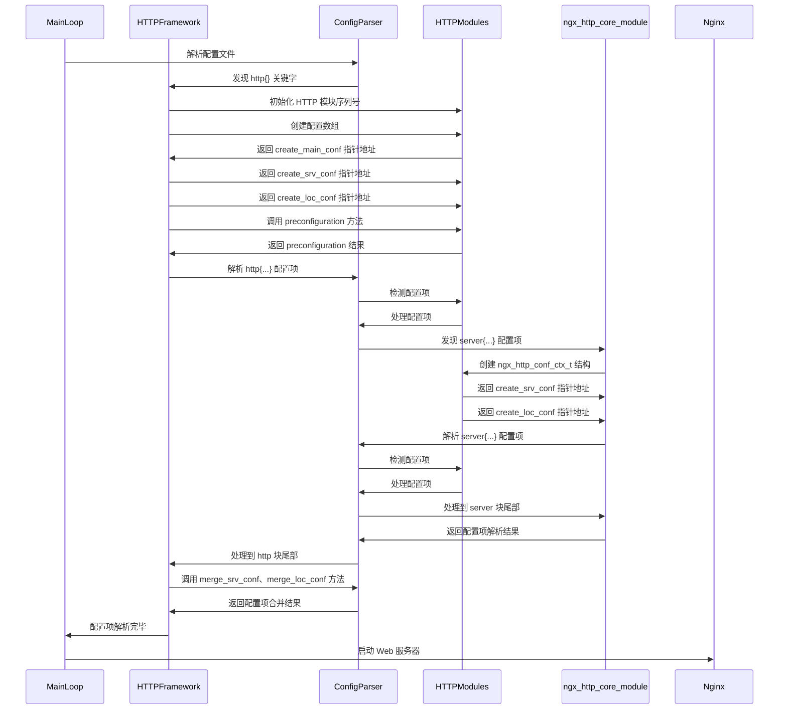

# 第二部分如何编写 HTTP 模块

-   第 3 章开发一个简单的 HTTP 模块
-   第 4 章配置、error 日志和请求上下文
-   第 5 章访问第三方服务
-   第 6 章开发一个简单的 HTTP 过滤模块
-   第 7 章 Nginx 提供的高级数据结构

## 第 4 章配置、error 日志和请求上下文

在开发功能灵活的 Nginx 模块时，需要从配置文件中获取特定的信息，不过，不需要再编写一套读取配置的系统，Nginx 已经为用户提供了强大的配置项解析机制，同时它还支持“-s reload”命令——在不重启服务的情况下可使配置生效。4.1 节会回顾第 2 章中 http 配置项的一些特点，4.2 节中会全面讨论如何使用 http 配置项，包括使用 Nginx 预设的解析方法（可以少写许多代码）或者自定义配置项的解析方式，如果读者对其中较复杂的配置块嵌套关系有疑问，在 4.3 节中会从 HTTP 框架的实现机制上解释 http 配置项的模型。

开发复杂的 Nginx 模块时，如何定位代码上的问题是必须考虑的前提条件，此时输出各种日志就显得很关键了，4.4 节中会讨论 Nginx 为用户准备好的输出日志方法。

编写全异步的 HTTP 模块时，必须要有上下文来维持一个请求的必要信息，在 4.5 节中，首先探讨请求的上下文与全异步实现的 Nginx 服务之间的关系，以及如何使用 HTTP 上下文，然后简单描述 HTTP 框架是如何管理请求的上下文结构体的。

### 4.1 http 配置项的使用场景

在第 2 章中通过多样化修改 nginx.conf 文件中的配置项，实现了复杂的 Web 服务器功能。

其中，http{...}内的配置项最为复杂，在 http 配置块内还有 server 块、location 块等，同一个配置项可以同时出现在多个 http 块、server 块或 location 块内。

那么，如何解析这样的配置项呢？在第 3 章中的 mytest 例子中，又是怎样获取 nginx.conf 中的配置的呢？当同一个配置在 http 块、server 块、location 块中同时出现时，应当选择哪一个块下的配置呢？当多个不同 URI 表达式下的 location 都配置了 mytest 这个配置项，然而后面的参数值却不同时，Nginx 是如何处理的呢？这些就是本章将要回答的问题。

我们先来看一个例子，有一个配置项 test_str，它在多个块内都出现了，如下所示。

```ini
http {
  test_str main;
  server {
    listen 80;
    test_str server80;
    location url1 {
      mytest;
      test_str loc1;
    }
    location url2 {
      mytest;
      test_str loc2;
    }
  }
  server {
    listen 8080;
    test_str server8080;
    location /url3 {
      mytest;
      test_str loc3;
    }
  }
}
```

在上面的配置文件中，test_str 这个配置项在 http 块内出现的值为 main，在监听 80 端口的 server 块内 test_str 值为 server80，该 server 块内有两个 location 都是由第 3 章中定义的 mytest 模块处理的，而且每个 location 中又重新设置了 test_str 的值，分别为 loc1 和 loc2。在这之后又定义了监听 8080 端口的 server 块，并重定义 test_str 的值为 server8080，这个 server 块内定义的一个 location 也是由 mytest 模块处理的，而且这个 location 内再次重定义了 test_str 的值为 loc3。（事实上不只是例子中的 server 块可以嵌套 location 块，location 块之间还可以继续嵌套，这样 test_str 的值就更复杂了，上例中没有出现 location 中进一步反复嵌套 location 的场景。在 4.3.3 节讨论 HTTP 框架如何合并配置项时涉及了 location 块的反复嵌套问题，请读者注意。）在这段很短的配置中，mytest 模块将会处理两个监听端口上建立的 TCP 连接，以及 3 种 HTTP 请求，请求的 URL 分别对应着/url1、/url2、/url3。假设 mytest 模块必须取出 test_str 配置项的参数，可是在以上的例子中 test_str 出现了 6 个不同的参数值，分别为 main、server80、server8080、loc1、loc2、loc3，那么在 mytest 模块中我们取到的 test_str 值以哪一个为准呢？ 事实上，Nginx 的设计是非常灵活的（实际上这是第 10 章将要介绍的 HTTP 框架设计的），它在每一个 http 块、server 块或 location 块下，都会生成独立的数据结构来存放配置项。

因此，我们允许当用户访问的请求不同时（如请求的 URL 分别是/url1、/url2、/url3），配置项 test_str 可以具有不同的值。那么，当请求是/url1 时，test_str 的值应当是 location 块下的 loc1，还是这个 location 所属的 server 块下的 server80，又或者是其所属 http 块下的值 main 呢？

完全由 mytest 模块自己决定，我们可以定义这个行为。下面在 4.2 节中将说明如何灵活地使用配置项，在 4.3 节中将探讨 Nginx 实际上是如何实现 http 配置功能的。

### 4.2 怎样使用 http 配置

事实上，在第 3 章中已经使用过 mytest 配置项，只不过当时 mytest 配置项是没有值的，只是用来标识当 location 块内出现 mytest 配置项时就启用 mytest 模块，从而处理匹配该 location 表达式的用户请求。本章将由易到难来阐述 HTTP 模块是怎样获得感兴趣的配置项的。

处理 http 配置项可以分为下面 4 个步骤：
1）创建数据结构用于存储配置项对应的参数。

2）设定配置项在 nginx.conf 中出现时的限制条件与回调方法。

3）实现第 2 步中的回调方法，或者使用 Nginx 框架预设的 14 个回调方法。

4）合并不同级别的配置块中出现的同名配置项。

不过，这 4 个步骤如何与 Nginx 有机地结合起来呢？就是通过第 3 章中介绍过的两个数据
结构 ngx_http_module_t 和 ngx_command_t ，它们都是定义一个 HTTP 模块时不可或缺的部分。

#### 4.2.1 分配用于保存配置参数的数据结构

首先需要创建一个结构体，其中包含了所有我们感兴趣的参数。为了说明 14 种预设配置
项的解析方法，我们将在这个结构体中定义 14 个成员，存储感兴趣的配置项参数。例如：

```C
typedef struct {
  ngx_str_t my_str;
  ngx_int_t my_num;
  ngx_flag_t my_flag;
  size_t my_size;
  ngx_array_t * my_str_array;
  ngx_array_t * my_keyval;
  off_t my_off;
  ngx_msec_t my_msec;
  time_t my_sec;
  ngx_bufs_t my_bufs;
  ngx_uint_t my_enum_seq;
  ngx_uint_t my_bitmask;
  ngx_uint_t my_access;
  ngx_path_t * my_path;
} ngx_http_mytest_conf_t;
```

ngx_http_mytest_conf_t 中的 14 个成员存储的配置项都不相同，读者可暂时忽略上面 ngx_http_mytest_conf_t 结构中一些没见过的 Nginx 数据结构，这些将在 4.2.3 节中介绍。

为什么要这么严格地用一个结构体来存储配置项的参数值，而不是随意地定义几个全局变量来存储它们呢？这就要回到 4.1 节中例子的使用场景了，多个 location 块（或者 http 块、server 块）中的相同配置项是允许同时生效的，也就是说，我们刚刚定义的 ngx_http_mytest_conf_t 结构必须在 Nginx 的内存中保存许多份。事实上，HTTP 框架在解析 nginx.conf 文件时只要遇到 http{}、server{}或者 location{}配置块就会立刻分配一个新的 ngx_http_mytest_conf_t 结构体。因此，HTTP 模块感兴趣的配置项需要统一地使用一个 struct 结构体来保存（否则 HTTP 框架无法管理），如果 nginx.conf 文件中在 http{}下有多个 server{}或者 location{}，那么这个 struct 结构体在 Nginx 进程中就会存在多份实例。

Nginx 怎样管理我们自定义的存储配置的结构体 ngx_http_mytest_conf_t 呢？很简单，通过第 3 章中曾经提到的 ngx_http_module_t 中的回调方法。下面回顾一下 ngx_http_module_t 的定义。

```C
typedef struct {
  ngx_int_t (*preconfiguration)(ngx_conf_t cf);
  ngx_int_t (postconfiguration)(ngx_conf_t cf);
  void (*create_main_conf)(ngx_conf_t cf);
  char (*init_main_conf)(ngx_conf_t cf, void conf);
  void (create_srv_conf)(ngx_conf_t cf);
  char (*merge_srv_conf)(ngx_conf_t cf, void prev, void *conf);
  void (create_loc_conf)(ngx_conf_t cf);
  char (*merge_loc_conf)(ngx_conf_t cf, void prev, void \*conf);
} ngx_http_module_t;
```

其中，create_main_conf、create_srv_conf、create_loc_conf 这 3 个回调方法负责把我们分配的用于保存配置项的结构体传递给 HTTP 框架。下面解释一下为什么不是定义 1 个而是定义 3 个回调方法。

HTTP 框架定义了 3 个级别的配置 main、srv、loc，分别表示直接出现在 http{}、server{}、location{}块内的配置项。当 nginx.conf 中出现 http{}时，HTTP 框架会接管配置文件中 http{}块内的配置项解析，之后的流程可以由 4.3.1 节中的图 4-1 来了解。当遇到 http{...}配置块时，HTTP 框架会调用所有 HTTP 模块可能实现的 create_main_conf、create_srv_conf、create_loc_conf 方法生成存储 main 级别配置参数的结构体；在遇到 server{...}块时会再次调用所有 HTTP 模块的 create_srv_conf、create_loc_conf 回调方法生成存储 srv 级别配置参数的结构体；在遇到 location{...}时则会再次调用 create_loc_conf 回调方法生成存储 loc 级别配置参数的结构体。因此，实现这 3 个回调方法的意义是不同的，例如，对于 mytest 模块来说，在 http{} 块内只会调用 1 次 create_main_conf，而 create_loc_conf 可能会被调用许多次，也就是有许多个由 create_loc_conf 生成的结构体。

普通的 HTTP 模块往往只实现 create_loc_conf 回调方法，因为它们只关注匹配某种 URL 的请求。我们的 mytest 例子也是这样实现的，这里实现 create_loc_conf 的是 ngx_http_mytest_create_loc_conf 方法，如下所示。

```C
static void* ngx_http_mytest_create_loc_conf(ngx_conf_t cf)
{
  ngx_http_mytest_conf_t mycf;
  mycf = (ngx_http_mytest_conf_t *)ngx_pcalloc(cf->pool, sizeof(ngx_http_mytest_conf_t));
  if (mycf == NULL) {
    return NULL;
  }
  mycf->my_flag = NGX_CONF_UNSET;
  mycf->my_num = NGX_CONF_UNSET;
  mycf->my_str_array = NGX_CONF_UNSET_PTR;
  mycf->my_keyval = NULL;
  mycf->my_off = NGX_CONF_UNSET;
  mycf->my_msec = NGX_CONF_UNSET_MSEC;
  mycf->my_sec = NGX_CONF_UNSET;
  mycf->my_size = NGX_CONF_UNSET_SIZE;
  return mycf;
}
```

上述代码中对一些配置参数设置了初始值，这是为了 14 个预设方法准备的，下面会解释为什么要这样赋值。

#### 4.2.2 设定配置项的解析方式

下面详细介绍在读取 HTTP 配置时是如何使用 ngx_command_t 结构的，首先回顾一下第 3 章中曾经提到过的定义，再详细介绍每个成员的意义。

```C
struct ngx_command_s {
  ngx_str_t name;
  ngx_uint_t type;
  char (set)(ngx_conf_t cf, ngx_command_t cmd, void conf);
  ngx_uint_t conf;
  ngx_uint_t offset;
  void post;
};
```

（1）ngx_str_t name

其中，name 是配置项名称，如 4.1 节例子中的“test_str”。

（2）ngx_uint_t type

其中，type 决定这个配置项可以在哪些块（如 http、server、location、if、upstream 块等）中出现，以及可以携带的参数类型和个数等。表 4-1 列出了设置 http 配置项时 type 可以取的值。注意，type 可以同时取表 4-1 中的多个值，各值之间用|符号连接，例如，type 可以取值为 NGX_HTTP_MAIN_CONF|NGX_HTTP_SRV_CONF|NGX_HTTP_LOC_CONF|NGX_CONF_TAKE1。

表 4-1 ngx_command_t 结构体中 type 成员的取值及其意义

每个进程中都有一个唯一的 ngx_cycle_t 核心结构体，它有一个成员 conf_ctx 维护着所有模块的配置结构体，其类型是 void\*\*\*\*。conf_ctx 意义为首先指向一个成员皆为指针的数组，其中每个成员指针又指向另外一个成员皆为指针的数组，第 2 个子数组中的成员指针才会指向各模块生成的配置结构体。这正是为了事件模块、http 模块、mail 模块而设计的，第 9、10 章都有详述，这有利于不同于 NGX_CORE_MODULE 类型的特定模块解析配置项。然而，NGX_CORE_MODULE 类型的核心模块解析配置项时，配置项一定是全局的，不会从属于任何{}配置块的，它不需要上述这种双数组设计。解析标识为 NGX_DIRECT_CONF 类型的配置项时，会把 void\*\*\*\*类型的 conf_ctx 强制转换为 void\*\*，也就是说，此时，在 conf_ctx 指向的指针数组中，每个成员指针不再指向其他数组，直接指向核心模块生成的配置结构体。因此，NGX_DIRECT_CONF 仅由 NGX_CORE_MODULE 类型的核心模块使用，而且配置项只应该出现在全局配置中。

:::tip 注意
如果 HTTP 模块中定义的配置项在 nginx.conf 配置文件中实际出现的位置和参数格式与 type 的意义不符，那么 Nginx 在启动时会报错。
:::

（3）char(set)(ngx_conf_t \*cf, ngx_command_t \*cmd, void \*conf)

关于 set 回调方法，在第 3 章中处理 mytest 配置项时已经使用过，其中 mytest 配置项是不带参数的。如果处理配置项，我们既可以自己实现一个回调方法来处理配置项（4.2.4 节中会举例说明如何自定义回调方法），也可以使用 Nginx 预设的 14 个解析配置项方法，这会少写许多代码，表 4-2 列出了这些预设的解析配置项方法。我们将在 4.2.3 节中举例说明这些预设方法的使用方式。

表 4-2 预设的 14 个配置项解析方法

（4）ngx_uint_t conf

conf 用于指示配置项所处内存的相对偏移位置，仅在 type 中没有设置 NGX_DIRECT_CONF 和 NGX_MAIN_CONF 时才会生效。对于 HTTP 模块，conf 是必须要设置的，它的取值范围见表 4-3。

表 4-3 ngx_command_t 结构中的 conf 成员在 HTTP 模块中的取值及其意义

为什么 HTTP 模块一定要设置 conf 的值呢？因为 HTTP 框架可以使用预设的 14 种方法自动地将解析出的配置项写入 HTTP 模块代码定义的结构体中，但 HTTP 模块中可能会定义 3 个结构体，分别用于存储 main、srv、loc 级别的配置项（对应于 create_main_conf、create_srv_conf、create_loc_conf 方法创建的结构体），而 HTTP 框架自动解析时需要知道应把解析出的配置项值写入哪个结构体中，这将由 conf 成员完成。

因此，对 conf 的设置是与 ngx_http_module_t 实现的回调方法（在 4.2.1 节中介绍）相关的。

如果用于存储这个配置项的数据结构是由 create_main_conf 回调方法完成的，那么必须把 conf 设置为 NGX_HTTP_MAIN_CONF_OFFSET。同样，如果这个配置项所属的数据结构是由 create_srv_conf 回调方法完成的，那么必须把 conf 设置为 NGX_HTTP_SRV_CONF_OFFSET。

可如果 create_loc_conf 负责生成存储这个配置项的数据结构，就得将 conf 设置为 NGX_HTTP_LOC_CONF_OFFSET。

目前，功能较为简单的 HTTP 模块都只实现了 create_loc_conf 回调方法，对于 http{}、server{}块内出现的同名配置项，都是并入某个 location{}内 create_loc_conf 方法产生的结构体中的（在 4.2.5 节中会详述如何合并配置项）。当我们希望同时出现在 http{}、server{}、location{}块的同名配置项，在 HTTP 模块的代码中保存于不同的变量中时，就需要实现 create_main_conf 方法、create_srv_conf 方法产生新的结构体，从而以不同的结构体独立保存不同级别的配置项，而不是全部合并到某个 location 下 create_loc_conf 方法生成的结构体中。

（5）ngx_uint_t offset

offset 表示当前配置项在整个存储配置项的结构体中的偏移位置（以字节（Byte）为单位）。举个例子，在 32 位机器上，int（整型）类型长度是 4 字节，那么看下面这个数据结构：

```C
typedef struct {
  int a;
  int b;
  int c;
} test_struct;
```

如果要处理的配置项是由成员 b 来存储参数的，那么这时 b 相对于 test_stru 的偏移量就是 4；如果要处理的配置项由成员 c 来存储参数，那么这时 c 相对于 test_stru 的偏移量就是 8。

实际上，这种计算工作不用用户自己来做，使用 offsetof 宏即可实现。例如，在上例中取 b 的偏移量时可以这么做：

```C
offsetof(test_stru, b)
```

其中，offsetof 中第 1 个参数是存储配置项的结构体名称，第 2 个参数是这个结构体中的变量名称。offsetof 将会返回这个变量相对于结构体的偏移量。

提示 offsetof 这个宏是如何取得成员相对结构体的偏移量的呢？其实很简单，它的实现类似于：#define offsetof(type,member)(size_t)&(((type\*)0)-\>member)。可以看到，offsetof 将 0 地址转换成 type 结构体类型的指针，并在访问 member 成员时取得 member 成员的指针，这个指针相对于 0 地址来说自然就是成员相对于结构体的偏移量了。

设置 offset 有什么作用呢？如果使用 Nginx 预设的解析配置项方法，就必须设置 offset，这样 Nginx 首先通过 conf 成员找到应该用哪个结构体来存放，然后通过 offset 成员找到这个结构体中的相应成员，以便存放该配置。如果是自定义的专用配置项解析方法（只解析某一个配置项），则可以不设置 offset 的值。读者可以通过 4.3.4 节来了解预设配置项解析方法是如何使用 offset 的。

（6）void\*post

post 指针有许多用途，从它被设计成 void\*就可以看出。

如果自定义了配置项的回调方法，那么 post 指针的用途完全由用户来定义。如果不使用它，那么随意设为 NULL 即可。如果想将一些数据结构或者方法的指针传过来，那么使用 post 也可以。

如果使用 Nginx 预设的配置项解析方法，就需要根据这些预设方法来决定 post 的使用方式。表 4-4 说明了 post 相对于 14 个预设方法的用途。

表 4-4 ngx_command_t 结构中 post 的取值及其意义

可以看到，有 9 个预设方法在使用时 post 是可以设置为 ngx_conf_post_t 结构体来使用的，先来看看 ngx_conf_post_t 的定义。

```C
typedef char (ngx_conf_post_handler_pt) (ngx_conf_t cf, void data, void *conf);
typedef struct {
  ngx_conf_post_handler_pt post_handler;
} ngx_conf_post_t;
```

如果需要在解析完配置项（表 4-4 中列出的前 9 个预设方法）后回调某个方法，就要实现上面的 ngx_conf_post_handler_pt，并将包含 post_handler 的 ngx_conf_post_t 结构体传给 post 指针。

目前，ngx_conf_post_t 结构体提供的这个功能没有官方 Nginx 模块使用，因为它限制过多且 post 成员过于灵活，一般完全可以 init_main_conf 这样的方法统一处理解析完的配置项。

#### 4.2.3 使用 14 种预设方法解析配置项

本节将以举例的方式说明如何使用这 14 种 Nginx 的预设配置项解析方法来处理我们感兴趣的配置项。下面仍然以 4.2.1 节生成的配置项结构体 ngx_http_mytest_conf_t 为例进行说明，其中会尽量把 type 成员的多种用法都涵盖到。

（1）ngx_conf_set_flag_slot

假设我们希望在 nginx.conf 中有一个配置项的名称为 test_flag，它的后面携带 1 个参数，这个参数的取值必须是 on 或者 off。我们将用 4.2.1 节中生成的 ngx_http_mytest_conf_t 结构体中的以下成员来保存：

```C
ngx_flag_t my_flag;
```

先看一下 ngx_flag_t 的定义：

```C
typedef intptr_t ngx_flag_t;
```

可见，ngx_flag_t 与 ngx_int_t 整型是相当的。可以如下设置 ngx_conf_set_flag_slot 来帮助解析 test_flag 参数。

```C
static ngx_command_t ngx_http_mytest_commands[] = {
  …
  { ngx_string("test_flag"),
  NGX_HTTP_LOC_CONF| NGX_CONF_FLAG,
  ngx_conf_set_flag_slot,
  NGX_HTTP_LOC_CONF_OFFSET,
  offsetof(ngx_http_mytest_conf_t, my_flag),
  NULL },
  ngx_null_command
};
```

上段代码表示，test_flag 配置只能出现在 location{...}块中（更多的 type 设置可参见表 4-1）。其中，test_flag 配置项的参数为 on 时，ngx_http_mytest_conf_t 结构体中的 my_flag 会设为 1，而参数为 off 时 my_flag 会设为 0。

注意在 ngx_http_mytest_create_loc_conf 创建结构体时，如果想使用 ngx_conf_set_flag_slot，必须把 my_flag 初始化为 NGX_CONF_UNSET 宏，也就是 4.2.1 节中的语句“mycf-\>test_flag=NGX_CONF_UNSET;”，否则 ngx_conf_set_flag_slot 方法在解析时会报“is duplicate”错误。

（2）ngx_conf_set_str_slot

假设我们希望在 nginx.conf 中有一个配置项的名称为 test_str，其后的参数只能是 1 个，我们将用 ngx_http_mytest_conf_t 结构体中的以下成员来保存它。

```C
ngx_str_t my_str;
```

可以这么设置 ngx_conf_set_str_slot 来实现 test_str 的解析，如下所示。

```C
static ngx_command_t ngx_http_mytest_commands[] = {
  ...
  { ngx_string("test_str"),
  NGX_HTTP_MAIN_CONF|NGX_HTTP_SRV_CONF|NGX_HTTP_LOC_CONF| NGX_CONF_TAKE1,
  ngx_conf_set_str_slot,
  NGX_HTTP_LOC_CONF_OFFSET,
  offsetof(ngx_http_mytest_conf_t, my_str),
  NULL },
  ngx_null_command
};
```

以上代码表示 test_str 可以出现在 http{...}、server{...}或者 location{...}块内，它携带的 1 个参数会保存在 my_str 中。例如，有以下配置：

```ini
location …
{
  test_str apple;
}
```

那么，my_str 的值为{len=5;data=“apple”;}。

（3）ngx_conf_set_str_array_slot

如果希望在 nginx.conf 中有多个同名配置项，如名称是 test_str_array，那么每个配置项后都跟着一个字符串参数。这些同名配置项可能具有多个不同的参数值。这时，可以使用 ngx_conf_set_str_array_slot 预设方法，它将会把所有的参数值都以 ngx_str_t 的类型放到 ngx_array_t 队列容器中，如下所示。

```C
static ngx_command_t ngx_http_mytest_commands[] = {
  ...
  { ngx_string("test_str_array"),
  NGX_HTTP_LOC_CONF | NGX_CONF_TAKE1,
  ngx_conf_set_str_array_slot,
  NGX_HTTP_LOC_CONF_OFFSET,
  offsetof(ngx_http_mytest_conf_t, my_str_array),
  NULL },
  ngx_null_command
};
```

在 4.2.1 节中已看到 my_str_array 是 ngx_array_t\*类型的。ngx_array_t 数据结构的使用方法与 ngx_list_t 类似。本章不详细讨论 ngx_array_t 容器，感兴趣的读者可以直接阅读第 6 章查看 ngx_array_t 的使用特点。

上面代码中的 test_str_array 配置项也只能出现在 location{...}块内。如果有以下配置：

```ini
location …
{
test_str_array Content-Length;
test_str_array Content-Encoding;
}
```

那么，my_str_array-\>nelts 的值将是 2，表示出现了两个 test_str_array 配置项。而且，my_str_array-\>elts 指向 ngx_str_t 类型组成的数组，这样就可以按以下方式访问这两个值。

```C
ngx_str_t *pstr=mycf->my_str_array->elts;
```

于是，pstr[0]和 pstr[1]可以取到参数值，分别是{len=14;data=“Content-Length”;}和{len=16;data=“Content-Encoding”;}。从这里可以看到，当处理 HTTP 头部这样的配置项时是很适合使用 ngx_conf_set_str_array_slot 预设方法的。

（4）ngx_conf_set_keyval_slot

ngx_conf_set_keyval_slot 与 ngx_conf_set_str_array_slot 非常相似，唯一的不同点是 ngx_conf_set_str_array_slot 要求同名配置项后的参数个数是 1，而 ngx_conf_set_keyval_slot 则要求配置项后的参数个数是 2，分别表示 key/value。如果用 ngx_array_t\*类型的 my_keyval 变量存储以 test_keyval 作为配置名的参数，则必须设置 NGX_CONF_TAKE2，表示 test_keyval 后跟两个参数。例如：

```C
static ngx_command_t ngx_http_mytest_commands[] = {
  ...
  { ngx_string("test_keyval"),
  NGX_HTTP_LOC_CONF | NGX_CONF_TAKE2,
  ngx_conf_set_keyval_slot,
  NGX_HTTP_LOC_CONF_OFFSET,
  offsetof(ngx_http_mytest_conf_t, my_keyval),
  NULL },
  ngx_null_command
  };
```

如果 nginx.conf 中出现以下配置项：

```ini
location …
{
  test_keyval Content-Type image/png;
  test_keyval Content-Type image/gif;
  test_keyval Accept-Encoding gzip;
}
```

那么，ngx_array_t\*类型的 my_keyval 将会有 3 个成员，每个成员的类型如下所示。

```C
typedef struct {
  ngx_str_t key;
  ngx_str_t value;
} ngx_keyval_t;
```

因此，通过遍历 my_keyval 就可以获取 3 个成员，分别是{“Content-Type”,“image/png”}、{“Content-Type”,“image/gif”}、{“Accept-Encoding”,“gzip”}。例如，取得第 1 个成员的代码如下。

```C
ngx_keyval_t* pkv = mycf->my_keyval->elts;
ngx_log_error(NGX_LOG_ALERT, r->connection->log, 0,"my_keyval key=%*s,value=%\*s,", pkv[0].key.len,pkv[0].key.data, pkv[0].value.len,pkv[0].value.data);
```

对于 ngx_log_error 日志的用法，将会在 4.4 节详细说明。

注意在 ngx_http_mytest_create_loc_conf 创建结构体时，如果想使用 ngx_conf_set_keyval_slot，必须把 my_keyval 初始化为 NULL 空指针，也就是 4.2.1 节中的语句“mycf-\>my_keyval=NULL;”，否则 ngx_conf_set_keyval_slot 在解析时会报错。

（5）ngx_conf_set_num_slot

ngx_conf_set_num_slot 处理的配置项必须携带 1 个参数，这个参数必须是数字。我们用 ngx_http_mytest_conf_t 结构中的以下成员来存储这个数字参数如下所示。

```C
ngx_int_t my_num;
```

如果用"test_num"表示这个配置项名称，那么 ngx_command_t 可以写成如下形式。

```C
static ngx_command_t ngx_http_mytest_commands[] = {
  ...
  { ngx_string("test_num"),
  NGX_HTTP_LOC_CONF | NGX_CONF_TAKE1,
  ngx_conf_set_num_slot,
  NGX_HTTP_LOC_CONF_OFFSET,
  offsetof(ngx_http_mytest_conf_t, my_num),
  NULL },
  ngx_null_command
};
```

如果在 nginx.conf 中有 test_num 10;配置项，那么 my_num 变量就会设置为 10。

:::tip 注意
注意在 ngx_http_mytest_create_loc_conf 创建结构体时，如果想使用 ngx_conf_set_num_slot，必须把 my_num 初始化为 NGX_CONF_UNSET 宏，也就是 4.2.1 节中的语句“mycf-\>my_num=NGX_CONF_UNSET;”，否则 ngx_conf_set_num_slot 在解析时会报错。
:::

（6）ngx_conf_set_size_slot

如果希望配置项表达的含义是空间大小，那么用 ngx_conf_set_size_slot 来解析配置项是非常合适的，因为 ngx_conf_set_size_slot 允许配置项的参数后有单位，例如，k 或者 K 表示 Kilobyte，m 或者 M 表示 Megabyte。用 ngx_http_mytest_conf_t 结构中的 size_t my_size;来存储参数，解析后的 my_size 表示的单位是字节。例如：

```C
static ngx_command_t ngx_http_mytest_commands[] = {
  ...
  { ngx_string("test_size"),
  NGX_HTTP_LOC_CONF | NGX_CONF_TAKE1,
  ngx_conf_set_size_slot,
  NGX_HTTP_LOC_CONF_OFFSET,
  offsetof(ngx_http_mytest_conf_t, my_size),
  NULL },
  ngx_null_command
};
```

如果在 nginx.conf 中配置了 test_size 10k;，那么 my_size 将会设置为 10240。如果配置为 test_size 10m;，则 my_size 会设置为 10485760。

ngx_conf_set_size_slot 只允许配置项后的参数携带单位 k 或者 K、m 或者 M，不允许有 g 或者 G 的出现，这与 ngx_conf_set_off_slot 是不同的。

:::tip 注意
注意在 ngx_http_mytest_create_loc_conf 创建结构体时，如果想使用 ngx_conf_set_size_slot，必须把 my_size 初始化为 NGX_CONF_UNSET_SIZE 宏，也就是 4.2.1 节中的语句“mycf-\>my_size=NGX_CONF_UNSET_SIZE;”，否则 ngx_conf_set_size_slot 在解析时会报错。
:::

（7）ngx_conf_set_off_slot

如果希望配置项表达的含义是空间的偏移位置，那么可以使用 ngx_conf_set_off_slot 预设方法。事实上，ngx_conf_set_off_slot 与 ngx_conf_set_size_slot 是非常相似的，最大的区别是 ngx_conf_set_off_slot 支持的参数单位还要多 1 个 g 或者 G，表示 Gigabyte。用 ngx_http_mytest_conf_t 结构中的 off_t my_off;来存储参数，解析后的 my_off 表示的偏移量单位是字节。例如：

```C
static ngx_command_t ngx_http_mytest_commands[] = {
  ...
  { ngx_string("test_off"),
  NGX_HTTP_LOC_CONF | NGX_CONF_TAKE1,
  ngx_conf_set_off_slot, NGX_HTTP_LOC_CONF_OFFSET,
  offsetof(ngx_http_mytest_conf_t, my_off),
  NULL },
  ngx_null_command
};
```

如果在 nginx.conf 中配置了 test_off 1g;，那么 my_off 将会设置为 1073741824。当它的单位为 k、K、m、M 时，其意义与 ngx_conf_set_size_slot 相同。

:::tip 注意
注意在 ngx_http_mytest_create_loc_conf 创建结构体时，如果想使用 ngx_conf_set_off_slot，必须把 my_off 初始化为 NGX_CONF_UNSET 宏，也就是 4.2.1 节中的语句“mycf-\>my_off=NGX_CONF_UNSET;”，否则 ngx_conf_set_off_slot 在解析时会报错。
:::

（8）ngx_conf_set_msec_slot

如果希望配置项表达的含义是时间长短，那么用 ngx_conf_set_msec_slot 来解析配置项是非常合适的，因为它支持非常多的时间单位。

用 ngx_http_mytest_conf_t 结构中的 ngx_msec_t my_msec;来存储参数，解析后的 my_msec 表示的时间单位是毫秒。事实上，ngx_msec_t 是一个无符号整型：

```C
typedef ngx_uint_t ngx_rbtree_key_t;
typedef ngx_rbtree_key_t ngx_msec_t;
```

ngx_conf_set_msec_slot 解析的配置项也只能携带 1 个参数。例如：

```C
static ngx_command_t ngx_http_mytest_commands[] = {
  ...
  { ngx_string("test_msec"),
  NGX_HTTP_LOC_CONF | NGX_CONF_TAKE1,
  ngx_conf_set_msec_slot, NGX_HTTP_LOC_CONF_OFFSET,
  offsetof(ngx_http_mytest_conf_t, my_msec),
  NULL },
  ngx_null_command
};
```

如果在 nginx.conf 中配置了 test_msec 1d;，那么 my_msec 会设置为 1 天之内的毫秒数，也就是 86400000。

:::tip 注意
注意在 ngx_http_mytest_create_loc_conf 创建结构体时，如果想使用 ngx_conf_set_msec_slot，那么必须把 my_msec 初始化为 NGX_CONF_UNSET_MSEC 宏，也就是 4.2.1 节中的语句“mycf-\>my_msec=NGX_CONF_UNSET_MSEC;”，否则 ngx_conf_set_msec_slot 在解析时会报错。
:::

（9）ngx_conf_set_sec_slot

ngx_conf_set_sec_slot 与 ngx_conf_set_msec_slot 非常相似，只是 ngx_conf_set_sec_slot 在用 ngx_http_mytest_conf_t 结构体中的 time_t my_sec;来存储参数时，解析后的 my_sec 表示的时间单位是秒，而 ngx_conf_set_msec_slot 为毫秒。

```C
static ngx_command_t ngx_http_mytest_commands[] = {
  ...
  { ngx_string("test_sec"),
  NGX_HTTP_LOC_CONF | NGX_CONF_TAKE1,
  ngx_conf_set_sec_slot,
  NGX_HTTP_LOC_CONF_OFFSET,
  offsetof(ngx_http_mytest_conf_t, my_sec),
  NULL },
  ngx_null_command
};
```

如果在 nginx.conf 中配置了 test_sec 1d;，那么 my_sec 会设置为 1 天之内的秒数，也就是 86400。

:::tip 注意
注意在 ngx_http_mytest_create_loc_conf 创建结构体时，如果想使用 ngx_conf_set_sec_slot，那么必须把 my_sec 初始化为 NGX_CONF_UNSET 宏，也就是 4.2.1 节中的语句“mycf-\>my_sec=NGX_CONF_UNSET;”，否则 ngx_conf_set_sec_slot 在解析时会报错。
:::

（10）ngx_conf_set_bufs_slot

Nginx 中许多特有的数据结构都会用到两个概念：单个 ngx_buf_t 缓存区的空间大小和允许的缓存区个数。ngx_conf_set_bufs_slot 就是用于设置它的，它要求配置项后必须携带两个参数，第 1 个参数是数字，通常会用来表示缓存区的个数；第 2 个参数表示单个缓存区的空间大小，它像 ngx_conf_set_size_slot 中的参数单位一样，可以不携带单位，也可以使用 k 或者 K、m 或者 M 作为单位，如“gzip_buffers 48k;”。我们用 ngx_http_mytest_conf_t 结构中的 ngx_bufs_t my_bufs;来存储参数，ngx_bufs_t（12.1.3 节 ngx_http_upstream_conf_t 结构体中的 bufs 成员就是应用 ngx_bufs_t 配置的一个非常好的例子）的定义很简单，如下所示。

```C
typedef struct {
  ngx_int_t num;
  size_t size;
} ngx_bufs_t;
```

ngx_conf_set_bufs_slot 解析后会把配置项后的两个参数转化成 ngx_bufs_t 结构下的两个成员 num 和 size，其中 size 以字节为单位。例如：

```C
static ngx_command_t ngx_http_mytest_commands[] = {
  ...
  { ngx_string("test_bufs"),
  NGX_HTTP_LOC_CONF | NGX_CONF_TAKE2,
  ngx_conf_set_bufs_slot, NGX_HTTP_LOC_CONF_OFFSET,
  offsetof(ngx_http_mytest_conf_t, my_bufs),
  NULL },
  ngx_null_command
};
```

如果在 nginx.conf 中配置为 test_bufs 41k;，那么 my_bufs 会设置为{4,1024}。

（11）ngx_conf_set_enum_slot

ngx_conf_set_enum_slot 表示枚举配置项，也就是说，Nginx 模块代码中将会指定配置项的参数值只能是已经定义好的 ngx_conf_enum_t 数组中 name 字符串中的一个。先看看 ngx_conf_enum_t 的定义如下所示。

```C
typedef struct {
  ngx_str_t name;
  ngx_uint_t value;
} ngx_conf_enum_t;
```

其中，name 表示配置项后的参数只能与 name 指向的字符串相等，而 value 表示如果参数中出现了 name，ngx_conf_set_enum_slot 方法将会把对应的 value 设置到存储的变量中。例如：

```C
static ngx_conf_enum_t test_enums[] = {
  { ngx_string("apple"), 1 },
  { ngx_string("banana"), 2 },
  { ngx_string("orange"), 3 },
  { ngx_null_string, 0 }
};
```

上面这个例子表示，配置项中的参数必须是 apple、banana、orange 其中之一。注意，必须以 ngx_null_string 结尾。需要用 ngx_uint_t 来存储解析后的参数，在 4.2.1 节中是用 ngx_http_mytest_conf_t 中的“ngx_uint_t my_enum_seq;”来存储解析后的枚举参数的。在设置 ngx_command_t 时，需要把上面例子中定义的 test_enums 数组传给 post 指针，如下所示。

```C
static ngx_command_t ngx_http_mytest_commands[] = {
  ...
  { ngx_string("test_enum"),
  NGX_HTTP_LOC_CONF | NGX_CONF_TAKE1,
  ngx_conf_set_enum_slot, NGX_HTTP_LOC_CONF_OFFSET,
  offsetof(ngx_http_mytest_conf_t, my_enum_seq),
  test_enums },
  ngx_null_command
};
```

这样，如果在 nginx.conf 中出现了配置项 test_enum banana;，my_enum_seq 的值是 2。如果配置项 test_enum 出现了除 apple、banana、orange 之外的值，Nginx 将会报“invalid value”错误。

（12）ngx_conf_set_bitmask_slot(ngx_conf_t\*cf,ngx_command_t\*cmd,void\*conf);

ngx_conf_set_bitmask_slot 与 ngx_conf_set_enum_slot 也是非常相似的，配置项的参数都必须是枚举成员，唯一的差别在于效率方面，ngx_conf_set_enum_slot 中枚举成员的对应值是整型，表示序列号，它的取值范围是整型的范围；而 ngx_conf_set_bitmask_slot 中枚举成员的对应值虽然也是整型，但可以按位比较，它的效率要高得多。也就是说，整型是 4 字节（32 位）的话，在这个枚举配置项中最多只能有 32 项。

由于 ngx_conf_set_bitmask_slot 与 ngx_conf_set_enum_slot 这两个预设解析方法在名称上的差别，用来表示配置项参数的枚举取值结构体也由 ngx_conf_enum_t 变成了 ngx_conf_bitmask_t，但它们并没有区别。

```C
typedef struct {
  ngx_str_t name;
  ngx_uint_t mask;
} ngx_conf_bitmask_t;
```

下面以定义 test_bitmasks 数组为例来进行说明。

```C
static ngx_conf_bitmask_t test_bitmasks[] = {
  { ngx_string("good"), 0x0002 },
  { ngx_string("better"), 0x0004 },
  { ngx_string("best"), 0x0008 },
  { ngx_null_string, 0 }
};
```

如果配置项名称定义为 test_bitmask，在 nginx.conf 文件中 test_bitmask 配置项后的参数只能是 good、better、best 这 3 个值之一。我们用 ngx_http_mytest_conf_t 中的以下成员：

```C
ngx_uint_t my_bitmask;
```

来存储 test_bitmask 的参数，如下所示。

```C
static ngx_command_t ngx_http_mytest_commands[] = {
  ...
  { ngx_string("test_bitmask"),
  NGX_HTTP_LOC_CONF | NGX_CONF_TAKE1,
  ngx_conf_set_bitmask_slot,
  NGX_HTTP_LOC_CONF_OFFSET,
  offsetof(ngx_http_mytest_conf_t, my_bitmask),
  test_bitmasks },
  ngx_null_command
};
```

如果在 nginx.conf 中出现配置项 test_bitmask best;，那么 my_bitmask 的值是 0x8。

（13）ngx_conf_set_access_slot

ngx_conf_set_access_slot 用于设置读/写权限，配置项后可以携带 1~3 个参数，因此，在 ngx_command_t 中的 type 成员要包含 NGX_CONF_TAKE123。参数的取值可参见表 4-2。这里用 ngx_http_mytest_conf_t 结构中的“ngx_uint_t my_access;”来存储配置项“test_access”后的参数值，如下所示。

```C
static ngx_command_t ngx_http_mytest_commands[] = {
  ...
  { ngx_string("test_access"),
  NGX_HTTP_LOC_CONF | NGX_CONF_TAKE123,
  ngx_conf_set_access_slot,
  NGX_HTTP_LOC_CONF_OFFSET,
  offsetof(ngx_http_mytest_conf_t, my_access),
  NULL },
  ngx_null_command
};
```

这样，ngx_conf_set_access_slot 就可以解析读/写权限的配置项了。例如，当 nginx.conf 中出现配置项 test_access user:rw group:rw all:r;时，my_access 的值将是 436。

:::tip 注意
注意在 ngx_http_mytest_create_loc_conf 创建结构体时，如果想使用 ngx_conf_set_access_slot，那么必须把 my_access 初始化为 NGX_CONF_UNSET_UINT 宏，也就是 4.2.1 节中的语句“mycf-\>my_access=NGX_CONF_UNSET_UINT;”，否则 ngx_conf_set_access_slot 解析时会报错。
:::

（14）ngx_conf_set_path_slot

ngx_conf_set_path_slot 可以携带 1~4 个参数，其中第 1 个参数必须是路径，第 2~4 个参数必须是整数（大部分情形下可以不使用），可以参见 2.4.3 节中 client_body_temp_path 配置项的用法，client_body_temp_path 配置项就是用 ngx_conf_set_path_slot 预设方法来解析参数的。

ngx_conf_set_path_slot 会把配置项中的路径参数转化为 ngx_path_t 结构，看一下 ngx_path_t 的定义。

```C
typedef struct {
  ngx_str_t name;
  size_t len;
  size_t level[3];
  ngx_path_manager_pt manager;
  ngx_path_loader_pt loader;
  void data;
  u_char conf_file;
  ngx_uint_t line;
} ngx_path_t;
```

其中，name 成员存储着字符串形式的路径，而 level 数组就会存储着第 2、第 3、第 4 个参数（如果存在的话）。这里用 ngx_http_mytest_conf_t 结构中的“ngx_path_t\*my_path;”来存储配置项“test_path”后的参数值。

```C
static ngx_command_t ngx_http_mytest_commands[] = {
  ...
  { ngx_string("test_path"),
  NGX_HTTP_LOC_CONF | NGX_CONF_TAKE1234,
  ngx_conf_set_path_slot,
  NGX_HTTP_LOC_CONF_OFFSET,
  offsetof(ngx_http_mytest_conf_t, my_path),
  NULL },
  ngx_null_command
};
```

如果 nginx.conf 中存在配置项 test_path/usr/local/nginx/123;，my_path 指向的 ngx_path_t 结构中，name 的内容是/usr/local/nginx/，而 level[0]为 1，level[1]为 2，level[2]为 3。如果配置项是“test_path/usr/local/nginx/;”，那么 level 数组的 3 个成员都是 0。

#### 4.2.4 自定义配置项处理方法

除了使用 Nginx 已经实现的 14 个通用配置项处理方法外，还可以自己编写专用的配置项处理方法。事实上，3.5 节中的 ngx_http_mytest 就是自定义的处理 mytest 配置项的方法，只是没有去处理配置项的参数而已。本节举例说明如何编写方法来解析配置项。

假设我们要处理的配置项名称是 test_config，它接收 1 个或者 2 个参数，且第 1 个参数类型是字符串，第 2 个参数必须是整型。定义结构体来存储这两个参数，如下所示。

```C
typedef struct {
  ngx_str_t my_config_str;
  ngx_int_t my_config_num;
} ngx_http_mytest_conf_t;
```

其中，my_config_str 存储第 1 个字符串参数，my_config_num 存储第 2 个数字参数。

首先，我们按照 4.2.2 节 ngx_command_s 中的 set 方法指针格式来定义这个配置项处理方法，如下所示。

```C
static char* ngx_conf_set_myconfig(ngx_conf_t cf, ngx_command_t cmd, void *conf);
```

接下来定义 ngx_command_t 结构体，如下所示。

```C
static ngx_command_t ngx_http_mytest_commands[] = {
  …
  { ngx_string("test_myconfig"),
  NGX_HTTP_LOC_CONF | NGX_CONF_TAKE12,
  ngx_conf_set_myconfig,
  NGX_HTTP_LOC_CONF_OFFSET,
  0,
  NULL },
  ngx_null_command
};
```

这样，test_myconfig 后就必须跟着 1 个或者 2 个参数了。现在开始实现 ngx_conf_set_myconfig 处理方法，如下所示。

```C
static char* ngx_conf_set_myconfig(ngx_conf_t cf, ngx_command_t cmd, void conf)
{
  /* 注意，参数 conf 就是 HTTP 框架传给用户的在 ngx_http_mytest_create_loc_conf 回调方法中分配的结构体 ngx_http_mytest_conf_t*/
  ngx_http_mytest_conf_t mycf = conf;
  /* cf-\>args 是 1 个 ngx_array_t 队列，它的成员都是 ngx_str_t 结构。我们用 value 指向 ngx_array_t 的 elts 内容，其中 value[1]就是第 1 个参数，同理， value[2]是第 2 个参数 */
  ngx_str_t *value = cf-\>args-\>elts;
  // ngx_array_t 的 nelts 表示参数的个数
  if (cf->args->nelts > 1)
  {
    // 直接赋值即可， ngx_str_t 结构只是指针的传递
    mycf->my_config_str = value[1];
  }
  if (cf->args->nelts > 2)
  {
    // 将字符串形式的第 2 个参数转为整型
    mycf->my_config_num = ngx_atoi(value[2].data, value[2].len);
    /*如果字符串转化整型失败，将报“ invalid number”错误， Nginx 启动失败 */
    if (mycf->my_config_num == NGX_ERROR) {
      return "invalid number";
    }
  }
  // 返回成功
  return NGX_CONF_OK;
}
```

假设 nginx.conf 中出现 test_myconfig jordan 23;配置项，那么 my_config_str 的值是 jordan，而 my_config_num 的值是 23。

#### 4.2.5 合并配置项

回顾一下 4.1 节中的例子，一个 test_str 配置同时在 http{...}、server{...}、location/url1{...} 中出现时，到底以哪一个为准？本节将讨论如何合并不同配置块间的同名配置项，首先回顾一下 4.2.1 节中 ngx_http_module_t 的结构。

```C
typedef struct {
  …
  void (create_loc_conf)(ngx_conf_t cf);
  char (*merge_loc_conf)(ngx_conf_t cf, void prev, void *conf);
  …
} ngx_http_module_t;
```

上面这段代码定义了 create_loc_conf 方法，意味着 HTTP 框架会建立 loc 级别的配置。什么意思呢？就是说，如果没有实现 merge_loc_conf 方法，也就是在构造 ngx_http_module_t 时将 merge_loc_conf 设为 NULL 了，那么在 4.1 节的例子中 server 块或者 http 块内出现的配置项都不会生效。如果我们希望在 server 块或者 http 块内的配置项也生效，那么可以通过 merge_loc_conf 方法来实现。merge_loc_conf 会把所属父配置块的配置项与子配置块的同名配置项合并，当然，如何合并取决于具体的 merge_loc_conf 实现。

merge_loc_conf 有 3 个参数，第 1 个参数仍然是 ngx_conf_t\*cf，提供一些基本的数据结构，如内存池、日志等。我们需要关注的是第 2、第 3 个参数，其中第 2 个参数 void\*prev 是指解析父配置块时生成的结构体，而第 3 个参数 void\*conf 则指出的是保存子配置块的结构体。

仍以 4.1 节的例子为例，来看看如何合并同时出现了 6 次的 test_str 配置项，如下所示。

```C
static char *
ngx_http_mytest_merge_loc_conf(ngx_conf_t cf, void *parent, void *child)
{
  ngx_http_mytest_conf_t *prev = (ngx_http_mytest_conf_t )parent;
  ngx_http_mytest_conf_t *conf = (ngx_http_mytest_conf_t )child;
  ngx_conf_merge_str_value(conf->my_str,  prev->my_str, "defaultstr");
  return NGX_CONF_OK;
}
```

可以看到，只需要按照自己的需求将父配置块的值赋予子配置块即可，这时表示父配置块优先级更高，反过来也是可以的，表示子配置块的优先级更高。例如，在解析 server{...}块时（传入的 child 参数就是当前 server 块的 ngx_http_mytest_conf_t 结构），父配置块（也就是传入的 parent 参数）就是 http{...}块；解析 location{...}块时父配置块就是 server{...}块。

如何处理父、子配置块下的同名配置项，每个 HTTP 模块都可以自由选择。例如，可以简单地以父配置替换子配置，或者将两种不同级别的配置做完运算后再覆盖等。上面的例子对不同级别下的 test_str 配置项的处理是最简单的，下面我们使用 Nginx 预置的 ngx_conf_merge_str_value 宏来合并子配置块中 ngx_str_t 类型的 my_str 成员，看看 ngx_conf_merge_str_value 到底做了哪些事情。

```C
define ngx_conf_merge_str_value(conf, prev, default)
// 当前配置块中是否已经解析到 test_str 配置项
if (conf.data == NULL){
  // 父配置块中是否已经解析到 test_str 配置项
  if (prev.data) {
    // 将父配置块中的 test_str 参数值直接覆盖当前配置块的 test_str
    conf.len = prev.len;
    conf.data = prev.data;
  } else {
    /*如果父配置块和子配置块都没有解析到 test*str，以 default 参数作为默认值传给当前配置块的 test_str*/
    conf.len = sizeof(default) - 1;
    conf.data = (u_char \*) default;
  }
}
```

事实上，Nginx 预设的配置项合并方法有 10 个，它们的行为与上述的 ngx_conf_merge_str_value 是相似的。参见表 4-5 中 Nginx 已经实现好的 10 个简单的配置项合并宏，它们的参数类型与 ngx_conf_merge_str_value 一致，而且除了 ngx_conf_merge_bufs_value 外，它们都将接收 3 个参数，分别表示父配置块参数、子配置块参数、默认值。

表 4-5 Nginx 预设的 10 种配置项合并宏

在 4.3.3 节中我们会看到 HTTP 框架在什么时候会调用各模块的 merge_loc_conf 方法或者 merge_srv_conf 方法。

### 4.3 HTTP 配置模型

上文中我们了解了如何使用 Nginx 提供的预设解析方法来处理自己感兴趣的配置项，由于 http 配置项设计得有些复杂，为了更清晰地使用好 ngx_command_t 结构体处理 http 配置项，本节将简单讨论 HTTP 配置模型是怎样实现的，在第 10 章我们会从 HTTP 框架的角度谈谈它是怎么管理每一个 HTTP 模块的配置结构体的。

当 Nginx 检测到 http{...}这个关键配置项时，HTTP 配置模型就启动了，这时会首先建立 1 个 ngx_http_conf_ctx_t 结构。下面看一下 ngx_http_conf_ctx_t 的定义。

```C
typedef struct {
  /*指针数组，数组中的每个元素指向所有 HTTP 模块 create_main_conf 方法产生的结构体 */
  void *main_conf;
  /*指针数组，数组中的每个元素指向所有 HTTP 模块 create_srv_conf 方法产生的结构体 */
  void *srv_conf;
  /*指针数组，数组中的每个元素指向所有 HTTP 模块 create_loc_conf 方法产生的结构体 */
  void *loc_conf;
} ngx_http_conf_ctx_t;
```

这时，HTTP 框架会为所有的 HTTP 模块建立 3 个数组，分别存放所有 HTTP 模块的 create_main_conf、create_srv_conf、create_loc_conf 方法返回的地址指针（就像本章的例子中 mytest 模块在 create_loc_conf 中生成了 ngx_http_mytest_conf_t 结构，并在 create_loc_conf 方法返回时将指针传递给 HTTP 框架）。当然，如果 HTTP 模块对于配置项不感兴趣，它没有实现 create_main_conf、create_srv_conf、create_loc_conf 等方法，那么数组中相应位置存储的指针是 NULL。ngx_http_conf_ctx_t 的 3 个成员 main_conf、srv_conf、loc_conf 分别指向这 3 个数组。

下面看一段简化的代码，了解如何设置 create_loc_conf 返回的地址。

```C
ngx_http_conf_ctx_t *ctx;
// HTTP 框架生成了 1 个 ngx_http_conf_ctx_t 结构
ctx = ngx_pcalloc(cf->pool, sizeof(ngx_http_conf_ctx_t));
if (ctx == NULL) {
  return NGX_CONF_ERROR;
}
// 生成 1 个数组存储所有的 HTTP 模块 create_loc_conf 方法返回的地址
ctx->loc_conf = ngx_pcalloc(cf->pool, sizeof(void *) * ngx_http_max_module);
if (ctx->loc_conf == NULL) {
  return NGX_CONF_ERROR;
}
// 遍历所有的 HTTP 模块
for (m = 0; ngx_modules[m]; m++) {
  if (ngx_modules[m]->type != NGX_HTTP_MODULE) {
    continue;
  }
  module = ngx_modules[m]->ctx;
  mi = ngx_modules[m]->ctx_index;
  /*如果这个 HTTP 模块实现了 create_loc_conf，就调用它，并把返回的地址存储到 loc_conf 中 */
  if (module->create_loc_conf) {
    ctx->loc_conf[mi] = module->create_loc_conf(cf);
    if (ctx->loc_conf[mi] == NULL) {
      return NGX_CONF_ERROR;
    }
  }
}
```

这样，在 http{...}块中就通过 1 个 ngx_http_conf_ctx_t 结构保存了所有 HTTP 模块的配置数据结构的入口。以后遇到任何 server{...}块或者 location{...}块时，也会建立 ngx_http_conf_ctx_t 结构，生成同样的数组来保存所有 HTTP 模块通过 create_srv_conf、create_loc_conf 等方法返回的指针地址。ngx_http_conf_ctx_t 是了解 http 配置块的基础，下面我们来看看具体的解析流程。

#### 4.3.1 解析 HTTP 配置的流程

图 4-1 是 HTTP 框架解析配置项的示意流程图（图中出现了 ngx_http_module 和 ngx_http_core_module 模块，所谓的 HTTP 框架主要由这两个模块组成），下面解释图中每个流程的意义。



图 4-1 解析 http 配置项的示意流程图

1）图 4-1 中的主循环是指 Nginx 进程的主循环，主循环只有调用配置文件解析器才能解析 nginx.conf 文件（这里的“主循环”是指解析全部配置文件的循环代码，图 8-6 的第 4 步，为了便于理解，可以认为是 Nginx 框架代码在循环解析配置项）。

2）当发现配置文件中含有 http{}关键字时，HTTP 框架开始启动，这一过程详见 10.7 节描述的 ngx_http_block 方法。

3）HTTP 框架会初始化所有 HTTP 模块的序列号，并创建 3 个数组用于存储所有 HTTP 模块的 create_main_conf、create_srv_conf、create_loc_conf 方法返回的指针地址，并把这 3 个数组的地址保存到 ngx_http_conf_ctx_t 结构中。

4）调用每个 HTTP 模块（当然也包括例子中的 mytest 模块）的 create_main_conf、create_srv_conf、create_loc_conf（如果实现的话）方法。

5）把各 HTTP 模块上述 3 个方法返回的地址依次保存到 ngx_http_conf_ctx_t 结构体的 3 个数组中。

6）调用每个 HTTP 模块的 preconfiguration 方法（如果实现的话）。

7）注意，如果 preconfiguration 返回失败，那么 Nginx 进程将会停止。

8）HTTP 框架开始循环解析 nginx.conf 文件中 http{...}里面的所有配置项，注意，这个过程到第 19 步才会返回。

9）配置文件解析器在检测到 1 个配置项后，会遍历所有的 HTTP 模块，检查它们的 ngx_command_t 数组中的 name 项是否与配置项名相同。

10）如果找到有 1 个 HTTP 模块（如 mytest 模块）对这个配置项感兴趣（如 test_myconfig 配置项），就调用 ngx_command_t 结构中的 set 方法来处理。

11）set 方法返回是否处理成功。如果处理失败，那么 Nginx 进程会停止。

12）配置文件解析器继续检测配置项。如果发现 server{...}配置项，就会调用 ngx_http_core_module 模块来处理。因为 ngx_http_core_module 模块明确表示希望处理 server{}块下的配置项。注意，这次调用到第 18 步才会返回。

13）ngx_http_core_module 模块在解析 server{...}之前，也会如第 3 步一样建立 ngx_http_conf_ctx_t 结构，并建立数组保存所有 HTTP 模块返回的指针地址。然后，它会调用每个 HTTP 模块的 create_srv_conf、create_loc_conf 方法（如果实现的话）。

14）将上一步各 HTTP 模块返回的指针地址保存到 ngx_http_conf_ctx_t 对应的数组中。

15）开始调用配置文件解析器来处理 server{...}里面的配置项，注意，这个过程在第 17 步返回。

16）继续重复第 9 步的过程，遍历 nginx.conf 中当前 server{...}内的所有配置项。

17）配置文件解析器继续解析配置项，发现当前 server 块已经遍历到尾部，说明 server 块内的配置项处理完毕，返回 ngx_http_core_module 模块。

18）http core 模块也处理完 server 配置项了，返回至配置文件解析器继续解析后面的配置项。

19）配置文件解析器继续解析配置项，这时发现处理到了 http{...}的尾部，返回给 HTTP 框架继续处理。

20）在第 3 步和第 13 步，以及我们没有列出来的某些步骤中（如发现其他 server 块或者 location 块），都创建了 ngx_http_conf_ctx_t 结构，这时将开始调用 merge_srv_conf、merge_loc_conf 等方法合并这些不同块（http、server、location）中每个 HTTP 模块分配的数据结构。

21）HTTP 框架处理完毕 http 配置项（也就是 ngx_command_t 结构中的 set 回调方法处理完毕），返回给配置文件解析器继续处理其他 http{...}外的配置项。

22）配置文件解析器处理完所有配置项后会告诉 Nginx 主循环配置项解析完毕，这时 Nginx 才会启动 Web 服务器。

:::tip 注意
注意图 4-1 并没有列出解析 location{...}块的流程，实际上，解析 location 与解析 server
并没有本质上的区别，为了简化起见，没有把它画到图中。
:::

#### 4.3.2 HTTP 配置模型的内存布局

了解内存布局，会帮助理解使用 create_main_conf、create_srv_conf、create_loc_conf 等方法在内存中创建了多少个存放配置项的结构体，以及最终处理请求时，使用到的是哪个结构体。我们已经看到，http{}块下有 1 个 ngx_http_conf_ctx_t 结构，而每一个 server{}块下也有 1 个 ngx_http_conf_ctx_t 结构，它们的关系如图 4-2 所示。

图 4-2 描述了 http 块与某个 server 块下存储配置项参数的结构体间的关系。某个 server 块下 ngx_http_conf_ctx_t 结构中的 main_conf 数组将通过直接指向来复用所属的 http 块下的 main_conf 数组（其实是说 server 块下没有 main 级别配置，这是显然的）。

可以看到，ngx_http_conf_ctx_t 结构中的 main_conf、srv_conf、loc_conf 数组保存了所有 HTTP 模块使用 create_main_conf、create_srv_conf、create_loc_conf 方法分配的结构体地址。每个 HTTP 模块都有自己的序号，如第 1 个 HTTP 模块就是 ngx_http_core_module 模块。当在 http{...}内遍历到第 2 个 HTTP 模块时，这个 HTTP 模块已经使用 create_main_conf、create_srv_conf、create_loc_conf 方法在内存中创建了 3 个结构体，并把地址放到了 ngx_http_conf_ctx_t 内 3 个数组的第 2 个成员中。在解析 server{...}块时遍历到第 2 个 HTTP 模块时，除了不调用 create_main_conf 方法外，其他完全与 http{...}内的处理一致。

当解析到 location{...}块时，也会生成 1 个 ngx_http_conf_ctx_t 结构，其中的 3 个指针数组与 server{...}、http{...}块内 ngx_http_conf_ctx_t 结构的关系如图 4-3 所示。

从图 4-3 可以看出，在解析 location{...}块时只会调用每个 HTTP 模块的 create_loc_conf 方法创建存储配置项参数的内存，ngx_http_conf_ctx_t 结构的 main_conf 和 srv_conf 都直接引用其所属的 server 块下的 ngx_http_conf_ctx_t 结构。这也是显然的，因为 location{...}块中当然没有 main 级别和 srv 级别的配置项，所以不需要调用各个 HTTP 模块的 create_main_conf、 create_srv_conf 方法生成结构体存放 main、srv 配置项。

图 4-2 http 块与 server 块下的 ngx_http_conf_ctx_t 所指向的内存间的关系

图 4-2 和图 4-3 说明了一个事实：在解析 nginx.conf 配置文件时，一旦解析到 http{}块，将会调用所有 HTTP 模块的 create_main_conf、create_srv_conf、create_loc_conf 方法创建 3 组结构体，以便存放各个 HTTP 模块感兴趣的 main 级别配置项；在解析到任何一个 server{}块时，又会调用所有 HTTP 模块的 create_srv_conf、create_loc_conf 方法创建两组结构体，以存放各个 HTTP 模块感兴趣的 srv 级别配置项；在解析到任何一个 location{}块时，则会调用所有 HTTP 模块的 create_loc_conf 方法创建 1 组结构体，用于存放各个 HTTP 模块感兴趣的 loc 级别配置项。

图 4-3 location 块与 http 块、server 块下分配的内存关系

这个事实告诉我们，在 nginx.conf 配置文件中 http{}、server{}、location{}块的总个数有多少，我们开发的 HTTP 模块中 create_loc_conf 方法（如果实现的话）就会被调用多少次；

http{}、server{}块的总个数有多少，create_srv_conf 方法（如果实现的话）就会被调用多少次;由于只有一个 http{}，所以 create_main_conf 方法只会被调用一次。这 3 个方法每被调用一次，就会生成一个结构体，Nginx 的 HTTP 框架居然创建了如此多的结构体来存放配置项，怎样理解呢？很简单，就是为了解决同名配置项的合并问题。

如果实现了 create_main_conf 方法，它所创建的结构体只会存放直接出现在 http{}块下的配置项，那么 create_main_conf 只会被调用一次。

如果实现了 create_srv_conf 方法，那么它所创建的结构体既会存放直接出现在 http{}块下的配置项，也会存放直接出现在 server{}块下的配置项。为什么呢？这其实是 HTTP 框架的一种优秀设计。例如，虽然某个配置项是针对于 server 虚拟主机才生效的，但 http{}下面可能有多个 server{}块，对于用户来说，如果希望在 http{}下面写入了这个配置项后对所有的 server{}块都生效，这应当是允许的，因为它减少了用户的工作量。而对于 HTTP 框架而言，就需要在解析直属于 http{}块内的配置项时，调用 create_srv_conf 方法产生一个结构体存放配置，解析到一个 server{}块时再调用 create_srv_conf 方法产生一个结构体存放配置，最后通过把这两个结构体合并解决两个问题：有一个配置项在 http{}块内出现了，在 server{}块内却没有出现，这时以 http 块内的配置项为准；可如果这个配置项同时在 http{}块、server{}块内出现了，它们的值又不一样，此时应当由对它感兴趣的 HTTP 模块来决定配置项以哪个为准。

如果实现了 create_loc_conf 方法，那么它所创建的结构体将会出现在 http{}、server{}、location{}块中，理由同上。这是一种非常人性化的设计，充分考虑到 nginx.conf 文件中高级别的配置可以对所包含的低级别配置起作用，同时也给出了不同级别下同名配置项冲突时的解决方案（可以由 HTTP 模块自行决定其行为）。4.3.3 节中将讨论 HTTP 框架如何合并可能出现的冲突配置项。在 10.2 节会详细讨论 HTTP 框架怎样管理 HTTP 模块产生的如此多的结构体，以及每个 HTTP 模块在处理请求时，HTTP 框架又是怎样把正确的配置结构体告诉它的。

#### 4.3.3 如何合并配置项

在 4.3.1 节描述的 http 配置项处理序列图（图 4-1）中可以看到，在第 20 步，HTTP 框架开始合并 http{}、server{}、location{}不同块下各 HTTP 模块生成的存放配置项的结构体，那么合并配置的流程是怎样进行的呢？本节将简单介绍这一工作流程，而在 10.2.4 节中会利用源代码完整地说明它。

图 4-4 是合并配置项过程的活动图，它主要包含四大部分内容。

-   如果 HTTP 模块实现了 merge_srv_conf 方法，就将 http{...}块下 create_srv_conf 生成的结构体与遍历每一个 server{...}配置块下的结构体做 merge_srv_conf 操作。
-   如果 HTTP 模块实现了 merge_loc_conf 方法，就将 http{...}块下 create_loc_conf 生成的结构体与嵌套的每一个 server{...}配置块下生成的结构体做 merge_loc_conf 操作。
-   如果 HTTP 模块实现了 merge_loc_conf 方法，就将 server{...}块下 create_loc_conf 生成的结构体与嵌套的每一个 location{...}配置块下 create_loc_conf 生成的数据结构做 merge_loc_conf 操作。
-   如果 HTTP 模块实现了 merge_loc_conf 方法，就将 location{...}块下 create_loc_conf 生成的结构体与继续嵌套的每一个 location{...}配置块下 create_loc_conf 生成的数据结构做 merge_loc_conf 操作。注意，这个动作会无限地递归下去，也就是说，location 配置块内继续嵌套 location，而嵌套多少层在本节中是不受 HTTP 框架限制的。不过在图 4-4 没有表达出无限地递归处理嵌套 location 块的意思，仅以 location 中再嵌套一个 location 作为例子简单说明一下。

图 4-4 解析完所有 http 配置项后合并配置的流程图

图 4-4 包括 4 重循环，第 1 层（最外层）遍历所有的 HTTP 模块，第 2 层遍历所有的 server{...}配置块，第 3 层是遍历某个 server{}块中嵌套的所有 location{...}块，第 4 层遍历某个 location{}块中继续嵌套的所有 location 块（实际上，它会一直递归下去以解析可能被层层嵌套的 location 块，详见 10.2 节）。读者可以对照上述 4 重循环来理解合并配置项的流程图。

#### 4.3.4 预设配置项处理方法的工作原理

在 4.2.4 节中可以看到，自定义的配置项处理方法读取参数值也是很简单的，直接使用 ngx_str_t\*value=cf-\>args-\>elts;就可以获取参数。接下来将把参数赋值到 ngx_http_mytest_conf_t 结构体的相应成员中。不过，预设的配置项处理方法并不知道每个 HTTP 模块所定义的结构体包括哪些成员，那么，它们怎么可以做到具有通用性的呢？

很简单，返回到 4.2.2 节就可以看到，ngx_command_t 结构体的 offset 成员已经进行了正确的设置（实际存储参数的成员相对于整个结构体的偏移位置），Nginx 配置项解析模块在调用 ngx_command_t 结构体的 set 回调方法时，会同时把 offset 偏移位置传进来。每种预设的配置项解析方法都只解析特定的数据结构，也就是说，它们既知道存储参数的成员相对于整个结构体的偏移量，又知道这个成员的数据类型，自然可以做到具有通用性了。

下面以读取数字配置项的方法 ngx_conf_set_num_slot 为例，说明预设的 14 个通用方法是如何解析配置项的。

```C
char * ngx_conf_set_num_slot(ngx_conf_t cf, ngx_command_t cmd, void conf)
{
  // 指针 conf 就是存储参数的结构体的地址
  char p = conf;
  ngx_int_t np;
  ngx_str_t value;
  ngx_conf_post_t post;
  /*根据 ngx_command_t 中的 offset 偏移量，可以找到结构体中的成员，而对于 ngx_conf_set_num_slot 方法而言，存储数字的必须是 ngx_int_t 类型 */
  np = (ngx_int_t ) (p + cmd->offset);
  /*在这里可以知道为什么要把使用 ngx_conf_set_num_slot 方法解析的成员在 create_loc_conf 等方法中初始化为 NGX_CONF_UNSET，否则是会报错的 */
  if (np != NGX_CONF_UNSET) {
    return "is duplicate";
  }
  // value 将指向配置项的参数
  value = cf->args->elts;
  /*将字符串的参数转化为整型，并设置到 create_loc_conf 等方法生成的结构体的相关成员上 */
  np = ngx_atoi(value[1].data, value[1].len);
  if (*np == NGX_ERROR) {
    return "invalid number";
  }
  // 如果 ngx_command_t 中的 post 已经实现，那么还需要调用 post->post_handler 方法
  if (cmd->post) {
    post = cmd->post;
    return post->post_handler(cf, post, np);
  }
  return NGX_CONF_OK;
}
```

可以看到，这是一种非常灵活和巧妙的设计。

### 4.4 error 日志的用法

Nginx 的日志模块（这里所说的日志模块是 ngx_errlog_module 模块，而 ngx_http_log_module 模块是用于记录 HTTP 请求的访问日志的，两者功能不同，在实现上也没有任何关系）为其他模块提供了基本的记录日志功能，本章提到的 mytest 模块当然也可以使用日志模块提供的接口。出于跨平台的考虑，日志模块提供了相当多的接口，主要是因为有些平台下不支持可变参数。本节主要讨论支持可变参数的日志接口，事实上不支持可变参数的日志接口在实现方面与其并没有太大的不同（参见表 4-9）。首先看一下日志模块对于支持可变参数平台而提供的 3 个接口。

```C
define ngx_log_error(level, log, args...) \
if ((log)->log_level >= level) ngx_log_error_core(level, log, args)

define ngx_log_debug(level, log, args...) \
if ((log)->log_level & level) \
  ngx_log_error_core(NGX_LOG_DEBUG, log, args)

void ngx_log_error_core(ngx_uint_t level, ngx_log_t log, ngx_err_t err, const char fmt, ...);
```

Nginx 的日志模块记录日志的核心功能是由 ngx_log_error_core 方法实现的，ngx_log_error 宏和 ngx_log_debug 宏只是对它做了简单的封装，一般情况下记录日志时只需要使用这两个宏。

ngx_log_error 宏和 ngx_log_debug 宏都包括参数 level、log、err、fmt，下面分别解释这 4 个
参数的意义。

（1）level 参数

对于 ngx_log_error 宏来说，level 表示当前这条日志的级别。它的取值范围见表 4-6。

表 4-6 ngx_log_error 日志接口 level 参数的取值范围

| 级别名称       | 值  | 意义                                                                                               |
| -------------- | --- | -------------------------------------------------------------------------------------------------- |
| NGX_LOG_STDERR | 0   | 最高级别日志，日志的内容不会再写入 log 参数指定的文件中，而是直接输出到标准错误设备,如控制台屏幕。 |
| NGX_LOG_EMERG  | 1   | 大于 NGX_LOG_ALERT 级别而小于或等于 NGX_LOG_EMERG 级别的日志都会输出到 log 参数指定的文件中。      |
| NGX_LOG_ALERT  | 3   | 大于 NGX_LOG_CRIT 级别。                                                                           |
| NGX_LOG_CRIT   | 4   | 大于 NGX_LOG_ERR 级别。                                                                            |
| NGX_LOG_ERR    | 5   | 大于 NGX_LOG_WARN 级别。                                                                           |
| NGX_LOG_WARN   | 6   | 大于 NGX_LOG_NOTICE 级别。                                                                         |
| NGX_LOG_NOTICE | 7   | 大于 NGX_LOG_INFO 级别。                                                                           |
| NGX_LOG_INFO   | 8   | 大于 NGX_LOG_DEBUG 级别。                                                                          |
| NGX_LOG_DEBUG  | 8   | 最低级别日志，只有 NGX_LOG_DEBUG 级别以上的日志才会输出到 log 参数指定的文件中。                   |

使用 ngx_log_error 宏记录日志时，如果传入的 level 级别小于或等于 log 参数`r->log-level`中的日志级别（通常是由 nginx.conf 配置文件中指定），就会输出日志内容，否则这条日志会被忽略。

在使用 ngx_log_debug 宏时，level 的意义完全不同，它表达的意义不再是级别（已经是 DEBUG 级别），而是日志类型，因为 ngx_log_debug 宏记录的日志必须是 NGX_LOG_DEBUG 调试级别的，这里的 level 由各子模块定义。level 的取值范围参见表 4-7。

表 4-7 ngx_log_debug 日志接口 level 参数的取值范围

| 级别名称            | 值    | 意义                                 |
| ------------------- | ----- | ------------------------------------ |
| NGX_LOG_DEBUG_CORE  | 0x010 | Nginx 核心模块的调试日志。           |
| NGX_LOG_DEBUG_ALLOC | 0x020 | Nginx 分配内存时使用的调试日志。     |
| NGX_LOG_DEBUG_MUTEX | 0x040 | Nginx 使用进程锁时使用的的调试日志。 |
| NGX_LOG_DEBUG_EVENT | 0x080 | Nginx 事件模块的调试日志。           |
| NGX_LOG_DEBUG_HTTP  | 0x100 | NGINX HTTP 模块的调试日志。          |
| NGX_LOG_DEBUG_MAIL  | 0x200 | Nginx 邮件模块的调试日志。           |
| NGX_LOG_DEBUG_MYSQL | 0x400 | Nginx MySQL 相关模块的调试日志。     |

当 HTTP 模块调用 ngx_log_debug 宏记录日志时，传入的 level 参数是 NGX_LOG_DEBUG_HTTP，这时如果 log 参数不属于 HTTP 模块，如使用了 event 事件模块的 log，则不会输出任何日志。它正是 ngx_log_debug 拥有 level 参数的意义所在。

（2）log 参数

实际上，在开发 HTTP 模块时我们并不用关心 log 参数的构造，因为在处理请求时 ngx_http_request_t 结构中的 connection 成员就有一个 ngx_log_t 类型的 log 成员，可以传给 ngx_log_error 宏和 ngx_log_debug 宏记录日志。在读取配置阶段，ngx_conf_t 结构也有 log 成员可以用来记录日志（读取配置阶段时的日志信息都将输出到控制台屏幕）。下面简单地看一下 ngx_log_t 的定义。

```C
typedef struct ngx_log_s ngx_log_t;
typedef u_char (ngx_log_handler_pt) (ngx_log_t log, u_char buf, size_t len);
struct ngx_log_s {
// 日志级别或者日志类型
ngx_uint_t log_level;
// 日志文件
ngx_open_file_t *file;
// 连接数，不为 0 时会输出到日志中
ngx_atomic_uint_t connection;
/*记录日志时的回调方法。当 handler 已经实现（不为 NULL），并且不是 DEBUG 调试级别时，才会调用 handler 钩子方法  每个模块都可以自定义 data 的使用方法。通常， data 参数都是在实现了上面的 handler 回调方法后才使用的。例如， HTTP 框架就定义了 handler 方法，并在 data 中放入了这个请求的上下文信息，这样每次输出日志时都会把这个请求 URI 输出到日志的尾部 */
ngx_log_handler_pt handler;
void data;
/*表示当前的动作。实际上， action 与 data 是一样的，只有在实现了 handler 回调方法后才会使用。例如， HTTP 框架就在 handler 方法中检查 action 是否为 NULL，如果不为 NULL，就会在日志后加入“while ”+action，以此表示当前日志是在进行什么操作，帮助定位问题 */
char action;
};
```

可以看到，如果只是想把相应的信息记录到日志文件中，那么完全不需要关心 ngx_log_t 类型的 log 参数是如何构造的。特别是在编写 HTTP 模块时，HTTP 框架要求所有的 HTTP 模块都使用它提供的 log，如果重定义 ngx_log_t 中的 handler 方法，或者修改 data 指向的地址，那么很可能会造成一系列问题。

然而，从上文对 ngx_log_t 结构的描述中可以看出，如果定义一种新的模块（不是 HTTP 模块），那么日志模块提供很强大的功能，可以把一些通用化的工作都放到 handler 回调方法中实现。

（3）err 参数

err 参数就是错误码，一般是执行系统调用失败后取得的 errno 参数。当 err 不为 0 时， Nginx 日志模块将会在正常日志内容前输出这个错误码以及其对应的字符串形式的错误消息。

（4）fmt 参数

fmt 就是可变参数，就像在 printf 等 C 语言方法中的输入一样。例如：

```C
ngx_log_error(NGX_LOG_ALERT, r->connection->log,0,
"test_flag=%d,test_str=%V,path=%\*s,mycf addr=%p",
mycf->my_flag,
&mycf->my_str,
mycf->my_path->name.len,
mycf->my_path->name.data,
mycf);
```

fmt 的大部分规则与 printf 等通用可变参数是一致的，然而 Nginx 为了方便它自定义的数据类型，重新实现了基本的 ngx_vslprintf 方法。例如，增加了诸如%V 等这样的转换类型，%V 后可加 ngx_str_t 类型的变量，这些都是普通的 printf 中没有的。表 4-8 列出了 ngx_vslprintf 中支持的 27 种转换格式。

注意 printf 或者 sprintf 支持的一些转换格式在 ngx_vslprintf 中是不支持的，或者意义不同。

表 4-8 打印日志或者使用 ngx_sprintf 系列方法转换字符串时支持的 27 种转化格式

例如，在 4.2.4 节自定义的 ngx_conf_set_myconfig 方法中，可以这样输出日志。

```C
long tl = 4900000000;
u_long tul = 5000000000;
int32_t ti32 = 110;
ngx_str_t tstr = ngx_string("teststr");
double tdoub = 3.1415926535897932;
int x = 15;
ngx_log_error(NGX_LOG_ALERT, cf->log, 0,
"l=%l,ul=%ul,D=%D,p=%p,f=%.10f,str=%V,x=%xd,X=%Xd",
tl,tul,ti32,&ti32,tdoub,&tstr,x,x);
```

上述这段代码将会输出：

```bash
nginx: [alert] l=4900000000,ul=5000000000,D=110,p=00007FFFF26B36DC,f=3.1415926536,str=teststr,x=f,X=F
```

在 Nginx 的许多核心模块中可以看到，它们多使用的是 debug 调试级别的日志接口，见表 4-9。

表 4-9 Nginx 提供的不支持可变参数的调试日志接口

### 4.5 请求的上下文

在 Nginx 中，上下文有很多种含义，然而本节描述的上下文是指 HTTP 框架为每个 HTTP 请求所准备的结构体。HTTP 框架定义的这个上下文是针对于 HTTP 请求的，而且一个 HTTP 请求对应于每一个 HTTP 模块都可以有一个独立的上下文结构体（并不是一个请求的上下文由所有 HTTP 模块共用）。

#### 4.5.1 上下文与全异步 Web 服务器的关系

上下文是什么？简单地讲，就是在一个请求的处理过程中，用类似 struct 这样的结构体把一些关键的信息都保存下来，这个结构体可以称为请求的上下文。每个 HTTP 模块都可以有自己的上下文结构体，一般都是在刚开始处理请求时在内存池上分配它，之后当经由 epoll、HTTP 框架再次调用到 HTTP 模块的处理方法时，这个 HTTP 模块可以由请求的上下文结构体中获取信息。请求结束时就会销毁该请求的内存池，自然也就销毁了上下文结构体。以上就是 HTTP 请求上下文的使用场景，由于 1 个上下文结构体是仅对 1 个请求 1 个模块而言的，所以它是低耦合的。如果这个模块不需要使用上下文，也可以完全不理会 HTTP 上下文这个概念。

那么，为什么要定义 HTTP 上下文这个概念呢？因为 Nginx 是个强大的全异步处理的 Web 服务器，意味着 1 个请求并不会在 epoll 的 1 次调度中处理完成，甚至可能成千上万次的调度各个 HTTP 模块后才能完成请求的处理。

怎么理解上面这句话呢？以 Apache 服务器为例，Apache 就像某些高档餐厅，每位客人（HTTP 请求）都有 1 位服务员（一个 Apache 进程）全程服务，每位服务员只有从头至尾服务完这位客人后，才能去为下一个客人提供服务。因此餐厅的并发处理数量受制于服务员的数量，但服务员的数量也不是越多越好，因为餐厅的固定设施（CPU）是有限的，它的管理成本（Linux 内核的进程切换成本）也会随着服务员数量的增加而提高，最终影响服务质量。

Nginx 则不同，它就像 Playfirst 公司在 2005 年发布的休闲游戏《美女餐厅》一样，1 位服务员同时处理所有客人的需求。当 1 位客人进入餐厅后，服务员首先给它安排好桌子并把菜单给客人后就离开了，继续服务于其他客人。当这位客人决定点哪些菜后，就试图去叫服务员过来处理点菜需求，当然，服务员可能正在忙于其他客人，但只要一有空闲就会过来拿菜单并交给厨房，再去服务于其他客人。直到厨房通知这位客人的菜已烹饪完毕，服务员再取来菜主动地传递给客人，请他用餐，之后服务员又去寻找是否有其他客人在等待服务。

可以注意到，当 1 位客人进入 Nginx“餐厅”时，首先是由客人来“激活”Nginx“服务员”的。

Nginx“服务员”再次来处理这位客人的请求时，有可能是因为这位客人点完菜后大声地叫 Nginx“服务员”，等候她来服务，也有可能是因为厨房做好菜后厨师“激活”了这位客人的服务，也就是说“激活”Nginx“服务员”的对象是不固定的。餐厅的流程是先点菜，再上菜，最后收账单以及撤碗盘，但客人是不想了解这个流程的，所以 Nginx“服务员”需要为每位客人建立上下文结构体来表示客人进行到哪个步骤，即他点了哪些菜、目前已经上了哪些菜，这些信息都需要独立的保存。“服务员”不会去记住所有客人的“上下文信息”，因为要同时服务的客人可能很多，只有在服务到某位客人时才会去查对应的“上下文信息”。

上面说的 Nginx“服务员”就像 Nginx worker 进程，客人就是一个个请求，一个 Nginx 进程同时可以处理百万级别的并发 HTTP 请求。厨房这些设施可能是网卡、硬盘等硬件。因此，如果我们开发的 HTTP 模块会多次反复处理同 1 个请求，那么必须定义上下文结构体来保存处理过程的中间状态，因为谁也不知道下一次是由网卡还是硬盘等服务来激活 Nginx 进程继续处理这个请求。Nginx 框架不会维护这个上下文，只能由这个请求自己保存着上下文结构体。

再把这个例子对应到 HTTP 框架中。点菜可能是一件非常复杂的事，因为可能涉及凉菜、热菜、汤、甜品等。假如 HTTP 模块 A 负责凉菜、HTTP 模块 B 负责热菜、HTTP 模块 C 负责汤。当一位新客人到来后，他招呼着服务员（worker 进程）和 HTTP 框架处理他的点菜需求时（假设他想点 2 个凉菜、5 个热菜、1 个汤），HTTP 模块 A 刚处理了 1 个凉菜，又有其他客人将服务员叫走了，那么，这个客人处必须有一张纸记录着关于凉菜刚点了一个，另一张纸记录着热菜一个没点，由于 HTTP 模块 C 知道，当前的餐厅汤已经卖完，业务实在是太简单了（回顾一下第 3 章的 helloword 例子），所以不需要再有一张纸记录着汤有没有点。这两张纸只从属于这个客人，对于其他客人没有意义，这就是上面所说的，上下文只是对于一个请求而言。同时，每个 HTTP 模块都可以拥有记录客人（请求）状态的纸，这张纸就其实就是上下文结构体。当这个客人叫来服务员时，各个 HTTP 模块可以查看客人身前的两张纸，了解到点了哪些菜，这才可以继续处理下去。

在第 3 章中的例子中虽然没有使用到上下文，但也完成了许多功能，这是因为第 3 章中的 mytest 模块对同 1 个请求只处理了一次（发送响应包时虽然有许多次调用，但这些调用是由 HTTP 框架帮助我们完成的，并没有再次回调 mytest 模块中的方法），它的功能非常简单。在第 5 章中可以看到，无论是 subrequest 还是 upstream，都必须有上下文结构体来支持异步地访问第三方服务。

#### 4.5.2 如何使用 HTTP 上下文

ngx_http_get_module_ctx 和 ngx_http_set_ctx 这两个宏可以完成 HTTP 上下文的设置和使用。

先看看这两个宏的定义，如下所示。

```C
define ngx_http_get_module_ctx(r, module) (r)->ctx[module.ctx_index]
define ngx_http_set_ctx(r, c, module) r->ctx[module.ctx_index] = c;
```

ngx_http_get_module_ctx 接受两个参数，其中第 1 个参数是 ngx_http_request_t 指针，第 2 个参数则是当前的 HTTP 模块对象。例如，在 mytest 模块中使用的就是在 3.5 节中定义的 ngx_module_t 类型的 ngx_http_mytest_module 结构体。ngx_http_get_module_ctx 返回值就是某个 HTTP 模块的上下文结构体指针，如果这个 HTTP 模块没有设置过上下文，那么将会返回 NULL 空指针。因此，在任何一个 HTTP 模块中，都可以使用 ngx_http_get_module_ctx 获取所有 HTTP 模块为该请求创建的上下文结构体。

ngx_http_set_ctx 接受 3 个参数，其中第 1 个参数是 ngx_http_request_t 指针，第 2 个参数是准备设置的上下文结构体的指针，第 3 个参数则是 HTTP 模块对象。

举个简单的例子来说明如何使用 ngx_http_get_module_ctx 宏和 ngx_http_set_ctx 宏。首先建立 mytest 模块的上下文结构体，如 ngx_http_mytest_ctx_t。

```C
typedef struct {
  ngx_uint_t my_step;
} ngx_http_mytest_ctx_t;
```

当请求第 1 次进入 mytest 模块处理时，创建 ngx_http_mytest_ctx_t 结构体，并设置到这个请求的上下文中。

```C
static ngx_int_t
ngx_http_mytest_handler(ngx_http_request_t *r)
{
  // 首先调用 ngx_http_get_module_ctx 宏来获取上下文结构体
  ngx_http_mytest_ctx_t* myctx = ngx_http_get_module_ctx(r,ngx_http_mytest_module);
  // 如果之前没有设置过上下文，那么应当返回 NULL
  if (myctx == NULL)
  {
    /*必须在当前请求的内存池 r->pool 中分配上下文结构体，这样请求结束时结构体占用的内存才会释放 */
    myctx = ngx_palloc(r->pool, sizeof(ngx_http_mytest_ctx_t));
    if (myctx == NULL)
    {
      return NGX_ERROR;
    }
    // 将刚分配的结构体设置到当前请求的上下文中
    ngx_http_set_ctx(r,myctx,ngx_http_mytest_module);
  }
  // 之后可以任意使用 myctx 这个上下文结构体
  ...
}
```

如果 Nginx 多次回调 mytest 模块的相应方法，那么每次用 ngx_http_get_module_ctx 宏取到上下文，ngx_http_mytest_ctx_t 都可以正常使用，HTTP 框架可以对一个请求保证，无论调用多少次 ngx_http_get_module_ctx 宏都只取到同一个上下文结构。

#### 4.5.3 HTTP 框架如何维护上下文结构

首先看一下 ngx_http_request_t 结构的 ctx 成员。

```C
struct ngx_http_request_s {
  ...
  void **ctx;
  ...
};
```

可以看到，ctx 与 4.3.2 节中 ngx_http_conf_ctx_t 结构的 3 个数组成员非常相似，它们都表示指向 void\*指针的数组。HTTP 框架就是在 ctx 数组中保存所有 HTTP 模块上下文结构体的指针的。

HTTP 框架在开始处理 1 个 HTTP 请求时，会在创建 ngx_http_request_t 结构后，建立 ctx 数组来存储所有 HTTP 模块的上下文结构体指针（请求 ngx_http_request_t 的 ctx 成员是一个指针数组，其初始化详见图 11-2 的第 9 步）。

```C
r->ctx = ngx_pcalloc(r->pool, sizeof(void*)*ngx_http_max_module);
if (r->ctx == NULL) {
  ngx_destroy_pool(r->pool);
  ngx_http_close_connection(c);
  return;
}
```

对比 4.5.2 节中的两个宏的定义可以看出，ngx_http_get_module_ctx 和 ngx_http_set_ctx 只是去获取或者设置 ctx 数组中相应 HTTP 模块的指针而已。

### 4.6 小结

通过第 3 章，我们已经了解到开发一个基本的 HTTP 模块可以非常简单，而本章介绍的读取配置项、使用日志记录必要信息、为每个 HTTP 请求定义上下文则是开发功能灵活、复杂、高性能的 Nginx 模块时必须了解的机制。熟练掌握本章内容，是开发每一个产品级别 HTTP 模块的先决条件。
