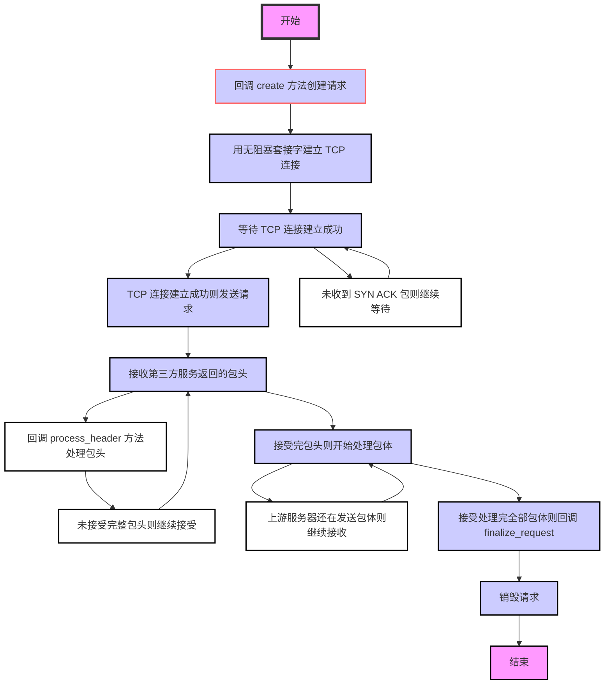
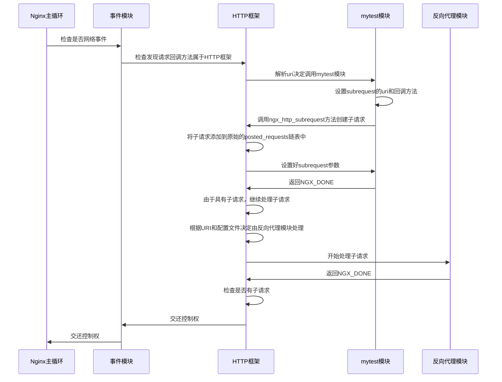

# 第 5 章 访问第三方服务

当需要访问第三方服务时，Nginx 提供了两种全异步方式来与第三方服务器通信： upstream 与 subrequest。upstream 可以保证在与第三方服务器交互时（包括三次握手建立 TCP 连接、发送请求、接收响应、四次握手关闭 TCP 连接等）不会阻塞 Nginx 进程处理其他请求，也就是说，Nginx 仍然可以保持它的高性能。因此，在开发 HTTP 模块时，如果需要访问第三方服务是不能自己简单地用套接字编程实现的，这样会破坏 Nginx 优秀的全异步架构。

subrequest 只是分解复杂请求的一种设计模式，它本质上与访问第三方服务没有任何关系，但从 HTTP 模块开发者的角度而言，使用 subrequest 访问第三方服务却很常用，当然， subrequest 访问第三方服务最终也是基于 upstream 实现的。这两种机制是 HTTP 框架为用户准备的、无阻塞访问第三方服务的利器。

upstream 和 subrequest 的设计目标是完全不同的。从名称中可以看出，upstream 被定义为访问上游服务器，也就是说，它把 Nginx 定义为代理服务器，首要功能是透传，其次才是以 TCP 获取第三方服务器的内容。Nginx 的 HTTP 反向代理模块就是基于 upstream 方式实现的。顾名思义，subrequest 是从属请求的意思，在这里我们更倾向于称它为子请求，也就是说，subrequest 将会为客户请求创建子请求，这是为什么呢？因为异步无阻塞程序的开发过于复杂，所以 HTTP 框架提供了这种机制将一个复杂的请求分解为多个子请求，每个子请求负责一种功能，而最初的原始请求负责构成并发送响应给客户端。例如，用 subrequest 访问第三方服务，一般都是派生出子请求访问上游服务器，父请求在完全取得上游服务器的响应后再决定如何处理来自客户端的请求。这样做的好处是每个子请求专注于一种功能。例如，对于一个子请求，通常在 NGX_HTTP_CONTENT_PHASE 阶段仅会使用一个 HTTP 模块处理，这大大降低了模块开发的复杂度。从 HTTP 框架的内部来说，subrequest 与 upstream 也完全不同，upstream 是从属于用户请求的，subrequest 与原始的用户请求相比是一个（或多个）独立的新请求，只是新的子请求与原始请求之间可以并发的处理。

因此，当我们希望把第三方服务的内容几乎原封不动地返回给用户时，一般使用 upstream 方式，它可以非常高效地透传 HTTP（第 12 章详细描述了 upstream 机制的两种透传方式）。可如果我们访问第三方服务只是为了获取某些信息，再依据这些信息来构造响应并发送给用户，这时应该用 subrequest 方式，因为从业务上来说，这是两件事：获取上游响应，再根据响应内容处理请求，应由两个请求处理。

本章仍然以 mytest 模块为例进行说明，但会扩展 mytest 的功能。注意，文中没有提及的代码（如定义 mytest 模块）都与第 3 章完全相同。

## 5.1 upstream 的使用方式

Nginx 的核心功能——反向代理是基于 upstream 模块（该模块属于 HTTP 框架的一部分）实现的。在弄清楚 upstream 的用法后，完全可以根据自己的需求重写 Nginx 的反向代理功能。

例如，反向代理模块是在先接收完客户请求的 HTTP 包体后，才向上游服务器建立连接并转发请求的。假设用户要上传大小为 1GB 的文件，由于网速限制，文件完整地到达 Nginx 需要 10 小时，恰巧 Nginx 与上游服务器间的网络也很差（当然这种情况很少见），反向代理这个请求到上游服务也需要 10 小时，因此，根据用户的网速也许本来只要 10 个小时的上传过程，最终可能需要 20 个小时才能完成。在了解了 upstream 功能后，可以试着改变反向代理模块的这种特性，比如模仿 squid 反向代理模式，在接收完整 HTTP 请求的头部后就与上游服务器建立连接，并开始将请求向上游服务器透传。

upstream 的使用方式并不复杂，它提供了 8 个回调方法，用户只需要视自己的需要实现其中几个回调方法就可以了。在了解这 8 个回调方法之前，首先要了解 upstream 是如何嵌入到一个请求中的。

从第 3 章中的内容可以看到，模块在处理任何一个请求时都有 ngx_http_request_t 结构的对象 r，而请求 r 中又有一个 ngx_http_upstream_t 类型的成员 upstream。

```C
typedef struct ngx_http_request_s ngx_http_request_t;
struct ngx_http_request_s {
  …
  ngx_http_upstream_t *upstream;
  …
};
```

如果没有使用 upstream 机制，那么 ngx_http_request_t 中的 upstream 成员是 NULL 空指针，如果使用 upstream 机制，那么关键在于如何设置 r-\>upstream 成员。

图 5-1 列出了使用 HTTP 模块启用 upstream 机制的示意图。下面以 mytest 模块为例简单地解释一下图 5-1。

1）首先需要创建上面介绍的 upstream 成员，注意，upstream 在初始状态下是 NULL 空指针。可以调用 HTTP 框架提供好的 ngx_http_upstream_create 方法来创建 upstream。

2）接着设置上游服务器的地址。在 HTTP 反向代理功能中似乎只能使用在 nginx.conf 中配置好的上游服务器（参见 2.5 节的 upstream 配置块内容），而实际上 upstream 机制并没有这种要求，用户能够以**任意方式指定上游服务器的 IP 地址**。例如，可以从请求的 URL 或 HTTP 头部中动态地获取上游服务器地址，ngx_http_upstream_t 中的 resolved 成员就可以帮助用户设置上游服务器（详见 [5.1.3 节](#513-设置需要访问的第三方服务器地址)）。

3）由于 upstream 非常灵活，在各个执行阶段中都会试图回调使用它的 HTTP 模块实现的 8 个方法（详见 5.1.4 节），因此，在 mytest 模块例子中，用户要定义好这些回调方法。

4）在 mytest 模块中，调用 ngx_http_upstream_init 方法即可启动 upstream 机制。注意，ngx_http_mytest_handler 方法此时必须返回 NGX_DONE，这是在要求 HTTP 框架不要按阶段继续向下处理请求了，同时它告诉 HTTP 框架请求必须停留在当前阶段，等待某个 HTTP 模块主动地继续处理这个请求（例如，在上游服务器主动关闭连接时，upstream 模块就会主动地继续处理这个请求，很可能会向客户端发送 502 响应码）。

图 5-1 启动 upstream 的流程图

使用 upstream 模块提供的 ngx_http_upstream_init 方法后，HTTP 框架到底如何运行 upstream 机制呢？图 5-2 给出了一个常见的 upstream 执行示意图，它仅在概念上表示主要流程，与代码的执行没有关系。第 12 章将详细介绍 upstream 机制到底是如何执行的。

图 5-2 所示的 upstream 流程包含了 epoll 模块多次调度、处理一个请求的过程，它虽然与实际代码执行关系不大，但却指出了最常用的 3 个回调方法——create_request、process_header、finalize_request 是如何回调的。



图 5-2 upstream 执行的一般流程

注意 upstream 提供了 3 种处理上游服务器包体的方式：

> （一）包括交由 HTTP 模块使用 input_filter 回调方法直接处理包体；
> （二）以固定缓冲区转发包体；
> （三）以多个缓冲加磁盘文件的方式转发包体等。

在后两种转发包体的方式中，upstream 还与文件缓存功能紧密相关，但为了让大家更清晰地理解 upstream，本章中将不涉及文件缓存。

### 5.1.1 ngx_http_upstream_t 结构体

上面了解了 upstream 机制运行的主要流程，现在来看一下 ngx_http_upstream_t 结构体。

ngx_http_upstream_t 结构体里有些成员仅仅是在 upstream 模块内部使用的，这里就不一一列出了（由于 C 语言是面向过程语言，所以 ngx_http_upstream_t 结构体里会出现第三方 HTTP 模块并不关心的成员。在 [12.1.2 节]中会完整地介绍 ngx_http_upstream_t 中的所有成员）。

```C
typedef struct ngx_http_upstream_s ngx_http_upstream_t;
struct ngx_http_upstream_s {
…
/* request_bufs 决定发送什么样的请求给上游服务器，在实现 create_request 方法时需要设置它 */
ngx_chain_t *request_bufs;
// upstream 访问时的所有限制性参数，在5.1.2节会详细讨论它
ngx_http_upstream_conf_t *conf;
// 通过 resolved 可以直接指定上游服务器地址，在 5.1.3 节会详细讨论它
ngx_http_upstream_resolved_t *resolved;
/* buffer 成员存储接收自上游服务器发来的响应内容，由于它会被复用，所以具有下列多种意义：
a)在使用 process_header 方法解析上游响应的包头时， buffer 中将会保存完整的响应包头；
b)当下面的 buffering 成员为 1，而且此时 upstream 是向下游转发上游的包体时， buffer 没有意义；
c)当 buffering 标志位为 0 时， buffer 缓冲区会被用于反复地接收上游的包体，进而向下游转发；
d)当 upstream 并不用于转发上游包体时， buffer 会被用于反复接收上游的包体， HTTP 模块实现的 input_filter 方法需要关注它
*/

ngx_buf_t buffer;

// 构造发往上游服务器的请求内容
ngx_int_t (*create_request)(ngx_http_request_t *r);

/*收到上游服务器的响应后就会回调 process_header 方法。如果 process_header 返回 NGX_AGAIN，那么是在告诉 upstream 还没有收到完整的响应包头，此时，对于本次 upstream 请求来说，再次接收到上游服务器发来的 TCP 流时，还会调用 process_header 方法处理，直到 process_header 函数返回非 NGX_AGAIN 值这一阶段才会停止 */
ngx_int_t (*process_header)(ngx_http_request_t *r);

// 销毁 upstream 请求时调用
void (*finalize_request)(ngx_http_request_t *r, ngx_int_t rc);

// 5 个可选的回调方法
ngx_int_t (*input_filter_init)(void *data);
ngx_int_t (*input_filter)(void *data, ssize_t bytes);
ngx_int_t (*reinit_request)(ngx_http_request_t *r);
void (*abort_request)(ngx_http_request_t *r);
ngx_int_t (*rewrite_redirect)(ngx_http_request_t *r, ngx_table_elt_t *h, size_t prefix);

// SSL 协议访问上游服务器
unsigned ssl:1;

/*在向客户端转发上游服务器的包体时才有用。当 buffering 为 1 时，表示使用多个缓冲区以及磁盘文件来转发上游的响应包体。当 Nginx 与上游间的网速远大于 Nginx 与下游客户端间的网速时，让 Nginx 开辟更多的内存甚至使用磁盘文件来缓存上游的响应包体，这是有意义的，它可以减轻上游服务器的并发压力。当 buffering 为 0 时，表示只使用上面的这一个 buffer 缓冲区来向下游转发响应包体 */
unsigned buffering:1;
…
};
```

上文介绍过，upstream 有 3 种处理上游响应包体的方式，但 HTTP 模块如何告诉 upstream 使用哪一种方式处理上游的响应包体呢？当请求的 ngx_http_request_t 结构体中 subrequest_in_memory 标志位为 1 时，将采用第 1 种方式，即 upstream 不转发响应包体到下游， 由 HTTP 模块实现的 input_filter 方法处理包体；当 subrequest_in_memory 为 0 时，upstream 会转发响应包体。当 ngx_http_upstream_conf_t 配置结构体中的 buffering 标志位为 1 时，将开启更多的内存和磁盘文件用于缓存上游的响应包体，这意味上游网速更快；当 buffering 为 0 时，将使用固定大小的缓冲区（就是上面介绍的 buffer 缓冲区）来转发响应包体。

注意上述的 8 个回调方法中，只有 `create_request`、`process_header`、`finalize_request` 是必须实现的，其余 5 个回调方法——`input_filter_init`、`input_filter`、`reinit_request`、`abort_request`、`rewrite_redirect` 是可选的。[第 12 章]会详细介绍如何使用这 5 个可选的回调方法。

另外，这 8 个方法的回调场景见 5.2 节。

### 5.1.2 设置 upstream 的限制性参数

本节介绍的是 ngx_http_upstream_t 中的 conf 成员，它用于设置 upstream 模块处理请求时的参数，包括连接、发送、接收的超时时间等。

```C
typedef struct {
…
// 连接上游服务器的超时时间，单位为毫秒
ngx_msec_t connect_timeout;
// 发送 TCP 包到上游服务器的超时时间，单位为毫秒
ngx_msec_t send_timeout;
// 接收 TCP 包到上游服务器的超时时间，单位为毫秒
ngx_msec_t read_timeout; …
} ngx_http_upstream_conf_t;
```

ngx_http_upstream_conf_t 中的参数有很多，[12.1.3 节]会完整地介绍所有成员。事实上，HTTP 反向代理模块在 nginx.conf 文件中提供的配置项大都是用来设置 ngx_http_upstream_conf_t 结构体中的成员的。 上面列出的 3 个超时时间是必须要设置的，因为它们默认为 0，如果不设置将永远无法与上游服务器建立起 TCP 连接 （因为 connect_timeout 值为 0）。

使用[第 4 章介绍的 14 个预设方法](#423-使用-14-种预设方法解析配置项)可以非常简单地通过 nginx.conf 配置文件设置 ngx_http_upstream_conf_t 结构体。例如，可以把 ngx_http_upstream_conf_t 类型的变量放到 ngx_http_mytest_conf_t 结构体中。

```C
typedef struct {
…
ngx_http_upstream_conf_t upstream;
} ngx_http_mytest_conf_t;
```

接下来以设置 connect_timeout 连接超时时间为例说明如何编写 ngx_command_t 来读取配置文件。

```C
static ngx_command_t ngx_http_mytest_commands[] = {…
{ ngx_string("upstream_connect_timeout"),
    NGX_HTTP_LOC_CONF|NGX_CONF_TAKE1,

    // 支持非常多的时间单位
    ngx_conf_set_msec_slot,
    NGX_HTTP_LOC_CONF_OFFSET,
    /*给出 connect_timeout 成员在 ngx_http_mytest_conf_t 结构体中的偏移字节数 */
    offsetof(ngx_http_mytest_conf_t, upstream.connect_timeout), NULL },
    …
}
```

这样，nginx.conf 文件中的 upstream_conn_timeout 配置项将被解析到 ngx_http_mytest_conf_t 结构体的 upstream.connect_timeout 成员中。在处理实际请求时，只要把 ngx_http_mytest_conf_t 配置项的 upstream 成员赋给 ngx_http_upstream_t 中的 conf 成员即可。例如，在 ngx_http_mytest_handler 方法中可以这样设置：

```C
ngx_http_mytest_conf_t *mycf = (ngx_http_mytest_conf_t *) ngx_http_get_module_loc_conf(r, ngx_http_mytest_module);
r->upstream->conf = &mycf->upstream;
```

上面代码中的 r-\>upstream-\>conf 是必须要设置的，否则进程会崩溃（crash）。

注意每一个请求都有独立的 ngx_http_upstream_conf_t 结构体，这意味着每一个请求都可以拥有不同的网络超时时间等配置，用户甚至可以根据 HTTP 请求信息决定连接上游服务器的超时时间、缓存上游响应包体的临时文件存放位置等，这些都只需要在设置 r->upstream->conf 时简单地进行赋值即可，有时这非常有用。

### 5.1.3 设置需要访问的第三方服务器地址

ngx_http_upstream_t 结构中的 resolved 成员可以直接设置上游服务器的地址。首先介绍一下 resolved 的类型。

```C
typedef struct {
  …
  // 地址个数
  ngx_uint_t naddrs;
  // 上游服务器的地址
  struct sockaddr *sockaddr;
  socklen_t socklen;
  …
} ngx_http_upstream_resolved_t;
```

在 ngx_http_upstream_resolved_t 结构的成员中，必须设置的是上面代码中列出的 3 个。具体设置的例子可参见 [5.3 节](#53-使用-upstream-的示例)。

当然，还有其他方法可以设置上游服务器地址，感兴趣的读者可以阅读 upstream 模块源代码，并在 nginx.conf 文件中配置 upstream 块，指定上游服务器的地址。

### 5.1.4 设置回调方法

5.1.1 节介绍的 ngx_http_upstream_t 结构体中有 8 个回调方法，可根据需求及其意义实现。

例如，3 个必须实现的回调方法可以这么定义：

```C
void mytest_upstream_finalize_request(ngx_http_request_t *r, ngx_int_t rc);
ngx_int_t mytest_upstream_create_request(ngx_http_request_t *r);
ngx_int_t mytest_upstream_process_header(ngx_http_request_t *r);
```

在 5.3 节中，会有一个简单的例子说明如何实现上述 3 个方法。

然后，在 ngx_http_mytest_handler 方法中设置它们，例如：

```C
r->upstream->create_request = mytest_upstream_create_request;
r->upstream->process_header = mytest_process_status_line;
r->upstream->finalize_request=mytest_upstream_finalize_request;
```

### 5.1.5 如何启动 upstream 机制

直接执行 ngx_http_upstream_init 方法即可启动 upstream 机制。例如：

```C
static ngx_int_t ngx_http_mytest_handler(ngx_http_request_t *r) {
  …
  r->main->count++;
  ngx_http_upstream_init(r);
  return NGX_DONE;
}
```

调用 ngx_http_upstream_init 就是在启动 upstream 机制，这时要通过返回 NGX_DONE 告诉 HTTP 框架暂停执行请求的下一个阶段。这里还需要执行 r-\>main-\>count++，这是在告诉 HTTP 框架将当前请求的引用计数加 1，即告诉 ngx_http_mytest_handler 方法暂时不要销毁请求，因为 HTTP 框架只有在引用计数为 0 时才能真正地销毁请求。这样的话，upstream 机制接下来才能接管请求的处理工作。

注意在阅读 HTTP 反向代理模块（ngx_http_proxy_module）源代码时，会发现它并没有调用 r-\>main-\>count++，其中 proxy 模块是这样启动 upstream 机制的：

```C
  ngx_http_read_client_request_body(r,ngx_http_upstream_init);
```

这表示读取完用户请求的 HTTP 包体后才会调用 ngx_http_upstream_init 方法启动 upstream 机制（参见 [3.6.4 节](#364-获取-http-包体)）。由于 ngx_http_read_client_request_body 的第一行有效语句是 r-\>main-\>count++，所以 HTTP 反向代理模块不能再次在其代码中执行 r-\>main-\>count++。

这个过程看起来似乎让人困惑。为什么有时需要把引用计数加 1，有时却不需要呢？因为 ngx_http_read_client_request_body 读取请求包体是一个异步操作（需要 epoll 多次调度才能完成的可称其为异步操作），ngx_http_upstream_init 方法启用 upstream 机制也是一个异步操作，因此，从理论上来说，每执行一次异步操作应该把引用计数加 1，而异步操作结束时应该调用 ngx_http_finalize_request 方法把引用计数减 1。另外，ngx_http_read_client_request_body 方法内是加过引用计数的，而 ngx_http_upstream_init 方法内却没有加过引用计数（或许 Nginx 将来会修改这个问题）。在 HTTP 反向代理模块中，它的 ngx_http_proxy_handler 方法中用`ngx_http_read_client_request_body(r,ngx_http_upstream_init);`语句同时启动了两个异步操作，注意，这行语句中只加了一次引用计数。执行这行语句的 ngx_http_proxy_handler 方法返回时只调用 ngx_http_finalize_request 方法一次，这是正确的。对于 mytest 模块也一样，务必要保证对引用计数的增加和减少是配对进行的。

## 5.2 回调方法的执行场景

使用 upstream 方式时最重要的工作都会在回调方法中实现，为了更好地实现它们，本节将介绍调用这些回调方法的典型场景。

### 5.2.1 create_request 回调方法

create_request 的回调场景最简单，即它只可能被调用 1 次（如果不启用 upstream 的失败重试机制的话。详见第 12 章），如图 5-3 所示。下面简单地介绍一下图 5-3 中的每一个步骤：

1）在 Nginx 主循环（这里的主循环是指 8.5 节提到的 ngx_worker_process_cycle 方法）中，会定期地调用事件模块，以检查是否有网络事件发生。

2）事件模块在接收到 HTTP 请求后会调用 HTTP 框架来处理。假设接收、解析完 HTTP 头部后发现应该由 mytest 模块处理，这时会调用 mytest 模块的 ngx_http_mytest_handler 来处理。

3）这里 mytest 模块此时会完成 5.1.2 节~5.1.4 节中所列出的步骤。

4）调用 ngx_http_upstream_init 方法启动 upstream。

图 5-3 create_request 回调场景的序列图

5）upstream 模块会去检查文件缓存，如果缓存中已经有合适的响应包，则会直接返回缓存（当然必须是在使用反向代理文件缓存的前提下）。为了让读者方便地理解 upstream 机制，本章将不再提及文件缓存。

6）回调 mytest 模块已经实现的 create_request 回调方法。

7）mytest 模块通过设置 r-\>upstream-\>request_bufs 已经决定好发送什么样的请求到上游服务器。

8）upstream 模块将会检查 5.1.3 节中介绍过的 resolved 成员，如果有 resolved 成员的话，就根据它设置好上游服务器的地址 r-\>upstream-\>peer 成员。

9）用无阻塞的 TCP 套接字建立连接。

10）无论连接是否建立成功，负责建立连接的 connect 方法都会立刻返回。

11）ngx_http_upstream_init 返回。

12）mytest 模块的 ngx_http_mytest_handler 方法返回 NGX_DONE。

13）当事件模块处理完这批网络事件后，将控制权交还给 Nginx 主循环。

### 5.2.2 reinit_request 回调方法

reinit_request 可能会被多次回调。它被调用的原因只有一个，就是在第一次试图向上游服务器建立连接时，如果连接由于各种异常原因失败，那么会根据 upstream 中 conf 参数的策略要求再次重连上游服务器，而这时就会调用 reinit_request 方法了。图 5-4 描述了典型的 reinit_request 调用场景。

图 5-4 reinit_request 回调场景的序列图

下面简单地介绍一下图 5-4 中列出的步骤。

1）Nginx 主循环中会定期地调用事件模块，检查是否有网络事件发生。

2）事件模块在确定与上游服务器的 TCP 连接建立成功后，会回调 upstream 模块的相关方法处理。

3）upstream 模块这时会把 r-\>upstream-\>request_sent 标志位置为 1，表示连接已经建立成功了，现在开始向上游服务器发送请求内容。

4）发送请求到上游服务器。

5）发送方法当然是无阻塞的（使用了无阻塞的套接字），会立刻返回。

6）upstream 模块处理第 2 步中的 TCP 连接建立成功事件。

7）事件模块处理完本轮网络事件后，将控制权交还给 Nginx 主循环。

8）Nginx 主循环重复第 1 步，调用事件模块检查网络事件。

9）这时，如果发现与上游服务器建立的 TCP 连接已经异常断开，那么事件模块会通知 upstream 模块处理它。

10）在符合重试次数的前提下，upstream 模块会毫不犹豫地再次用无阻塞的套接字试图建立连接。

11）无论连接是否建立成功都立刻返回。

12）这时检查 r-\>upstream-\>request_sent 标志位，会发现它已经被置为 1 了。

13）如果 mytest 模块没有实现 reinit_request 方法，那么是不会调用它的。而如果 reinit_request 不为 NULL 空指针，就会回调它。

14）mytest 模块在 reinit_request 中处理完自己的事情。

15）处理完第 9 步中的 TCP 连接断开事件，将控制权交还给事件模块。

16）事件模块处理完本轮网络事件后，交还控制权给 Nginx 主循环。

### 5.2.3 finalize_request 回调方法

当调用 ngx_http_upstream_init 启动 upstream 机制后，在各种原因（无论成功还是失败）导致该请求被销毁前都会调用 finalize_request 方法（参见图 5-1）。

在 finalize_request 方法中可以不做任何事情，但必须实现 finalize_request 方法，否则 Nginx 会出现空指针调用的严重错误。

### 5.2.4 process_header 回调方法

process_header 是用于解析上游服务器返回的基于 TCP 的响应头部的，因此， process_header 可能会被多次调用，它的调用次数与 process_header 的返回值有关。如图 5-5 所示，如果 process_header 返回 NGX_AGAIN，这意味着还没有接收到完整的响应头部，如果再次接收到上游服务器发来的 TCP 流，还会把它当做头部，仍然调用 process_header 处理。而在图 5-6 中，如果 process_header 返回 NGX_OK（或者其他非 NGX_AGAIN 的值），那么在这次连接的后续处理中将不会再次调用 process_header。

图 5-5 process_header 回调场景的序列图

下面简单地介绍一下图 5-5 中列出的步骤。

1）Nginx 主循环中会定期地调用事件模块，检查是否有网络事件发生。

2）事件模块接收到上游服务器发来的响应时，会回调 upstream 模块处理。

3）upstream 模块这时可以从套接字缓冲区中读取到来自上游的 TCP 流。

4）读取的响应会存放到 r-\>upstream-\>buffer 指向的内存中。注意：在未解析完响应头部前，若多次接收到字符流，所有接收自上游的响应都会完整地存放到 r-\>upstream-\>buffer 缓冲区中。因此，在解析上游响应包头时，如果 buffer 缓冲区全满却还没有解析到完整的响应头部（也就是说，process_header 一直在返回 NGX_AGAIN），那么请求就会出错。

5）调用 mytest 模块实现的 process_header 方法。

6）process_header 方法实际上就是在解析 r-\>upstream-\>buffer 缓冲区，试图从中取到完整的响应头部（当然，如果上游服务器与 Nginx 通过 HTTP 通信，就是接收到完整的 HTTP 头部）。

7）如果 process_header 返回 NGX_AGAIN，那么表示还没有解析到完整的响应头部，下次还会调用 process_header 处理接收到的上游响应。

8）调用无阻塞的读取套接字接口。

9）这时有可能返回套接字缓冲区已经为空。

10）当第 2 步中的读取上游响应事件处理完毕后，控制权交还给事件模块。

11）事件模块处理完本轮网络事件后，交还控制权给 Nginx 主循环。

### 5.2.5 rewrite_redirect 回调方法

在重定向 URL 阶段，如果实现了 rewrite_redirect 回调方法，那么这时会调用 rewrite_redirect。注意，本章不涉及 rewrite_redirect 方法，感兴趣的读者可以查看 upstream 模块的 ngx_http_upstream_rewrite_location 方法。如果 upstream 模块接收到完整的上游响应头部，而且由 HTTP 模块的 process_header 回调方法将解析出的对应于 Location 的头部设置到了 ngx_http_upstream_t 中的 headers_in 成员时，ngx_http_upstream_process_headers 方法将会最终调用 rewrite_redirect 方法（见 12.5.3 节图 12-5 的第 8 步）。因此，rewrite_redirect 的使用场景比较少，它主要应用于 HTTP 反向代理模块（ngx_http_proxy_module）。

### 5.2.6 input_filter_init 与 input_filter 回调方法

input_filter_init 与 input_filter 这两个方法都用于处理上游的响应包体，因为处理包体前 HTTP 模块可能需要做一些初始化工作。例如，分配一些内存用于存放解析的中间状态等，这时 upstream 就提供了 input_filter_init 方法。而 input_filter 方法就是实际处理包体的方法。这两个回调方法都可以选择不予实现，这是因为当这两个方法不实现时，upstream 模块会自动设置它们为预置方法（上文讲过，由于 upstream 有 3 种处理包体的方式，所以 upstream 模块准备了 3 对 input_filter_init、input_filter 方法）。因此，一旦试图重定义 input_filter_init、input_filter 方法，就意味着我们对 upstream 模块的默认实现是不满意的，所以才要重定义该功能。此时，首先必须要弄清楚默认的 input_filter 方法到底做了什么，在 12.6 节~12.8 节介绍的 3 种处理包体方式中，都会涉及默认的 input_filter 方法所做的工作。

在多数情况下，会在以下场景决定重新实现 input_filter 方法。

（1）在转发上游响应到下游的同时，需要做一些特殊处理

例如，ngx_http_memcached_module 模块会将实际由 memcached 实现的上游服务器返回的响应包体，转发到下游的 HTTP 客户端上。在上述过程中，该模块通过重定义了的 input_filter 方法来检测 memcached 协议下包体的结束，而不是完全、纯粹地透传 TCP 流。

（2）当无须在上、下游间转发响应时，并不想等待接收完全部的上游响应后才开始处理请求在不转发响应时，通常会将响应包体存放在内存中解析，如果试图接收到完整的响应后再来解析，由于响应可能会非常大，这会占用大量内存。而重定义了 input_filter 方法后，可以每解析完一部分包体，就释放一些内存。

重定义 input_filter 方法必须符合一些规则，如怎样取到刚接收到的包体以及如何释放缓冲区使得固定大小的内存缓冲区可以重复使用等。注意，本章的例子并不涉及 input_filter 方法，读者可以在第 12 章中找到 input_filter 方法的使用方式。

## 5.3 使用 upstream 的示例

下面以一个简单且能够运行的示例帮助读者理解如何使用 upstream 机制。这个示例要实现的功能很简单，即以访问 mytest 模块的 URL 参数作为搜索引擎的关键字，用 upstream 方式访问 google，查询 URL 里的参数，然后把 google 的结果返回给用户。这个场景非常适合使用 upstream 方式，因为 Nginx 访问 google 的服务器使用的是 HTTP，它当然符合 upstream 的使用场景：上游服务器提供基于 TCP 的协议。上文讲过，upstream 提供了 3 种处理包体的方式，这里选择以固定缓冲区向下游客户端转发 google 返回的包体（HTTP 的包体）的方式。

例如，如果访问的 URL 是/test?lumia，那么在 nginx.conf 中可以这样配置 location。

```ini
location /test {
mytest;
}
```

mytest 模块将会使用 upstream 机制向www.google.com 发送搜索请求，它的请求 URL 是/search?q=lumia，google 返回的包头将在 mytest 模块中解析并决定如何转发给用户，而包体将会被透传给用户。

这里继续以 mytest 模块为例来说明如何使用 upstream 达成上述效果。

### 5.3.1 upstream 的各种配置参数

每一个 HTTP 请求都会有独立的 ngx_http_upstream_conf_t 结构体，出于简单考虑，在 mytest 模块的例子中，所有的请求都将共享同一个 ngx_http_upstream_conf_t 结构体，因此，这里把它放到 ngx_http_mytest_conf_t 配置结构体中，如下所示。

```C
typedef struct {
ngx_http_upstream_conf_t upstream;
} ngx_http_mytest_conf_t;
```

在启动 upstream 前，先将 ngx_http_mytest_conf_t 下的 upstream 成员赋给 r-\>upstream-\>conf 成员，可参考 5.3.6 节中的示例代码。

ngx_http_upstream_conf_t 结构中的各成员可以通过第 4 章中介绍的方法，即用预设的配置项解析参数来赋值，如 5.1.2 节中的例子所示。出于方便，这里直接硬编码到 create_loc_conf 回调方法中了，如下所示。

```C
static void* ngx_http_mytest_create_loc_conf(ngx_conf_t *cf) {
ngx_http_mytest_conf_t *mycf;
mycf = (ngx_http_mytest_conf_t *)ngx_pcalloc(cf->pool, sizeof(ngx_http_mytest_conf_t));
if (mycf == NULL) {
  return NULL;
}
/*以下简单的硬编码 ngx_http_upstream_conf_t 结构中的各成员，如超时时间，都设为 1 分钟，这也是 HTTP 反向代理模块的默认值 */
mycf->upstream.connect_timeout = 60000;
mycf->upstream.send_timeout = 60000;
mycf->upstream.read_timeout = 60000;
mycf->upstream.store_access = 0600;
/* buffering 已经决定了将以固定大小的内存作为缓冲区来转发上游的响应包体，这块固定缓冲区的大小就是 buffer*size。如果 buffering 为 1，就会使用更多的内存缓存来不及发往下游的响应。例如，最多使用 bufs.num 个缓冲区且每个缓冲区大小为 bufs.size。另外，还会使用临时文件，临时文件的最大长度为 max_temp_file_size*/
mycf->upstream.buffering = 0;
mycf->upstream.bufs.num = 8;
mycf->upstream.bufs.size = ngx_pagesize;
mycf->upstream.buffer_size = ngx_pagesize;
mycf->upstream.busy_buffers_size = 2*ngx_pagesize;
mycf->upstream.temp_file_write_size = 2 * ngx_pagesize;
mycf->upstream.max_temp_file_size = 1024 * 1024 * 1024;
/* upstream hide_headers 成员必须要初始化（ upstream 在解析完上游服务器返回的包头时，会调用 ngx_http_upstream_process_headers 方法按照 hide_headers 成员将本应转发给下游的一些 HTTP 头部隐藏），这里将它赋为 NGX_CONF_UNSET_PTR ，这是为了在 merge 合并配置项方法中使用 upstream 模块提供的 ngx_http_upstream_hide_headers_hash 方法初始化 hide_headers 成员 */
mycf->upstream.hide_headers = NGX_CONF_UNSET_PTR;
mycf->upstream.pass_headers = NGX_CONF_UNSET_PTR;
return mycf;
}
```

hide_headers 的类型是 ngx_array_t 动态数组（实际上，upstream 模块将会通过 hide_headers 来构造 hide_headers_hash 散列表）。由于 upstream 模块要求 hide_headers 不可以为 NULL，所以必须要初始化 hide_headers 成员。upstream 模块提供了 ngx_http_upstream_hide_headers_hash 方法来初始化 hide_headers，但仅可用在合并配置项方法内。例如，在下面的 ngx_http_mytest_merge_loc_conf 方法中就可以使用，如下所示，

```C
static char *ngx_http_mytest_merge_loc_conf(ngx_conf_t cf, void *parent, void *child) {
  ngx_http_mytest_conf_t *prev = (ngx_http_mytest_conf_t *)parent;
  ngx_http_mytest_conf_t *conf = (ngx_http_mytest_conf_t *)child;
  ngx_hash_init_t hash;
  hash.max_size = 100;
  hash.bucket_size = 1024;
  hash.name = "proxy_headers_hash";
  if (ngx_http_upstream_hide_headers_hash(cf, &conf->upstream, &prev->upstream, ngx_http_proxy_hide_headers, &hash) != NGX_OK)
  {
    return NGX_CONF_ERROR;
  }
  return NGX_CONF_OK;
}
```

### 5.3.2 请求上下文

本节介绍的例子就必须要使用上下文才能正确地解析 upstream 上游服务器的响应包，因为 upstream 模块每次接收到一段 TCP 流时都会回调 mytest 模块实现的 process_header 方法解析， 这样就需要有一个上下文保存解析状态。在解析 HTTP 响应行时，可以使用 HTTP 框架提供的 ngx_http_status_t 结构，如下所示。

```C
typedef struct {
  ngx_uint_t code;
  ngx_uint_t count;
  u_char *start;
  u_char *end;
} ngx_http_status_t;
```

把 ngx_http_status_t 结构放到上下文中，并在 process_header 解析响应行时使用，如下所示。

```C
typedef struct {
ngx_http_status_t status;
} ngx_http_mytest_ctx_t;
```

在 [5.3.4 节](#534-在-process_header-方法中解析包头)实现 process_header 的代码中，可以学会如何使用 ngx_http_status_t 结构。

### 5.3.3 在 create_request 方法中构造请求

这里定义的 mytest_upstream_create_request 方法用于创建发送给上游服务器的 HTTP 请求，upstream 模块将会回调它，实现如下。

```C
static ngx_int_t mytest_upstream_create_request(ngx_http_request_t *r) {
  /*发往 google 上游服务器的请求很简单，就是模仿正常的搜索请求，以 /searchq=…的 URL 来发起搜索请求。 backendQueryLine 中的 %V 等转化格式的用法，可参见表 4-7*/
  static ngx_str_t backendQueryLine =
  ngx_string("GET searchq=%V HTTP1.1\r\nHost: www.google.com\r\nConnection: close\r\n\r\n");
  ngx_int_t queryLineLen = backendQueryLine.len + r->args.len - 2;
  /* epoll 多次调度 send 才能发送完成，这时必须保证这段内存不会被释放；另一个好处是，在请求结束时，这段内存会被自动释放，降低内存泄漏的可能 */
  ngx_buf_t_ b = ngx_create_temp_buf(r->pool, queryLineLen);
  if (b == NULL)
    return NGX_ERROR;
  // last 要指向请求的末尾
  b->last = b->pos + queryLineLen;
  // 作用相当于 snprintf，只是它支持表 4-7 中列出的所有转换格式
  ngx_snprintf(b->pos, queryLineLen , (char*)backendQueryLine.data,&r->args);
  /* r->upstream->request_bufs 是一个 ngx_chain_t 结构，它包含着要发送给上游服务器的请求 */
  r->upstream->request_bufs = ngx_alloc_chain_link(r->pool);
  if (r->upstream->request_bufs == NULL) return NGX_ERROR;
  // request_bufs 在这里只包含 1 个 ngx_buf_t 缓冲区
  r->upstream->request_bufs->buf = b; r->upstream->request_bufs->next = NULL; r->upstream->request_sent = 0;
  r->upstream->header_sent = 0;
  // header_hash 不可以为 0
  r->header_hash = 1;
  return NGX_OK;
}
```

### 5.3.4 在 process_header 方法中解析包头

process_header 负责解析上游服务器发来的基于 TCP 的包头，在本例中，就是解析 HTTP 响应行和 HTTP 头部，因此，这里使用 mytest_process_status_line 方法解析 HTTP 响应行，使用 mytest_upstream_process_header 方法解析 http 响应头部。之所以使用两个方法解析包头，这也是 HTTP 的复杂性造成的，因为无论是响应行还是响应头部都是不定长的，都需要使用状态机来解析。实际上，这两个方法也是通用的，它们适用于解析所有的 HTTP 响应包，而且这两个方法的代码与 ngx_http_proxy_module 模块的实现几乎是完全一致的。

```C
static ngx_int_t
mytest_process_status_line(ngx_http_request_t *r) {
    size_t len;
    ngx_int_t rc;
    ngx_http_upstream_t *u;
    // 上下文中才会保存多次解析 HTTP 响应行的状态，下面首先取出请求的上下文
    ngx_http_mytest_ctx_t *ctx = ngx_http_get_module_ctx(r, ngx_http_mytest_module);
    if (ctx == NULL)
    {
        return NGX_ERROR;
    }
    u = r->upstream;
    /* HTTP 框架提供的 ngx_http_parse_status_line 方法可以解析 HTTP 响应行，它的输入就是收到的字符流和上下文中的 ngx_http_status_t 结构 */
    rc = ngx_http_parse_status_line(r, &u->buffer, &ctx->status);
    // 返回 NGX_AGAIN 时，表示还没有解析出完整的 HTTP 响应行，需要接收更多的字符流再进行解析

    if (rc == NGX_AGAIN)
    {
        return rc;
    }
    // 返回 NGX_ERROR 时，表示没有接收到合法的 HTTP 响应行
    if (rc == NGX_ERROR)
    {
        ngx_log_error(NGX_LOG_ERR, r->connection->log, 0, "upstream sent no valid HTTP/1.0 header");
        r->http_version = NGX_HTTP_VERSION_9;
        u->state->status = NGX_HTTP_OK;
        return NGX_OK;
    }
    /*以下表示在解析到完整的 HTTP 响应行时，会做一些简单的赋值操作，将解析出的信息设置到 r->upstream->headers*in 结构体中。当 upstream 解析完所有的包头时，会把 headers_in 中的成员设置到将要向下游发送的 r->headers_out 结构体中，也就是说，现在用户向 headers_in 中设置的信息，最终都会发往下游客户端。为什么不直接设置 r->headers_out 而要多此一举呢？因为 upstream 希望能够按照 ngx_http_upstream_conf_t 配置结构体中的 hide_headers 等成员对发往下游的响应头部做统一处理 */
    if (u->state)
    {
        u->state->status = ctx->status.code;
    }
    u->headers_in.status_n = ctx->status.code;
    len = ctx->status.end - ctx->status.start;
    u->headers_in.status_line.len = len;
    u->headers_in.status_line.data = ngx_pnalloc(r->pool, len);
    if (u->headers_in.status_line.data == NULL)
    {
        return NGX_ERROR;
    }
    ngx_memcpy(u->headers_in.status_line.data, ctx->status.start, len);
    /*下一步将开始解析 HTTP 头部。设置 process*header 回调方法为 mytest_upstream_process_header，之后再收到的新字符流将由 mytest_upstream_process_header 解析 */
    u->process_header = mytest_upstream_process_header;
    /*如果本次收到的字符流除了 HTTP 响应行外，还有多余的字符，那么将由 mytest*upstream_process_header 方法解析 */
    return mytest_upstream_process_header(r);
}
```

mytest_upstream_process_header 方法可以解析 HTTP 响应头部，而这个例子只是简单地把上游服务器发送的 HTTP 头部添加到了请求 r-\>upstream-\>headers_in.headers 链表中。如果有需要特殊处理的 HTTP 头部，那么也应该在 mytest_upstream_process_header 方法中进行。

```C
static ngx_int_t mytest_upstream_process_header(ngx_http_request_t *r)
{
    ngx_int_t rc;
    ngx_table_elt_t *h;
    ngx_http_upstream_header_t *hh;
    ngx_http_upstream_main_conf_t *umcf;
    /*这里将 upstream 模块配置项 ngx*http_upstream_main_conf_t 取出来，目的只有一个，就是对将要转发给下游客户端的 HTTP 响应头部进行统一处理。该结构体中存储了需要进行统一处理的 HTTP 头部名称和回调方法 */
    umcf = ngx_http_get_module_main_conf(r, ngx_http_upstream_module);
    // 循环地解析所有的 HTTP 头部
    for (;;)
    {
        /* HTTP 框架提供了基础性的 ngx*http_parse_header_line 方法，它用于解析 HTTP 头部 */
        rc = ngx_http_parse_header_line(r, &r->upstream->buffer, 1);
        // 返回 NGX_OK 时，表示解析出一行 HTTP 头部
        if (rc == NGX_OK)
        {
            // 向 headers_in.headers 这个 ngx_list_t 链表中添加 HTTP 头部
            h = ngx_list_push(&r->upstream->headers_in.headers);
            if (h == NULL)
            {
                return NGX_ERROR;
            }
            // 下面开始构造刚刚添加到 headers 链表中的 HTTP 头部
            h->hash = r->header_hash;
            h->key.len = r->header_name_end - r->header_name_start;
            h->value.len = r->header_end - r->header_start;
            // HTTP 头部的内存空间
            h->key.data = ngx_pnalloc(r->pool, h->key.len + 1 + h->value.len + 1 + h->key.len);
            if (h->key.data == NULL)
            {
                return NGX_ERROR;
            }
            h->value.data = h->key.data + h->key.len + 1;
            h->lowcase_key = h->key.data + h->key.len + 1 + h->value.len + 1;
            ngx_memcpy(h->key.data, r->header_name_start, h->key.len);
            h->key.data[h->key.len] = '\0';
            ngx_memcpy(h->value.data, r->header_start, h->value.len);
            h->value.data[h->value.len] = '\0';
            if (h->key.len == r->lowcase_index)
            {
                ngx_memcpy(h->lowcase_key, r->lowcase_header, h->key.len);
            }
            else
            {
                ngx_strlow(h->lowcase_key, h->key.data, h->key.len);
            }
            // upstream 模块会对一些 HTTP 头部做特殊处理
            hh = ngx_hash_find(&umcf->headers_in_hash, h->hash, h->lowcase_key, h->key.len);
            if (hh && hh->handler(r, h, hh->offset) != NGX_OK)
            {
                return NGX_ERROR;
            }
            continue;
        }
        /*返回 NGX*HTTP_PARSE_HEADER_DONE 时，表示响应中所有的 HTTP 头部都解析完毕，接下来再接收到的都将是 HTTP 包体 */
        if (rc == NGX_HTTP_PARSE_HEADER_DONE)
        {
            /*如果之前解析 HTTP 头部时没有发现 server 和 date 头部，那么下面会根据 HTTP 协议规范添加这两个头部 */
            if (r->upstream->headers_in.server == NULL)
            {
                h = ngx_list_push(&r->upstream->headers_in.headers);
                if (h == NULL)
                {
                    return NGX_ERROR;
                }
                h->hash = ngx_hash(ngx_hash(ngx_hash(ngx_hash(ngx_hash('s', 'e'), 'r'), 'v'), 'e'), 'r');
                ngx_str_set(&h->key, "Server");
                ngx_str_null(&h->value);
                h->lowcase_key = (u_char *)"server";
            }
            if (r->upstream->headers_in.date == NULL)
            {
                h = ngx_list_push(&r->upstream->headers_in.headers);
                if (h == NULL)
                {
                    return NGX_ERROR;
                }
                h->hash = ngx_hash(ngx_hash(ngx_hash('d', 'a'), 't'), 'e');
                ngx_str_set(&h->key, "Date");
                ngx_str_null(&h->value);
                h->lowcase_key = (u_char *)"date";
            }
            return NGX_OK;
        }
        /*如果返回 NGX*AGAIN，则表示状态机还没有解析到完整的 HTTP 头部，此时要求 upstream 模块继续接收新的字符流，然后交由 process_header 回调方法解析 */
        if (rc == NGX_AGAIN)
        {
            return NGX_AGAIN;
        }
        // 其他返回值都是非法的
        ngx_log_error(NGX_LOG_ERR, r->connection->log, 0, "upstream sent invalid header");
        return NGX_HTTP_UPSTREAM_INVALID_HEADER;
    }
}
```

当 mytest_upstream_process_header 返回 NGX_OK 后，upstream 模块开始把上游的包体（如果有的话）直接转发到下游客户端。

### 5.3.5 在 finalize_request 方法中释放资源

当请求结束时，将会回调 finalize_request 方法，如果我们希望此时释放资源，如打开的句柄等，那么可以把这样的代码添加到 finalize_request 方法中。本例中定义了 mytest_upstream_finalize_request 方法，由于我们没有任何需要释放的资源，所以该方法没有完成任何实际工作，只是因为 upstream 模块要求必须实现 finalize_request 回调方法，如下所示。

```C
static void
mytest_upstream_finalize_request(ngx_http_request_t *r, ngx_int_t rc)
{
    ngx_log_error(NGX_LOG_DEBUG, r->connection->log, 0, "mytest_upstream_finalize_request");
}
```

### 5.3.6 在 ngx_http_mytest_handler 方法中启动 upstream

在开始介入处理客户端请求的 ngx_http_mytest_handler 方法中启动 upstream 机制，而何时请求会结束，则视 Nginx 与上游的 google 服务器间的通信而定。通常，在启动 upstream 时，我们将决定以何种方式处理上游响应的包体，前文说过，我们会原封不动地转发 google 的响应包体到客户端，这一行为是由 ngx_http_request_t 结构体中的 subrequest_in_memory 标志位决定的，默认情况下，subrequest_in_memory 为 0，即表示将转发上游的包体到下游。在 5.3.1 节中介绍过，当 ngx_http_upstream_conf_t 结构体中的 buffering 标志位为 0 时，意味着以固定大小的缓冲区来转发包体。

```C
static ngx_int_t ngx_http_mytest_handler(ngx_http_request_t *r)
{
    // 首先建立 HTTP 上下文结构体 ngx_http_mytest_ctx_t
    ngx_http_mytest_ctx_t *myctx = ngx_http_get_module_ctx(r, ngx_http_mytest_module);

    if (myctx == NULL)
    {
        myctx = ngx_palloc(r->pool, sizeof(ngx_http_mytest_ctx_t));
        if (myctx == NULL)
        {
            return NGX_ERROR;
        }
        // 将新建的上下文与请求关联起来
        ngx_http_set_ctx(r, myctx, ngx_http_mytest_module);
    }
    /*对每 1 个要使用 upstream 的请求，必须调用且只能调用 1 次 ngx_http_upstream_create 方法，它会初始化 r->upstream 成员 */
    if (ngx_http_upstream_create(r) != NGX_OK)
    {
        ngx_log_error(NGX_LOG_ERR, r->connection->log, 0, "ngx_http_upstream_create() failed");
        return NGX_ERROR;
    }
    // 得到配置结构体 ngx_http_mytest_conf_t
    ngx_http_mytest_conf_t *mycf = (ngx_http_mytest_conf_t *)ngx_http_get_module_loc_conf(r, ngx_http_mytest_module);
    ngx_http_upstream_t *u = r->upstream;
    // r->upstream->conf 成员
    u->conf = &mycf->upstream;
    // 决定转发包体时使用的缓冲区
    u->buffering = mycf->upstream.buffering;
    // 以下代码开始初始化 resolved 结构体，用来保存上游服务器的地址
    u->resolved = (ngx_http_upstream_resolved_t *)ngx_pcalloc(r->pool, sizeof(ngx_http_upstream_resolved_t));
    if (u->resolved == NULL)
    {
        ngx_log_error(NGX_LOG_ERR, r->connection->log, 0, "ngx_pcalloc resolved error. %s.", strerror(errno));
        return NGX_ERROR;
    }
    // 这里的上游服务器就是 www.google.com
    static struct sockaddr_in backendSockAddr;
    struct hostent pHost = gethostbyname((char)"www.google.com");
    if (pHost == NULL)
    {
        ngx_log_error(NGX_LOG_ERR, r->connection->log, 0, "gethostbyname fail. %s", strerror(errno));
        return NGX_ERROR;
    }
    // 访问上游服务器的 80 端口
    backendSockAddr.sin_family = AF_INET;
    backendSockAddr.sin_port = htons((in_port_t)80);
    char *pDmsIP = inet_ntoa(*(struct in_addr *)(pHost->h_addr_list[0]));
    backendSockAddr.sin_addr.s_addr = inet_addr(pDmsIP);
    myctx->backendServer.data = (u_char *)pDmsIP;
    myctx->backendServer.len = strlen(pDmsIP);
    // resolved 成员中
    u->resolved->sockaddr = (struct sockaddr *)&backendSockAddr;
    u->resolved->socklen = sizeof(struct sockaddr_in);
    u->resolved->naddrs = 1;
    // 设置 3 个必须实现的回调方法，也就是 5.3.3 节~ 5.3.5 节中实现的 3 个方法
    u->create_request = mytest_upstream_create_request;
    u->process_header = mytest_process_status_line;
    u->finalize_request = mytest_upstream_finalize_request;
    // count 成员加 1，参见 5.1.5 节
    r->main->count++;
    // 启动 upstream
    ngx_http_upstream_init(r);
    // 必须返回 NGX_DONE
    return NGX_DONE;
}
```

到此为止，高性能地访问第三方服务的 upstream 例子就介绍完了。在本例中，可以完全异步地访问第三方服务，并发访问数也只会受制于物理内存的大小，完全可以轻松达到几十万的并发 TCP 连接。

## 5.4 subrequest 的使用方式

subrequest 是由 HTTP 框架提供的一种分解复杂请求的设计模式，它可以把原始请求分解为许多子请求，使得诸多请求协同完成一个用户请求，并且每个请求只关注于一个功能。它与访问第三方服务及 upstream 机制有什么关系呢？首先，只要不是完全将上游服务器的响应包体转发到下游客户端，基本上都会使用 subrequest 创建出子请求，并由子请求使用 upstream 机制访问上游服务器，然后由父请求根据上游响应重新构造返回给下游客户端的响应。其次，在 HTTP 框架的设计上，subrequest 与 upstream 也是密切相关的。例如，上文讲过，描述 HTTP 请求的 ngx_http_request_t 结构体中有一个标志位 subrequest_in_memory，它决定 upstream 对待上游响应包体的行为。但是从名字上我们可以看到，它是与 subrequest 有关的，实际上，在创建子请求的方法中就可以设置 subrequest_in_memory。

subrequest 设计的基础是生成一个（子）请求的代价要非常小，消耗的内存也要很少， 并且不会一直占用进程资源。因此，每个请求都应该做简单、独立的工作，而由多个子请求合成为一个父请求向客户端提供完整的服务。在 Nginx 中，大量功能复杂的模块都是基于 subrequest 实现的。

使用 subrequest 的方式要比 upstream 简单得多，只需要完成以下 4 步操作即可。

1）在 nginx.conf 文件中配置好子请求的处理方式。

2）启动 subrequest 子请求。

3）实现子请求执行结束时的回调方法。

4）实现父请求被激活时的回调方法。

下面依次说明这 4 个步骤。

### 5.4.1 配置子请求的处理方式

实际上，子请求的处理过程与普通请求完全相同，也需要在 nginx.conf 中配置相应的模块来处理。子请求与普通请求的不同之处在于，子请求是由父请求生成的，不是接收客户端发来的网络包再由 HTTP 框架解析出的。配置处理子请求的模块与普通请求完全相同，可以任意地使用 HTTP 官方模块、第三方模块来处理。本章中将以访问第三方服务为例，因此会使用 ngx_http_proxy_module 反向代理模块来处理子请求（注意，这里并没有使用反向代理的转发响应功能，而只是把响应接收到 Nginx 的内存中），但在实际应用中不限于此。

假设我们生成的子请求是以 URI 为/list 开头的请求，使用 ngx_http_proxy_module 模块让子请求访问新浪的 hq.sinajs.cn 股票服务器，那么可以在 nginx.conf 中这样设置：

```ini
location /list {
proxy_pass hq.sinajs.cn;
/* 不希望第三方服务发来的 HTTP 包体做过 gzip 压缩，因为我们不想在子请求结束时要对响应做 gzip 解压缩操作 */
proxy_set_header Accept-Encoding "";
}
```

这样，在 [5.4.4 节](#544-启动-subrequest-子请求)中，如果生成的子请求是以/list 开头的，就会使用反向代理模块去访问新浪服务器，并在接收完新浪服务器的响应包后调用 5.4.2 节中介绍的回调方法。

### 5.4.2 实现子请求处理完毕时的回调方法

Nginx 在子请求正常或者异常结束时，都会调用 ngx_http_post_subrequest_pt 回调方法，如下所示。

```C
typedef ngx_int_t (*ngx_http_post_subrequest_pt) (ngx_http_request_t r,void data, ngx_int_t rc);
```

如何把这个回调方法传递给 subrequest 子请求呢？要建立 ngx_http_post_subrequest_t 结构体：

```C
typedef struct {
  ngx_http_post_subrequest_pt handler;
  void *data;
} ngx_http_post_subrequest_t;
```

在生成 ngx_http_post_subrequest_t 结构体时，可以把任意数据赋给这里的 data 指针， ngx_http_post_subrequest_pt 回调方法执行时的 data 参数就是 ngx_http_post_subrequest_t 结构体中的 data 成员指针。

ngx_http_post_subrequest_pt 回调方法中的 rc 参数是子请求在结束时的状态，它的取值则是执行 ngx_http_finalize_request 销毁请求时传递的 rc 参数（对于本例来说，由于子请求使用反向代理模块访问上游 HTTP 服务器，所以 rc 此时是 HTTP 响应码。例如，在正常情况下，rc 会是 200）。相应源代码如下：

```C
void ngx_http_finalize_request(ngx_http_request_t *r, ngx_int_t rc)
{
    // 如果当前请求属于某个原始请求的子请求
    if (r != r->main && r->post_subrequest)
    {
      rc = r->post_subrequest->handler(r, r->post_subrequest->data, rc);
    }
}
```

上面代码中的 r 变量是子请求（不是父请求）。

在 ngx_http_post_subrequest_pt 回调方法内必须设置父请求激活后的处理方法，设置的方法很简单，首先要找出父请求，例如：

```C
ngx_http_request_t *pr = r->parent;
```

然后将实现好的 ngx_http_event_handler_pt 回调方法赋给父请求的 write_event_handler 指针（为什么设置 write_event_handler？因为父请求正处于等待发送响应的阶段，详见 11.7 节），例如：

```C
pr->write_event_handler = mytest_post_handler;
```

mytest_post_handler 就是 [5.6.4 节](#564-父请求的回调方法)中实现的父请求重新激活后的回调方法。

在 5.6.3 节中可以看到相关的具体例子。

### 5.4.3 处理父请求被重新激活后的回调方法

mytest_post_handler 是父请求重新激活后的回调方法，它对应于 ngx_http_event_handler_pt 指针，如下所示：

```C
typedef void (*ngx_http_event_handler_pt)(ngx_http_request_t *r);
struct ngx_http_request_s {
  …
  ngx_http_event_handler_pt write_event_handler;
  …
}
```

这个方法负责发送响应包给用户，其流程与 [3.7 节](#37-发送响应)中介绍的发送方式是一致的，也可以参考 5.6.4 节中的例子。

### 5.4.4 启动 subrequest 子请求

在 ngx_http_mytest_handler 处理方法中，可以启动 subrequest 子请求。首先调用 ngx_http_subrequest 方法建立 subrequest 子请求，在 ngx_http_mytest_handler 返回后，HTTP 框架会自动执行子请求。先看一下 ngx_http_subrequest 的定义：

```C
ngx_int_t
ngx_http_subrequest(ngx_http_request_t *r, ngx_str_t uri, ngx_str_t args, ngx_http_request_t **psr, ngx_http_post_subrequest_t *ps, ngx_uint_t flags);
```

下面依次介绍 ngx_http_subrequest 中的参数和返回值。

（1）ngx_http_request_t \*r
ngx_http_request_t \*r 是当前的请求，也就是父请求。

（2）ngx_str_t \*uri
ngx_str_t \*uri 是子请求的 URI，它对究竟选用 nginx.conf 配置文件中的哪个模块来处理子请求起决定性作用。

（3）ngx_str_t \*args
ngx_str_t \*args 是子请求的 URI 参数，如果没有参数，可以传送 NULL 空指针。

（4）ngx_http_request_t \*\*psr
psr 是输出参数而不是输入参数，它将把 ngx_http_subrequest 生成的子请求传出来。一般，我们先建立一个子请求的空指针 ngx_http_request_t \*psr，再把它的地址&psr 传入到 ngx_http_subrequest 方法中，如果 ngx_http_subrequest 返回成功，psr 就指向建立好的子请求。

（5）ngx_http_post_subrequest_t \*ps

这里传入 [5.4.2 节](#542-实现子请求处理完毕时的回调方法)中创建的 ngx_http_post_subrequest_t 结构体地址，它指出子请求结束时必须回调的处理方法。

（6）ngx_uint_t flags
flag 的取值范围包括：

> ①0:在没有特殊需求的情况下都应该填写它；

> ②NGX_HTTP_SUBREQUEST_IN_MEMORY。这个宏会将子请求的 subrequest_in_memory 标志位置为 1，这意味着如果子请求使用 upstream 访问上游服务器，那么上游服务器的响应都将会在内存中处理；

> ③NGX_HTTP_SUBREQUEST_WAITED。这个宏会将子请求的 waited 标志位置为 1，当子请求提前结束时，有个 done 标志位会置为 1，但目前 HTTP 框架并没有针对这两个标志位做任何实质性处理。

:::warning
注意，flag 是按比特位操作的，这样可以同时含有上述 3 个值。
:::

（7）返回值
返回 NGX_OK 表示成功建立子请求；返回 NGX_ERROR 表示建立子请求失败。

ngx_http_mytest_handler 处理方法的返回值依然与 upstream 机制相同，它也必须返回 NGX_DONE，原因也是相同的。

## 5.5 subrequest 执行过程中的主要场景

在使用 subrequest 时，需要了解下面 3 个场景：

-   启动 subrequest 后子请求是如何运行的。

-   子请求如何存放接收到的响应。

-   子请求结束时如何回调处理方法，以及激活父请求的处理方法。

下面根据序列图来说明这 3 个场景。

5.5.1 如何启动 subrequest

处理父请求的过程中会创建子请求，在父请求的处理方法返回 NGX_DONE 后，HTTP 框架会开始执行子请求，如图 5-6 所示。

下面简单介绍一下图 5-6 中的每一个步骤：



图 5-6 subrequest 的启动过程序列图

1）Nginx 主循环中会定期地调用事件模块，检查是否有网络事件发生。
2）事件模块发现这个请求的回调方法属于 HTTP 框架，交由 HTTP 框架来处理请求。
3）根据解析完的 URI 来决定使用哪个 location 下的模块来处理这个请求。
4）调用 mytest 模块的 ngx_http_mytest_handler 方法处理这个请求。
5）设置 subrequest 子请求的 URI 及回调方法，这一步以及下面的第 6~9 步所做的工作参见 [5.4.4 节](#544-启动-subrequest-子请求)。
6）调用 ngx_http_subrequest 方法创建子请求。
7）创建的子请求会添加到原始请求的 posted_requests 链表中，这样保证第 10 步时会在父请求返回 NGX_DONE 的情况下开始执行子请求。
8）ngx_http_subrequest 方法执行完毕，子请求创建成功。
9）ngx_http_mytest_handler 方法执行完毕，返回 NGX_DONE，这样父请求不会被销毁，将等待以后的再次激活。
10）HTTP 框架执行完当前请求（父请求）后，检查 posted_requests 链表中是否还有子请求，如果存在子请求，则调用子请求的 write_event_handler 方法（详见 11.7 节）。
11）根据子请求的 URI（第 5 步中建立），检查 nginx.conf 文件中所有的 location 配置，确定应由哪个模块来执行子请求。在本章的例子中，子请求是交由反向代理模块执行的。
12）调用反向代理模块的入口方法 ngx_http_proxy_handler 来处理子请求。
13）由于反向代理模块使用了 upstream 机制，所以它也要通过许多次的异步调用才能完整地处理完子请求，这时它的入口方法会返回 NGX_DONE（非常类似 5.1.5 节中的内容）。
14）再次检查是否还有子请求，这时会发现已经没有子请求需要执行了。当然，子请求可以继续建立新的子请求，只是这里的反向代理模块不会这样做。
15）当第 2 步中的网络读取事件处理完毕后，交还控制权给事件模块。
16）当本轮网络事件处理完毕后，交还控制权给 Nginx 主循环。

### 5.5.2 如何转发多个子请求的响应包体

ngx_http_postpone_filter_module 过滤模块实际上是为了 subrequest 功能而建立的，本章的例子虽然没有用到 postpone（能够应用到的场合其实非常少），这里还是要介绍一下这个过滤模块希望解决什么样的问题，这样读者会对 postpone 模块和 subrequest 间的关系有更深刻的了解。

当派生一个子请求访问第三方服务时，如果只是希望接收到完整的响应后在 Nginx 中解析、处理，那么这里就不需要 postpone 模块，就像 5.6 节中的例子那样处理即可；如果原始请求派生出许多子请求，并且希望将所有子请求的响应依次转发给客户端，当然，这里的“依次”就是按照创建子请求的顺序来发送响应，这时，postpone 模块就有了“用武之地”。Nginx 中的所有请求都是异步执行的，后创建的子请求可能优先执行，这样转发到客户端的响应就会产生混乱。而 postpone 模块会强制地把待转发的响应包体放在一个链表中发送，只有优先转发的子请求结束后才会开始转发下一个子请求中的响应。下面介绍一下它是如何实现的。

每个请求的 ngx_http_request_t 结构体中都有一个 postponed 成员：

```C
struct ngx_http_request_s
{
    …
    ngx_http_postponed_request_t *postponed;
    …
}
```

它实际上是一个链表：

```C
typedef struct ngx_http_postponed_request_s ngx_http_postponed_request_t;
struct ngx_http_postponed_request_s
{
    ngx_http_request_t *request;
    ngx_chain_t out;
    ngx_http_postponed_request_t next;
};
```

从上述代码可以看出，多个 ngx_http_postponed_request_t 之间使用 next 指针连接成一个单向链表。ngx_http_postponed_request_t 中的 out 成员是 ngx_chain_t 结构，它指向的是来自上游的、将要转发给下游的响应包体。

每当使用 ngx_http_output_filter 方法（反向代理模块也使用该方法转发响应）向下游的客户端发送响应包体时，都会调用到 ngx_http_postpone_filter_module 过滤模块处理这段要发送的包体。下面看一下过滤包体的 ngx_http_postpone_filter 方法（在阅读完第 11 章后再回头看这段代码，概念可能会更加清晰）：

```C
// 这里的参数 in 就是将要发送给客户端的一段包体，第 6 章会详述HTTP 过滤模块
static ngx_int_t
ngx_http_postpone_filter(ngx_http_request_t *r, ngx_chain_t *in)
{
    ngx_connection_t *c;
    ngx_http_postponed_request_t *pr;
    // c 是 Nginx 与下游客户端间的连接， c->data 保存的是原始请求
    c = r->connection;
    // 如果当前请求 r 是一个子请求（因为 c->data 指向原始请求）
    if (r != c->data)
    {
        /*如果待发送的 in 包体不为空，则把 in 加到 postponed 链表中属于当前请求的 ngx_http_postponed_request_t 结构体的 out 链表中，同时返回 NGX_OK，这意味着本次不会把 in 包体发给客户端 */
        if (in)
        {
            ngx_http_postpone_filter_add(r, in);
            return NGX_OK;
        }
        // 如果当前请求是子请求，而 in 包体又为空，那么直接返回即可
        return NGX_OK;
    }

    // 如果 postponed 为空，表示请求 r 没有子请求产生的响应需要转发
    if (r->postponed == NULL)
    {
        /*直接调用下一个 HTTP 过滤模块继续处理 in 包体即可。如果没有错误的话，就会开始向下游客户端发送响应
        if (in || c->buffered) {
        return ngx_http_next_filter(r->main, in);
        }
        return NGX_OK;
        }
        至此，说明 postponed 链表中是有子请求产生的响应需要转发的，可以先把 in 包体加到待转发响应的末尾 */
        if (in)
        {
            ngx_http_postpone_filter_add(r, in);
        }
        // 循环处理 postponed 链表中所有子请求待转发的包体
        do
        {
            pr = r->postponed;
            /*如果 pr->request 是子请求，则加入到原始请求的 posted_requests 队列中，等待 HTTP 框架下次调用这个请求时再来处理（参见 11.7 节） */
            if (pr->request)
            {
                r->postponed = pr->next;
                c->data = pr->request;
                return ngx_http_post_request(pr->request, NULL);
            }
            // 调用下一个 HTTP 过滤模块转发 out 链表中保存的待转发的包体
            if (pr->out == NULL)
            {
            }
            else
            {
                if (ngx_http_next_filter(r->main, pr->out) == NGX_ERROR)
                {
                    return NGX_ERROR;
                }
            }
            // 遍历完 postponed 链表
            r->postponed = pr->next;
        } while (r->postponed);
        return NGX_OK;
    }
}
```

图 5-7 展示了使用反向代理模块转发子请求的包体的一般流程，其中的第 5 步正是上面介绍的 ngx_http_postpone_filter 方法。

下面简单地介绍一下图 5-7 中的每一个步骤：
1）Nginx 主循环中会定期地调用事件模块，检查是否有网络事件发生。
2）事件模块发现这个请求的回调方法属于反向代理模块的接收 HTTP 包体阶段，于是交由反向代理模块来处理。
3）读取上游服务器发来的包体。
4）对于接收到的字符流，会依次调用所有的 HTTP 过滤器模块来转发包体。其中，还会调用到 postpone 过滤模块，这个模块将会处理设置在子请求中的 ngx_http_postponed_request_t 链表。
5）postpone 模块使用 ngx_http_postpone_filter 方法将待转发的包体以合适的顺序再进行整理发送到下游客户端。如果 ngx_http_postpone_filter 方法没有通过 ngx_http_next_filter 方法继续调用其他 HTTP 过滤模块（如由于顺序的原因而暂停转发某个子请求的响应包体），将会直接跳到第 7 步，否则继续处理这段接收到的包体（第 6 步）。

图 5-7 子请求转发 HTTP 包体过程的序列图
6）继续调用其他 HTTP 过滤模块，待所有的过滤模块执行完毕后将控制权交还给反向代理模块。
7）当第 2 步中的网络读取事件处理完毕后，交还控制权给事件模块。
8）当本轮网络事件处理完毕后，交还控制权给 Nginx 主循环。

### 5.5.3 子请求如何激活父请求

子请求在结束前会回调在 ngx_http_post_subrequest_t 中实现的 handler 方法（见 5.4.2 节），在这个 handler 方法中，又设置了父请求被激活后的执行方法 mytest_post_handler，流程如图 5-8 所示。

下面简单地介绍一下图 5-8 中的每一个步骤：
1）Nginx 主循环中会定期地调用事件模块，检查是否有网络事件发生。
2）如果事件模块检测到连接关闭事件，而这个请求的处理方法属于 upstream 模块，则交由 upstream 模块来处理请求。
3）upstream 模块开始调用 ngx_http_upstream_finalize_request 方法来结束 upstream 机制下的请求（详见 12.9 节）。

图 5-8 子请求激活父请求过程的序列图
4）调用 HTTP 框架提供的 ngx_http_finalize_request 方法来结束子请求。
5）ngx_http_finalize_request 方法会检查当前的请求是否是子请求，如果是子请求，则会回调 post_subrequest 成员中的 handler 方法（参见图 11-26 中的第 5 步），也就是会调用 mytest_subrequest_post_handler 方法（见 5.6.3 节）。
6）在实现的子请求回调方法中，解析子请求返回的响应包。注意，这时需要通过 write_event_handler 设置父请求被激活后的回调方法（因为此时父请求的回调方法已经被 HTTP 框架设置为什么事都不做的 ngx_http_request_empty_handler 方法，详见第 11 章）。

7）子请求的回调方法执行完毕后，交由 HTTP 框架的 ngx_http_finalize_request 方法继续向下执行。

8）ngx_http_finalize_request 方法执行完毕。

9）HTTP 框架如果发现当前请求后还有父请求需要执行，则调用父请求的 write_event_handler 回调方法。

10）这里可以根据第 6 步中解析子请求响应后的结果来构造响应包。

11）调用无阻塞的 ngx_http_send_header、ngx_http_output_filter 发送方法，向客户端发送响应包。

12）无阻塞发送方法会立刻返回。即使目前未发送完，Nginx 之后也会异步地发送完所有的响应包，然后再结束请求。

13）父请求的回调方法执行完毕。

14）当第 2 步中的上游服务器连接关闭事件处理完毕后，交还控制权给事件模块。

15）当本轮网络事件处理完毕后，交还控制权给 Nginx 主循环。

## 5.6 subrequest 使用的例子

下面以一个简单的例子说明 subrequest 的用法。场景很简单，当使用浏览器访问/query?s_sh000001 时（s_sh000001 是新浪服务器上的 A 股上证指数），Nginx 由 mytest 模块处理，它会生成一个子请求，由反向代理模块处理这个子请求，访问新浪的 hq.sinajs.cn 服务器，这时子请求得到的响应包是上证指数的当天价格交易量等信息，而 mytest 模块会解析这个响应，重新构造发往客户端浏览器的 HTTP 响应。浏览器得到的返回值格式为：stock[上证指数]，Today current price:2373.436,volumn:770。当然，如果传入的参数不仅是 s_sh000001，也可以是任意新浪服务器识别的股票代码，如 s_sh000009 代表上证 380。

这个例子说明如何生成子请求，以及子请求如何通过配置文件配置为反向代理服务器以访问新浪，并试图将新浪的返回内容全部保存在一块内存缓冲区中，最后解析缓冲区中的内容生成 HTTP 响应返回给浏览器等过程。这里的限制条件是内存缓冲区的大小要可以容纳完整的新浪服务器的响应，它实际上是由 ngx_http_upstream_conf_t 结构体内的 buffer_size 参数决定的（见 5.3.1 节），而对于反向代理模块来说，就是由 nginx.conf 文件中的 proxy_buffer_size 配置项决定的。如果新浪这样的上游服务器返回的 HTTP 响应大于缓冲区大小，请求将会出错，这时要么增大 proxy_buffer_size 配置的值，要么不能再选择反向代理模块访问上游服务器，而要自己使用 upstream 机制编写相应的 HTTP 模块解析上游服务器的响应包体。

### 5.6.1 配置文件中子请求的设置

若访问新浪服务器的 URL 为/list=s_sh000001，则可以这样配置：

```ini
location /list {
  // 决定访问的上游服务器地址是 hq.sinajs.cn
  proxy_pass hq.sinajs.cn;
  // 不希望第三方服务发来的 HTTP 包体进行过 gzip 压缩
  proxy_set_header Accept-Encoding "";
}
```

当然，处理以/query 开头的 URI 用户请求还需选用 mytest 模块，例如：

```C
location /query {
  mytest;
}
```

### 5.6.2 请求上下文

这里的上下文仅用于保存子请求回调方法中解析出来的股票数据，如下所示：

```C
typedef struct {
    ngx_str_t stock[6];
} ngx_http_mytest_ctx_t;
```

新浪服务器的返回大致如下：

```js
var hq_str_s_sh000009 = "上证 380,3356.355,-5.725,-0.17,266505,2519967";
```

上段代码中引号内的 6 项值（以逗号分隔）就是解析出的值。在父请求的回调方法中，将会用到这 6 个值。

### 5.6.3 子请求结束时的处理方法

定义 mytest_subrequest_post_handler 作为子请求结束时的回调方法，如下所示：

```C
static ngx_int_t mytest_subrequest_post_handler(ngx_http_request_t *r, void *data, ngx_int_t rc)
{
    // 当前请求 r 是子请求，它的 parent 成员指向父请求
    ngx_http_request_t *pr = r->parent;
    /*注意，由于上下文是保存在父请求中的（参见 5.6.5 节），所以要由 pr 取上下文。其实有更简单的方法，即参数 data 就是上下文，初始化 subrequest 时就对其进行设置。这里仅为了说明如何获取到父请求的上下文 */

    ngx_http_mytest_ctx_t *myctx = ngx_http_get_module_ctx(pr, ngx_http_mytest_module);
    pr->headers_out.status = r->headers_out.status;
    /* NGX_HTTP_OK（也就是200），则意味着访问新浪服务器成功，接着将开始解析 HTTP 包体 */
    if (r->headers_out.status == NGX_HTTP_OK)
    {
        int flag = 0;
        /*在不转发响应时， buffer 中会保存上游服务器的响应。特别是在使用反向代理模块访问上游服务器时，如果它使用 upstream 机制时没有重定义 input*filter 方法， upstream 机制默认的 input_filter 方法会试图把所有的上游响应全部保存到 buffer 缓冲区中 */
        ngx_buf_t *pRecvBuf = &r->upstream->buffer;

        /*以下开始解析上游服务器的响应，并将解析出的值赋到上下文结构体 myctx->stock 数组中 */
        for (; pRecvBuf->pos != pRecvBuf->last; pRecvBuf->pos++)
        {
            if (*pRecvBuf->pos == ',' || *pRecvBuf->pos == '\"')
            {
                if (flag > 0)
                {
                    myctx->stock[flag - 1].len = pRecvBuf->pos - myctx->stock[flag - 1].data;
                }
                flag++;
                myctx->stock[flag - 1].data = pRecvBuf->pos + 1;
            }
            if (flag > 6)
                break;
        }
        // 设置接下来父请求的回调方法，这一步很重要
        pr->write_event_handler = mytest_post_handler;
        return NGX_OK;
    }
}
```

### 5.6.4 父请求的回调方法

将父请求的回调方法定义为 mytest_post_handler，如下所示：

```C
static void mytest_post_handler(ngx_http_request_t *r)
{
    // 如果没有返回 200，则直接把错误码发回用户
    if (r->headers_out.status != NGX_HTTP_OK)
    {
        ngx_http_finalize_request(r, r->headers_out.status);
        return;
    }
    // 当前请求是父请求，直接取其上下文
    ngx_http_mytest_ctx_t *myctx = ngx_http_get_module_ctx(r, ngx_http_mytest_module);

    /*定义发给用户的 HTTP 包体内容，格式为：
    stock[…],
    Today current price: …,
    volumn: …*/
    ngx_str_t output_format = ngx_string("stock[%V],Today current price: %V, volumn: %V");

    // 计算待发送包体的长度
    int bodylen = output_format.len + myctx->stock[0].len + myctx->stock[1].len + myctx->stock[4].len - 6;
    r->headers_out.content_length_n = bodylen; //
    ngx_buf_t *b = ngx_create_temp_buf(r->pool, bodylen);
    ngx_snprintf(b->pos, bodylen, (char *)output_format.data, &myctx->stock[0], &myctx->stock[1], &myctx->stock[4]);
    b->last = b->pos + bodylen;
    b->last_buf = 1;
    ngx_chain_t out;
    out.buf = b;
    out.next = NULL;

    // 设置 Content-Type，注意，在汉字编码方面，新浪服务器使用了 GBK
    static ngx_str_t type = ngx_string("text/plain; charset=GBK");
    r->headers_out.content_type = type;
    r->headers_out.status = NGX_HTTP_OK;
    r->connection->buffered |= NGX_HTTP_WRITE_BUFFERED;
    ngx_int_t ret = ngx_http_send_header(r);
    ret = ngx_http_output_filter(r, &out);

    /* ngx_http_finalize_request 结束请求，因为这时 HTTP 框架不会再帮忙调用它*/
    ngx_http_finalize_request(r, ret);
}
```

### 5.6.5 启动 subrequest

在处理用户请求的 ngx_http_mytest_handler 方法中，开始创建 subrequest 子请求。

ngx_http_mytest_handler 方法的完整实现如下所示：

```C
static ngx_int_t
ngx_http_mytest_handler(ngx_http_request_t *r)
{
    // 创建 HTTP 上下文
    ngx_http_mytest_ctx_t *myctx = ngx * http_get_module_ctx(r, ngx_http_mytest_module);
    if (myctx == NULL)
    {
        myctx = ngx_palloc(r->pool, sizeof(ngx_http_mytest_ctx_t));
        if (myctx == NULL)
        {
            return NGX_ERROR;
        }
        // 将上下文设置到原始请求 r 中
        ngx_http_set_ctx(r, myctx, ngx_http_mytest_module);
    }
    // ngx_http_post_subrequest_t 结构体会决定子请求的回调方法，参见 5.4.1 节
    ngx_http_post_subrequest_t *psr = ngx * palloc(r->pool, sizeof(ngx_http_post_subrequest_t));
    if (psr == NULL)
    {
        return NGX_HTTP_INTERNAL_SERVER_ERROR;
    }
    // 设置子请求回调方法为 mytest_subrequest_post_handler
    psr->handler = mytest_subrequest_post_handler;
    /*将 data 设为 myctx 上下文，这样回调 mytest*subrequest_post_handler 时传入的 data 参数就是 myctx*/
    psr->data = myctx;
    /* 子请求的 URI 前缀是 / list，这是因为访问新浪服务器的请求必须是类似 / list = s_sh000001 的 URI，这与在 nginx.conf 中配置的子请求 location 的 URI 是一致的（见 5.6.1 节） */
    ngx_str_t sub_prefix = ngx_string("/list=");
    ngx_str_t sub_location;
    sub_location.len = sub_prefix.len + r->args.len;
    sub_location.data = ngx_palloc(r->pool, sub_location.len);
    ngx_snprintf(sub_location.data, sub_location.len, "%V%V", &sub_prefix, &r->args); // sr
    ngx_http_request_t *sr;
    /*调用 ngx*http_subrequest 创建子请求，它只会返回 NGX_OK 或者 NGX_ERROR。返回 NGX_OK 时， sr 已经是合法的子请求。注意，这里的 NGX_HTTP_SUBREQUEST_IN_MEMORY 参数将告诉 upstream 模块把上游服务器的响应全部保存在子请求的 sr->upstream->buffer 内存缓冲区中 */
    ngx_int_t rc = ngx_http_subrequest(r, &sub_location, NULL, &sr, psr, NGX_HTTP_SUBREQUEST_IN_MEMORY);
    if (rc != NGX_OK)
    {
        return NGX_ERROR;
    }
    // 必须返回 NGX_DONE，原因同 upstream
    return NGX_DONE;
}
```

至此，一个使用 subrequest 的 mytest 模块已经创建完成，它支持的并发 HTTP 连接数只与物理内存大小相关，因此，这样的服务器通常可以轻易地支持几十万的并发 TCP 连接。

## 5.7 小结

反向代理是 Nginx 希望实现的一大功能。从本章的内容中可以感受到，upstream 和 subrequest 都为转发上游服务器的响应做了大量工作，当然，upstream 的转发过程也非常高效。然而，转发响应毕竟只是访问第三方服务的一种应用，而 upstream 最初始的目的就是用于访问上游服务器。本章前半部分虽然以转发响应为例说明了 upstream 的一种使用方式，但后半部分创建的子请求却是通过反向代理模块使用 upstream 将上游服务器简单地保存在内存中的。关于 upstream 更详细的用法，将在第 12 章讲述。subrequest 是分解复杂请求的设计方法，派生出的子请求使用某些 HTTP 模块基于 upstream 访问第三方服务是最常见的用法。通过 subrequest 可以使 Nginx 在保持高并发的前提下处理复杂的业务。

当应用需要访问第三方服务时，可以根据以上特性选择使用 upstream 或者 subrequest，它们可以完全地发挥 Nginx 原生的高并发特性，支持现代互联网服务器中海量数据的处理。