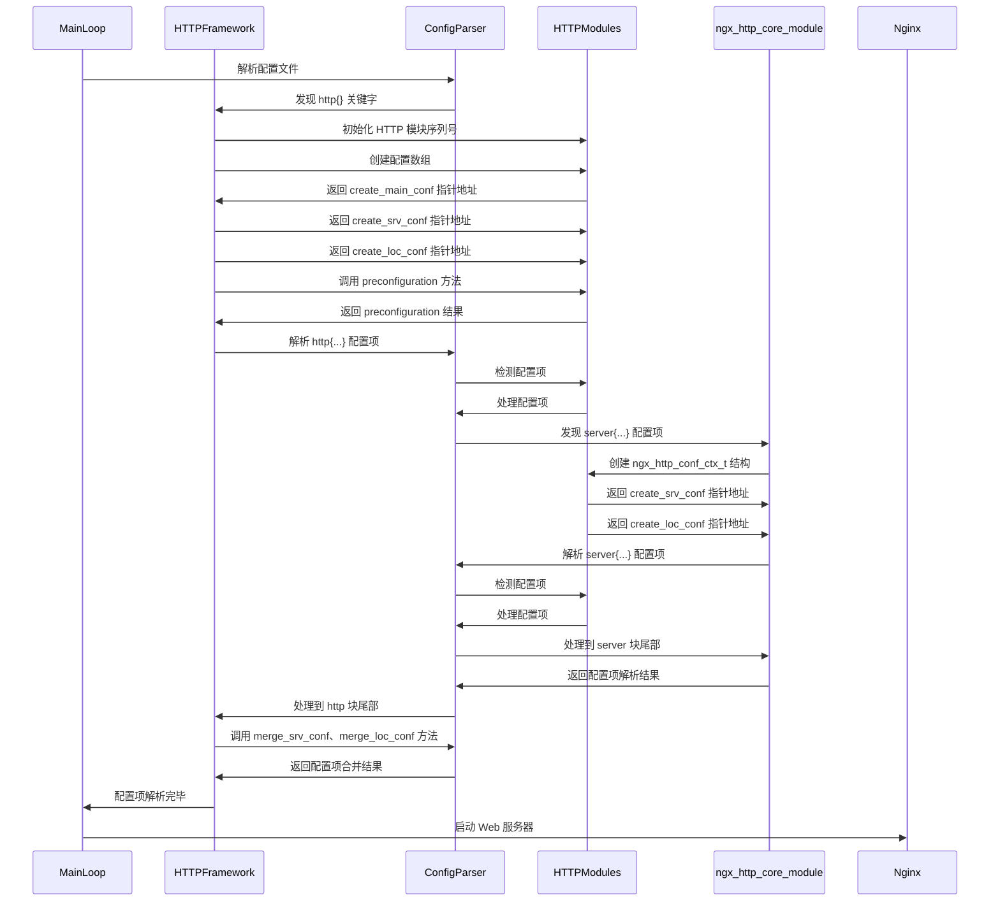
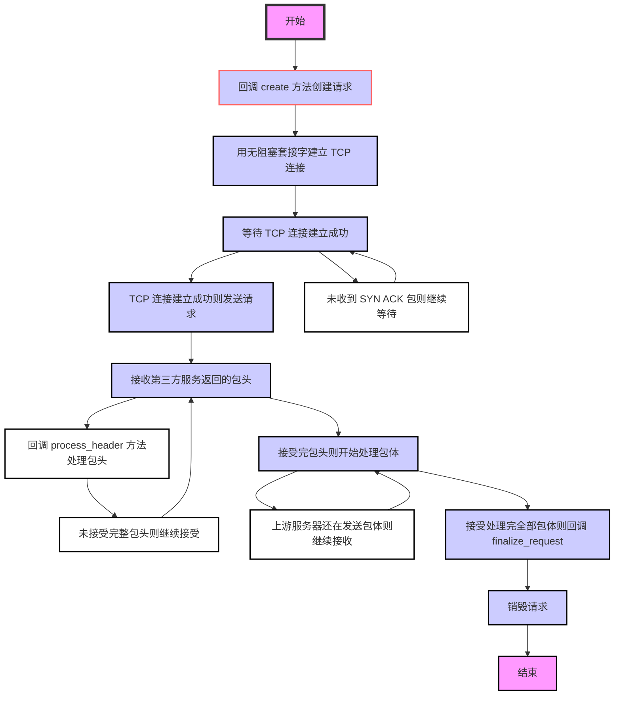
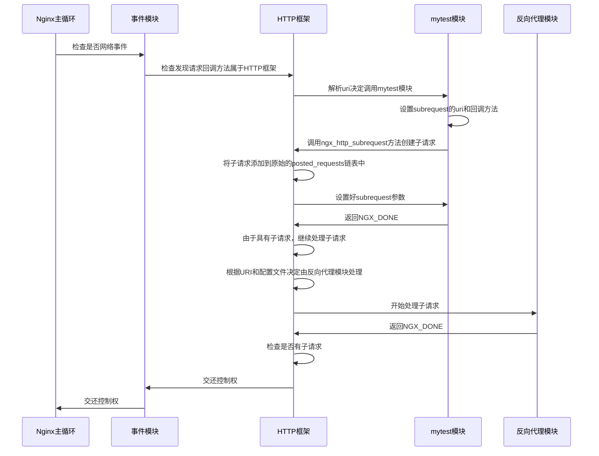

# 第二部分如何编写 HTTP 模块

- 第 3 章开发一个简单的 HTTP 模块
- 第 4 章配置、error 日志和请求上下文
- 第 5 章访问第三方服务
- 第 6 章开发一个简单的 HTTP 过滤模块
- 第 7 章 Nginx 提供的高级数据结构

## 第 3 章开发一个简单的 HTTP 模块

当通过开发 HTTP 模块来实现产品功能时，是可以完全享用 Nginx 的优秀设计所带来的、与官方模块相同的高并发特性的。不过，如何开发一个充满异步调用、无阻塞的 HTTP 模块呢？首先，需要把程序嵌入到 Nginx 中，也就是说，最终编译出的二进制程序 Nginx 要包含我们的代码（见 [3.3 节](#_3-3-如何将自己的-http-模块编译进-nginx)）；其次，这个全新的 HTTP 模块要能介入到 HTTP 请求的处理流程中（具体参见 [3.1 节](#_3-1-如何调用-http-模块)、[3.4 节](#_3-4-http-模块的数据结构)、[3.5 节](#_3-5-定义自己的-http-模块)）。满足上述两个前提后，我们的模块才能开始处理 HTTP 请求，但在开始处理请求前还需要先了解一些 Nginx 框架定义的数据结构（见 [3.2 节](#_3-2-准备工作)），这是后面必须要用到的；正式处理请求时，还要可以获得 Nginx 框架接收、解析后的用户请求信息（见 [3.6 节](#_3-6-处理用户请求)）；业务执行完毕后，则要考虑发送响应给用户（见 3.7 节），包括将磁盘中的文件以 HTTP 包体的形式发送给用户（见 3.8 节）。

本章最后会讨论如何用 C++语言来编写 HTTP 模块，这虽然不是 Nginx 官方倡导的方式，

但 C++向前兼容 C 语言，使用 C++语言开发的模块还是可以很容易地嵌入到 Nginx 中。本章不会深入探讨 HTTP 模块与 Nginx 的各个核心模块是如何配合工作的，而且这部分提到的每个接口将只涉及用法而不涉及实现原理，在第 3 部分我们才会进一步阐述本章提到的许多接口是如何实现异步访问的。

### 3.1 如何调用 HTTP 模块

在开发 HTTP 模块前，首先需要了解典型的 HTTP 模块是如何介入 Nginx 处理用户请求流程的。图 3-1 是一个简化的时序图，这里省略了许多异步调用，忽略了多个不同的 HTTP 处理阶段，仅标识了在一个典型请求的处理过程中主要模块被调用的流程，以此帮助读者理解 HTTP 模块如何处理用户请求。完整的流程将在第 11 章中详细介绍。

图 3-1 Nginx HTTP 模块调用的简化流程

```mermaid
graph LR
    subgraph 主循环
        direction TB
        A[worker 进程主循环] -->|调用事件模块| B[事件模块]
        B -->|建立TCP连接| C[HTTP框架]
    end
    subgraph HTTP处理
        direction TB
        C -->|接收请求的HTTP包头| D[HTTP处理模块]
        D -->|根据 location 配置调用 HTTP 模块处理请求| E[HTTP过滤模块链表]
        E -->|处理请求| F[其他HTTP处理模块]
    end
    subgraph 响应处理
        direction TB
        F -->|发送 HTTP响应时依次调用所有HTTP过滤模块| G[客户端]
        G -->|所有 HTTP过滤模块返回| H[处理后返回]
        H -->|控制权交还| I[worker 进程主循环]
    end

```



从图 3-1 中看到，worker 进程会在一个 for 循环语句里反复调用事件模块检测网络事件。

当事件模块检测到某个客户端发起的 TCP 请求时（接收到 SYN 包），将会为它建立 TCP 连接，成功建立连接后根据 nginx.conf 文件中的配置会交由 HTTP 框架处理。HTTP 框架会试图接收完整的 HTTP 头部，并在接收到完整的 HTTP 头部后将请求分发到具体的 HTTP 模块中处理。这种分发策略是多样化的，其中最常见的是根据请求的 URI 和 nginx.conf 里 location 配置项的匹配度来决定如何分发（本章的例子正是应用这种分发策略，在第 10 章中会介绍其他分发策略）。HTTP 模块在处理请求的结束时，大多会向客户端发送响应，此时会自动地依次调用所有的 HTTP 过滤模块，每个过滤模块可以根据配置文件决定自己的行为。例如，gzip 过滤模块根据配置文件中的 gzip on|off 来决定是否压缩响应。HTTP 处理模块在返回时会将控制权交还给 HTTP 框架，如果在返回前设置了 subrequest，那么 HTTP 框架还会继续异步地调用适合的 HTTP 模块处理子请求。

开发 HTTP 模块时，首先要注意的就是 HTTP 框架到具体的 HTTP 模块间数据流的传递， 以及开发的 HTTP 模块如何与诸多的过滤模块协同工作（第 10 章、第 11 章会详细介绍 HTTP 框架）。下面正式进入 HTTP 模块的开发环节。

### 3.2 准备工作

Nginx 模块需要使用 C（或者 C++）语言编写代码来实现，每个模块都要有自己的名字。

按照 Nginx 约定俗成的命名规则，我们把第一个 HTTP 模块命名为 ngx_http_mytest_module。由于第一个模块非常简单，一个 C 源文件就可以完成，所以这里按照官方惯例，将唯一的源代码文件命名为 ngx_http_mytest_module.c。

实际上，我们还需要定义一个名称，以便在编译前的 configure 命令执行时显示是否执行成功（即 configure 脚本执行时的 ngx_addon_name 变量）。为方便理解，仍然使用同一个模块名来表示，如 ngx_http_mytest_module。

为了让 HTTP 模块正常工作，首先需要把它编译进 Nginx（3.3 节会探讨编译新增模块的两种方式）。其次需要设定模块如何在运行中生效，比如在图 3-1 描述的典型方式中，配置文件中的 location 块决定了匹配某种 URI 的请求将会由相应的 HTTP 模块处理，因此，运行时 HTTP 框架会在接收完毕 HTTP 请求的头部后，将请求的 URI 与配置文件中的所有 location 进行匹配（事实上会优先匹配虚拟主机，第 11 章会详细说明该流程），匹配后再根据 location{}内的配置项选择 HTTP 模块来调用。这是一种最典型的 HTTP 模块调用方式。3.4 节将解释 HTTP 模块定义嵌入方式时用到的数据结构，3.5 节将定义我们的第一个 HTTP 模块，3.6 节中介绍如何使用上述模块调用方式来处理请求。

既然有典型的调用方式，自然也有非典型的调用方式，比如 ngx_http_access_module 模块，它是根据 IP 地址决定某个客户端是否可以访问服务的，因此，这个模块需要在 NGX_HTTP_ACCESS_PHASE 阶段（在第 10 章中会详述 HTTP 框架定义的 11 个阶段）生效， 它会比本章介绍的 mytest 模块更早地介入请求的处理中，同时它的流程与图 3-1 中的不同，它可以对所有请求产生作用。也就是说，任何 HTTP 请求都会调用 ngx_http_access_module 模块处理，只是该模块会根据它感兴趣的配置项及所在的配置块来决定行为方式，这与 mytest 模块不同，在 mytest 模块中，只有在配置了 location/uri{mytest;}后，HTTP 框架才会在某个请求匹配了/uri 后调用它处理请求。如果某个匹配了 URI 请求的 location 中没有配置 mytest 配置项， mytest 模块依然是不会被调用的。

为了做到跨平台，Nginx 定义、封装了一些基本的数据结构。由于 Nginx 对内存分配比较“吝啬”（只有保证低内存消耗，才可能实现十万甚至百万级别的同时并发连接数），所以这些 Nginx 数据结构天生都是尽可能少占用内存。下面介绍本章中将要用到的 Nginx 定义的几个基本数据结构和方法，在第 7 章还会介绍一些复杂的容器，读者可以从中体会到如何才能有效地利用内存。

#### 3.2.1 整型的封装

Nginx 使用 ngx_int_t 封装有符号整型，使用 ngx_uint_t 封装无符号整型。Nginx 各模块的变量定义都是如此使用的，建议读者沿用 Nginx 的习惯，以此替代 int 和 unsinged int。

在 Linux 平台下，Nginx 对 ngx_int_t 和 ngx_uint_t 的定义如下：

```c
typedef intptr_t ngx_int_t;
typedef uintptr_t ngx_uint_t;
```

#### 3.2.2 ngx_str_t 数据结构

在 Nginx 的领域中，ngx_str_t 结构就是字符串。ngx_str_t 的定义如下：

```C
typedef struct {
size_t len;
u_char *data;
} ngx_str_t;
```

ngx_str_t 只有两个成员，其中 data 指针指向字符串起始地址，len 表示字符串的有效长度。注意，ngx_str_t 的 data 成员指向的并不是普通的字符串，因为这段字符串未必会以'\0'作为结尾，所以使用时必须根据长度 len 来使用 data 成员。例如，在 3.7.2 节中，我们会看到 r->method_name 就是一个 ngx_str_t 类型的变量，比较 method_name 时必须如下这样使用：

```C
if (0 == ngx_strncmp(
                    r->method_name.data,
                    "PUT",
                    r->method_name.len)
)
```

{...}
这里，ngx_strncmp 其实就是 strncmp 函数，为了跨平台 Nginx 习惯性地对其进行了名称上
的封装，下面看一下它的定义：

```C
define ngx_strncmp(s1, s2, n) strncmp((const char \*) s1, (const char \*) s2, n)
```

任何试图将 ngx_str_t 的 data 成员当做字符串来使用的情况，都可能导致内存越界！Nginx 使用 ngx_str_t 可以有效地降低内存使用量。例如，用户请求“GET/testa=1 http/1.1\r\n”存储到内存地址 0x1d0b0110 上，这时只需要把 r-\>method_name 设置为{len=3,data=0x1d0b0110}就可以表示方法名“GET”，而不需要单独为 method_name 再分配内存冗余的存储字符串。

#### 3.2.3 ngx_list_t 数据结构

ngx_list_t 是 Nginx 封装的链表容器，它在 Nginx 中使用得很频繁，例如 HTTP 的头部就是用 ngx_list_t 来存储的。当然，C 语言封装的链表没有 C++或 Java 等面向对象语言那么容易理解。

先看一下 ngx_list_t 相关成员的定义：

```C
typedef struct ngx_list_part_s  ngx_list_part_t;

struct ngx_list_part_s {
    void             *elts;
    ngx_uint_t        nelts;
    ngx_list_part_t  *next;
};


typedef struct {
    ngx_list_part_t  *last;
    ngx_list_part_t   part;
    size_t            size;
    ngx_uint_t        nalloc;
    ngx_pool_t       *pool;
} ngx_list_t;
```

ngx_list_t 描述整个链表，而 ngx_list_part_t 只描述链表的一个元素。这里要注意的是，ngx_list_t 不是一个单纯的链表，为了便于理解，我们姑且称它为存储数组的链表，什么意思呢？抽象地说，就是每个链表元素 ngx_list_part_t 又是一个数组，拥有连续的内存，它既依赖于 ngx_list_t 里的 size 和 nalloc 来表示数组的容量，同时又依靠每个 ngx_list_part_t 成员中的 nelts 来表示数组当前已使用了多少容量。因此，ngx_list_t 是一个链表容器，而链表中的元素又是一个数组。事实上，ngx_list_part_t 数组中的元素才是用户想要存储的东西，ngx_list_t 链表能够容纳的元素数量由 ngx_list_part_t 数组元素的个数与每个数组所能容纳的元素相乘得到。

这样设计有什么好处呢？

- 链表中存储的元素是灵活的，它可以是任何一种数据结构。
- 链表元素需要占用的内存由 ngx_list_t 管理，它已经通过数组分配好了。
- 小块的内存使用链表访问效率是低下的，使用数组通过偏移量来直接访问内存则要高
  效得多。

下面详述每个成员的意义。

（1）ngx_list_t

- part：链表的首个数组元素。
- last：指向链表的最后一个数组元素。
- size：前面讲过，链表中的每个 ngx_list_part_t 元素都是一个数组。因为数组存储的是某种类型的数据结构，且 ngx_list_t 是非常灵活的数据结构，所以它不会限制存储什么样的数据，只是通过 size 限制每一个数组元素的占用的空间大小，也就是用户要存储的一个数据所占用的字节数必须小于或等于 size。
- nalloc：链表的数组元素一旦分配后是不可更改的。nalloc 表示每个 ngx_list_part_t 数组的容量，即最多可存储多少个数据。
- pool：链表中管理内存分配的内存池对象。用户要存放的数据占用的内存都是由 pool 分配的，下文中会详细介绍。

（2）ngx_list_part_t

- elts：指向数组的起始地址。
- nelts：表示数组中已经使用了多少个元素。当然，nelts 必须小于 ngx_list_t 结构体中的 nalloc。
- next：下一个链表元素 ngx_list_part_t 的地址。

事实上，ngx_list_t 中的所有数据都是由 ngx_pool_t 类型的 pool 内存池分配的，它们通常都是连续的内存（在由一个 pool 内存池分配的情况下）。下面以图 3-2 为例来看一下 ngx_list_t 的内存分布情况。


图 3-2 中是由 3 个 ngx_list_part_t 数组元素组成的 ngx_list_t 链表可能拥有的一种内存分布结构，读者可以从这种较为常见的内存分布中看到 ngx_list_t 链表的用法。这里，pool 内存池为其分配了连续的内存，最前端内存存储的是 ngx_list_t 结构中的成员，紧接着是第一个 ngx_list_part_t 结构占用的内存，然后是 ngx_list_part_t 结构指向的数组，它们一共占用 size\*nalloc 字节，表示数组中拥有 nalloc 个大小为 size 的元素。其后面是第 2 个 ngx_list_part_t 结构以及它所指向的数组，依此类推。

对于链表，Nginx 提供的接口包括：ngx_list_create 接口用于创建新的链表，ngx_list_init 接口用于初始化一个已有的链表，ngx_list_push 接口用于添加新的元素，如下所示：

```C
ngx_list_t *ngx_list_create(ngx_pool_t *pool, ngx_uint_t n, size_t size);

static ngx_inline ngx_int_t
ngx_list_init(ngx_list_t *list, ngx_pool_t *pool, ngx_uint_t n, size_t size)
{
    list->part.elts = ngx_palloc(pool, n * size);
    if (list->part.elts == NULL) {
        return NGX_ERROR;
    }

    list->part.nelts = 0;
    list->part.next = NULL;
    list->last = &list->part;
    list->size = size;
    list->nalloc = n;
    list->pool = pool;

    return NGX_OK;
}


/*
 *
 *  the iteration through the list:
 *
 *  part = &list.part;
 *  data = part->elts;
 *
 *  for (i = 0 ;; i++) {
 *
 *      if (i >= part->nelts) {
 *          if (part->next == NULL) {
 *              break;
 *          }
 *
 *          part = part->next;
 *          data = part->elts;
 *          i = 0;
 *      }
 *
 *      ...  data[i] ...
 *
 *  }
 */


void *ngx_list_push(ngx_list_t *list);
```

调用 ngx_list_create 创建元素时，pool 参数是内存池对象（参见 3.7.2 节），size 是每个元素的大小，n 是每个链表数组可容纳元素的个数（相当于 ngx_list_t 结构中的 nalloc 成员）。

ngx_list_create 返回新创建的链表地址，如果创建失败，则返回 NULL 空指针。ngx_list_create 被调用后至少会创建一个数组（不会创建空链表），其中包含 n 个大小为 size 字节的连续内存块，也就是 ngx_list_t 结构中的 part 成员。

下面看一个简单的例子，我们首先建立一个链表，它存储的元素是 ngx_str_t，其中每个链表数组中存储 4 个元素，代码如下所示：

```C
ngx_list_t *testlist = ngx_list_create(
    r->pool, 4 ,sizeof(ngx_str_t));
    if (testlist == NULL) {
        return NGX_ERROR;
    }
```

ngx_list_init 的使用方法与 ngx_list_create 非常类似，需要注意的是，这时链表数据结构已经创建好了，若 ngx_list_init 返回 NGX_OK，则表示初始化成功，若返回 NGX_ERROR，则表示失败。

调用 ngx_list_push 表示添加新的元素，传入的参数是 ngx_list_t 链表。正常情况下，返回的是新分配的元素首地址。如果返回 NULL 空指针，则表示添加失败。在使用它时通常先调用 ngx_list_push 得到返回的元素地址，再对返回的地址进行赋值。例如：

```c
ngx_str_t* str = ngx_list_push(testlist);
if (str == NULL) {
    return NGX_ERROR;
}
str->len= sizeof("Hello world");
str->data = "Hello world";
```

遍历链表时 Nginx 没有提供相应的接口，实际上也不需要。我们可以用以下方法遍历链表中的元素：

```C
// part 用于指向链表中的每一个ngx_list_part_t 数组
ngx_list_part_t* part = &testlist.part; // 根据链表中的数据类型，把数组里的 elts 转化为该类型使用
ngx_str_t* str = part->elts; // i 表示元素在链表的每个 ngx_list_part_t 数组里的序号
for (i = 0; /* void */; i++) {
    if (i >= part->nelts) {
        if (part->next == NULL) {
        // 如果某个 ngx_list_part_t 数组的 next 指针为空，
        // 则说明已经遍历完链表
        break;
        }
        // 访问下一个 ngx_list_part_t
        part = part->next;
        str = part->elts;
        // 将 i 序号置为0，准备重新访问下一个数组
        i = 0;
    }

    // 这里可以很方便地取到当前遍历到的链表元素
    printf("list element: %*s\n",str[i].len, str[i].data);
}
```

#### 3.2.4 ngx_table_elt_t 数据结构

ngx_table_elt_t 数据结构如下所示：

```C
typedef struct {
  ngx_uint_t hash;
  ngx_str_t key;
  ngx_str_t value;
  u_char *lowcase_key;
} ngx_table_elt_t;
```

可以看到，ngx_table_elt_t 就是一个 key/value 对，ngx_str_t 类型的 key、value 成员分别存储的是名字、值字符串。hash 成员表明 ngx_table_elt_t 也可以是某个散列表数据结构（ngx_hash_t 类型）中的成员。ngx_uint_t 类型的 hash 成员可以在 ngx_hash_t 中更快地找到相同 key 的 ngx_table_elt_t 数据。lowcase_key 指向的是全小写的 key 字符串。

显而易见，ngx_table_elt_t 是为 HTTP 头部“量身订制”的，其中 key 存储头部名称（如 Content-Length），value 存储对应的值（如“1024”），lowcase_key 是为了忽略 HTTP 头部名称的大小写（例如，有些客户端发来的 HTTP 请求头部是 content-length，Nginx 希望它与大小写敏感的 Content-Length 做相同处理，有了全小写的 lowcase_key 成员后就可以快速达成目的了），hash 用于快速检索头部（它的用法在 3.6.3 节中进行详述）。

#### 3.2.5 ngx\*buf_t 数据结构

缓冲区 ngx_buf_t 是 Nginx 处理大数据的关键数据结构，它既应用于内存数据也应用于磁盘数据。下面主要介绍 ngx_buf_t 结构体本身，而描述磁盘文件的 ngx_file_t 结构体则在 3.8.1 节中说明。下面来看一下相关代码：

```C
typedef struct ngx_buf_s ngx_buf_t;
typedef void * ngx_buf_tag_t;
struct ngx_buf_s {
/* pos 通常是用来告诉使用者本次应该从 pos 这个位置开始处理内存中的数据，这样设置是因为同一个 ngx_buf_t 可能被多次反复处理。当然， pos 的含义是由使用它的模块定义的 */
u_char _pos;
/*last 通常表示有效的内容到此为止，注意， pos 与 last 之间的内存是希望 nginx 处理的内容 */
u*char *last;
/*处理文件时， file_pos 与 file_last 的含义与处理内存时的pos 与 last 相同， file_pos 表示将要处理的文件位置，file_last 表示截止的文件位置 */
off_t file_pos;
off_t file_last;
// 如果 ngx_buf_t 缓冲区用于内存，那么 start 指向这段内存的起始地址 u_char *start;与 start 成员对应，指向缓冲区内存的末尾
u_char *end;
/*表示当前缓冲区的类型，例如由哪个模块使用就指向这个模块 ngx_module_t 变量的地址 */
ngx_buf_tag_t tag;
// 引用的文件
ngx_file_t *file;
/*当前缓冲区的影子缓冲区，该成员很少用到，仅仅在 12.8 节描述的使用缓冲区转发上游服务器的响应时才使用了 shadow 成员，这是因为 Nginx 太节约内存了，分配一块内存并使用 ngx*buf_t 表示接收到的上游服务器响应后，在向下游客户端转发时可能会把这块内存存储到文件中，也可能直接向下游发送，此时 Nginx 绝不会重新复制一份内存用于新的目的，而是再次建立一个 ngx_buf_t 结构体指向原内存，这样多个 ngx_buf_t 结构体指向了同一块内存，它们之间的关系就通过 shadow 成员来引用。这种设计过于复杂，通常不建议使用 */
ngx_buf_t *shadow;
// 临时内存标志位，为 1 时表示数据在内存中且这段内存可以修改
 unsigned temporary:1;
// 标志位，为 1 时表示数据在内存中且这段内存不可以被修改
unsigned memory:1;
// 标志位，为 1 时表示这段内存是用 mmap 系统调用映射过来的，不可以被修改
unsigned mmap:1;
// 标志位，为 1 时表示可回收
unsigned recycled:1;
// 标志位，为 1 时表示这段缓冲区处理的是文件而不是内存
unsigned in_file:1;
// 标志位，为 1 时表示需要执行 flush 操作
unsigned flush:1;
/*标志位，对于操作这块缓冲区时是否使用同步方式，需谨慎考虑，这可能会阻塞 Nginx 进程， Nginx 中所有操作几乎都是异步的，这是它支持高并发的关键。有些框架代码在 sync 为 1 时可能会有阻塞的方式进行 I/O 操作，它的意义视使用它的 Nginx 模块而定 */
unsigned sync:1;
/*标志位，表示是否是最后一块缓冲区，因为 ngx_buf_t 可以由 ngx_chain_t 链表串联起来，因此，当 last_buf 为 1 时，表示当前是最后一块待处理的缓冲区 */
unsigned last_buf:1;
// 标志位，表示是否是 ngx_chain_t 中的最后一块缓冲区
unsigned last_in_chain:1;
/*标志位，表示是否是最后一个影子缓冲区，与 shadow 域配合使用。通常不建议使用它 */
unsigned last_shadow:1;
// 标志位，表示当前缓冲区是否属于临时文件
unsigned temp_file:1;
};

```

关于使用 ngx_buf_t 的案例参见 3.7.2 节。ngx_buf_t 是一种基本数据结构，本质上它提供的仅仅是一些指针成员和标志位。对于 HTTP 模块来说，需要注意 HTTP 框架、事件框架是如何设置和使用 pos、last 等指针以及如何处理这些标志位的，上述说明只是最常见的用法。（如果我们自定义一个 ngx_buf_t 结构体，不应当受限于上述用法，而应该根据业务需求自行定义。例如，在 13.7 节中用一个 ngx_buf_t 缓冲区转发上下游 TCP 流时，pos 会指向将要发送到下游的 TCP 流起始地址，而 last 会指向预备接收上游 TCP 流的缓冲区起始地址。）

#### 3.2.6 ngx_chain_t 数据结构

ngx_chain_t 是与 ngx_buf_t 配合使用的链表数据结构，下面看一下它的定义：

```C
typedef struct ngx_chain_s ngx_chain_t;
struct ngx_chain_s {
  ngx_buf_t *buf;
  ngx_chain_t *next;
};
```

buf 指向当前的 ngx_buf_t 缓冲区，next 则用来指向下一个 ngx_chain_t。如果这是最后一个 ngx_chain_t，则需要把 next 置为 NULL。

在向用户发送 HTTP 包体时，就要传入 ngx_chain_t 链表对象，注意，如果是最后一个 ngx_chain_t，那么必须将 next 置为 NULL，否则永远不会发送成功，而且这个请求将一直不会结束（Nginx 框架的要求）。

### 3.3 如何将自己的 HTTP 模块编译进 Nginx

Nginx 提供了一种简单的方式将第三方的模块编译到 Nginx 中。首先把源代码文件全部放到一个目录下，同时在该目录中编写一个文件用于通知 Nginx 如何编译本模块，这个文件名必须为 config。它的格式将在 3.3.1 节中说明。

这样，只要在 configure 脚本执行时加入参数--add-module=PATH（PATH 就是上面我们给定的源代码、config 文件的保存目录），就可以在执行正常编译安装流程时完成 Nginx 编译工作。

有时，Nginx 提供的这种方式可能无法满足我们的需求，其实，在执行完 configure 脚本后 Nginx 会生成 objs/Makefile 和 objs/ngx_modules.c 文件，完全可以自己去修改这两个文件，这是一种更强大也复杂得多的方法，我们将在 3.3.3 节中说明如何直接修改它们。

#### 3.3.1 config 文件的写法

config 文件其实是一个可执行的 Shell 脚本。如果只想开发一个 HTTP 模块，那么 config 文件中需要定义以下 3 个变量：

- ngx_addon_name：仅在 configure 执行时使用，一般设置为模块名称。

- HTTP_MODULES：保存所有的 HTTP 模块名称，每个 HTTP 模块间由空格符相连。在
  重新设置 HTTP_MODULES 变量时，不要直接覆盖它，因为 configure 调用到自定义的 config 脚
  本前，已经将各个 HTTP 模块设置到 HTTP_MODULES 变量中了，因此，要像如下这样设
  置：
  "$HTTP_MODULES ngx_http_mytest_module"
- NGX_ADDON_SRCS：用于指定新增模块的源代码，多个待编译的源代码间以空格
  符相连。注意，在设置 NGX_ADDON_SRCS 时可以使用$ngx_addon_dir 变量，它等价于
  configure 执行时--add-module=PATH 的 PATH 参数。

因此，对于 mytest 模块，可以这样编写 config 文件：

```ini
ngx_addon_name=ngx_http_mytest_module
HTTP_MODULES="$HTTP_MODULES ngx_http_mytest_module"
NGX_ADDON_SRCS="$NGX_ADDON_SRCS $ngx_addon_dir/ngx_http_mytest_module.c"
```

注意以上 3 个变量并不是唯一可以在 config 文件中自定义的部分。如果我们不是开发 HTTP 模块，而是开发一个 HTTP 过滤模块，那么就要用 HTTP_FILTER_MODULES 替代上面的 HTTP_MODULES 变量。事实上，包括$CORE_MODULES、$EVENT_MODULES、$HTTP_MODULES、$HTTP_FILTER_MODULES、$HTTP_HEADERS_FILTER_MODULE 等模块变量都可以重定义，它们分别对应着 Nginx 的核心模块、事件模块、HTTP 模块、HTTP过滤模块、HTTP 头部过滤模块。除了 NGX_ADDON_SRCS 变量，或许还有一个变量我们会用到，即$NGX_ADDON_DEPS 变量，它指定了模块依赖的路径，同样可以在 config 中设置。

#### 3.3.2 利用 configure 脚本将定制的模块加入到 Nginx 中

在 1.6 节提到的 configure 执行流程中，其中有两行脚本负责将第三方模块加入到 Nginx 中，如下所示。

```zsh
. auto/modules
. auto/make
```

下面完整地解释一下 configure 脚本是如何与 3.3.1 节中提到的 config 文件配合起来把定制的第三方模块加入到 Nginx 中的。

在执行 configure--add-module=PATH 命令时，PATH 就是第三方模块所在的路径。在 configure 中，通过 auto/options 脚本设置了 NGX_ADDONS 变量：

```zsh
--add-module=\*) NGX_ADDONS="$NGX_ADDONS $value" ;;
```

在 configure 命令执行到 auto/modules 脚本时，将在生成的 ngx_modules.c 文件中加入定制的第三方模块。

```ini
if test -n "$NGX_ADDONS"; then
echo configuring additional modules
for ngx_addon_dir in $NGX_ADDONS
do
echo "adding module in $ngx_addon_dir"
if test -f $ngx_addon_dir/config; then
在这里执行自定义的
config脚本
. $ngx_addon_dir/config
echo " + $ngx_addon_name was configured"
else
echo "$0: error: no $ngx_addon_dir/config was found"
exit 1
fi
done
fi
```

可以看到，$NGX_ADDONS 可以包含多个目录，对于每个目录，如果其中存在 config 文件就会执行，也就是说，在 config 中重新定义的变量都会生效。之后，auto/modules 脚本开始创建 ngx_modules.c 文件，这个文件的关键点就是定义了 ngx_module_t\*ngx_modules[]数组，这个数组存储了 Nginx 中的所有模块。Nginx 在初始化、处理请求时，都会循环访问 ngx_modules 数组，确定该用哪一个模块来处理。下面来看一下 auto/modules 是如何生成数组的，代码如下所示：

```zsh
modules="$CORE_MODULES $EVENT_MODULES"
if [ $USE_OPENSSL = YES ]; then
modules="$modules $OPENSSL_MODULE"
CORE_DEPS="$CORE_DEPS $OPENSSL_DEPS"
CORE_SRCS="$CORE_SRCS $OPENSSL_SRCS"
fi
if [ $HTTP = YES ]; then
modules="$modules $HTTP_MODULES $HTTP_FILTER_MODULES \
$HTTP_HEADERS_FILTER_MODULE \
$HTTP_AUX_FILTER_MODULES \
$HTTP_COPY_FILTER_MODULE \
$HTTP_RANGE_BODY_FILTER_MODULE \
$HTTP_NOT_MODIFIED_FILTER_MODULE"
NGX_ADDON_DEPS="$NGX_ADDON_DEPS \$(HTTP_DEPS)"
fi
```

首先，auto/modules 会按顺序生成 modules 变量。注意，这里的$HTTP_MODULES 等已经在 config 文件中重定义了。这时，modules 变量是包含所有模块的。然后，开始生成 ngx_modules.c 文件：

```zsh
// cat << END > $NGX_MODULES_C
include <ngx_config.h>
include <ngx_core.h>
$NGX_PRAGMA
END
for mod in $modules
do
echo "extern ngx_module_t $mod;" \>\> $NGX_MODULES_C
done
echo \>\> $NGX_MODULES_C
echo 'ngx_module_t *ngx_modules[] = {' \>\> $NGX_MODULES_C
for mod in $modules
do
向 ngx_modules数组里添加 Nginx模块
echo " &$mod," >> $NGX_MODULES_C
done
cat << END >> $NGX_MODULES_C
NULL
};
END
```

这样就已经确定了 Nginx 在运行时会调用自定义的模块，而 auto/make 脚本负责把相关模
块编译进 Nginx。

在 Makefile 中生成编译第三方模块的源代码如下：

```Makefile
if test -n "$NGX_ADDON_SRCS"; then
ngx_cc="\$(CC) $ngx_compile_opt \$(CFLAGS) $ngx_use_pch \$(ALL_INCS)"
for ngx_src in $NGX_ADDON_SRCS
do
ngx_obj="addon/`basename \`dirname $ngx_src\``"
ngx_obj=`echo $ngx_obj/\`basename $ngx_src\` \
| sed -e "s/\// $ngx_regex_dirsep/g"`
ngx_obj=`echo $ngx_obj \
| sed -e
"s#^\(.*\.\)cpp\\$#$ngx_objs_dir\1$ngx*objext#g" \
-e
"s#^\(.*\.\)cc\\$#$ngx*objs_dir\1$ngx_objext#g" \
-e
"s#^\(.*\.\)c\\$#$ngx_objs_dir\1$ngx_objext#g" \
-e
"s#^\(.*\.\)S\\$#$ngx_objs_dir\1$ngx_objext#g"`
ngx_src=`echo $ngx_src | sed -e "s/\// $ngx_regex_dirsep/g"`
cat \<\< END \>\> $NGX_MAKEFILE
$ngx_obj: \$(ADDON_DEPS)$ngx_cont$ngx_src
$ngx_cc$ngx_tab$ngx_objout$ngx_obj$ngx_tab$ngx_src$NGX_AUX
END
done
fi
```

下面这段代码用于将各个模块的目标文件设置到 ngx_obj 变量中，紧接着会生成 Makefile 里的链接代码，并将所有的目标文件、库文件链接成二进制程序。

```zsh
for ngx_src in $NGX_ADDON_SRCS
do
ngx_obj="addon/`basename \`dirname $ngx_src\``"
test -d $NGX_OBJS/$ngx_obj || mkdir -p $NGX_OBJS/$ngx_obj
ngx_obj=`echo $ngx_obj/\`basename $ngx_src\` \
| sed -e "s/\// $ngx_regex_dirsep/g"`
ngx_all_srcs="$ngx_all_srcs $ngx_obj"
done…
cat \<\< END \>\> $NGX_MAKEFILE
$NGX_OBJS${ngx_dirsep}nginx${ngx_binext}:
$ngx_deps$ngx_spacer \$(LINK)
${ngx_long_start}${ngx_binout}$NGX_OBJS${ngx_dirsep}nginx$ngx_long_cont$ngx
objs$ngxlibs$ngx_link
$ngx_rcc
${ngx_long_end}
END
```

综上可知，第三方模块就是这样嵌入到 Nginx 程序中的。

#### 3.3.3 直接修改 Makefile 文件

3.3.2 节中介绍的方法毫无疑问是最方便的，因为大量的工作已由 Nginx 中的 configure 脚本帮我们做好了。在使用其他第三方模块时，一般也推荐使用该方法。

我们有时可能需要更灵活的方式，比如重新决定 ngx_module_t\*ngx_modules[]数组中各个模块的顺序，或者在编译源代码时需要加入一些独特的编译选项，那么可以在执行完 configure 后，对生成的 objs/ngx_modules.c 和 objs/Makefile 文件直接进行修改。

在修改 objs/ngx_modules.c 时，首先要添加新增的第三方模块的声明，如下所示。

```C

extern ngx_module_t ngx_http_mytest_module;
```

其次，在合适的地方将模块加入到 ngx_modules 数组中。

```C
ngx_module_t \*ngx_modules[] = {
…
&ngx_http_upstream_ip_hash_module,
&ngx_http_mytest_module,
&ngx_http_write_filter_module,
…
NULL
};
```

注意，模块的顺序很重要。如果同时有两个模块表示对同一个请求感兴趣，那么只有顺序在前的模块会被调用。

修改 objs/Makefile 时需要增加编译源代码的部分，例如：

```Makefile
objs/addon/httpmodule/ngx_http_mytest_module.o: $(ADDON_DEPS) \
../sample/httpmodule// ngx_http_mytest_module.c
$(CC) -c $(CFLAGS) $(ALL_INCS) \
-o objs/addon/httpmodule/ngx_http_mytest_module.o \
../sample/httpmodule// ngx_http_mytest_module.c
```

还需要把目标文件链接到 Nginx 中，例如：

```Makefile
objs/nginx: objs/src/core/nginx.o \
...
objs/addon/httpmodule/ngx_http_mytest_module.o \
objs/ngx_modules.o
$(LINK) -o objs/nginx \
objs/src/core/nginx.o \
...
objs/addon/httpmodule/ngx_http_mytest_module.o \
objs/ngx_modules.o \
-lpthread -lcrypt -lpcre -lcrypto -lcrypto -lz
```

请慎用这种直接修改 Makefile 和 ngx_modules.c 的方法，不正确的修改可能导致 Nginx 工作
不正常。

### 3.4 HTTP 模块的数据结构

定义 HTTP 模块方式很简单，例如：

```C
ngx_module_t ngx_http_mytest_module;
```

其中，ngx_module_t 是一个 Nginx 模块的数据结构（详见 8.2 节）。下面来分析一下 Nginx 模块中所有的成员，如下所示：

```C
typedef struct ngx_module_s ngx_module_t;

struct ngx_module_s {
/* 下面的 ctx_index、 index、 spare0、 spare1、 spare2、 spare3、 version 变量不需要在定义时赋值，可以用 Nginx 准备好的宏 NGX_MODULE_V1 来定义，它已经定义好了这 7 个值。 #define NGX_MODULE_V1 0, 0, 0, 0, 0, 0, 1 对于一类模块（由下面的 type 成员决定类别）而言， ctx_index 表示当前模块在这类模块中的序号。这个成员常常是由管理这类模块的一个 Nginx 核心模块设置的，对于所有的 HTTP 模块而言， ctx_index 是由核心模块 ngx_http_module 设置的。 ctx_index 非常重要， Nginx 的模块化设计非常依赖于各个模块的顺序，它们既用于表达优先级，也用于表明每个模块的位置，借以帮助 Nginx 框架快速获得某个模块的数据（ HTTP 框架设置 ctx_index 的过程参见 10.7 节） */
ngx_uint_t ctx_index;

/*index 表示当前模块在 ngx_modules 数组中的序号。注意， ctx_index 表示的是当前模块在一类模块中的序号，而 index 表示当前模块在所有模块中的序号，它同样关键。 Nginx 启动时会根据 ngx*modules 数组设置各模块的 index 值。例如： ngx_max_module = 0;
for (i = 0; ngx_modules[i]; i++) {
ngx_modules[i]-\>index = ngx_max_module++; }
*/
ngx_uint_t index;

// spare 系列的保留变量，暂未使用
ngx_uint_t spare0;
ngx_uint_t spare1;
ngx_uint_t spare2;
ngx_uint_t spare3;

// 模块的版本，便于将来的扩展。目前只有一种，默认为 1
ngx_uint_t version;

/*ctx 用于指向一类模块的上下文结构体，为什么需要 ctx 呢？因为前面说过， Nginx 模块有许多种类，不同类模块之间的功能差别很大。例如，事件类型的模块主要处理 I/O 事件相关的功能， HTTP 类型的模块主要处理 HTTP 应用层的功能。这样，每个模块都有了自己的特性，而 ctx 将会指向特定类型模块的公共接口。例如，在 HTTP 模块中， ctx 需要指向 ngx_http_module_t 结构体 */
void *ctx;

// commands 将处理 nginx.conf 中的配置项，详见第 4 章
ngx_command_t *commands;

/*type 表示该模块的类型，它与 ctx 指针是紧密相关的。在官方 Nginx 中，它的取值范围是以下 5 种：
NGX_HTTP_MODULE、
NGX_CORE_MODULE、
NGX_CONF_MODULE、
NGX_EVENT_MODULE、
NGX_MAIL_MODULE。这 5 种模块间的关系参考图 8-2。实际上，还可以自定义新的模块类型
*/
ngx_uint_t type;
/*在 Nginx 的启动、停止过程中，以下 7 个函数指针表示有 7 个执行点会分别调用这 7 种方法（参见 8.4 节~ 8.6 节）。对于任一个方法而言，如果不需要 Nginx 在某个时刻执行它，那么简单地把它设为 NULL 空指针即可 */
/*虽然从字面上理解应当在 master 进程启动时回调 init_master，但到目前为止，框架代码从来不会调用它，因此，可将 init_master 设为 NULL */
ngx_int_t (*init_master)(ngx_log_t *log);

/*init_module 回调方法在初始化所有模块时被调用。在 master/worker 模式下，这个阶段将在启动 worker 子进程前完成 */
ngx_int_t (_init_module)(ngx_cycle_t *cycle);

/* init*process 回调方法在正常服务前被调用。在 master/worker 模式下，多个 worker 子进程已经产生，在每个 worker 进程的初始化过程会调用所有模块的 init_process 函数 */
ngx_int_t (_init_process)(ngx_cycle_t *cycle);

/* 由于 Nginx 暂不支持多线程模式，所以 init*thread 在框架代码中没有被调用过，设为 NULL*/
ngx_int_t (*init_thread)(ngx_cycle_t *cycle);

// 同上， exit_thread 也不支持，设为 NULL
void (_exit_thread)(ngx_cycle_t *cycle);

/* exit_process 回调方法在服务停止前调用。在 master/worker 模式下， worker 进程会在退出前调用它 */
void (*exit_process)(ngx_cycle_t *cycle);

// exit_master 回调方法将在 master 进程退出前被调用
void (*exit_master)(ngx_cycle_t *cycle);

/*以下 8 个 spare_hook 变量也是保留字段，目前没有使用，但可用 Nginx 提供的 NGX_MODULE_V1_PADDING 宏来填充。看一下该宏的定义：
define NGX_MODULE_V1_PADDING 0, 0, 0, 0, 0, 0, 0, 0\*/
uintptr_t spare_hook0;
uintptr_t spare_hook1;
uintptr_t spare_hook2;
uintptr_t spare_hook3;
uintptr_t spare_hook4;
uintptr_t spare_hook5;
uintptr_t spare_hook6;
uintptr_t spare_hook7;
};
```

定义一个 HTTP 模块时，务必把 type 字段设为 NGX_HTTP_MODULE。

对于下列回调方法：init_module、init_process、exit_process、exit_master，调用它们的是 Nginx 的框架代码。换句话说，这 4 个回调方法与 HTTP 框架无关，即使 nginx.conf 中没有配置 http{...}这种开启 HTTP 功能的配置项，这些回调方法仍然会被调用。因此，通常开发 HTTP 模块时都把它们设为 NULL 空指针。这样，当 Nginx 不作为 Web 服务器使用时，不会执行 HTTP 模块的任何代码。

定义 HTTP 模块时，最重要的是要设置 ctx 和 commands 这两个成员。对于 HTTP 类型的模块来说，ngx_module_t 中的 ctx 指针必须指向 ngx_http_module_t 接口（HTTP 框架的要求）。下面先来分析 ngx_http_module_t 结构体的成员。

HTTP 框架在读取、重载配置文件时定义了由 ngx_http_module_t 接口描述的 8 个阶段，HTTP 框架在启动过程中会在每个阶段中调用 ngx_http_module_t 中相应的方法。当然，如果 ngx_http_module_t 中的某个回调方法设为 NULL 空指针，那么 HTTP 框架是不会调用它的。

```C
typedef struct {
// 解析配置文件前调用
ngx_int_t (*preconfiguration)(ngx_conf_t *cf);

// 完成配置文件的解析后调用
ngx_int_t (*postconfiguration)(ngx_conf_t *cf);

/*当需要创建数据结构用于存储 main 级别（直属于 http{...}块的配置项）的全局配置项时，可以通过create*main_conf 回调方法创建存储全局配置项的结构体 */
void *(*create_main_conf)(ngx_conf_t *cf);

// 常用于初始化main 级别配置项
char *(*init_main_conf)(ngx_conf_t *cf, void *conf);

/*当需要创建数据结构用于存储 srv 级别（直属于虚拟主机server{...}块的配置项）的配置项时，可以通过实现 create*srv_conf 回调方法创建存储 srv 级别配置项的结构体 */
void *(*create_srv_conf)(ngx_conf_t *cf);

// merge*srv_conf 回调方法主要用于合并 main 级别和 srv 级别下的同名配置项
char *(*merge_srv_conf)(ngx_conf_t cf, void prev, void *conf);

/*当需要创建数据结构用于存储 loc 级别（直属于 location{...}块的配置项）的配置项时，可以实现 create_loc_conf 回调方法 */
void *(*create_loc_conf)(ngx_conf_t *cf);

//merge_loc_conf 回调方法主要用于合并 srv 级别和 loc 级别下的同名配置项
char *(*merge_loc_conf)(ngx_conf_t cf, void prev, void *conf);
} ngx_http_module_t;
```

不过，这 8 个阶段的调用顺序与上述定义的顺序是不同的。在 Nginx 启动过程中，HTTP 框架调用这些回调方法的实际顺序有可能是这样的（与 nginx.conf 配置项有关）：

> 1）create_main_conf
> 2）create_srv_conf
> 3）create_loc_conf
> 4）preconfiguration
> 5）init_main_conf
> 6）merge_srv_conf
> 7）merge_loc_conf
> 8）postconfiguration commands

数组用于定义模块的配置文件参数，每一个数组元素都是 ngx_command_t 类型，数组的结尾用 ngx_null_command 表示。Nginx 在解析配置文件中的一个配置项时首先会遍历所有的模块，对于每一个模块而言，即通过遍历 commands 数组进行，另外，在数组中检查到 ngx_null_command 时，会停止使用当前模块解析该配置项。每一个 ngx_command_t 结构体定义了自己感兴趣的一个配置项：

```C
typedef struct ngx_command_s ngx_command_t;
struct ngx_command_s
{

    // 配置项名称，如 "gzip"
    ngx_str_t name;

    /*配置项类型， type 将指定配置项可以出现的位置。
    例如，出现在 server{}或 location{}中，以及它可以携带的参数个数 */
    ngx *uint_t type;

    // 出现了 name 中指定的配置项后，将会调用 set 方法处理配置项的参数
    char *(*set)(ngx_conf_t *cf, ngx_command_t *cmd, void *conf);

    // 在配置文件中的偏移量
    ngx *uint_t conf;

    /*通常用于使用预设的解析方法解析配置项，这是配置模块的一个优秀设计。
    它需要与 conf 配合使用，在第 4 章中详细介绍 */
    ngx_uint_t offset;

    // 配置项读取后的处理方法，必须是 ngx_conf_post_t 结构的指针
    void *post;
};
```

ngx_null_command 只是一个空的 ngx_command_t，如下所示：

```C
define ngx_null_command { ngx_null_string, 0, NULL, 0, 0, NULL }
```

### 3.5 定义自己的 HTTP 模块

上文中我们了解了定义 HTTP 模块时需要定义哪些成员以及实现哪些方法，但在定义 HTTP 模块前，首先需要确定自定义的模块应当在什么样的场景下开始处理用户请求，也就是说，先要弄清楚我们的模块是如何介入到 Nginx 处理用户请求的流程中的。从 2.4 节中的 HTTP 配置项意义可知，一个 HTTP 请求会被许多个配置项控制，实际上这是因为一个 HTTP 请求可以被许多个 HTTP 模块同时处理。这样一来，肯定会有一个先后问题，也就是说，谁先处理请求谁的“权力”就更大。例如，ngx_http_access_module 模块的 deny 选项一旦得到满足后，Nginx 就会决定拒绝来自某个 IP 的请求，后面的诸如 root 这种访问静态文件的处理方式是得不到执行的。另外，由于同一个配置项可以从属于许多个 server、location 配置块，那么这个配置项将会针对不同的请求起作用。因此，现在面临的问题是，我们希望自己的模块在哪个时刻开始处理请求？是希望自己的模块对到达 Nginx 的所有请求都起作用，还是希望只对某一类请求（如 URI 匹配了 location 后表达式的请求）起作用？Nginx 的 HTTP 框架定义了非常多的用法，我们有很大的自由来定义自己的模块如何介入 HTTP 请求的处理，但本章只想说明最简单、最常见的 HTTP 模块应当如何编写，因此，我们这样定义第一个 HTTP 模块介入 Nginx 的方式： 1）不希望模块对所有的 HTTP 请求起作用。 2）在 nginx.conf 文件中的 http{}、server{}或者 location{}块内定义 mytest 配置项，如果一个用户请求通过主机域名、URI 等匹配上了相应的配置块，而这个配置块下又具有 mytest 配置项，那么希望 mytest 模块开始处理请求。在这种介入方式下，模块处理请求的顺序是固定的，即必须在 HTTP 框架定义的 NGX_HTTP_CONTENT_PHASE 阶段开始处理请求，具体内容下文详述。

下面开始按照这种方式定义 mytest 模块。首先，定义 mytest 配置项的处理。从上文中关于 ngx_command_t 结构的说明来看，只需要定义一个 ngx_command_t 数组，并设置在出现 mytest 配置后的解析方法由 ngx_http_mytest“担当”，如下所示：

```C
static ngx_command_t ngx_http_mytest_commands[] = {
  { ngx_string("mytest"),
  NGX_HTTP_MAIN_CONF|NGX_HTTP_SRV_CONF|NGX_HTTP_LOC_CONF|NGX_HTTP_LMT_CONF|NGX_CONF_NOARGS, ngx_http_mytest,
  NGX_HTTP_LOC_CONF_OFFSET,
  0,
  NULL },
  ngx_null_command
};
```

其中，ngx_http_mytest 是 ngx_command_t 结构体中的 set 成员（完整定义为 char*(\*set) (ngx_conf_t\*cf,ngx_command_t*cmd,void\*conf);），当在某个配置块中出现 mytest 配置项时，Nginx 将会调用 ngx_http_mytest 方法。下面看一下如何实现 ngx_http_mytest 方法。

```C
static char *
ngx_http_mytest(ngx_conf_t *cf, ngx_command_t *cmd, void *conf) {
  ngx_http_core_loc_conf_t *clcf;

  /*首先找到 mytest 配置项所属的配置块， clcf 看上去像是 location 块内的数据结构，其实不然，它可以是 main、 srv 或者 loc 级别配置项，也就是说，在每个 http{}和 server{}内也都有一个 ngx_http_core_loc_conf_t 结构体 */
  clcf = ngx_http_conf_get_module_loc_conf(cf, ngx_http_core_module);

  /*HTTP 框架在处理用户请求进行到 NGX_HTTP_CONTENT_PHASE 阶段时，如果请求的主机域名、 URI 与 mytest 配置项所在的配置块相匹配，就将调用我们实现的 ngx_http_mytest_handler 方法处理这个请求 */
  clcf->handler = ngx_http_mytest_handler;
  return NGX_CONF_OK;
}
```

当 Nginx 接收完 HTTP 请求的头部信息时，就会调用 HTTP 框架处理请求，另外在 11.6 节描述的 NGX_HTTP_CONTENT_PHASE 阶段将有可能调用 mytest 模块处理请求。在 ngx_http_mytest 方法中，我们定义了请求的处理方法为 ngx_http_mytest_handler，举个例子来说，如果用户的请求 URI 是/test/example，而在配置文件中有这样的 location 块：

```bash
Location /test {
  mytest;
}
```

那么，HTTP 框架在 NGX_HTTP_CONTENT_PHASE 阶段就会调用到我们实现的 ngx_http_mytest_handler 方法来处理这个用户请求。事实上，HTTP 框架共定义了 11 个阶段（第三方 HTTP 模块只能介入其中的 7 个阶段处理请求，详见 10.6 节），本章只关注 NGX_HTTP_CONTENT_PHASE 处理阶段，多数 HTTP 模块都在此阶段实现相关功能。下面简
单说明一下这 11 个阶段。

```C
typedef enum {
// 在接收到完整的 HTTP 头部后处理的 HTTP 阶段
NGX_HTTP_POST_READ_PHASE = 0,

/*在还没有查询到 URI 匹配的 location 前，这时 rewrite 重写 URL 也作为一个独立的 HTTP 阶段 */
NGX_HTTP_SERVER_REWRITE_PHASE,

/*根据 URI 寻找匹配的 location，这个阶段通常由 ngx_http_core_module 模块实现，不建议其他 HTTP 模块重新定义这一阶段的行为 */
NGX_HTTP_FIND_CONFIG_PHASE,

/*在 NGX_HTTP_FIND_CONFIG_PHASE 阶段之后重写 URL 的意义与 NGX_HTTP_SERVER_REWRITE_PHASE 阶段显然是不同的，因为这两者会导致查找到不同的 location 块（ location 是与 URI 进行匹配的） */
NGX_HTTP_REWRITE_PHASE,

/*这一阶段是用于在 rewrite 重写 URL 后重新跳到 NGX_HTTP_FIND_CONFIG_PHASE 阶段，找到与新的 URI 匹配的 location。所以，这一阶段是无法由第三方 HTTP 模块处理的，而仅由 ngx_http_core_module 模块使用 */
NGX_HTTP_POST_REWRITE_PHASE,

// 处理 NGX_HTTP_ACCESS_PHASE 阶段前， HTTP 模块可以介入的处理阶段
NGX_HTTP_PREACCESS_PHASE,

//这个阶段用于让 HTTP 模块判断是否允许这个请求访问 Nginx 服务器
NGX_HTTP_ACCESS_PHASE,

/*当 NGX_HTTP_ACCESS_PHASE 阶段中 HTTP 模块的 handler 处理方法返回不允许访问的错误码时（实际是 NGX_HTTP_FORBIDDEN 或者 NGX_HTTP_UNAUTHORIZED），这个阶段将负责构造拒绝服务的用户响应。所以，这个阶段实际上用于给 NGX_HTTP_ACCESS_PHASE 阶段收尾 */
NGX_HTTP_POST_ACCESS_PHASE,

/*这个阶段完全是为了 try_files 配置项而设立的。当 HTTP 请求访问静态文件资源时， try_files 配置项可以使这个请求顺序地访问多个静态文件资源，如果某一次访问失败，则继续访问 try_files 中指定的下一个静态资源。另外，这个功能完全是在 NGX_HTTP_TRY_FILES_PHASE 阶段中实现的 */
NGX_HTTP_TRY_FILES_PHASE,

// 用于处理 HTTP 请求内容的阶段，这是大部分 HTTP 模块最喜欢介入的阶段
NGX_HTTP_CONTENT_PHASE,

/*处理完请求后记录日志的阶段。例如， ngx_http_log_module 模块就在这个阶段中加入了一个 handler 处理方法，使得每个 HTTP 请求处理完毕后会记录 access_log 日志 */
NGX_HTTP_LOG_PHASE
} ngx_http_phases;
```

当然，用户可以在以上 11 个阶段中任意选择一个阶段让 mytest 模块介入，但这需要学习完第 10 章、第 11 章的内容，完全熟悉了 HTTP 框架的处理流程后才可以做到。

暂且不管如何实现处理请求的 ngx_http_mytest_handler 方法，如果没有什么工作是必须在 HTTP 框架初始化时完成的，那就不必实现 ngx_http_module_t 的 8 个回调方法，可以像下面这样定义 ngx_http_module_t 接口。

```C
static ngx*http_module_t ngx_http_mytest_module_ctx = {
NULL, /* preconfiguration */
NULL, /* postconfiguration */
NULL, /* create main configuration */
NULL, /* init main configuration */
NULL, /* create server configuration */
NULL, /* merge server configuration */
NULL, /* create location configuration */
NULL  /* merge location configuration */
};
```

最后，定义 mytest 模块：

```C
ngx_module_t ngx_http_mytest_module = {
  NGX_MODULE_V1,
  &ngx_http_mytest_module_ctx, /* 模块上下文 */
  ngx_http_mytest_commands, /* 模块指令 */
  NGX_HTTP_MODULE, /* 模块类型 */
  NULL, /* 初始化主机*/
  NULL, /* 初始化模块 */
  NULL, /* 初始化进程 */
  NULL, /* 初始化线程 */
  NULL, /* 退出线程 */
  NULL, /* 退出流程 */
  NULL, /* exit master */
  NGX_MODULE_V1_PADDING
};
```

这样，mytest 模块在编译时将会被加入到 ngx_modules 全局数组中。Nginx 在启动时，会调用所有模块的初始化回调方法，当然，这个例子中我们没有实现它们（也没有实现 HTTP 框架初始化时会调用的 ngx_http_module_t 中的 8 个方法）。

### 3.6 处理用户请求

本节介绍如何处理一个实际的 HTTP 请求。回顾一下上文，在出现 mytest 配置项时， ngx_http_mytest 方法会被调用，这时将 ngx_http_core_loc_conf_t 结构的 handler 成员指定为 ngx_http_mytest_handler，另外，HTTP 框架在接收完 HTTP 请求的头部后，会调用 handler 指向的方法。下面看一下 handler 成员的原型 ngx_http_handler_pt：

```C
typedef ngx_int_t (*ngx_http_handler_pt)(ngx_http_request_t *r);
```

从上面这段代码可以看出，实际处理请求的方法 ngx_http_mytest_handler 将接收一个 ngx_http_request_t 类型的参数 r，返回一个 ngx_int_t（参见 3.2.1 节）类型的结果。下面先探讨一下 ngx_http_mytest_handler 方法可以返回什么，再看一下参数 r 包含了哪些 Nginx 已经解析完的用户请求信息。

#### 3.6.1 处理方法的返回值

这个返回值可以是 HTTP 中响应包的返回码，其中包括了 HTTP 框架已经在/src/http/ngx_http_request.h 文件中定义好的宏，如下所示。

```C
define NGX_HTTP_OK 200
define NGX_HTTP_CREATED 201
define NGX_HTTP_ACCEPTED 202
define NGX_HTTP_NO_CONTENT 204
define NGX_HTTP_PARTIAL_CONTENT 206
define NGX_HTTP_SPECIAL_RESPONSE 300
define NGX_HTTP_MOVED_PERMANENTLY 301
define NGX_HTTP_MOVED_TEMPORARILY 302
define NGX_HTTP_SEE_OTHER 303
define NGX_HTTP_NOT_MODIFIED 304
define NGX_HTTP_TEMPORARY_REDIRECT 307
define NGX_HTTP_BAD_REQUEST 400
define NGX_HTTP_UNAUTHORIZED 401
define NGX_HTTP_FORBIDDEN 403
define NGX_HTTP_NOT_FOUND 404
define NGX_HTTP_NOT_ALLOWED 405
define NGX_HTTP_REQUEST_TIME_OUT 408
define NGX_HTTP_CONFLICT 409
define NGX_HTTP_LENGTH_REQUIRED 411
define NGX_HTTP_PRECONDITION_FAILED 412
define NGX_HTTP_REQUEST_ENTITY_TOO_LARGE 413
define NGX_HTTP_REQUEST_URI_TOO_LARGE 414
define NGX_HTTP_UNSUPPORTED_MEDIA_TYPE 415
define NGX_HTTP_RANGE_NOT_SATISFIABLE 416
/* The special code to close connection without any response */
define NGX_HTTP_CLOSE 444
define NGX_HTTP_NGINX_CODES 494
define NGX_HTTP_REQUEST_HEADER_TOO_LARGE 494
define NGX_HTTPS_CERT_ERROR 495
define NGX_HTTPS_NO_CERT 496
define NGX_HTTP_TO_HTTPS 497
define NGX_HTTP_CLIENT_CLOSED_REQUEST 499
define NGX_HTTP_INTERNAL_SERVER_ERROR 500
define NGX_HTTP_NOT_IMPLEMENTED 501
define NGX_HTTP_BAD_GATEWAY 502
define NGX_HTTP_SERVICE_UNAVAILABLE 503
define NGX_HTTP_GATEWAY_TIME_OUT 504
define NGX_HTTP_INSUFFICIENT_STORAGE 507
```

注意以上返回值除了 RFC2616 规范中定义的返回码外，还有 Nginx 自身定义的 HTTP 返回码。例如，NGX_HTTP_CLOSE 就是用于要求 HTTP 框架直接关闭用户连接的。

在 ngx_http_mytest_handler 的返回值中，如果是正常的 HTTP 返回码，Nginx 就会按照规范构造合法的响应包发送给用户。例如，假设对于 PUT 方法暂不支持，那么，在处理方法中发现方法名是 PUT 时，返回 NGX_HTTP_NOT_ALLOWED，这样 Nginx 也就会构造类似下面的响应包给用户。

```html
http/1.1 405 Not Allowed Server: nginx/1.0.14 Date: Sat, 28 Apr 2012 06:07:17
GMT Content-Type: text/html Content-Length: 173 Connection: keepalive
<html>
  <head>
    \
    <title>405 Not Allowed\</title>
  </head>
  <body bgcolor="white">
    <center><h1>405 Not Allowed\</h1></center>
    <hr />
    <center>nginx/1.0.14</center>
  </body>
</html>
```

在处理方法中除了返回 HTTP 响应码外，还可以返回 Nginx 全局定义的几个错误码，包
括： define NGX_OK 0 define NGX_ERROR -1 define NGX_AGAIN -2 define NGX_BUSY -3
define NGX_DONE -4 define NGX_DECLINED -5 define NGX_ABORT -6

这些错误码对于 Nginx 自身提供的大部分方法来说都是通用的。所以，当我们最后调用 ngx_http_output_filter（参见 3.7 节）向用户发送响应包时，可以将 ngx_http_output_filter 的返回值作为 ngx_http_mytest_handler 方法的返回值使用。例如：

```C
static ngx_int_t ngx_http_mytest_handler(ngx_http_request_t *r) {
  ...
  ngx_int_t rc = ngx_http_send_header(r);
  if (rc == NGX_ERROR || rc > NGX_OK || r->header_only) {
    return rc;
  }
  return ngx_http_output_filter(r, &out);
}
```

当然，直接返回以上 7 个通用值也是可以的。在不同的场景下，这 7 个通用返回值代表的含义不尽相同。在 mytest 的例子中，HTTP 框架在 NGX_HTTP_CONTENT_PHASE 阶段调用 ngx_http_mytest_handler 后，会将 ngx_http_mytest_handler 的返回值作为参数传给 ngx_http_finalize_request 方法，如下所示。

```C
if (r->content_handler) {
  r->write_event_handler = ngx_http_request_empty_handler;
  ngx_http_finalize_request(r, r->content_handler(r));
  return NGX_OK;
}
```

上面的 r-\>content_handler 会指向 ngx_http_mytest_handler 处理方法。也就是说，事实上 ngx_http_finalize_request 决定了 ngx_http_mytest_handler 如何起作用。本章不探讨 ngx_http_finalize_request 的实现（详见 11.10 节），只简单地说明一下 4 个通用返回码，另外，在 11.10 节中介绍这 4 个返回码引发的 Nginx 一系列动作。

- NGX_OK：表示成功。Nginx 将会继续执行该请求的后续动作（如执行 subrequest 或撤销这个请求）。
- NGX_DECLINED：继续在 NGX_HTTP_CONTENT_PHASE 阶段寻找下一个对于该请求感兴趣的 HTTP 模块来再次处理这个请求。
- NGX_DONE：表示到此为止，同时 HTTP 框架将暂时不再继续执行这个请求的后续部分。事实上，这时会检查连接的类型，如果是 keepalive 类型的用户请求，就会保持住 HTTP 连接，然后把控制权交给 Nginx。这个返回码很有用，考虑以下场景：在一个请求中我们必须访问一个耗时极长的操作（比如某个网络调用），这样会阻塞住 Nginx，又因为我们没有把控制权交还给 Nginx，而是在 ngx_http_mytest_handler 中让 Nginx worker 进程休眠了（如等待网络的回包），所以，这就会导致 Nginx 出现性能问题，该进程上的其他用户请求也得不到响应。可如果我们把这个耗时极长的操作分为上下两个部分（就像 Linux 内核中对中断处理的划分），上半部分和下半部分都是无阻塞的（耗时很少的操作），这样，在 ngx_http_mytest_handler 进入时调用上半部分，然后返回 NGX_DONE，把控制交还给 Nginx， 从而让 Nginx 继续处理其他请求。在下半部分被触发时（这里不探讨具体的实现方式，事实上使用 upstream 方式做反向代理时用的就是这种思想），再回调下半部分处理方法，这样就可以保证 Nginx 的高性能特性了。如果需要彻底了解 NGX_DONE 的意义，那么必须学习第 11 章内容，其中还涉及请求的引用计数内容。
- NGX_ERROR：表示错误。这时会调用 ngx_http_terminate_request 终止请求。如果还有 POST 子请求，那么将会在执行完 POST 请求后再终止本次请求。

#### 3.6.2 获取 URI 和参数

请求的所有信息（如方法、URI、协议版本号和头部等）都可以在传入的 ngx_http_request_t 类型参数 r 中取得。ngx_http_request_t 结构体的内容很多，本节不会探讨 ngx_http_request_t 中所有成员的意义（ngx_http_request_t 结构体中的许多成员只有 HTTP 框架才感兴趣，在 11.3.1 节会更详细的说明），只介绍一下获取 URI 和参数的方法，这非常简单，因为 Nginx 提供了多种方法得到这些信息。下面先介绍相关成员的定义。

```C
typedef struct ngx_http_request_s ngx_http_request_t;
struct ngx_http_request_s {
  …
  ngx_uint_t method;
  ngx_uint_t http_version;
  ngx_str_t request_line;
  ngx_str_t uri;
  ngx_str_t args;
  ngx_str_t exten;
  ngx_str_t unparsed_uri;
  ngx_str_t method_name;
  ngx_str_t http_protocol;
  u_char *uri_start;
  u_char *uri_end;
  u_char *uri_ext;
  u_char *args_start;
  u_char *request_start;
  u_char *request_end;
  u_char *method_end;
  u_char *schema_start;
  u_char *schema_end;
};
```

在对一个用户请求行进行解析时，可以得到下列 4 类信息。

（1）方法名
method 的类型是 ngx_uint_t（无符号整型），它是 Nginx 忽略大小写等情形时解析完用户请求后得到的方法类型，其取值范围如下所示。

```C
define NGX_HTTP_UNKNOWN 0x0001
define NGX_HTTP_GET 0x0002
define NGX_HTTP_HEAD 0x0004
define NGX_HTTP_POST 0x0008
define NGX_HTTP_PUT 0x0010
define NGX_HTTP_DELETE 0x0020
define NGX_HTTP_MKCOL 0x0040
define NGX_HTTP_COPY 0x0080
define NGX_HTTP_MOVE 0x0100
define NGX_HTTP_OPTIONS 0x0200
define NGX_HTTP_PROPFIND 0x0400
define NGX_HTTP_PROPPATCH 0x0800
define NGX_HTTP_LOCK 0x1000
define NGX_HTTP_UNLOCK 0x2000
define NGX_HTTP_TRACE 0x4000
```

当需要了解用户请求中的 HTTP 方法时，应该使用 r-\>method 这个整型成员与以上 15 个宏进行比较，这样速度是最快的（如果使用 method_name 成员与字符串做比较，那么效率会差很多），大部分情况下推荐使用这种方式。除此之外，还可以用 method_name 取得用户请求中的方法名字符串，或者联合 request_start 与 method_end 指针取得方法名。method_name 是 ngx_str_t 类型，按照 3.2.2 节中介绍的方法使用即可。

request_start 与 method_end 的用法也很简单，其中 request_start 指向用户请求的首地址，同时也是方法名的地址，method_end 指向方法名的最后一个字符（注意，这点与其他 xxx_end 指针不同）。获取方法名时可以从 request_start 开始向后遍历，直到地址与 method_end 相同为止，这段内存存储着方法名。

注意 Nginx 中对内存的控制相当严格，为了避免不必要的内存开销，许多需要用到的成员都不是重新分配内存后存储的，而是直接指向用户请求中的相应地址。例如， method_name.data、request_start 这两个指针实际指向的都是同一个地址。而且，因为它们是简单的内存指针，不是指向字符串的指针，所以，在大部分情况下，都不能将这些 u_char\*指针当做字符串使用。

（2）URI
ngx_str_t 类型的 uri 成员指向用户请求中的 URI。同理，u_char\*类型的 uri_start 和 uri_end 也与 request_start、method_end 的用法相似，唯一不同的是，method_end 指向方法名的最后一个字符，而 uri_end 指向 URI 结束后的下一个地址，也就是最后一个字符的下一个字符地址（HTTP 框架的行为），这是大部分 u_char\*类型指针对“xxx_start”和“xxx_end”变量的用法。

ngx_str_t 类型的 exten 成员指向用户请求的文件扩展名。例如，在访问“GET/a.txt HTTP/1.1”时，exten 的值是{len=3,data="txt"}，而在访问“GET/a HTTP/1.1”时，exten 的值为空，也就是{len=0,data=0x0}。

uri_ext 指针指向的地址与 exten.data 相同。

unparsed_uri 表示没有进行 URL 解码的原始请求。例如，当 uri 为“a b”时，unparsed_uri 是“a%20b”（空格字符做完编码后是%20）。

（3）URL 参数
args 指向用户请求中的 URL 参数。

args_start 指向 URL 参数的起始地址，配合 uri_end 使用也可以获得 URL 参数。

（4）协议版本
http_protocol 的 data 成员指向用户请求中 HTTP 协议版本字符串的起始地址，len 成员为协议版本字符串长度。

http_version 是 Nginx 解析过的协议版本，它的取值范围如下：

```C
define NGX_HTTP_VERSION_9 9
define NGX_HTTP_VERSION_10 1000
define NGX_HTTP_VERSION_11 1001
```

建议使用 http_version 分析 HTTP 的协议版本。

最后，使用 request_start 和 request_end 可以获取原始的用户请求行。

#### 3.6.3 获取 HTTP 头部

在 ngx_http_request_t\*r 中就可以取到请求中的 HTTP 头部，比如使用下面的成员：

```C
struct ngx_http_request_s {
  …
  ngx_buf_t *header_in;
  ngx_http_headers_in_t headers_in;
  …
};

```

其中，header_in 指向 Nginx 收到的未经解析的 HTTP 头部，这里暂不关注它（在第 11 章中可以看到，header_in 就是接收 HTTP 头部的缓冲区）。ngx_http_headers_in_t 类型的 headers_in 则存储已经解析过的 HTTP 头部。下面介绍 ngx_http_headers_in_t 结构体中的成员。

```C
typedef struct {
/*所有解析过的 HTTP 头部都在 headers 链表中，可以使用 3.2.3 节中介绍的遍历链表的方法来获取所有的 HTTP 头部。注意，这里 headers 链表的每一个元素都是 3.2.4 节介绍过的 ngx_table_elt_t 成员 */
ngx_list_t headers;

/*以下每个 ngx_table_elt_t 成员都是 RFC2616 规范中定义的 HTTP 头部， 它们实际都指向 headers 链表中的相应成员。注意，当它们为 NULL 空指针时，表示没有解析到相应的 HTTP 头部 */
ngx_table_elt_t *host;
ngx_table_elt_t *connection;
ngx_table_elt_t *if_modified_since;
ngx_table_elt_t *if_unmodified_since;
ngx_table_elt_t *user_agent;
ngx_table_elt_t *referer;
ngx_table_elt_t *content_length;
ngx_table_elt_t *content_type;
ngx_table_elt_t *range;
ngx_table_elt_t *if_range;
ngx_table_elt_t *transfer_encoding;
ngx_table_elt_t *expect;
#if (NGX_HTTP_GZIP)
  ngx_table_elt_t *accept_encoding;
  ngx_table_elt_t *via;
#endif

ngx_table_elt_t *authorization;
ngx_table_elt_t *keep_alive;

#if (NGX_HTTP_PROXY || NGX_HTTP_REALIP || NGX_HTTP_GEO)
  ngx_table_elt_t *x_forwarded_for;
#endif

#if (NGX_HTTP_REALIP)
  ngx_table_elt_t *x_real_ip;
#endif

#if (NGX_HTTP_HEADERS)
  ngx_table_elt_t *accept;
  ngx_table_elt_t *accept_language;
#endif

#if (NGX_HTTP_DAV)
ngx_table_elt_t *depth;
ngx_table_elt_t *destination;
ngx_table_elt_t *overwrite;
ngx_table_elt_t *date;
#endif

/* user 和 passwd 是只有 ngx_http_auth_basic_module 才会用到的成员，这里可以忽略 */
ngx_str_t user;
ngx_str_t passwd;

/* cookies 是以 ngx_array_t 数组存储的，本章先不介绍这个数据结构，感兴趣的话可以直接跳到 7.3 节了解 ngx_array_t 的相关用法 */
ngx_array_t cookies;

// server 名称
ngx_str_t server;

// 根据 ngx_table_elt_t *content_length 计算出的 HTTP 包体大小
off_t content_length_n;
time_t keep_alive_n;

/*HTTP 连接类型，它的取值范围是 0、 NGX_http_CONNECTION_CLOSE 或者 NGX_HTTP_CONNECTION_KEEP_ALIVE*/
unsigned connection_type:2;

/*以下 7 个标志位是 HTTP 框架根据浏览器传来的“ useragent”头部，它们可用来判断浏览器的类型，值为 1 时表示是相应的浏览器发来的请求，值为 0 时则相反 */
unsigned msie:1;
unsigned msie6:1;
unsigned opera:1;
unsigned gecko:1;
unsigned chrome:1;
unsigned safari:1;
unsigned konqueror:1;
} ngx_http_headers_in_t;
```

获取 HTTP 头部时，直接使用 r->headers_in 的相应成员就可以了。这里举例说明一下如何
通过遍历 headers 链表获取非 RFC2616 标准的 HTTP 头部，读者可以先回顾一下 ngx_list_t 链表
和 ngx_table_elt_t 结构体的用法。前面 3.2.3 节中已经介绍过，headers 是一个 ngx_list_t 链表，它
存储着解析过的所有 HTTP 头部，链表中的元素都是 ngx_table_elt_t 类型。下面尝试在一个用
户请求中找到“Rpc-Description”头部，首先判断其值是否为“uploadFile”，再决定后续的服务
器行为，代码如下。

```C
ngx_list_part_t *part = &r->headers_in.headers.part;
ngx_table_elt_t *header = part->elts;
// 开始遍历链表
for (i = 0;; i++) {
  // 判断是否到达链表中当前数组的结尾处
    if (i >= part->nelts) {
      // 是否还有下一个链表数组元素
      if (part->next == NULL) {
        break;
      }
      /* part 设置为 next 来访问下一个链表数组； header 也指向下一个链表数组的首地址； i 设置为 0 时，表示从头开始遍历新的链表数组 */
      part = part->next;
      header = part->elts;
      i = 0;
    }
    // hash 为 0 时表示不是合法的头部
    if (header[i].hash == 0) {
      continue;
    }

    /*判断当前的头部是否是“ Rpc-Description”。如果想要忽略大小写，则应该先用 header[i].lowcase_key 代替 header[i].key.data，然后比较字符串 */
    if (0 == ngx_strncasecmp(header[i].key.data, (u_char *) "Rpc-Description", header[i].key.len))
    {

    // 判断这个 HTTP 头部的值是否是“uploadFile”
    if (0 == ngx_strncmp(header[i].value.data, "uploadFile",
    header[i].value.len))
    {
    // 找到了正确的头部，继续向下执行
    }
  }
}
```

对于常见的 HTTP 头部，直接获取 r-\>headers_in 中已经由 HTTP 框架解析过的成员即可， 而对于不常见的 HTTP 头部，需要遍历 r-\>headers_in.headers 链表才能获得。

#### 3.6.4 获取 HTTP 包体

HTTP 包体的长度有可能非常大，如果试图一次性调用并读取完所有的包体，那么多半会阻塞 Nginx 进程。HTTP 框架提供了一种方法来异步地接收包体：

```C
ngx_int_t ngx_http_read_client_request_body(ngx_http_request_t \*r,ngx_http_client_body_handler_pt post_handler);

```

ngx_http_read_client_request_body 是一个异步方法，调用它只是说明要求 Nginx 开始接收请求的包体，并不表示是否已经接收完，当接收完所有的包体内容后，post_handler 指向的回调方法会被调用。因此，即使在调用了 ngx_http_read_client_request_body 方法后它已经返回， 也无法确定这时是否已经调用过 post_handler 指向的方法。换句话说， ngx_http_read_client_request_body 返回时既有可能已经接收完请求中所有的包体（假如包体的长度很小），也有可能还没开始接收包体。如果 ngx_http_read_client_request_body 是在 ngx_http_mytest_handler 处理方法中调用的，那么后者一般要返回 NGX_DONE，因为下一步就是将它的返回值作为参数传给 ngx_http_finalize_request。NGX_DONE 的意义在 3.6.1 节中已经介绍过，这里不再赘述。

下面看一下包体接收完毕后的回调方法原型 ngx_http_client_body_handler_pt 是如何定义的：

```C
typedef void (*ngx_http_client_body_handler_pt)(ngx_http_request_t *r);
```

其中，有参数 ngx_http_request_t\*r，这个请求的信息都可以从 r 中获得。这样可以定义一个方法 void func(ngx_http_request_t\*r)，在 Nginx 接收完包体时调用它，另外，后续的流程也都会写在这个方法中，例如：

```C
void ngx_http_mytest_body_handler(ngx_http_request_t \*r) {
  …
}
```

注意 ngx_http_mytest_body_handler 的返回类型是 void，Nginx 不会根据返回值做一些收尾工作，因此，我们在该方法里处理完请求时必须要主动调用 ngx_http_finalize_request 方法来结束请求。

接收包体时可以这样写：

```C
ngx_int_t rc = ngx_http_read_client_request_body(r, ngx_http_mytest_body_handler);
if (rc >= NGX_HTTP_SPECIAL_RESPONSE) {
  return rc;
}
return NGX_DONE;
```

Nginx 异步接收 HTTP 请求的包体的内容将在 11.8 节中详述。

如果不想处理请求中的包体，那么可以调用 ngx_http_discard_request_body 方法将接收自客户端的 HTTP 包体丢弃掉。例如：

```C
ngx_int_t rc = ngx_http_discard_request_body(r); if (rc != NGX_OK) {
return rc;
}
```

ngx_http_discard_request_body 只是丢弃包体，不处理包体不就行了吗？何必还要调用 ngx_http_discard_request_body 方法呢？其实这一步非常有意义，因为有些客户端可能会一直
试图发送包体，而如果 HTTP 模块不接收发来的 TCP 流，有可能造成客户端发送超时。

接收完请求的包体后，可以在 r-\>request_body-\>temp_file-\>file 中获取临时文件（假定将 r-\>request_body_in_file_only 标志位设为 1，那就一定可以在这个变量获取到包体。更复杂的接收包体的方式本节暂不讨论）。file 是一个 ngx_file_t 类型，在 3.8 节会详细介绍它的用法。这里，我们可以从 r-\>request_body-\>temp_file-\>file.name 中获取 Nginx 接收到的请求包体所在文件的名称（包括路径）。

### 3.7 发送响应

请求处理完毕后，需要向用户发送 HTTP 响应，告知客户端 Nginx 的执行结果。HTTP 响应主要包括响应行、响应头部、包体三部分。发送 HTTP 响应时需要执行发送 HTTP 头部（发送 HTTP 头部时也会发送响应行）和发送 HTTP 包体两步操作。本节将以发送经典的“Hello World”为例来说明如何发送响应。

#### 3.7.1 发送 HTTP 头部

下面看一下 HTTP 框架提供的发送 HTTP 头部的方法，如下所示。

```C
ngx_int_t ngx_http_send_header(ngx_http_request_t *r);
```

调用 ngx_http_send_header 时把 ngx_http_request_t 对象传给它即可，而 ngx_http_send_header 的返回值是多样的，在本节中，可以认为返回 NGX_ERROR 或返回值大于 0 就表示不正常，例如：

```C
ngx_int_t rc = ngx_http_send_header(r);
if (rc == NGX_ERROR || rc > NGX_OK || r->header_only) {
  return rc;
}
```

下面介绍设置响应中的 HTTP 头部的过程。

如同 headers_in，ngx_http_request_t 也有一个 headers_out 成员，用来设置响应中的 HTTP 头部，如下所示。

```C
struct ngx_http_request_s {
  …
  ngx_http_headers_in_t headers_in;
  ngx_http_headers_out_t headers_out;
  …
};
```

只要指定 headers_out 中的成员，就可以在调用 ngx_http_send_header 时正确地把 HTTP 头部
发出。下面介绍 headers_out 的结构类型 ngx_http_headers_out_t。

```C
typedef struct {
// 待发送的 HTTP 头部链表，与headers*in 中的headers 成员类似
ngx_list_t headers;

/*响应中的状态值，如 200 表示成功。这里可以使用 3.6.1 节中介绍过的各个宏，如 NGX*HTTP_OK */
ngx*uint_t status;

// 响应的状态行，如“HTTP/1.1 201 CREATED”
ngx_str_t status_line;

/*以下成员（包括 ngx*table_elt_t）都是 RFC1616 规范中定义的 HTTP 头部，设置后， ngx_http_header_filter_module 过滤模块可以把它们加到待发送的网络包中 */

ngx_table_elt_t *server;
ngx_table_elt_t *date;
ngx_table_elt_t *content_length;
ngx_table_elt_t *content_encoding;
ngx_table_elt_t *location;
ngx_table_elt_t *refresh;
ngx_table_elt_t *last_modified;
ngx_table_elt_t *content_range;
ngx_table_elt_t *accept_ranges;
ngx_table_elt_t *www_authenticate;
ngx_table_elt_t *expires;
ngx_table_elt_t *etag;
ngx_str_t *override_charset;

/* ngx_http_set_content_type(r)方法帮助我们设置 Content-Type 头部，这个方法会根据 URI 中的文件扩展名并对应着 mime.type 来设置 Content-Type 值 */

size_t content_type_len;
ngx_str_t content_type;
ngx_str_t charset;
u_char *content_type_lowcase;
ngx_uint_t content_type_hash;
ngx_array_t cache_control;
/* content_length_n 后，不用再次到 ngx_table_elt_t *content_length 中设置响应长度*/
off_t content_length_n;
time_t date_time;
time_t last_modified_time;
} ngx_http_headers_out_t;
```

在向 headers 链表中添加自定义的 HTTP 头部时，可以参考 [3.2.3 节](#_3-2-3-ngx-list-t-数据结构)中 ngx_list_push 的使用方法。这里有一个简单的例子，如下所示。

```C
ngx_table_elt_t* h = ngx_list_push(&r->headers_out.headers);
if (h == NULL) {
  return NGX_ERROR;
}
h->hash = 1;
h->key.len = sizeof("TestHead") - 1;
h->key.data = (u_char *) "TestHead";
h->value.len = sizeof("TestValue") - 1;
h->value.data = (u_char *) "TestValue";
```

这样将会在响应中新增一行 HTTP 头部： TestHead: TestValue\r\n 如果发送的是一个不含有 HTTP 包体的响应，这时就可以直接结束请求了（例如，在 ngx_http_mytest_handler 方法中，直接在 ngx_http_send_header 方法执行后将其返回值 return 即可）。

注意 ngx_http_send_header 方法会首先调用所有的 HTTP 过滤模块共同处理 headers_out 中定义的 HTTP 响应头部，全部处理完毕后才会序列化为 TCP 字符流发送到客户端，相关流程可参见 11.9.1 节。

#### 3.7.2 将内存中的字符串作为包体发送

调用 ngx_http_output_filter 方法即可向客户端发送 HTTP 响应包体，下面查看一下此方法的原型，如下所示。

```C
ngx_int_t ngx_http_output_filter(ngx_http_request_t r, ngx_chain_t in);
```

ngx_http_output_filter 的返回值在 mytest 例子中不需要处理，通过在 ngx_http_mytest_handler 方法中返回的方式传递给 ngx_http_finalize_request 即可。ngx_chain_t 结构已经在 [3.2.6 节](#_3-2-6-ngx-chain-t-数据结构)中介绍过，它仅用于容纳 ngx_buf_t 缓冲区，所以需要先了解一下如何使用 ngx_buf_t 分配内存。下面介绍 Nginx 的内存池是如何分配内存的。

为了减少内存碎片的数量，并通过统一管理来减少代码中出现内存泄漏的可能性，Nginx 设计了 ngx_pool_t 内存池数据结构。本章我们不会深入分析内存池的实现，只关注内存池的用法。在 ngx_http_mytest_handler 处理方法传来的 ngx_http_request_t 对象中就有这个请求的内存池管理对象，我们对内存池的操作都可以基于它来进行，这样，在这个请求结束的时候，内存池分配的内存也都会被释放。

```C
struct ngx_http_request_s {
  …
  ngx_pool_t *pool;
  …
};
```

实际上，在 r 中可以获得许多内存池对象，这些内存池的大小、意义及生存期各不相同。第 3 部分会涉及许多内存池，本章使用 r-\>pool 内存池即可。有了 ngx_pool_t 对象后，可以从内存池中分配内存。例如，下面这个基本的申请分配内存的方法：

```C
void *ngx_palloc(ngx_pool_t *pool, size_t size);
```

其中，ngx_palloc 函数将会从 pool 内存池中分配到 size 字节的内存，并返回这段内存的起始地址。如果返回 NULL 空指针，则表示分配失败。还有一个封装了 ngx_palloc 的函数 ngx_pcalloc，它多做了一件事，就是把 ngx_palloc 申请到的内存块全部置为 0，虽然，多数情况下更适合用 ngx_pcalloc 来分配内存。

假如要分配一个 ngx_buf_t 结构，可以这样做：

```C
ngx_buf_t* b = ngx_pcalloc(r->pool, sizeof(ngx_buf_t));
```

这样，ngx_buf_t 中的成员指向的内存仍然可以继续分配，例如：

```C
b->start = (u_char*)ngx_pcalloc(r->pool, 128);
b->pos = b->start;
b->last = b->start;
b->end = b->last + 128;
b->temporary = 1;
```

实际上，Nginx 还封装了一个生成 ngx_buf_t 的简便方法，它完全等价于上面的 6 行语句，如下所示。

```C
ngx_buf_t *b = ngx_create_temp_buf(r->pool, 128);
```

分配完内存后，可以向这段内存写入数据。当写完数据后，要让 b-\>last 指针指向数据的末尾，如果 b-\>last 与 b-\>pos 相等，那么 HTTP 框架是不会发送一个字节的包体的。

最后，把上面的 ngx_buf_t\*b 用 ngx_chain_t 传给 ngx_http_output_filter 方法就可以发送 HTTP 响应的包体内容了。例如：

```C
ngx_chain_t out;
out.buf = b;
out.next = NULL;
return ngx_http_output_filter(r, &out);
```

注意在向用户发送响应包体时，必须牢记 Nginx 是全异步的服务器，也就是说，不可以在进程的栈里分配内存并将其作为包体发送。当一直 ngx_http_output_filter 方法返回时，可能由于 TCP 连接上的缓冲区还不可写，所以导致 ngx_buf_t 缓冲区指向的内存还没有发送，可这时方法返回已把控制权交给 Nginx 了，又会导致栈里的内存被释放，最后就会造成内存越界错误。因此，在发送响应包体时，尽量将 ngx_buf_t 中的 pos 指针指向从内存池里分配的内存。

#### 3.7.3 经典的“Hello World”示例

下面以经典的返回“Hello World”为例来编写一个最小的 HTTP 处理模块，以此介绍完整的 ngx_http_mytest_handler 处理方法。

```C
static ngx *int_t ngx_http_mytest_handler(ngx_http_request_t *r)
{
    // 必须是 GET 或者 HEAD 方法，否则返回 405 Not Allowed
    if (!(r -\> method & (NGX * HTTP_GET | NGX_HTTP_HEAD)))
    {
        return NGX_HTTP_NOT_ALLOWED;
    }

    // 丢弃请求中的包体
    ngx_int_t rc = ngx_http_discard_request_body(r);
    if (rc != NGX_OK)
    {
        return rc;
    }

    /*设置返回的 Content-Type。注意， ngx*str_t 有一个很方便的初始化宏 ngx_string，它可以把 ngx_str_t 的 data 和 len 成员都设置好 */
    ngx_str_t type = ngx_string("text/plain");       // 返回的包体内容
    ngx_str_t response = ngx_string("Hello World!"); // 设置返回状态码
    r->headers_out.status = NGX_HTTP_OK;             // 响应包是有包体内容的，需要设置 Content-Length 长度
    r->headers_out.content_length_n = response.len;  // 设置 Content-Type
    r->headers_out.content_type = type;              // 发送 HTTP 头部
    rc = ngx_http_send_header(r);
    if (rc == NGX_ERROR || rc > NGX_OK || r->header_only)
    {
        return rc;
    }

    // 构造 ngx_buf_t 结构体准备发送包体
    ngx_buf_t *b;
    b = ngx_create_temp_buf(r->pool, response.len);
    if (b == NULL)
    {
        return NGX_HTTP_INTERNAL_SERVER_ERROR;
    }

    // 将 Hello World 复制到 ngx_buf_t 指向的内存中
    ngx_memcpy(b->pos, response.data, response.len); // 注意，一定要设置好 last 指针
    b->last = b->pos + response.len;

    // 声明这是最后一块缓冲区
    b->last_buf = 1;

    // 构造发送时的 ngx_chain_t 结构体
    ngx_chain_t out;

    // 赋值 ngx_buf_t
    out.buf = b;

    // 设置 next 为 NULL
    out.next = NULL;

    /*最后一步为发送包体，发送结束后 HTTP 框架会调用 ngx*http_finalize_request 方法结束请求 */
    return ngx_http_output_filter(r, &out);
}
```

### 3.8 将磁盘文件作为包体发送

上文讨论了如何将内存中的数据作为包体发送给客户端，而在发送文件时完全可以先把文件读取到内存中再向用户发送数据，但是这样做会有两个缺点：

- 为了不阻塞 Nginx，每次只能读取并发送磁盘中的少量数据，需要反复持续多次。
- Linux 上高效的 sendfile 系统调用不需要先把磁盘中的数据读取到用户态内存再发送到网络中。

当然，Nginx 已经封装好了多种接口，以便将磁盘或者缓存中的文件发送给用户。

#### 3.8.1 如何发送磁盘中的文件

发送文件时使用的是 3.7 节中所介绍的接口。例如：

```C
ngx_chain_t out;
out.buf = b;
out.next = NULL;

return ngx_http_output_filter(r, &out);
```

两者不同的地方在于如何设置 ngx_buf_t 缓冲区。在 3.2.5 节中介绍过，ngx_buf_t 有一个标志位 in_file，将 in_file 置为 1 就表示这次 ngx_buf_t 缓冲区发送的是文件而不是内存。调用 ngx_http_output_filter 后，若 Nginx 检测到 in_file 为 1，将会从 ngx_buf_t 缓冲区中的 file 成员处获取实际的文件。file 的类型是 ngx_file_t，下面看一下 ngx_file_t 的结构。

```C
typedef struct ngx*file_s ngx_file_t;
struct ngx_file_s {
  // 文件句柄描述符
  ngx_fd_t fd;

  // 文件名称
  ngx_str_t name;

  // 文件大小等资源信息，实际就是 Linux 系统定义的 stat 结构
  ngx_file_info_t info;

  /*该偏移量告诉 Nginx 现在处理到文件何处了，一般不用设置它， Nginx 框架会根据当前发送状态设置它 */
  off_t offset;

  // 当前文件系统偏移量，一般不用设置它，同样由 Nginx 框架设置
  off_t sys_offset;

  // 日志对象，相关的日志会输出到 log 指定的日志文件中
  ngx_log_t *log;

  // 目前未使用
  unsigned valid_info:1;

  // 与配置文件中的 directio 配置项相对应，在发送大文件时可以设为 1
  unsigned directio:1;
};
```

fd 是打开文件的句柄描述符，打开文件这一步需要用户自己来做。Nginx 简单封装了一个宏用来代替 open 系统的调用，如下所示。

```C
define ngx_open_file(name, mode, create, access) open((const char *) name, mode|create, access)
```

实际上，ngx_open_file 与 open 方法的区别不大，ngx_open_file 返回的是 Linux 系统的文件句柄。对于打开文件的标志位，Nginx 也定义了以下几个宏来加以封装。

```C
define NGX_FILE_RDONLY O_RDONLY
define NGX_FILE_WRONLY O_WRONLY
define NGX_FILE_RDWR O_RDWR
define NGX_FILE_CREATE_OR_OPEN O_CREAT
define NGX_FILE_OPEN 0
define NGX_FILE_TRUNCATE O_CREAT|O_TRUNC
define NGX_FILE_APPEND O_WRONLY|O_APPEND
define NGX_FILE_NONBLOCK O_NONBLOCK
define NGX_FILE_DEFAULT_ACCESS 0644
define NGX_FILE_OWNER_ACCESS 0600
```

因此，在打开文件时只需要把文件路径传递给 name 参数，并把打开方式传递给 mode、create、access 参数即可。例如：

```C
ngx_buf_t *b;
b = ngx_palloc(r->pool, sizeof(ngx_buf_t));
u_char* filename = (u_char*)"/tmptest.txt";
b->in_file = 1;
b->file = ngx_pcalloc(r-\>pool, sizeof(ngx_file_t));
b->file->fd = ngx_open_file(filename, NGX_FILE_RDONLY|NGX_FILE_NONBLOCK, NGX_FILE_OPEN, 0); b->file->log = r->connection->log;
b->file->name.data = filename;
b->file->name.len = sizeof(filename) - 1; // strlen(filename)会因filename类型报错
if (b->file-\>fd <= 0)
{
  return NGX_HTTP_NOT_FOUND;
}
```

到这里其实还没有结束，还需要告知 Nginx 文件的大小，包括设置响应中的 Content_Length 头部，以及设置 ngx_buf_t 缓冲区的 file_pos 和 file_last。实际上，通过 ngx_file_t 结构里 ngx_file_info_t 类型的 info 变量就可以获取文件信息：

```C
typedef struct stat ngx_file_info_t;
```

Nginx 不只对 stat 数据结构做了封装，对于由操作系统中获取文件信息的 stat 方法，Nginx 也使用一个宏进行了简单的封装，如下所示：

```C
define ngx_file_info(file, sb) stat((const char *) file, sb)
```

因此，获取文件信息时可以先这样写：

```C
if (ngx_file_info(filename, &b->file->info) == NGX_FILE_ERROR)
{
  return NGX_HTTP_INTERNAL_SERVER_ERROR;
}
```

之后必须要设置 Content-Length 头部：

```C
r->headers_out.content_length_n = b->file->info.st_size;
```

还需要设置 ngx_buf_t 缓冲区的 file_pos 和 file_last：

```C
b->file_pos = 0;
b->file_last = b->file->info.st_size;
```

这里是告诉 Nginx 从文件的 file_pos 偏移量开始发送文件，一直到达 file_last 偏移量处截止。

注意当磁盘中有大量的小文件时，会占用 Linux 文件系统中过多的 inode 结构，这时，成熟的解决方案会把许多小文件合并成一个大文件。在这种情况下，当有需要时，只要把上面的 file_pos 和 file_last 设置为合适的偏移量，就可以只发送合并大文件中的某一块内容（原来的小文件），这样就可以大幅降低小文件数量。

#### 3.8.2 清理文件句柄

Nginx 会异步地将整个文件高效地发送给用户，但是我们必须要求 HTTP 框架在响应发送完毕后关闭已经打开的文件句柄，否则将会出现句柄泄露问题。设置清理文件句柄也很简单，只需要定义一个 ngx_pool_cleanup_t 结构体（这是最简单的方法，HTTP 框架还提供了其他方式，在请求结束时回调各个 HTTP 模块的 cleanup 方法，将在第 11 章介绍），将我们刚得到的文件句柄等信息赋给它，并将 Nginx 提供的 ngx_pool_cleanup_file 函数设置到它的 handler 回调方法中即可。首先介绍一下 ngx_pool_cleanup_t 结构体。

```C
typedef struct ngx_pool_cleanup_s ngx_pool_cleanup_t;

struct ngx_pool_cleanup_s {
// 执行实际清理资源工作的回调方法
ngx_pool_cleanup_pt handler;

// handler 回调方法需要的参数
void *data;

// 下一个 ngx_pool_cleanup_t 清理对象，如果没有，需置为 NULL
ngx_pool_cleanup_t *next;
};
```

设置好 handler 和 data 成员就有可能要求 HTTP 框架在请求结束前传入 data 成员回调 handler
方法。接着，介绍一下专用于关闭文件句柄的 ngx_pool_cleanup_file 方法。

```C
void ngx_pool_cleanup_file(void *data) {
  ngx_pool_cleanup_file_t *c = data;
  ngx_log_debug1(NGX_LOG_DEBUG_ALLOC, c-\>log, 0, "file cleanup: fd:%d",c-\>fd);
  if (ngx_close_file(c-\>fd) == NGX_FILE_ERROR) {
    ngx_log_error(NGX_LOG_ALERT, c-\>log, ngx_errno, ngx_close_file_n " \"%s\" failed", c-\>name);
  }
}
```

ngx_pool_cleanup_file 的作用是把文件句柄关闭。从上面的实现中可以看出，ngx_pool_cleanup_file 方法需要一个 ngx_pool_cleanup_file_t 类型的参数，那么，如何提供这个参数呢？在 ngx_pool_cleanup_t 结构体的 data 成员上赋值即可。下面介绍一下 ngx_pool_cleanup_file_t 的结构。

```C
typedef struct {
  // 文件句柄
  ngx_fd_t fd;
  // 文件名称
  u_char *name;
  // 日志对象
  ngx_log_t *log;
} ngx_pool_cleanup_file_t;
```

可以看到，ngx_pool_cleanup_file_t 中的对象在 ngx_buf_t 缓冲区的 file 结构体中都出现过了，意义也是相同的。对于 file 结构体，我们在内存池中已经为它分配过内存，只有在请求结束时才会释放，因此，这里简单地引用 file 里的成员即可。清理文件句柄的完整代码如下。

```C
ngx_pool_cleanup_t* cln = ngx_pool_cleanup_add(r->pool, sizeof(ngx_pool_cleanup_file_t));
if (cln == NULL) {
  return NGX_ERROR;
}
cln->handler = ngx_pool_cleanup_file;
ngx_pool_cleanup_file_t *clnf = cln->data;
clnf->fd = b->file->fd;
clnf->name = b->file->name.data;
clnf->log = r->pool->log;
```

ngx_pool_cleanup_add 用于告诉 HTTP 框架，在请求结束时调用 cln 的 handler 方法清理资源。

至此，HTTP 模块已经可以向客户端发送文件了。下面介绍一下如何支持多线程下载与断点续传。

#### 3.8.3 支持用户多线程下载和断点续传

RFC2616 规范中定义了 range 协议，它给出了一种规则使得客户端可以在一次请求中只下载完整文件的某一部分，这样就可支持客户端在开启多个线程的同时下载一份文件，其中每个线程仅下载文件的一部分，最后组成一个完整的文件。range 也支持断点续传，只要客户端记录了上次中断时已经下载部分的文件偏移量，就可以要求服务器从断点处发送文件之后的内容。

Nginx 对 range 协议的支持非常好，因为 range 协议主要增加了一些 HTTP 头部处理流程，以及发送文件时的偏移量处理。在第 1 章中曾说过，Nginx 设计了 HTTP 过滤模块，每一个请求可以由许多个 HTTP 过滤模块处理，而 http_range_header_filter 模块就是用来处理 HTTP 请求头部 range 部分的，它会解析客户端请求中的 range 头部，最后告知在发送 HTTP 响应包体时将会调用到的 ngx_http_range_body_filter_module 模块，该模块会按照 range 协议修改指向文件的 ngx_buf_t 缓冲区中的 file_pos 和 file_last 成员，以此实现仅发送一个文件的部分内容到客户端。

其实，支持 range 协议对我们来说很简单，只需要在发送前设置 ngx_http_request_t 的成员 allow_ranges 变量为 1 即可，之后的工作都会由 HTTP 框架完成。例如：

```C
r->allow_ranges = 1;
```

这样，我们就支持了多线程下载和断点续传功能。

### 3.9 用 C++语言编写 HTTP 模块

Nginx 及其官方模块都是由 C 语言开发的，那么能不能使用 C++语言来开发 Nginx 模块呢？ C 语言是面向过程的编程语言，C++则是面向对象的编程语言，面向对象与面向过程的优劣这里暂且不论，存在即合理。当我们由于各种原因需要使用 C++语言实现一个 Nginx 模块时 （例如，某个子功能是用 C++语言写成，或者开发团队对 C++语言更熟练，又或者就是喜欢使用 C++语言），尽管 Nginx 本身并没有提供相应的方法支持这样做，但由于 C 语言与 C++语言的近亲特性，我们还是可以比较容易达成此目的的。

首先需要弄清楚相关解决方案的设计思路。

- 不要试图用 C++编译器（如 G++）来编译 Nginx 的官方代码，这会带来大量的不可控错误。正确的做法是仍然用 C 编译器来编译 Nginx 官方提供的各模块，而用 C++编译器来编译用 C++语言开发的模块，最后利用 C++向前兼容 C 语言的特性，使用 C++编译器把所有的目标文件链接起来（包括 C 编译器由 Nginx 官方模块生成的目标文件和 C++编译器由第三方模块生成的目标文件），这样才可以正确地生成二进制文件 Nginx。
- 保证 C++编译的 Nginx 模块与 C 编译的 Nginx 模块互相适应。所谓互相适应就是 C++模块要能够调用 Nginx 框架提供的 C 语言方法，而 Nginx 的 HTTP 框架也要能够正常地回调 C++模
  块中的方法去处理请求。这一点用 C++提供的 extern“C”特性即可实现。

下面详述如何实现上述两点内容。

#### 3.9.1 编译方式的修改

Nginx 的 configure 脚本没有对 C++语言编译模块提供支持，因此，修改编译方式就有以下
两种思路：
1）修改 configure 相关的脚本。

2）修改 configure 执行完毕后生成的 Makefile 文件。

我们推荐使用第 2 种方法，因为 Nginx 的一个优点是具备大量的第三方模块，这些模块都是基于官方的 configure 脚本而写的，擅自修改 configure 脚本会导致我们的 Nginx 无法使用第三方模块。

修改 Makefile 其实是很简单的。首先我们根据 3.3.2 节介绍的方式来执行 configure 脚本， 之后会生成 objs/Makefile 文件，此时只需要修改这个文件的 3 处即可实现 C++模块。这里还是以 mytest 模块为例，代码如下。

```bash
CC = gcc
CXX = g++
CFLAGS = -pipe -O -W -Wall -Wpointer-arith -Wno-unused-parameter -Wunused-function -Wunused-variable -Wunused-value -Werror -g
CPP = gcc -E
LINK = $(CXX)…
objs/addon/httpmodule/ngx_http_mytest_module.o: $(ADDON_DEPS) \
../sample/httpmodule/ngx_http_mytest_module.c
$(CXX) -c $(CFLAGS) $(ALL_INCS) \
-o objs/addon/httpmodule/ngx_http_mytest_module.o \
../sample/httpmodule/ngx_http_mytest_module.cpp…
```

下面解释一下上述代码中修改的地方。

- 在 Makefile 文件首部新增了一行 CXX=g++，即添加了 C++编译器。
- 把链接方式 LINK=$(CC)改为了LINK=$(CXX)，表示用 C++编译器做最后的链接。
- 把模块的编译方式修改为 C++编译器。如果我们只有一个 C++源文件，则只要修改一
  处，但如果有多个 C++源文件，则每个地方都需要修改。修改方式是把$(CC)改为$(CXX)。

这样，编译方式即修改完毕。修改源文件后不要轻易执行 configure 脚本，否则会覆盖已经修改过的 Makefile。建议将修改过的 Makefile 文件进行备份，避免每次执行 configure 后重新修改 Makefile。

注意确保在操作系统上已经安装了 C++编译器。请参照 1.3.2 节中的方式安装 gcc_c++编译器。

#### 3.9.2 程序中的符号转换

C 语言与 C++语言最大的不同在于编译后的符号有差别（C++为了支持多种面向对象特性，如重载、类等，编译后的方法名与 C 语言完全不同），这可以通过 C++语言提供的 extern“C”{}来实现符号的互相识别。也就是说，在 C++语言开发的模块中，include 包含的 Nginx 官方头文件都需要使用 extern“C”括起来。例如：

```C
extern "C" {
  include <ngx_config.h>
  include <ngx_core.h>
  include <ngx_http.h>
}
```

这样就可以正常地调用 Nginx 的各种方法了。

另外，对于希望 Nginx 框架回调的类似于 ngx_http_mytest_handler 这样的方法也需要放在 extern“C”中。

### 3.10 小结

本章讲述了如何开发一个基本的 HTTP 模块，这里除了获取请求的包体外没有涉及异步处理问题。通过本章的学习，读者应该可以轻松地编写一个简单的 HTTP 模块了，既可以获取到用户请求中的任何信息，也可以发送任意的响应给用户。当然，处理方法必须是快速、无阻塞的，因为 Nginx 在调用例子中的 ngx_http_mytest_handler 方法时是阻塞了整个 Nginx 进程的，所以 ngx_http_mytest_handler 或类似的处理方法中是不能有耗时很长的操作的。

## 第 4 章配置、error 日志和请求上下文

在开发功能灵活的 Nginx 模块时，需要从配置文件中获取特定的信息，不过，不需要再编写一套读取配置的系统，Nginx 已经为用户提供了强大的配置项解析机制，同时它还支持“-s reload”命令——在不重启服务的情况下可使配置生效。4.1 节会回顾第 2 章中 http 配置项的一些特点，4.2 节中会全面讨论如何使用 http 配置项，包括使用 Nginx 预设的解析方法（可以少写许多代码）或者自定义配置项的解析方式，如果读者对其中较复杂的配置块嵌套关系有疑问，在 4.3 节中会从 HTTP 框架的实现机制上解释 http 配置项的模型。

开发复杂的 Nginx 模块时，如何定位代码上的问题是必须考虑的前提条件，此时输出各种日志就显得很关键了，4.4 节中会讨论 Nginx 为用户准备好的输出日志方法。

编写全异步的 HTTP 模块时，必须要有上下文来维持一个请求的必要信息，在 4.5 节中，首先探讨请求的上下文与全异步实现的 Nginx 服务之间的关系，以及如何使用 HTTP 上下文，然后简单描述 HTTP 框架是如何管理请求的上下文结构体的。

### 4.1 http 配置项的使用场景

在第 2 章中通过多样化修改 nginx.conf 文件中的配置项，实现了复杂的 Web 服务器功能。

其中，http{...}内的配置项最为复杂，在 http 配置块内还有 server 块、location 块等，同一个配置项可以同时出现在多个 http 块、server 块或 location 块内。

那么，如何解析这样的配置项呢？在第 3 章中的 mytest 例子中，又是怎样获取 nginx.conf 中的配置的呢？当同一个配置在 http 块、server 块、location 块中同时出现时，应当选择哪一个块下的配置呢？当多个不同 URI 表达式下的 location 都配置了 mytest 这个配置项，然而后面的参数值却不同时，Nginx 是如何处理的呢？这些就是本章将要回答的问题。

我们先来看一个例子，有一个配置项 test_str，它在多个块内都出现了，如下所示。

```ini
http {
  test_str main;
  server {
    listen 80;
    test_str server80;
    location url1 {
      mytest;
      test_str loc1;
    }
    location url2 {
      mytest;
      test_str loc2;
    }
  }
  server {
    listen 8080;
    test_str server8080;
    location /url3 {
      mytest;
      test_str loc3;
    }
  }
}
```

在上面的配置文件中，test_str 这个配置项在 http 块内出现的值为 main，在监听 80 端口的 server 块内 test_str 值为 server80，该 server 块内有两个 location 都是由第 3 章中定义的 mytest 模块处理的，而且每个 location 中又重新设置了 test_str 的值，分别为 loc1 和 loc2。在这之后又定义了监听 8080 端口的 server 块，并重定义 test_str 的值为 server8080，这个 server 块内定义的一个 location 也是由 mytest 模块处理的，而且这个 location 内再次重定义了 test_str 的值为 loc3。（事实上不只是例子中的 server 块可以嵌套 location 块，location 块之间还可以继续嵌套，这样 test_str 的值就更复杂了，上例中没有出现 location 中进一步反复嵌套 location 的场景。在 4.3.3 节讨论 HTTP 框架如何合并配置项时涉及了 location 块的反复嵌套问题，请读者注意。）在这段很短的配置中，mytest 模块将会处理两个监听端口上建立的 TCP 连接，以及 3 种 HTTP 请求，请求的 URL 分别对应着/url1、/url2、/url3。假设 mytest 模块必须取出 test_str 配置项的参数，可是在以上的例子中 test_str 出现了 6 个不同的参数值，分别为 main、server80、server8080、loc1、loc2、loc3，那么在 mytest 模块中我们取到的 test_str 值以哪一个为准呢？ 事实上，Nginx 的设计是非常灵活的（实际上这是第 10 章将要介绍的 HTTP 框架设计的），它在每一个 http 块、server 块或 location 块下，都会生成独立的数据结构来存放配置项。

因此，我们允许当用户访问的请求不同时（如请求的 URL 分别是/url1、/url2、/url3），配置项 test_str 可以具有不同的值。那么，当请求是/url1 时，test_str 的值应当是 location 块下的 loc1，还是这个 location 所属的 server 块下的 server80，又或者是其所属 http 块下的值 main 呢？

完全由 mytest 模块自己决定，我们可以定义这个行为。下面在 4.2 节中将说明如何灵活地使用配置项，在 4.3 节中将探讨 Nginx 实际上是如何实现 http 配置功能的。

### 4.2 怎样使用 http 配置

事实上，在第 3 章中已经使用过 mytest 配置项，只不过当时 mytest 配置项是没有值的，只是用来标识当 location 块内出现 mytest 配置项时就启用 mytest 模块，从而处理匹配该 location 表达式的用户请求。本章将由易到难来阐述 HTTP 模块是怎样获得感兴趣的配置项的。

处理 http 配置项可以分为下面 4 个步骤：
1）创建数据结构用于存储配置项对应的参数。

2）设定配置项在 nginx.conf 中出现时的限制条件与回调方法。

3）实现第 2 步中的回调方法，或者使用 Nginx 框架预设的 14 个回调方法。

4）合并不同级别的配置块中出现的同名配置项。

不过，这 4 个步骤如何与 Nginx 有机地结合起来呢？就是通过第 3 章中介绍过的两个数据
结构 ngx_http_module_t 和 ngx_command_t ，它们都是定义一个 HTTP 模块时不可或缺的部分。

#### 4.2.1 分配用于保存配置参数的数据结构

首先需要创建一个结构体，其中包含了所有我们感兴趣的参数。为了说明 14 种预设配置
项的解析方法，我们将在这个结构体中定义 14 个成员，存储感兴趣的配置项参数。例如：

```C
typedef struct {
  ngx_str_t my_str;
  ngx_int_t my_num;
  ngx_flag_t my_flag;
  size_t my_size;
  ngx_array_t * my_str_array;
  ngx_array_t * my_keyval;
  off_t my_off;
  ngx_msec_t my_msec;
  time_t my_sec;
  ngx_bufs_t my_bufs;
  ngx_uint_t my_enum_seq;
  ngx_uint_t my_bitmask;
  ngx_uint_t my_access;
  ngx_path_t * my_path;
} ngx_http_mytest_conf_t;
```

ngx_http_mytest_conf_t 中的 14 个成员存储的配置项都不相同，读者可暂时忽略上面 ngx_http_mytest_conf_t 结构中一些没见过的 Nginx 数据结构，这些将在 4.2.3 节中介绍。

为什么要这么严格地用一个结构体来存储配置项的参数值，而不是随意地定义几个全局变量来存储它们呢？这就要回到 4.1 节中例子的使用场景了，多个 location 块（或者 http 块、server 块）中的相同配置项是允许同时生效的，也就是说，我们刚刚定义的 ngx_http_mytest_conf_t 结构必须在 Nginx 的内存中保存许多份。事实上，HTTP 框架在解析 nginx.conf 文件时只要遇到 http{}、server{}或者 location{}配置块就会立刻分配一个新的 ngx_http_mytest_conf_t 结构体。因此，HTTP 模块感兴趣的配置项需要统一地使用一个 struct 结构体来保存（否则 HTTP 框架无法管理），如果 nginx.conf 文件中在 http{}下有多个 server{}或者 location{}，那么这个 struct 结构体在 Nginx 进程中就会存在多份实例。

Nginx 怎样管理我们自定义的存储配置的结构体 ngx_http_mytest_conf_t 呢？很简单，通过第 3 章中曾经提到的 ngx_http_module_t 中的回调方法。下面回顾一下 ngx_http_module_t 的定义。

```C
typedef struct {
  ngx_int_t (*preconfiguration)(ngx_conf_t cf);
  ngx_int_t (postconfiguration)(ngx_conf_t cf);
  void (*create_main_conf)(ngx_conf_t cf);
  char (*init_main_conf)(ngx_conf_t cf, void conf);
  void (create_srv_conf)(ngx_conf_t cf);
  char (*merge_srv_conf)(ngx_conf_t cf, void prev, void *conf);
  void (create_loc_conf)(ngx_conf_t cf);
  char (*merge_loc_conf)(ngx_conf_t cf, void prev, void \*conf);
} ngx_http_module_t;
```

其中，create_main_conf、create_srv_conf、create_loc_conf 这 3 个回调方法负责把我们分配的用于保存配置项的结构体传递给 HTTP 框架。下面解释一下为什么不是定义 1 个而是定义 3 个回调方法。

HTTP 框架定义了 3 个级别的配置 main、srv、loc，分别表示直接出现在 http{}、server{}、location{}块内的配置项。当 nginx.conf 中出现 http{}时，HTTP 框架会接管配置文件中 http{}块内的配置项解析，之后的流程可以由 4.3.1 节中的图 4-1 来了解。当遇到 http{...}配置块时，HTTP 框架会调用所有 HTTP 模块可能实现的 create_main_conf、create_srv_conf、create_loc_conf 方法生成存储 main 级别配置参数的结构体；在遇到 server{...}块时会再次调用所有 HTTP 模块的 create_srv_conf、create_loc_conf 回调方法生成存储 srv 级别配置参数的结构体；在遇到 location{...}时则会再次调用 create_loc_conf 回调方法生成存储 loc 级别配置参数的结构体。因此，实现这 3 个回调方法的意义是不同的，例如，对于 mytest 模块来说，在 http{} 块内只会调用 1 次 create_main_conf，而 create_loc_conf 可能会被调用许多次，也就是有许多个由 create_loc_conf 生成的结构体。

普通的 HTTP 模块往往只实现 create_loc_conf 回调方法，因为它们只关注匹配某种 URL 的请求。我们的 mytest 例子也是这样实现的，这里实现 create_loc_conf 的是 ngx_http_mytest_create_loc_conf 方法，如下所示。

```C
static void* ngx_http_mytest_create_loc_conf(ngx_conf_t cf)
{
  ngx_http_mytest_conf_t mycf;
  mycf = (ngx_http_mytest_conf_t *)ngx_pcalloc(cf->pool, sizeof(ngx_http_mytest_conf_t));
  if (mycf == NULL) {
    return NULL;
  }
  mycf->my_flag = NGX_CONF_UNSET;
  mycf->my_num = NGX_CONF_UNSET;
  mycf->my_str_array = NGX_CONF_UNSET_PTR;
  mycf->my_keyval = NULL;
  mycf->my_off = NGX_CONF_UNSET;
  mycf->my_msec = NGX_CONF_UNSET_MSEC;
  mycf->my_sec = NGX_CONF_UNSET;
  mycf->my_size = NGX_CONF_UNSET_SIZE;
  return mycf;
}
```

上述代码中对一些配置参数设置了初始值，这是为了 14 个预设方法准备的，下面会解释为什么要这样赋值。

#### 4.2.2 设定配置项的解析方式

下面详细介绍在读取 HTTP 配置时是如何使用 ngx_command_t 结构的，首先回顾一下第 3 章中曾经提到过的定义，再详细介绍每个成员的意义。

```C
struct ngx_command_s {
  ngx_str_t name;
  ngx_uint_t type;
  char (set)(ngx_conf_t cf, ngx_command_t cmd, void conf);
  ngx_uint_t conf;
  ngx_uint_t offset;
  void post;
};
```

（1）ngx_str_t name

其中，name 是配置项名称，如 4.1 节例子中的“test_str”。

（2）ngx_uint_t type

其中，type 决定这个配置项可以在哪些块（如 http、server、location、if、upstream 块等）中出现，以及可以携带的参数类型和个数等。表 4-1 列出了设置 http 配置项时 type 可以取的值。注意，type 可以同时取表 4-1 中的多个值，各值之间用|符号连接，例如，type 可以取值为 NGX_HTTP_MAIN_CONF|NGX_HTTP_SRV_CONF|NGX_HTTP_LOC_CONF|NGX_CONF_TAKE1。

表 4-1 ngx_command_t 结构体中 type 成员的取值及其意义

每个进程中都有一个唯一的 ngx_cycle_t 核心结构体，它有一个成员 conf_ctx 维护着所有模块的配置结构体，其类型是 void\*\*\*\*。conf_ctx 意义为首先指向一个成员皆为指针的数组，其中每个成员指针又指向另外一个成员皆为指针的数组，第 2 个子数组中的成员指针才会指向各模块生成的配置结构体。这正是为了事件模块、http 模块、mail 模块而设计的，第 9、10 章都有详述，这有利于不同于 NGX_CORE_MODULE 类型的特定模块解析配置项。然而，NGX_CORE_MODULE 类型的核心模块解析配置项时，配置项一定是全局的，不会从属于任何{}配置块的，它不需要上述这种双数组设计。解析标识为 NGX_DIRECT_CONF 类型的配置项时，会把 void\*\*\*\*类型的 conf_ctx 强制转换为 void\*\*，也就是说，此时，在 conf_ctx 指向的指针数组中，每个成员指针不再指向其他数组，直接指向核心模块生成的配置结构体。因此，NGX_DIRECT_CONF 仅由 NGX_CORE_MODULE 类型的核心模块使用，而且配置项只应该出现在全局配置中。

:::tip 注意
如果 HTTP 模块中定义的配置项在 nginx.conf 配置文件中实际出现的位置和参数格式与 type 的意义不符，那么 Nginx 在启动时会报错。
:::

（3）char(set)(ngx_conf_t \*cf, ngx_command_t \*cmd, void \*conf)

关于 set 回调方法，在第 3 章中处理 mytest 配置项时已经使用过，其中 mytest 配置项是不带参数的。如果处理配置项，我们既可以自己实现一个回调方法来处理配置项（4.2.4 节中会举例说明如何自定义回调方法），也可以使用 Nginx 预设的 14 个解析配置项方法，这会少写许多代码，表 4-2 列出了这些预设的解析配置项方法。我们将在 4.2.3 节中举例说明这些预设方法的使用方式。

表 4-2 预设的 14 个配置项解析方法

（4）ngx_uint_t conf

conf 用于指示配置项所处内存的相对偏移位置，仅在 type 中没有设置 NGX_DIRECT_CONF 和 NGX_MAIN_CONF 时才会生效。对于 HTTP 模块，conf 是必须要设置的，它的取值范围见表 4-3。

表 4-3 ngx_command_t 结构中的 conf 成员在 HTTP 模块中的取值及其意义

为什么 HTTP 模块一定要设置 conf 的值呢？因为 HTTP 框架可以使用预设的 14 种方法自动地将解析出的配置项写入 HTTP 模块代码定义的结构体中，但 HTTP 模块中可能会定义 3 个结构体，分别用于存储 main、srv、loc 级别的配置项（对应于 create_main_conf、create_srv_conf、create_loc_conf 方法创建的结构体），而 HTTP 框架自动解析时需要知道应把解析出的配置项值写入哪个结构体中，这将由 conf 成员完成。

因此，对 conf 的设置是与 ngx_http_module_t 实现的回调方法（在 4.2.1 节中介绍）相关的。

如果用于存储这个配置项的数据结构是由 create_main_conf 回调方法完成的，那么必须把 conf 设置为 NGX_HTTP_MAIN_CONF_OFFSET。同样，如果这个配置项所属的数据结构是由 create_srv_conf 回调方法完成的，那么必须把 conf 设置为 NGX_HTTP_SRV_CONF_OFFSET。

可如果 create_loc_conf 负责生成存储这个配置项的数据结构，就得将 conf 设置为 NGX_HTTP_LOC_CONF_OFFSET。

目前，功能较为简单的 HTTP 模块都只实现了 create_loc_conf 回调方法，对于 http{}、server{}块内出现的同名配置项，都是并入某个 location{}内 create_loc_conf 方法产生的结构体中的（在 4.2.5 节中会详述如何合并配置项）。当我们希望同时出现在 http{}、server{}、location{}块的同名配置项，在 HTTP 模块的代码中保存于不同的变量中时，就需要实现 create_main_conf 方法、create_srv_conf 方法产生新的结构体，从而以不同的结构体独立保存不同级别的配置项，而不是全部合并到某个 location 下 create_loc_conf 方法生成的结构体中。

（5）ngx_uint_t offset

offset 表示当前配置项在整个存储配置项的结构体中的偏移位置（以字节（Byte）为单位）。举个例子，在 32 位机器上，int（整型）类型长度是 4 字节，那么看下面这个数据结构：

```C
typedef struct {
  int a;
  int b;
  int c;
} test_struct;
```

如果要处理的配置项是由成员 b 来存储参数的，那么这时 b 相对于 test_stru 的偏移量就是 4；如果要处理的配置项由成员 c 来存储参数，那么这时 c 相对于 test_stru 的偏移量就是 8。

实际上，这种计算工作不用用户自己来做，使用 offsetof 宏即可实现。例如，在上例中取 b 的偏移量时可以这么做：

```C
offsetof(test_stru, b)
```

其中，offsetof 中第 1 个参数是存储配置项的结构体名称，第 2 个参数是这个结构体中的变量名称。offsetof 将会返回这个变量相对于结构体的偏移量。

提示 offsetof 这个宏是如何取得成员相对结构体的偏移量的呢？其实很简单，它的实现类似于：#define offsetof(type,member)(size_t)&(((type\*)0)-\>member)。可以看到，offsetof 将 0 地址转换成 type 结构体类型的指针，并在访问 member 成员时取得 member 成员的指针，这个指针相对于 0 地址来说自然就是成员相对于结构体的偏移量了。

设置 offset 有什么作用呢？如果使用 Nginx 预设的解析配置项方法，就必须设置 offset，这样 Nginx 首先通过 conf 成员找到应该用哪个结构体来存放，然后通过 offset 成员找到这个结构体中的相应成员，以便存放该配置。如果是自定义的专用配置项解析方法（只解析某一个配置项），则可以不设置 offset 的值。读者可以通过 4.3.4 节来了解预设配置项解析方法是如何使用 offset 的。

（6）void\*post

post 指针有许多用途，从它被设计成 void\*就可以看出。

如果自定义了配置项的回调方法，那么 post 指针的用途完全由用户来定义。如果不使用它，那么随意设为 NULL 即可。如果想将一些数据结构或者方法的指针传过来，那么使用 post 也可以。

如果使用 Nginx 预设的配置项解析方法，就需要根据这些预设方法来决定 post 的使用方式。表 4-4 说明了 post 相对于 14 个预设方法的用途。

表 4-4 ngx_command_t 结构中 post 的取值及其意义

可以看到，有 9 个预设方法在使用时 post 是可以设置为 ngx_conf_post_t 结构体来使用的，先来看看 ngx_conf_post_t 的定义。

```C
typedef char (ngx_conf_post_handler_pt) (ngx_conf_t cf, void data, void *conf);
typedef struct {
  ngx_conf_post_handler_pt post_handler;
} ngx_conf_post_t;
```

如果需要在解析完配置项（表 4-4 中列出的前 9 个预设方法）后回调某个方法，就要实现上面的 ngx_conf_post_handler_pt，并将包含 post_handler 的 ngx_conf_post_t 结构体传给 post 指针。

目前，ngx_conf_post_t 结构体提供的这个功能没有官方 Nginx 模块使用，因为它限制过多且 post 成员过于灵活，一般完全可以 init_main_conf 这样的方法统一处理解析完的配置项。

#### 4.2.3 使用 14 种预设方法解析配置项

本节将以举例的方式说明如何使用这 14 种 Nginx 的预设配置项解析方法来处理我们感兴趣的配置项。下面仍然以 4.2.1 节生成的配置项结构体 ngx_http_mytest_conf_t 为例进行说明，其中会尽量把 type 成员的多种用法都涵盖到。

（1）ngx_conf_set_flag_slot

假设我们希望在 nginx.conf 中有一个配置项的名称为 test_flag，它的后面携带 1 个参数，这个参数的取值必须是 on 或者 off。我们将用 4.2.1 节中生成的 ngx_http_mytest_conf_t 结构体中的以下成员来保存：

```C
ngx_flag_t my_flag;
```

先看一下 ngx_flag_t 的定义：

```C
typedef intptr_t ngx_flag_t;
```

可见，ngx_flag_t 与 ngx_int_t 整型是相当的。可以如下设置 ngx_conf_set_flag_slot 来帮助解析 test_flag 参数。

```C
static ngx_command_t ngx_http_mytest_commands[] = {
  …
  { ngx_string("test_flag"),
  NGX_HTTP_LOC_CONF| NGX_CONF_FLAG,
  ngx_conf_set_flag_slot,
  NGX_HTTP_LOC_CONF_OFFSET,
  offsetof(ngx_http_mytest_conf_t, my_flag),
  NULL },
  ngx_null_command
};
```

上段代码表示，test_flag 配置只能出现在 location{...}块中（更多的 type 设置可参见表 4-1）。其中，test_flag 配置项的参数为 on 时，ngx_http_mytest_conf_t 结构体中的 my_flag 会设为 1，而参数为 off 时 my_flag 会设为 0。

注意在 ngx_http_mytest_create_loc_conf 创建结构体时，如果想使用 ngx_conf_set_flag_slot，必须把 my_flag 初始化为 NGX_CONF_UNSET 宏，也就是 4.2.1 节中的语句“mycf-\>test_flag=NGX_CONF_UNSET;”，否则 ngx_conf_set_flag_slot 方法在解析时会报“is duplicate”错误。

（2）ngx_conf_set_str_slot

假设我们希望在 nginx.conf 中有一个配置项的名称为 test_str，其后的参数只能是 1 个，我们将用 ngx_http_mytest_conf_t 结构体中的以下成员来保存它。

```C
ngx_str_t my_str;
```

可以这么设置 ngx_conf_set_str_slot 来实现 test_str 的解析，如下所示。

```C
static ngx_command_t ngx_http_mytest_commands[] = {
  ...
  { ngx_string("test_str"),
  NGX_HTTP_MAIN_CONF|NGX_HTTP_SRV_CONF|NGX_HTTP_LOC_CONF| NGX_CONF_TAKE1,
  ngx_conf_set_str_slot,
  NGX_HTTP_LOC_CONF_OFFSET,
  offsetof(ngx_http_mytest_conf_t, my_str),
  NULL },
  ngx_null_command
};
```

以上代码表示 test_str 可以出现在 http{...}、server{...}或者 location{...}块内，它携带的 1 个参数会保存在 my_str 中。例如，有以下配置：

```ini
location …
{
  test_str apple;
}
```

那么，my_str 的值为{len=5;data=“apple”;}。

（3）ngx_conf_set_str_array_slot

如果希望在 nginx.conf 中有多个同名配置项，如名称是 test_str_array，那么每个配置项后都跟着一个字符串参数。这些同名配置项可能具有多个不同的参数值。这时，可以使用 ngx_conf_set_str_array_slot 预设方法，它将会把所有的参数值都以 ngx_str_t 的类型放到 ngx_array_t 队列容器中，如下所示。

```C
static ngx_command_t ngx_http_mytest_commands[] = {
  ...
  { ngx_string("test_str_array"),
  NGX_HTTP_LOC_CONF | NGX_CONF_TAKE1,
  ngx_conf_set_str_array_slot,
  NGX_HTTP_LOC_CONF_OFFSET,
  offsetof(ngx_http_mytest_conf_t, my_str_array),
  NULL },
  ngx_null_command
};
```

在 4.2.1 节中已看到 my_str_array 是 ngx_array_t\*类型的。ngx_array_t 数据结构的使用方法与 ngx_list_t 类似。本章不详细讨论 ngx_array_t 容器，感兴趣的读者可以直接阅读第 6 章查看 ngx_array_t 的使用特点。

上面代码中的 test_str_array 配置项也只能出现在 location{...}块内。如果有以下配置：

```ini
location …
{
test_str_array Content-Length;
test_str_array Content-Encoding;
}
```

那么，my_str_array-\>nelts 的值将是 2，表示出现了两个 test_str_array 配置项。而且，my_str_array-\>elts 指向 ngx_str_t 类型组成的数组，这样就可以按以下方式访问这两个值。

```C
ngx_str_t *pstr=mycf->my_str_array->elts;
```

于是，pstr[0]和 pstr[1]可以取到参数值，分别是{len=14;data=“Content-Length”;}和{len=16;data=“Content-Encoding”;}。从这里可以看到，当处理 HTTP 头部这样的配置项时是很适合使用 ngx_conf_set_str_array_slot 预设方法的。

（4）ngx_conf_set_keyval_slot

ngx_conf_set_keyval_slot 与 ngx_conf_set_str_array_slot 非常相似，唯一的不同点是 ngx_conf_set_str_array_slot 要求同名配置项后的参数个数是 1，而 ngx_conf_set_keyval_slot 则要求配置项后的参数个数是 2，分别表示 key/value。如果用 ngx_array_t\*类型的 my_keyval 变量存储以 test_keyval 作为配置名的参数，则必须设置 NGX_CONF_TAKE2，表示 test_keyval 后跟两个参数。例如：

```C
static ngx_command_t ngx_http_mytest_commands[] = {
  ...
  { ngx_string("test_keyval"),
  NGX_HTTP_LOC_CONF | NGX_CONF_TAKE2,
  ngx_conf_set_keyval_slot,
  NGX_HTTP_LOC_CONF_OFFSET,
  offsetof(ngx_http_mytest_conf_t, my_keyval),
  NULL },
  ngx_null_command
  };
```

如果 nginx.conf 中出现以下配置项：

```ini
location …
{
  test_keyval Content-Type image/png;
  test_keyval Content-Type image/gif;
  test_keyval Accept-Encoding gzip;
}
```

那么，ngx_array_t\*类型的 my_keyval 将会有 3 个成员，每个成员的类型如下所示。

```C
typedef struct {
  ngx_str_t key;
  ngx_str_t value;
} ngx_keyval_t;
```

因此，通过遍历 my_keyval 就可以获取 3 个成员，分别是{“Content-Type”,“image/png”}、{“Content-Type”,“image/gif”}、{“Accept-Encoding”,“gzip”}。例如，取得第 1 个成员的代码如下。

```C
ngx_keyval_t* pkv = mycf->my_keyval->elts;
ngx_log_error(NGX_LOG_ALERT, r->connection->log, 0,"my_keyval key=%*s,value=%\*s,", pkv[0].key.len,pkv[0].key.data, pkv[0].value.len,pkv[0].value.data);
```

对于 ngx_log_error 日志的用法，将会在 4.4 节详细说明。

注意在 ngx_http_mytest_create_loc_conf 创建结构体时，如果想使用 ngx_conf_set_keyval_slot，必须把 my_keyval 初始化为 NULL 空指针，也就是 4.2.1 节中的语句“mycf-\>my_keyval=NULL;”，否则 ngx_conf_set_keyval_slot 在解析时会报错。

（5）ngx_conf_set_num_slot

ngx_conf_set_num_slot 处理的配置项必须携带 1 个参数，这个参数必须是数字。我们用 ngx_http_mytest_conf_t 结构中的以下成员来存储这个数字参数如下所示。

```C
ngx_int_t my_num;
```

如果用"test_num"表示这个配置项名称，那么 ngx_command_t 可以写成如下形式。

```C
static ngx_command_t ngx_http_mytest_commands[] = {
  ...
  { ngx_string("test_num"),
  NGX_HTTP_LOC_CONF | NGX_CONF_TAKE1,
  ngx_conf_set_num_slot,
  NGX_HTTP_LOC_CONF_OFFSET,
  offsetof(ngx_http_mytest_conf_t, my_num),
  NULL },
  ngx_null_command
};
```

如果在 nginx.conf 中有 test_num 10;配置项，那么 my_num 变量就会设置为 10。

:::tip 注意
注意在 ngx_http_mytest_create_loc_conf 创建结构体时，如果想使用 ngx_conf_set_num_slot，必须把 my_num 初始化为 NGX_CONF_UNSET 宏，也就是 4.2.1 节中的语句“mycf-\>my_num=NGX_CONF_UNSET;”，否则 ngx_conf_set_num_slot 在解析时会报错。
:::

（6）ngx_conf_set_size_slot

如果希望配置项表达的含义是空间大小，那么用 ngx_conf_set_size_slot 来解析配置项是非常合适的，因为 ngx_conf_set_size_slot 允许配置项的参数后有单位，例如，k 或者 K 表示 Kilobyte，m 或者 M 表示 Megabyte。用 ngx_http_mytest_conf_t 结构中的 size_t my_size;来存储参数，解析后的 my_size 表示的单位是字节。例如：

```C
static ngx_command_t ngx_http_mytest_commands[] = {
  ...
  { ngx_string("test_size"),
  NGX_HTTP_LOC_CONF | NGX_CONF_TAKE1,
  ngx_conf_set_size_slot,
  NGX_HTTP_LOC_CONF_OFFSET,
  offsetof(ngx_http_mytest_conf_t, my_size),
  NULL },
  ngx_null_command
};
```

如果在 nginx.conf 中配置了 test_size 10k;，那么 my_size 将会设置为 10240。如果配置为 test_size 10m;，则 my_size 会设置为 10485760。

ngx_conf_set_size_slot 只允许配置项后的参数携带单位 k 或者 K、m 或者 M，不允许有 g 或者 G 的出现，这与 ngx_conf_set_off_slot 是不同的。

:::tip 注意
注意在 ngx_http_mytest_create_loc_conf 创建结构体时，如果想使用 ngx_conf_set_size_slot，必须把 my_size 初始化为 NGX_CONF_UNSET_SIZE 宏，也就是 4.2.1 节中的语句“mycf-\>my_size=NGX_CONF_UNSET_SIZE;”，否则 ngx_conf_set_size_slot 在解析时会报错。
:::

（7）ngx_conf_set_off_slot

如果希望配置项表达的含义是空间的偏移位置，那么可以使用 ngx_conf_set_off_slot 预设方法。事实上，ngx_conf_set_off_slot 与 ngx_conf_set_size_slot 是非常相似的，最大的区别是 ngx_conf_set_off_slot 支持的参数单位还要多 1 个 g 或者 G，表示 Gigabyte。用 ngx_http_mytest_conf_t 结构中的 off_t my_off;来存储参数，解析后的 my_off 表示的偏移量单位是字节。例如：

```C
static ngx_command_t ngx_http_mytest_commands[] = {
  ...
  { ngx_string("test_off"),
  NGX_HTTP_LOC_CONF | NGX_CONF_TAKE1,
  ngx_conf_set_off_slot, NGX_HTTP_LOC_CONF_OFFSET,
  offsetof(ngx_http_mytest_conf_t, my_off),
  NULL },
  ngx_null_command
};
```

如果在 nginx.conf 中配置了 test_off 1g;，那么 my_off 将会设置为 1073741824。当它的单位为 k、K、m、M 时，其意义与 ngx_conf_set_size_slot 相同。

:::tip 注意
注意在 ngx_http_mytest_create_loc_conf 创建结构体时，如果想使用 ngx_conf_set_off_slot，必须把 my_off 初始化为 NGX_CONF_UNSET 宏，也就是 4.2.1 节中的语句“mycf-\>my_off=NGX_CONF_UNSET;”，否则 ngx_conf_set_off_slot 在解析时会报错。
:::

（8）ngx_conf_set_msec_slot

如果希望配置项表达的含义是时间长短，那么用 ngx_conf_set_msec_slot 来解析配置项是非常合适的，因为它支持非常多的时间单位。

用 ngx_http_mytest_conf_t 结构中的 ngx_msec_t my_msec;来存储参数，解析后的 my_msec 表示的时间单位是毫秒。事实上，ngx_msec_t 是一个无符号整型：

```C
typedef ngx_uint_t ngx_rbtree_key_t;
typedef ngx_rbtree_key_t ngx_msec_t;
```

ngx_conf_set_msec_slot 解析的配置项也只能携带 1 个参数。例如：

```C
static ngx_command_t ngx_http_mytest_commands[] = {
  ...
  { ngx_string("test_msec"),
  NGX_HTTP_LOC_CONF | NGX_CONF_TAKE1,
  ngx_conf_set_msec_slot, NGX_HTTP_LOC_CONF_OFFSET,
  offsetof(ngx_http_mytest_conf_t, my_msec),
  NULL },
  ngx_null_command
};
```

如果在 nginx.conf 中配置了 test_msec 1d;，那么 my_msec 会设置为 1 天之内的毫秒数，也就是 86400000。

:::tip 注意
注意在 ngx_http_mytest_create_loc_conf 创建结构体时，如果想使用 ngx_conf_set_msec_slot，那么必须把 my_msec 初始化为 NGX_CONF_UNSET_MSEC 宏，也就是 4.2.1 节中的语句“mycf-\>my_msec=NGX_CONF_UNSET_MSEC;”，否则 ngx_conf_set_msec_slot 在解析时会报错。
:::

（9）ngx_conf_set_sec_slot

ngx_conf_set_sec_slot 与 ngx_conf_set_msec_slot 非常相似，只是 ngx_conf_set_sec_slot 在用 ngx_http_mytest_conf_t 结构体中的 time_t my_sec;来存储参数时，解析后的 my_sec 表示的时间单位是秒，而 ngx_conf_set_msec_slot 为毫秒。

```C
static ngx_command_t ngx_http_mytest_commands[] = {
  ...
  { ngx_string("test_sec"),
  NGX_HTTP_LOC_CONF | NGX_CONF_TAKE1,
  ngx_conf_set_sec_slot,
  NGX_HTTP_LOC_CONF_OFFSET,
  offsetof(ngx_http_mytest_conf_t, my_sec),
  NULL },
  ngx_null_command
};
```

如果在 nginx.conf 中配置了 test_sec 1d;，那么 my_sec 会设置为 1 天之内的秒数，也就是 86400。

:::tip 注意
注意在 ngx_http_mytest_create_loc_conf 创建结构体时，如果想使用 ngx_conf_set_sec_slot，那么必须把 my_sec 初始化为 NGX_CONF_UNSET 宏，也就是 4.2.1 节中的语句“mycf-\>my_sec=NGX_CONF_UNSET;”，否则 ngx_conf_set_sec_slot 在解析时会报错。
:::

（10）ngx_conf_set_bufs_slot

Nginx 中许多特有的数据结构都会用到两个概念：单个 ngx_buf_t 缓存区的空间大小和允许的缓存区个数。ngx_conf_set_bufs_slot 就是用于设置它的，它要求配置项后必须携带两个参数，第 1 个参数是数字，通常会用来表示缓存区的个数；第 2 个参数表示单个缓存区的空间大小，它像 ngx_conf_set_size_slot 中的参数单位一样，可以不携带单位，也可以使用 k 或者 K、m 或者 M 作为单位，如“gzip_buffers 48k;”。我们用 ngx_http_mytest_conf_t 结构中的 ngx_bufs_t my_bufs;来存储参数，ngx_bufs_t（12.1.3 节 ngx_http_upstream_conf_t 结构体中的 bufs 成员就是应用 ngx_bufs_t 配置的一个非常好的例子）的定义很简单，如下所示。

```C
typedef struct {
  ngx_int_t num;
  size_t size;
} ngx_bufs_t;
```

ngx_conf_set_bufs_slot 解析后会把配置项后的两个参数转化成 ngx_bufs_t 结构下的两个成员 num 和 size，其中 size 以字节为单位。例如：

```C
static ngx_command_t ngx_http_mytest_commands[] = {
  ...
  { ngx_string("test_bufs"),
  NGX_HTTP_LOC_CONF | NGX_CONF_TAKE2,
  ngx_conf_set_bufs_slot, NGX_HTTP_LOC_CONF_OFFSET,
  offsetof(ngx_http_mytest_conf_t, my_bufs),
  NULL },
  ngx_null_command
};
```

如果在 nginx.conf 中配置为 test_bufs 41k;，那么 my_bufs 会设置为{4,1024}。

（11）ngx_conf_set_enum_slot

ngx_conf_set_enum_slot 表示枚举配置项，也就是说，Nginx 模块代码中将会指定配置项的参数值只能是已经定义好的 ngx_conf_enum_t 数组中 name 字符串中的一个。先看看 ngx_conf_enum_t 的定义如下所示。

```C
typedef struct {
  ngx_str_t name;
  ngx_uint_t value;
} ngx_conf_enum_t;
```

其中，name 表示配置项后的参数只能与 name 指向的字符串相等，而 value 表示如果参数中出现了 name，ngx_conf_set_enum_slot 方法将会把对应的 value 设置到存储的变量中。例如：

```C
static ngx_conf_enum_t test_enums[] = {
  { ngx_string("apple"), 1 },
  { ngx_string("banana"), 2 },
  { ngx_string("orange"), 3 },
  { ngx_null_string, 0 }
};
```

上面这个例子表示，配置项中的参数必须是 apple、banana、orange 其中之一。注意，必须以 ngx_null_string 结尾。需要用 ngx_uint_t 来存储解析后的参数，在 4.2.1 节中是用 ngx_http_mytest_conf_t 中的“ngx_uint_t my_enum_seq;”来存储解析后的枚举参数的。在设置 ngx_command_t 时，需要把上面例子中定义的 test_enums 数组传给 post 指针，如下所示。

```C
static ngx_command_t ngx_http_mytest_commands[] = {
  ...
  { ngx_string("test_enum"),
  NGX_HTTP_LOC_CONF | NGX_CONF_TAKE1,
  ngx_conf_set_enum_slot, NGX_HTTP_LOC_CONF_OFFSET,
  offsetof(ngx_http_mytest_conf_t, my_enum_seq),
  test_enums },
  ngx_null_command
};
```

这样，如果在 nginx.conf 中出现了配置项 test_enum banana;，my_enum_seq 的值是 2。如果配置项 test_enum 出现了除 apple、banana、orange 之外的值，Nginx 将会报“invalid value”错误。

（12）ngx_conf_set_bitmask_slot(ngx_conf_t\*cf,ngx_command_t\*cmd,void\*conf);

ngx_conf_set_bitmask_slot 与 ngx_conf_set_enum_slot 也是非常相似的，配置项的参数都必须是枚举成员，唯一的差别在于效率方面，ngx_conf_set_enum_slot 中枚举成员的对应值是整型，表示序列号，它的取值范围是整型的范围；而 ngx_conf_set_bitmask_slot 中枚举成员的对应值虽然也是整型，但可以按位比较，它的效率要高得多。也就是说，整型是 4 字节（32 位）的话，在这个枚举配置项中最多只能有 32 项。

由于 ngx_conf_set_bitmask_slot 与 ngx_conf_set_enum_slot 这两个预设解析方法在名称上的差别，用来表示配置项参数的枚举取值结构体也由 ngx_conf_enum_t 变成了 ngx_conf_bitmask_t，但它们并没有区别。

```C
typedef struct {
  ngx_str_t name;
  ngx_uint_t mask;
} ngx_conf_bitmask_t;
```

下面以定义 test_bitmasks 数组为例来进行说明。

```C
static ngx_conf_bitmask_t test_bitmasks[] = {
  { ngx_string("good"), 0x0002 },
  { ngx_string("better"), 0x0004 },
  { ngx_string("best"), 0x0008 },
  { ngx_null_string, 0 }
};
```

如果配置项名称定义为 test_bitmask，在 nginx.conf 文件中 test_bitmask 配置项后的参数只能是 good、better、best 这 3 个值之一。我们用 ngx_http_mytest_conf_t 中的以下成员：

```C
ngx_uint_t my_bitmask;
```

来存储 test_bitmask 的参数，如下所示。

```C
static ngx_command_t ngx_http_mytest_commands[] = {
  ...
  { ngx_string("test_bitmask"),
  NGX_HTTP_LOC_CONF | NGX_CONF_TAKE1,
  ngx_conf_set_bitmask_slot,
  NGX_HTTP_LOC_CONF_OFFSET,
  offsetof(ngx_http_mytest_conf_t, my_bitmask),
  test_bitmasks },
  ngx_null_command
};
```

如果在 nginx.conf 中出现配置项 test_bitmask best;，那么 my_bitmask 的值是 0x8。

（13）ngx_conf_set_access_slot

ngx_conf_set_access_slot 用于设置读/写权限，配置项后可以携带 1~3 个参数，因此，在 ngx_command_t 中的 type 成员要包含 NGX_CONF_TAKE123。参数的取值可参见表 4-2。这里用 ngx_http_mytest_conf_t 结构中的“ngx_uint_t my_access;”来存储配置项“test_access”后的参数值，如下所示。

```C
static ngx_command_t ngx_http_mytest_commands[] = {
  ...
  { ngx_string("test_access"),
  NGX_HTTP_LOC_CONF | NGX_CONF_TAKE123,
  ngx_conf_set_access_slot,
  NGX_HTTP_LOC_CONF_OFFSET,
  offsetof(ngx_http_mytest_conf_t, my_access),
  NULL },
  ngx_null_command
};
```

这样，ngx_conf_set_access_slot 就可以解析读/写权限的配置项了。例如，当 nginx.conf 中出现配置项 test_access user:rw group:rw all:r;时，my_access 的值将是 436。

:::tip 注意
注意在 ngx_http_mytest_create_loc_conf 创建结构体时，如果想使用 ngx_conf_set_access_slot，那么必须把 my_access 初始化为 NGX_CONF_UNSET_UINT 宏，也就是 4.2.1 节中的语句“mycf-\>my_access=NGX_CONF_UNSET_UINT;”，否则 ngx_conf_set_access_slot 解析时会报错。
:::

（14）ngx_conf_set_path_slot

ngx_conf_set_path_slot 可以携带 1~4 个参数，其中第 1 个参数必须是路径，第 2~4 个参数必须是整数（大部分情形下可以不使用），可以参见 2.4.3 节中 client_body_temp_path 配置项的用法，client_body_temp_path 配置项就是用 ngx_conf_set_path_slot 预设方法来解析参数的。

ngx_conf_set_path_slot 会把配置项中的路径参数转化为 ngx_path_t 结构，看一下 ngx_path_t 的定义。

```C
typedef struct {
  ngx_str_t name;
  size_t len;
  size_t level[3];
  ngx_path_manager_pt manager;
  ngx_path_loader_pt loader;
  void data;
  u_char conf_file;
  ngx_uint_t line;
} ngx_path_t;
```

其中，name 成员存储着字符串形式的路径，而 level 数组就会存储着第 2、第 3、第 4 个参数（如果存在的话）。这里用 ngx_http_mytest_conf_t 结构中的“ngx_path_t\*my_path;”来存储配置项“test_path”后的参数值。

```C
static ngx_command_t ngx_http_mytest_commands[] = {
  ...
  { ngx_string("test_path"),
  NGX_HTTP_LOC_CONF | NGX_CONF_TAKE1234,
  ngx_conf_set_path_slot,
  NGX_HTTP_LOC_CONF_OFFSET,
  offsetof(ngx_http_mytest_conf_t, my_path),
  NULL },
  ngx_null_command
};
```

如果 nginx.conf 中存在配置项 test_path/usr/local/nginx/123;，my_path 指向的 ngx_path_t 结构中，name 的内容是/usr/local/nginx/，而 level[0]为 1，level[1]为 2，level[2]为 3。如果配置项是“test_path/usr/local/nginx/;”，那么 level 数组的 3 个成员都是 0。

#### 4.2.4 自定义配置项处理方法

除了使用 Nginx 已经实现的 14 个通用配置项处理方法外，还可以自己编写专用的配置项处理方法。事实上，3.5 节中的 ngx_http_mytest 就是自定义的处理 mytest 配置项的方法，只是没有去处理配置项的参数而已。本节举例说明如何编写方法来解析配置项。

假设我们要处理的配置项名称是 test_config，它接收 1 个或者 2 个参数，且第 1 个参数类型是字符串，第 2 个参数必须是整型。定义结构体来存储这两个参数，如下所示。

```C
typedef struct {
  ngx_str_t my_config_str;
  ngx_int_t my_config_num;
} ngx_http_mytest_conf_t;
```

其中，my_config_str 存储第 1 个字符串参数，my_config_num 存储第 2 个数字参数。

首先，我们按照 4.2.2 节 ngx_command_s 中的 set 方法指针格式来定义这个配置项处理方法，如下所示。

```C
static char* ngx_conf_set_myconfig(ngx_conf_t cf, ngx_command_t cmd, void *conf);
```

接下来定义 ngx_command_t 结构体，如下所示。

```C
static ngx_command_t ngx_http_mytest_commands[] = {
  …
  { ngx_string("test_myconfig"),
  NGX_HTTP_LOC_CONF | NGX_CONF_TAKE12,
  ngx_conf_set_myconfig,
  NGX_HTTP_LOC_CONF_OFFSET,
  0,
  NULL },
  ngx_null_command
};
```

这样，test_myconfig 后就必须跟着 1 个或者 2 个参数了。现在开始实现 ngx_conf_set_myconfig 处理方法，如下所示。

```C
static char* ngx_conf_set_myconfig(ngx_conf_t cf, ngx_command_t cmd, void conf)
{
  /* 注意，参数 conf 就是 HTTP 框架传给用户的在 ngx_http_mytest_create_loc_conf 回调方法中分配的结构体 ngx_http_mytest_conf_t*/
  ngx_http_mytest_conf_t mycf = conf;
  /* cf-\>args 是 1 个 ngx_array_t 队列，它的成员都是 ngx_str_t 结构。我们用 value 指向 ngx_array_t 的 elts 内容，其中 value[1]就是第 1 个参数，同理， value[2]是第 2 个参数 */
  ngx_str_t *value = cf-\>args-\>elts;
  // ngx_array_t 的 nelts 表示参数的个数
  if (cf->args->nelts > 1)
  {
    // 直接赋值即可， ngx_str_t 结构只是指针的传递
    mycf->my_config_str = value[1];
  }
  if (cf->args->nelts > 2)
  {
    // 将字符串形式的第 2 个参数转为整型
    mycf->my_config_num = ngx_atoi(value[2].data, value[2].len);
    /*如果字符串转化整型失败，将报“ invalid number”错误， Nginx 启动失败 */
    if (mycf->my_config_num == NGX_ERROR) {
      return "invalid number";
    }
  }
  // 返回成功
  return NGX_CONF_OK;
}
```

假设 nginx.conf 中出现 test_myconfig jordan 23;配置项，那么 my_config_str 的值是 jordan，而 my_config_num 的值是 23。

#### 4.2.5 合并配置项

回顾一下 4.1 节中的例子，一个 test_str 配置同时在 http{...}、server{...}、location/url1{...} 中出现时，到底以哪一个为准？本节将讨论如何合并不同配置块间的同名配置项，首先回顾一下 4.2.1 节中 ngx_http_module_t 的结构。

```C
typedef struct {
  …
  void (create_loc_conf)(ngx_conf_t cf);
  char (*merge_loc_conf)(ngx_conf_t cf, void prev, void *conf);
  …
} ngx_http_module_t;
```

上面这段代码定义了 create_loc_conf 方法，意味着 HTTP 框架会建立 loc 级别的配置。什么意思呢？就是说，如果没有实现 merge_loc_conf 方法，也就是在构造 ngx_http_module_t 时将 merge_loc_conf 设为 NULL 了，那么在 4.1 节的例子中 server 块或者 http 块内出现的配置项都不会生效。如果我们希望在 server 块或者 http 块内的配置项也生效，那么可以通过 merge_loc_conf 方法来实现。merge_loc_conf 会把所属父配置块的配置项与子配置块的同名配置项合并，当然，如何合并取决于具体的 merge_loc_conf 实现。

merge_loc_conf 有 3 个参数，第 1 个参数仍然是 ngx_conf_t\*cf，提供一些基本的数据结构，如内存池、日志等。我们需要关注的是第 2、第 3 个参数，其中第 2 个参数 void\*prev 是指解析父配置块时生成的结构体，而第 3 个参数 void\*conf 则指出的是保存子配置块的结构体。

仍以 4.1 节的例子为例，来看看如何合并同时出现了 6 次的 test_str 配置项，如下所示。

```C
static char *
ngx_http_mytest_merge_loc_conf(ngx_conf_t cf, void *parent, void *child)
{
  ngx_http_mytest_conf_t *prev = (ngx_http_mytest_conf_t )parent;
  ngx_http_mytest_conf_t *conf = (ngx_http_mytest_conf_t )child;
  ngx_conf_merge_str_value(conf->my_str,  prev->my_str, "defaultstr");
  return NGX_CONF_OK;
}
```

可以看到，只需要按照自己的需求将父配置块的值赋予子配置块即可，这时表示父配置块优先级更高，反过来也是可以的，表示子配置块的优先级更高。例如，在解析 server{...}块时（传入的 child 参数就是当前 server 块的 ngx_http_mytest_conf_t 结构），父配置块（也就是传入的 parent 参数）就是 http{...}块；解析 location{...}块时父配置块就是 server{...}块。

如何处理父、子配置块下的同名配置项，每个 HTTP 模块都可以自由选择。例如，可以简单地以父配置替换子配置，或者将两种不同级别的配置做完运算后再覆盖等。上面的例子对不同级别下的 test_str 配置项的处理是最简单的，下面我们使用 Nginx 预置的 ngx_conf_merge_str_value 宏来合并子配置块中 ngx_str_t 类型的 my_str 成员，看看 ngx_conf_merge_str_value 到底做了哪些事情。

```C
define ngx_conf_merge_str_value(conf, prev, default)
// 当前配置块中是否已经解析到 test_str 配置项
if (conf.data == NULL){
  // 父配置块中是否已经解析到 test_str 配置项
  if (prev.data) {
    // 将父配置块中的 test_str 参数值直接覆盖当前配置块的 test_str
    conf.len = prev.len;
    conf.data = prev.data;
  } else {
    /*如果父配置块和子配置块都没有解析到 test*str，以 default 参数作为默认值传给当前配置块的 test_str*/
    conf.len = sizeof(default) - 1;
    conf.data = (u_char \*) default;
  }
}
```

事实上，Nginx 预设的配置项合并方法有 10 个，它们的行为与上述的 ngx_conf_merge_str_value 是相似的。参见表 4-5 中 Nginx 已经实现好的 10 个简单的配置项合并宏，它们的参数类型与 ngx_conf_merge_str_value 一致，而且除了 ngx_conf_merge_bufs_value 外，它们都将接收 3 个参数，分别表示父配置块参数、子配置块参数、默认值。

表 4-5 Nginx 预设的 10 种配置项合并宏

在 4.3.3 节中我们会看到 HTTP 框架在什么时候会调用各模块的 merge_loc_conf 方法或者 merge_srv_conf 方法。

### 4.3 HTTP 配置模型

上文中我们了解了如何使用 Nginx 提供的预设解析方法来处理自己感兴趣的配置项，由于 http 配置项设计得有些复杂，为了更清晰地使用好 ngx_command_t 结构体处理 http 配置项，本节将简单讨论 HTTP 配置模型是怎样实现的，在第 10 章我们会从 HTTP 框架的角度谈谈它是怎么管理每一个 HTTP 模块的配置结构体的。

当 Nginx 检测到 http{...}这个关键配置项时，HTTP 配置模型就启动了，这时会首先建立 1 个 ngx_http_conf_ctx_t 结构。下面看一下 ngx_http_conf_ctx_t 的定义。

```C
typedef struct {
  /*指针数组，数组中的每个元素指向所有 HTTP 模块 create_main_conf 方法产生的结构体 */
  void *main_conf;
  /*指针数组，数组中的每个元素指向所有 HTTP 模块 create_srv_conf 方法产生的结构体 */
  void *srv_conf;
  /*指针数组，数组中的每个元素指向所有 HTTP 模块 create_loc_conf 方法产生的结构体 */
  void *loc_conf;
} ngx_http_conf_ctx_t;
```

这时，HTTP 框架会为所有的 HTTP 模块建立 3 个数组，分别存放所有 HTTP 模块的 create_main_conf、create_srv_conf、create_loc_conf 方法返回的地址指针（就像本章的例子中 mytest 模块在 create_loc_conf 中生成了 ngx_http_mytest_conf_t 结构，并在 create_loc_conf 方法返回时将指针传递给 HTTP 框架）。当然，如果 HTTP 模块对于配置项不感兴趣，它没有实现 create_main_conf、create_srv_conf、create_loc_conf 等方法，那么数组中相应位置存储的指针是 NULL。ngx_http_conf_ctx_t 的 3 个成员 main_conf、srv_conf、loc_conf 分别指向这 3 个数组。

下面看一段简化的代码，了解如何设置 create_loc_conf 返回的地址。

```C
ngx_http_conf_ctx_t *ctx;
// HTTP 框架生成了 1 个 ngx_http_conf_ctx_t 结构
ctx = ngx_pcalloc(cf->pool, sizeof(ngx_http_conf_ctx_t));
if (ctx == NULL) {
  return NGX_CONF_ERROR;
}
// 生成 1 个数组存储所有的 HTTP 模块 create_loc_conf 方法返回的地址
ctx->loc_conf = ngx_pcalloc(cf->pool, sizeof(void *) * ngx_http_max_module);
if (ctx->loc_conf == NULL) {
  return NGX_CONF_ERROR;
}
// 遍历所有的 HTTP 模块
for (m = 0; ngx_modules[m]; m++) {
  if (ngx_modules[m]->type != NGX_HTTP_MODULE) {
    continue;
  }
  module = ngx_modules[m]->ctx;
  mi = ngx_modules[m]->ctx_index;
  /*如果这个 HTTP 模块实现了 create_loc_conf，就调用它，并把返回的地址存储到 loc_conf 中 */
  if (module->create_loc_conf) {
    ctx->loc_conf[mi] = module->create_loc_conf(cf);
    if (ctx->loc_conf[mi] == NULL) {
      return NGX_CONF_ERROR;
    }
  }
}
```

这样，在 http{...}块中就通过 1 个 ngx_http_conf_ctx_t 结构保存了所有 HTTP 模块的配置数据结构的入口。以后遇到任何 server{...}块或者 location{...}块时，也会建立 ngx_http_conf_ctx_t 结构，生成同样的数组来保存所有 HTTP 模块通过 create_srv_conf、create_loc_conf 等方法返回的指针地址。ngx_http_conf_ctx_t 是了解 http 配置块的基础，下面我们来看看具体的解析流程。

#### 4.3.1 解析 HTTP 配置的流程

图 4-1 是 HTTP 框架解析配置项的示意流程图（图中出现了 ngx_http_module 和 ngx_http_core_module 模块，所谓的 HTTP 框架主要由这两个模块组成），下面解释图中每个流程的意义。



图 4-1 解析 http 配置项的示意流程图

1）图 4-1 中的主循环是指 Nginx 进程的主循环，主循环只有调用配置文件解析器才能解析 nginx.conf 文件（这里的“主循环”是指解析全部配置文件的循环代码，图 8-6 的第 4 步，为了便于理解，可以认为是 Nginx 框架代码在循环解析配置项）。

2）当发现配置文件中含有 http{}关键字时，HTTP 框架开始启动，这一过程详见 10.7 节描述的 ngx_http_block 方法。

3）HTTP 框架会初始化所有 HTTP 模块的序列号，并创建 3 个数组用于存储所有 HTTP 模块的 create_main_conf、create_srv_conf、create_loc_conf 方法返回的指针地址，并把这 3 个数组的地址保存到 ngx_http_conf_ctx_t 结构中。

4）调用每个 HTTP 模块（当然也包括例子中的 mytest 模块）的 create_main_conf、create_srv_conf、create_loc_conf（如果实现的话）方法。

5）把各 HTTP 模块上述 3 个方法返回的地址依次保存到 ngx_http_conf_ctx_t 结构体的 3 个数组中。

6）调用每个 HTTP 模块的 preconfiguration 方法（如果实现的话）。

7）注意，如果 preconfiguration 返回失败，那么 Nginx 进程将会停止。

8）HTTP 框架开始循环解析 nginx.conf 文件中 http{...}里面的所有配置项，注意，这个过程到第 19 步才会返回。

9）配置文件解析器在检测到 1 个配置项后，会遍历所有的 HTTP 模块，检查它们的 ngx_command_t 数组中的 name 项是否与配置项名相同。

10）如果找到有 1 个 HTTP 模块（如 mytest 模块）对这个配置项感兴趣（如 test_myconfig 配置项），就调用 ngx_command_t 结构中的 set 方法来处理。

11）set 方法返回是否处理成功。如果处理失败，那么 Nginx 进程会停止。

12）配置文件解析器继续检测配置项。如果发现 server{...}配置项，就会调用 ngx_http_core_module 模块来处理。因为 ngx_http_core_module 模块明确表示希望处理 server{}块下的配置项。注意，这次调用到第 18 步才会返回。

13）ngx_http_core_module 模块在解析 server{...}之前，也会如第 3 步一样建立 ngx_http_conf_ctx_t 结构，并建立数组保存所有 HTTP 模块返回的指针地址。然后，它会调用每个 HTTP 模块的 create_srv_conf、create_loc_conf 方法（如果实现的话）。

14）将上一步各 HTTP 模块返回的指针地址保存到 ngx_http_conf_ctx_t 对应的数组中。

15）开始调用配置文件解析器来处理 server{...}里面的配置项，注意，这个过程在第 17 步返回。

16）继续重复第 9 步的过程，遍历 nginx.conf 中当前 server{...}内的所有配置项。

17）配置文件解析器继续解析配置项，发现当前 server 块已经遍历到尾部，说明 server 块内的配置项处理完毕，返回 ngx_http_core_module 模块。

18）http core 模块也处理完 server 配置项了，返回至配置文件解析器继续解析后面的配置项。

19）配置文件解析器继续解析配置项，这时发现处理到了 http{...}的尾部，返回给 HTTP 框架继续处理。

20）在第 3 步和第 13 步，以及我们没有列出来的某些步骤中（如发现其他 server 块或者 location 块），都创建了 ngx_http_conf_ctx_t 结构，这时将开始调用 merge_srv_conf、merge_loc_conf 等方法合并这些不同块（http、server、location）中每个 HTTP 模块分配的数据结构。

21）HTTP 框架处理完毕 http 配置项（也就是 ngx_command_t 结构中的 set 回调方法处理完毕），返回给配置文件解析器继续处理其他 http{...}外的配置项。

22）配置文件解析器处理完所有配置项后会告诉 Nginx 主循环配置项解析完毕，这时 Nginx 才会启动 Web 服务器。

:::tip 注意
注意图 4-1 并没有列出解析 location{...}块的流程，实际上，解析 location 与解析 server
并没有本质上的区别，为了简化起见，没有把它画到图中。
:::

#### 4.3.2 HTTP 配置模型的内存布局

了解内存布局，会帮助理解使用 create_main_conf、create_srv_conf、create_loc_conf 等方法在内存中创建了多少个存放配置项的结构体，以及最终处理请求时，使用到的是哪个结构体。我们已经看到，http{}块下有 1 个 ngx_http_conf_ctx_t 结构，而每一个 server{}块下也有 1 个 ngx_http_conf_ctx_t 结构，它们的关系如图 4-2 所示。

图 4-2 描述了 http 块与某个 server 块下存储配置项参数的结构体间的关系。某个 server 块下 ngx_http_conf_ctx_t 结构中的 main_conf 数组将通过直接指向来复用所属的 http 块下的 main_conf 数组（其实是说 server 块下没有 main 级别配置，这是显然的）。

可以看到，ngx_http_conf_ctx_t 结构中的 main_conf、srv_conf、loc_conf 数组保存了所有 HTTP 模块使用 create_main_conf、create_srv_conf、create_loc_conf 方法分配的结构体地址。每个 HTTP 模块都有自己的序号，如第 1 个 HTTP 模块就是 ngx_http_core_module 模块。当在 http{...}内遍历到第 2 个 HTTP 模块时，这个 HTTP 模块已经使用 create_main_conf、create_srv_conf、create_loc_conf 方法在内存中创建了 3 个结构体，并把地址放到了 ngx_http_conf_ctx_t 内 3 个数组的第 2 个成员中。在解析 server{...}块时遍历到第 2 个 HTTP 模块时，除了不调用 create_main_conf 方法外，其他完全与 http{...}内的处理一致。

当解析到 location{...}块时，也会生成 1 个 ngx_http_conf_ctx_t 结构，其中的 3 个指针数组与 server{...}、http{...}块内 ngx_http_conf_ctx_t 结构的关系如图 4-3 所示。

从图 4-3 可以看出，在解析 location{...}块时只会调用每个 HTTP 模块的 create_loc_conf 方法创建存储配置项参数的内存，ngx_http_conf_ctx_t 结构的 main_conf 和 srv_conf 都直接引用其所属的 server 块下的 ngx_http_conf_ctx_t 结构。这也是显然的，因为 location{...}块中当然没有 main 级别和 srv 级别的配置项，所以不需要调用各个 HTTP 模块的 create_main_conf、 create_srv_conf 方法生成结构体存放 main、srv 配置项。

图 4-2 http 块与 server 块下的 ngx_http_conf_ctx_t 所指向的内存间的关系

图 4-2 和图 4-3 说明了一个事实：在解析 nginx.conf 配置文件时，一旦解析到 http{}块，将会调用所有 HTTP 模块的 create_main_conf、create_srv_conf、create_loc_conf 方法创建 3 组结构体，以便存放各个 HTTP 模块感兴趣的 main 级别配置项；在解析到任何一个 server{}块时，又会调用所有 HTTP 模块的 create_srv_conf、create_loc_conf 方法创建两组结构体，以存放各个 HTTP 模块感兴趣的 srv 级别配置项；在解析到任何一个 location{}块时，则会调用所有 HTTP 模块的 create_loc_conf 方法创建 1 组结构体，用于存放各个 HTTP 模块感兴趣的 loc 级别配置项。

图 4-3 location 块与 http 块、server 块下分配的内存关系

这个事实告诉我们，在 nginx.conf 配置文件中 http{}、server{}、location{}块的总个数有多少，我们开发的 HTTP 模块中 create_loc_conf 方法（如果实现的话）就会被调用多少次；

http{}、server{}块的总个数有多少，create_srv_conf 方法（如果实现的话）就会被调用多少次;由于只有一个 http{}，所以 create_main_conf 方法只会被调用一次。这 3 个方法每被调用一次，就会生成一个结构体，Nginx 的 HTTP 框架居然创建了如此多的结构体来存放配置项，怎样理解呢？很简单，就是为了解决同名配置项的合并问题。

如果实现了 create_main_conf 方法，它所创建的结构体只会存放直接出现在 http{}块下的配置项，那么 create_main_conf 只会被调用一次。

如果实现了 create_srv_conf 方法，那么它所创建的结构体既会存放直接出现在 http{}块下的配置项，也会存放直接出现在 server{}块下的配置项。为什么呢？这其实是 HTTP 框架的一种优秀设计。例如，虽然某个配置项是针对于 server 虚拟主机才生效的，但 http{}下面可能有多个 server{}块，对于用户来说，如果希望在 http{}下面写入了这个配置项后对所有的 server{}块都生效，这应当是允许的，因为它减少了用户的工作量。而对于 HTTP 框架而言，就需要在解析直属于 http{}块内的配置项时，调用 create_srv_conf 方法产生一个结构体存放配置，解析到一个 server{}块时再调用 create_srv_conf 方法产生一个结构体存放配置，最后通过把这两个结构体合并解决两个问题：有一个配置项在 http{}块内出现了，在 server{}块内却没有出现，这时以 http 块内的配置项为准；可如果这个配置项同时在 http{}块、server{}块内出现了，它们的值又不一样，此时应当由对它感兴趣的 HTTP 模块来决定配置项以哪个为准。

如果实现了 create_loc_conf 方法，那么它所创建的结构体将会出现在 http{}、server{}、location{}块中，理由同上。这是一种非常人性化的设计，充分考虑到 nginx.conf 文件中高级别的配置可以对所包含的低级别配置起作用，同时也给出了不同级别下同名配置项冲突时的解决方案（可以由 HTTP 模块自行决定其行为）。4.3.3 节中将讨论 HTTP 框架如何合并可能出现的冲突配置项。在 10.2 节会详细讨论 HTTP 框架怎样管理 HTTP 模块产生的如此多的结构体，以及每个 HTTP 模块在处理请求时，HTTP 框架又是怎样把正确的配置结构体告诉它的。

#### 4.3.3 如何合并配置项

在 4.3.1 节描述的 http 配置项处理序列图（图 4-1）中可以看到，在第 20 步，HTTP 框架开始合并 http{}、server{}、location{}不同块下各 HTTP 模块生成的存放配置项的结构体，那么合并配置的流程是怎样进行的呢？本节将简单介绍这一工作流程，而在 10.2.4 节中会利用源代码完整地说明它。

图 4-4 是合并配置项过程的活动图，它主要包含四大部分内容。

- 如果 HTTP 模块实现了 merge_srv_conf 方法，就将 http{...}块下 create_srv_conf 生成的结构体与遍历每一个 server{...}配置块下的结构体做 merge_srv_conf 操作。
- 如果 HTTP 模块实现了 merge_loc_conf 方法，就将 http{...}块下 create_loc_conf 生成的结构体与嵌套的每一个 server{...}配置块下生成的结构体做 merge_loc_conf 操作。
- 如果 HTTP 模块实现了 merge_loc_conf 方法，就将 server{...}块下 create_loc_conf 生成的结构体与嵌套的每一个 location{...}配置块下 create_loc_conf 生成的数据结构做 merge_loc_conf 操作。
- 如果 HTTP 模块实现了 merge_loc_conf 方法，就将 location{...}块下 create_loc_conf 生成的结构体与继续嵌套的每一个 location{...}配置块下 create_loc_conf 生成的数据结构做 merge_loc_conf 操作。注意，这个动作会无限地递归下去，也就是说，location 配置块内继续嵌套 location，而嵌套多少层在本节中是不受 HTTP 框架限制的。不过在图 4-4 没有表达出无限地递归处理嵌套 location 块的意思，仅以 location 中再嵌套一个 location 作为例子简单说明一下。

图 4-4 解析完所有 http 配置项后合并配置的流程图

图 4-4 包括 4 重循环，第 1 层（最外层）遍历所有的 HTTP 模块，第 2 层遍历所有的 server{...}配置块，第 3 层是遍历某个 server{}块中嵌套的所有 location{...}块，第 4 层遍历某个 location{}块中继续嵌套的所有 location 块（实际上，它会一直递归下去以解析可能被层层嵌套的 location 块，详见 10.2 节）。读者可以对照上述 4 重循环来理解合并配置项的流程图。

#### 4.3.4 预设配置项处理方法的工作原理

在 4.2.4 节中可以看到，自定义的配置项处理方法读取参数值也是很简单的，直接使用 ngx_str_t\*value=cf-\>args-\>elts;就可以获取参数。接下来将把参数赋值到 ngx_http_mytest_conf_t 结构体的相应成员中。不过，预设的配置项处理方法并不知道每个 HTTP 模块所定义的结构体包括哪些成员，那么，它们怎么可以做到具有通用性的呢？

很简单，返回到 4.2.2 节就可以看到，ngx_command_t 结构体的 offset 成员已经进行了正确的设置（实际存储参数的成员相对于整个结构体的偏移位置），Nginx 配置项解析模块在调用 ngx_command_t 结构体的 set 回调方法时，会同时把 offset 偏移位置传进来。每种预设的配置项解析方法都只解析特定的数据结构，也就是说，它们既知道存储参数的成员相对于整个结构体的偏移量，又知道这个成员的数据类型，自然可以做到具有通用性了。

下面以读取数字配置项的方法 ngx_conf_set_num_slot 为例，说明预设的 14 个通用方法是如何解析配置项的。

```C
char * ngx_conf_set_num_slot(ngx_conf_t cf, ngx_command_t cmd, void conf)
{
  // 指针 conf 就是存储参数的结构体的地址
  char p = conf;
  ngx_int_t np;
  ngx_str_t value;
  ngx_conf_post_t post;
  /*根据 ngx_command_t 中的 offset 偏移量，可以找到结构体中的成员，而对于 ngx_conf_set_num_slot 方法而言，存储数字的必须是 ngx_int_t 类型 */
  np = (ngx_int_t ) (p + cmd->offset);
  /*在这里可以知道为什么要把使用 ngx_conf_set_num_slot 方法解析的成员在 create_loc_conf 等方法中初始化为 NGX_CONF_UNSET，否则是会报错的 */
  if (np != NGX_CONF_UNSET) {
    return "is duplicate";
  }
  // value 将指向配置项的参数
  value = cf->args->elts;
  /*将字符串的参数转化为整型，并设置到 create_loc_conf 等方法生成的结构体的相关成员上 */
  np = ngx_atoi(value[1].data, value[1].len);
  if (*np == NGX_ERROR) {
    return "invalid number";
  }
  // 如果 ngx_command_t 中的 post 已经实现，那么还需要调用 post->post_handler 方法
  if (cmd->post) {
    post = cmd->post;
    return post->post_handler(cf, post, np);
  }
  return NGX_CONF_OK;
}
```

可以看到，这是一种非常灵活和巧妙的设计。

### 4.4 error 日志的用法

Nginx 的日志模块（这里所说的日志模块是 ngx_errlog_module 模块，而 ngx_http_log_module 模块是用于记录 HTTP 请求的访问日志的，两者功能不同，在实现上也没有任何关系）为其他模块提供了基本的记录日志功能，本章提到的 mytest 模块当然也可以使用日志模块提供的接口。出于跨平台的考虑，日志模块提供了相当多的接口，主要是因为有些平台下不支持可变参数。本节主要讨论支持可变参数的日志接口，事实上不支持可变参数的日志接口在实现方面与其并没有太大的不同（参见表 4-9）。首先看一下日志模块对于支持可变参数平台而提供的 3 个接口。

```C
define ngx_log_error(level, log, args...) \
if ((log)->log_level >= level) ngx_log_error_core(level, log, args)
  define ngx_log_debug(level, log, args...) \
if ((log)->log_level & level) \
  ngx_log_error_core(NGX_LOG_DEBUG, log, args)
void ngx_log_error_core(ngx_uint_t level, ngx_log_t log, ngx_err_t err, const char fmt, ...);
```

Nginx 的日志模块记录日志的核心功能是由 ngx_log_error_core 方法实现的，ngx_log_error 宏和 ngx_log_debug 宏只是对它做了简单的封装，一般情况下记录日志时只需要使用这两个宏。

ngx_log_error 宏和 ngx_log_debug 宏都包括参数 level、log、err、fmt，下面分别解释这 4 个
参数的意义。

（1）level 参数

对于 ngx_log_error 宏来说，level 表示当前这条日志的级别。它的取值范围见表 4-6。

表 4-6 ngx_log_error 日志接口 level 参数的取值范围

使用 ngx_log_error 宏记录日志时，如果传入的 level 级别小于或等于 log 参数中的日志级别（通常是由 nginx.conf 配置文件中指定），就会输出日志内容，否则这条日志会被忽略。

在使用 ngx_log_debug 宏时，level 的意义完全不同，它表达的意义不再是级别（已经是 DEBUG 级别），而是日志类型，因为 ngx_log_debug 宏记录的日志必须是 NGX_LOG_DEBUG 调试级别的，这里的 level 由各子模块定义。level 的取值范围参见表 4-7。

表 4-7 ngx_log_debug 日志接口 level 参数的取值范围

当 HTTP 模块调用 ngx_log_debug 宏记录日志时，传入的 level 参数是 NGX_LOG_DEBUG_HTTP，这时如果 log 参数不属于 HTTP 模块，如使用了 event 事件模块的 log，则不会输出任何日志。它正是 ngx_log_debug 拥有 level 参数的意义所在。

（2）log 参数

实际上，在开发 HTTP 模块时我们并不用关心 log 参数的构造，因为在处理请求时 ngx_http_request_t 结构中的 connection 成员就有一个 ngx_log_t 类型的 log 成员，可以传给 ngx_log_error 宏和 ngx_log_debug 宏记录日志。在读取配置阶段，ngx_conf_t 结构也有 log 成员可以用来记录日志（读取配置阶段时的日志信息都将输出到控制台屏幕）。下面简单地看一下 ngx_log_t 的定义。

```C
typedef struct ngx_log_s ngx_log_t;
typedef u_char (ngx_log_handler_pt) (ngx_log_t log, u_char buf, size_t len);
struct ngx_log_s {
// 日志级别或者日志类型
ngx_uint_t log_level;
// 日志文件
ngx_open_file_t *file;
// 连接数，不为 0 时会输出到日志中
ngx_atomic_uint_t connection;
/*记录日志时的回调方法。当 handler 已经实现（不为 NULL），并且不是 DEBUG 调试级别时，才会调用 handler 钩子方法  每个模块都可以自定义 data 的使用方法。通常， data 参数都是在实现了上面的 handler 回调方法后才使用的。例如， HTTP 框架就定义了 handler 方法，并在 data 中放入了这个请求的上下文信息，这样每次输出日志时都会把这个请求 URI 输出到日志的尾部 */
ngx_log_handler_pt handler;
void data;
/*表示当前的动作。实际上， action 与 data 是一样的，只有在实现了 handler 回调方法后才会使用。例如， HTTP 框架就在 handler 方法中检查 action 是否为 NULL，如果不为 NULL，就会在日志后加入“while ”+action，以此表示当前日志是在进行什么操作，帮助定位问题 */
char action;
};
```

可以看到，如果只是想把相应的信息记录到日志文件中，那么完全不需要关心 ngx_log_t 类型的 log 参数是如何构造的。特别是在编写 HTTP 模块时，HTTP 框架要求所有的 HTTP 模块都使用它提供的 log，如果重定义 ngx_log_t 中的 handler 方法，或者修改 data 指向的地址，那么很可能会造成一系列问题。

然而，从上文对 ngx_log_t 结构的描述中可以看出，如果定义一种新的模块（不是 HTTP 模块），那么日志模块提供很强大的功能，可以把一些通用化的工作都放到 handler 回调方法中实现。

（3）err 参数

err 参数就是错误码，一般是执行系统调用失败后取得的 errno 参数。当 err 不为 0 时， Nginx 日志模块将会在正常日志内容前输出这个错误码以及其对应的字符串形式的错误消息。

（4）fmt 参数

fmt 就是可变参数，就像在 printf 等 C 语言方法中的输入一样。例如：

```C
ngx_log_error(NGX_LOG_ALERT, r->connection->log,0,
"test_flag=%d,test_str=%V,path=%\*s,mycf addr=%p",
mycf->my_flag,
&mycf->my_str,
mycf->my_path->name.len,
mycf->my_path->name.data,
mycf);
```

fmt 的大部分规则与 printf 等通用可变参数是一致的，然而 Nginx 为了方便它自定义的数据类型，重新实现了基本的 ngx_vslprintf 方法。例如，增加了诸如%V 等这样的转换类型，%V 后可加 ngx_str_t 类型的变量，这些都是普通的 printf 中没有的。表 4-8 列出了 ngx_vslprintf 中支持的 27 种转换格式。

注意 printf 或者 sprintf 支持的一些转换格式在 ngx_vslprintf 中是不支持的，或者意义不同。

表 4-8 打印日志或者使用 ngx_sprintf 系列方法转换字符串时支持的 27 种转化格式

例如，在 4.2.4 节自定义的 ngx_conf_set_myconfig 方法中，可以这样输出日志。

```C
long tl = 4900000000;
u_long tul = 5000000000;
int32_t ti32 = 110;
ngx_str_t tstr = ngx_string("teststr");
double tdoub = 3.1415926535897932;
int x = 15;
ngx_log_error(NGX_LOG_ALERT, cf->log, 0,
"l=%l,ul=%ul,D=%D,p=%p,f=%.10f,str=%V,x=%xd,X=%Xd",
tl,tul,ti32,&ti32,tdoub,&tstr,x,x);
```

上述这段代码将会输出：

```bash
nginx: [alert] l=4900000000,ul=5000000000,D=110,p=00007FFFF26B36DC,f=3.1415926536,str=teststr,x=f,X=F
```

在 Nginx 的许多核心模块中可以看到，它们多使用的是 debug 调试级别的日志接口，见表 4-9。

表 4-9 Nginx 提供的不支持可变参数的调试日志接口 

### 4.5 请求的上下文

在Nginx 中，上下文有很多种含义，然而本节描述的上下文是指 HTTP 框架为每个 HTTP 请求所准备的结构体。HTTP 框架定义的这个上下文是针对于 HTTP 请求的，而且一个 HTTP 请求对应于每一个 HTTP 模块都可以有一个独立的上下文结构体（并不是一个请求的上下文由所有 HTTP 模块共用）。

#### 4.5.1 上下文与全异步 Web 服务器的关系

上下文是什么？简单地讲，就是在一个请求的处理过程中，用类似 struct 这样的结构体把一些关键的信息都保存下来，这个结构体可以称为请求的上下文。每个 HTTP 模块都可以有自己的上下文结构体，一般都是在刚开始处理请求时在内存池上分配它，之后当经由 epoll、HTTP 框架再次调用到 HTTP 模块的处理方法时，这个 HTTP 模块可以由请求的上下文结构体中获取信息。请求结束时就会销毁该请求的内存池，自然也就销毁了上下文结构体。以上就是 HTTP 请求上下文的使用场景，由于 1 个上下文结构体是仅对 1 个请求 1 个模块而言的，所以它是低耦合的。如果这个模块不需要使用上下文，也可以完全不理会 HTTP 上下文这个概念。

那么，为什么要定义 HTTP 上下文这个概念呢？因为 Nginx 是个强大的全异步处理的 Web 服务器，意味着 1 个请求并不会在 epoll 的 1 次调度中处理完成，甚至可能成千上万次的调度各个 HTTP 模块后才能完成请求的处理。

怎么理解上面这句话呢？以 Apache 服务器为例，Apache 就像某些高档餐厅，每位客人（HTTP 请求）都有 1 位服务员（一个 Apache 进程）全程服务，每位服务员只有从头至尾服务完这位客人后，才能去为下一个客人提供服务。因此餐厅的并发处理数量受制于服务员的数量，但服务员的数量也不是越多越好，因为餐厅的固定设施（CPU）是有限的，它的管理成本（Linux 内核的进程切换成本）也会随着服务员数量的增加而提高，最终影响服务质量。

Nginx 则不同，它就像 Playfirst 公司在 2005 年发布的休闲游戏《美女餐厅》一样，1 位服务员同时处理所有客人的需求。当 1 位客人进入餐厅后，服务员首先给它安排好桌子并把菜单给客人后就离开了，继续服务于其他客人。当这位客人决定点哪些菜后，就试图去叫服务员过来处理点菜需求，当然，服务员可能正在忙于其他客人，但只要一有空闲就会过来拿菜单并交给厨房，再去服务于其他客人。直到厨房通知这位客人的菜已烹饪完毕，服务员再取来菜主动地传递给客人，请他用餐，之后服务员又去寻找是否有其他客人在等待服务。

可以注意到，当 1 位客人进入 Nginx“餐厅”时，首先是由客人来“激活”Nginx“服务员”的。

Nginx“服务员”再次来处理这位客人的请求时，有可能是因为这位客人点完菜后大声地叫 Nginx“服务员”，等候她来服务，也有可能是因为厨房做好菜后厨师“激活”了这位客人的服务，也就是说“激活”Nginx“服务员”的对象是不固定的。餐厅的流程是先点菜，再上菜，最后收账单以及撤碗盘，但客人是不想了解这个流程的，所以 Nginx“服务员”需要为每位客人建立上下文结构体来表示客人进行到哪个步骤，即他点了哪些菜、目前已经上了哪些菜，这些信息都需要独立的保存。“服务员”不会去记住所有客人的“上下文信息”，因为要同时服务的客人可能很多，只有在服务到某位客人时才会去查对应的“上下文信息”。

上面说的 Nginx“服务员”就像 Nginx worker 进程，客人就是一个个请求，一个 Nginx 进程同时可以处理百万级别的并发 HTTP 请求。厨房这些设施可能是网卡、硬盘等硬件。因此，如果我们开发的 HTTP 模块会多次反复处理同 1 个请求，那么必须定义上下文结构体来保存处理过程的中间状态，因为谁也不知道下一次是由网卡还是硬盘等服务来激活 Nginx 进程继续处理这个请求。Nginx 框架不会维护这个上下文，只能由这个请求自己保存着上下文结构体。

再把这个例子对应到 HTTP 框架中。点菜可能是一件非常复杂的事，因为可能涉及凉菜、热菜、汤、甜品等。假如 HTTP 模块 A 负责凉菜、HTTP 模块 B 负责热菜、HTTP 模块 C 负责汤。当一位新客人到来后，他招呼着服务员（worker 进程）和 HTTP 框架处理他的点菜需求时（假设他想点 2 个凉菜、5 个热菜、1 个汤），HTTP 模块 A 刚处理了 1 个凉菜，又有其他客人将服务员叫走了，那么，这个客人处必须有一张纸记录着关于凉菜刚点了一个，另一张纸记录着热菜一个没点，由于 HTTP 模块 C 知道，当前的餐厅汤已经卖完，业务实在是太简单了（回顾一下第 3 章的 helloword 例子），所以不需要再有一张纸记录着汤有没有点。这两张纸只从属于这个客人，对于其他客人没有意义，这就是上面所说的，上下文只是对于一个请求而言。同时，每个 HTTP 模块都可以拥有记录客人（请求）状态的纸，这张纸就其实就是上下文结构体。当这个客人叫来服务员时，各个 HTTP 模块可以查看客人身前的两张纸，了解到点了哪些菜，这才可以继续处理下去。

在第 3 章中的例子中虽然没有使用到上下文，但也完成了许多功能，这是因为第 3 章中的 mytest 模块对同 1 个请求只处理了一次（发送响应包时虽然有许多次调用，但这些调用是由 HTTP 框架帮助我们完成的，并没有再次回调 mytest 模块中的方法），它的功能非常简单。在第 5 章中可以看到，无论是 subrequest 还是 upstream，都必须有上下文结构体来支持异步地访问第三方服务。

#### 4.5.2 如何使用 HTTP 上下文

ngx_http_get_module_ctx 和 ngx_http_set_ctx 这两个宏可以完成 HTTP 上下文的设置和使用。

先看看这两个宏的定义，如下所示。

```C
define ngx_http_get_module_ctx(r, module) (r)->ctx[module.ctx_index]
define ngx_http_set_ctx(r, c, module) r->ctx[module.ctx_index] = c;
```

ngx_http_get_module_ctx 接受两个参数，其中第 1 个参数是 ngx_http_request_t 指针，第 2 个参数则是当前的 HTTP 模块对象。例如，在 mytest 模块中使用的就是在 3.5 节中定义的 ngx_module_t 类型的 ngx_http_mytest_module 结构体。ngx_http_get_module_ctx 返回值就是某个 HTTP 模块的上下文结构体指针，如果这个 HTTP 模块没有设置过上下文，那么将会返回 NULL 空指针。因此，在任何一个 HTTP 模块中，都可以使用 ngx_http_get_module_ctx 获取所有 HTTP 模块为该请求创建的上下文结构体。

ngx_http_set_ctx 接受 3 个参数，其中第 1 个参数是 ngx_http_request_t 指针，第 2 个参数是准备设置的上下文结构体的指针，第 3 个参数则是 HTTP 模块对象。

举个简单的例子来说明如何使用 ngx_http_get_module_ctx 宏和 ngx_http_set_ctx 宏。首先建立 mytest 模块的上下文结构体，如 ngx_http_mytest_ctx_t。

```C
typedef struct {
  ngx_uint_t my_step;
} ngx_http_mytest_ctx_t;
```

当请求第 1 次进入 mytest 模块处理时，创建 ngx_http_mytest_ctx_t 结构体，并设置到这个请求的上下文中。

```C
static ngx_int_t
ngx_http_mytest_handler(ngx_http_request_t *r)
{
  // 首先调用 ngx_http_get_module_ctx 宏来获取上下文结构体
  ngx_http_mytest_ctx_t* myctx = ngx_http_get_module_ctx(r,ngx_http_mytest_module);
  // 如果之前没有设置过上下文，那么应当返回 NULL
  if (myctx == NULL)
  {
    /*必须在当前请求的内存池 r->pool 中分配上下文结构体，这样请求结束时结构体占用的内存才会释放 */
    myctx = ngx_palloc(r->pool, sizeof(ngx_http_mytest_ctx_t));
    if (myctx == NULL)
    {
      return NGX_ERROR;
    }
    // 将刚分配的结构体设置到当前请求的上下文中
    ngx_http_set_ctx(r,myctx,ngx_http_mytest_module);
  }
  // 之后可以任意使用 myctx 这个上下文结构体
  ...
}
```

如果 Nginx 多次回调 mytest 模块的相应方法，那么每次用 ngx_http_get_module_ctx 宏取到上下文，ngx_http_mytest_ctx_t 都可以正常使用，HTTP 框架可以对一个请求保证，无论调用多少次 ngx_http_get_module_ctx 宏都只取到同一个上下文结构。

#### 4.5.3 HTTP 框架如何维护上下文结构

首先看一下 ngx_http_request_t 结构的 ctx 成员。

```C
struct ngx_http_request_s {
  ...
  void **ctx;
  ...
};
```

可以看到，ctx 与 4.3.2 节中 ngx_http_conf_ctx_t 结构的 3 个数组成员非常相似，它们都表示指向 void\*指针的数组。HTTP 框架就是在 ctx 数组中保存所有 HTTP 模块上下文结构体的指针的。

HTTP 框架在开始处理 1 个 HTTP 请求时，会在创建 ngx_http_request_t 结构后，建立 ctx 数组来存储所有 HTTP 模块的上下文结构体指针（请求 ngx_http_request_t 的 ctx 成员是一个指针数组，其初始化详见图 11-2 的第 9 步）。

```C
r->ctx = ngx_pcalloc(r->pool, sizeof(void*)*ngx_http_max_module);
if (r->ctx == NULL) {
  ngx_destroy_pool(r->pool);
  ngx_http_close_connection(c);
  return;
}
```

对比 4.5.2 节中的两个宏的定义可以看出，ngx_http_get_module_ctx 和 ngx_http_set_ctx 只是去获取或者设置 ctx 数组中相应 HTTP 模块的指针而已。

### 4.6 小结

通过第 3 章，我们已经了解到开发一个基本的 HTTP 模块可以非常简单，而本章介绍的读取配置项、使用日志记录必要信息、为每个 HTTP 请求定义上下文则是开发功能灵活、复杂、高性能的 Nginx 模块时必须了解的机制。熟练掌握本章内容，是开发每一个产品级别 HTTP 模块的先决条件。

## 第 5 章访问第三方服务

当需要访问第三方服务时，Nginx 提供了两种全异步方式来与第三方服务器通信： upstream 与 subrequest。upstream 可以保证在与第三方服务器交互时（包括三次握手建立 TCP 连接、发送请求、接收响应、四次握手关闭 TCP 连接等）不会阻塞 Nginx 进程处理其他请求，也就是说，Nginx 仍然可以保持它的高性能。因此，在开发 HTTP 模块时，如果需要访问第三方服务是不能自己简单地用套接字编程实现的，这样会破坏 Nginx 优秀的全异步架构。

subrequest 只是分解复杂请求的一种设计模式，它本质上与访问第三方服务没有任何关系，但从 HTTP 模块开发者的角度而言，使用 subrequest 访问第三方服务却很常用，当然， subrequest 访问第三方服务最终也是基于 upstream 实现的。这两种机制是 HTTP 框架为用户准备的、无阻塞访问第三方服务的利器。

upstream 和 subrequest 的设计目标是完全不同的。从名称中可以看出，upstream 被定义为访问上游服务器，也就是说，它把 Nginx 定义为代理服务器，首要功能是透传，其次才是以 TCP 获取第三方服务器的内容。Nginx 的 HTTP 反向代理模块就是基于 upstream 方式实现的。顾名思义，subrequest 是从属请求的意思，在这里我们更倾向于称它为子请求，也就是说，subrequest 将会为客户请求创建子请求，这是为什么呢？因为异步无阻塞程序的开发过于复杂，所以 HTTP 框架提供了这种机制将一个复杂的请求分解为多个子请求，每个子请求负责一种功能，而最初的原始请求负责构成并发送响应给客户端。例如，用 subrequest 访问第三方服务，一般都是派生出子请求访问上游服务器，父请求在完全取得上游服务器的响应后再决定如何处理来自客户端的请求。这样做的好处是每个子请求专注于一种功能。例如，对于一个子请求，通常在 NGX_HTTP_CONTENT_PHASE 阶段仅会使用一个 HTTP 模块处理，这大大降低了模块开发的复杂度。从 HTTP 框架的内部来说，subrequest 与 upstream 也完全不同，upstream 是从属于用户请求的，subrequest 与原始的用户请求相比是一个（或多个）独立的新请求，只是新的子请求与原始请求之间可以并发的处理。

因此，当我们希望把第三方服务的内容几乎原封不动地返回给用户时，一般使用 upstream 方式，它可以非常高效地透传 HTTP（第 12 章详细描述了 upstream 机制的两种透传方式）。可如果我们访问第三方服务只是为了获取某些信息，再依据这些信息来构造响应并发送给用户，这时应该用 subrequest 方式，因为从业务上来说，这是两件事：获取上游响应，再根据响应内容处理请求，应由两个请求处理。

本章仍然以 mytest 模块为例进行说明，但会扩展 mytest 的功能。注意，文中没有提及的代码（如定义 mytest 模块）都与第 3 章完全相同。

### 5.1 upstream 的使用方式

Nginx 的核心功能——反向代理是基于 upstream 模块（该模块属于 HTTP 框架的一部分）实现的。在弄清楚 upstream 的用法后，完全可以根据自己的需求重写 Nginx 的反向代理功能。

例如，反向代理模块是在先接收完客户请求的 HTTP 包体后，才向上游服务器建立连接并转发请求的。假设用户要上传大小为 1GB 的文件，由于网速限制，文件完整地到达 Nginx 需要 10 小时，恰巧 Nginx 与上游服务器间的网络也很差（当然这种情况很少见），反向代理这个请求到上游服务也需要 10 小时，因此，根据用户的网速也许本来只要 10 个小时的上传过程，最终可能需要 20 个小时才能完成。在了解了 upstream 功能后，可以试着改变反向代理模块的这种特性，比如模仿 squid 反向代理模式，在接收完整 HTTP 请求的头部后就与上游服务器建立连接，并开始将请求向上游服务器透传。

upstream 的使用方式并不复杂，它提供了 8 个回调方法，用户只需要视自己的需要实现其中几个回调方法就可以了。在了解这 8 个回调方法之前，首先要了解 upstream 是如何嵌入到一个请求中的。

从第 3 章中的内容可以看到，模块在处理任何一个请求时都有 ngx_http_request_t 结构的对象 r，而请求 r 中又有一个 ngx_http_upstream_t 类型的成员 upstream。

```C
typedef struct ngx_http_request_s ngx_http_request_t;
struct ngx_http_request_s {
  …
  ngx_http_upstream_t *upstream;
  …
};
```

如果没有使用 upstream 机制，那么 ngx_http_request_t 中的 upstream 成员是 NULL 空指针，如果使用 upstream 机制，那么关键在于如何设置 r-\>upstream 成员。

图 5-1 列出了使用 HTTP 模块启用 upstream 机制的示意图。下面以 mytest 模块为例简单地解释一下图 5-1。

1）首先需要创建上面介绍的 upstream 成员，注意，upstream 在初始状态下是 NULL 空指针。可以调用 HTTP 框架提供好的 ngx_http_upstream_create 方法来创建 upstream。

2）接着设置上游服务器的地址。在 HTTP 反向代理功能中似乎只能使用在 nginx.conf 中配置好的上游服务器（参见 2.5 节的 upstream 配置块内容），而实际上 upstream 机制并没有这种要求，用户能够以**任意方式指定上游服务器的 IP 地址**。例如，可以从请求的 URL 或 HTTP 头部中动态地获取上游服务器地址，ngx_http_upstream_t 中的 resolved 成员就可以帮助用户设置上游服务器（详见 [5.1.3 节](#513-设置需要访问的第三方服务器地址)）。

3）由于 upstream 非常灵活，在各个执行阶段中都会试图回调使用它的 HTTP 模块实现的 8 个方法（详见 5.1.4 节），因此，在 mytest 模块例子中，用户要定义好这些回调方法。

4）在 mytest 模块中，调用 ngx_http_upstream_init 方法即可启动 upstream 机制。注意，ngx_http_mytest_handler 方法此时必须返回 NGX_DONE，这是在要求 HTTP 框架不要按阶段继续向下处理请求了，同时它告诉 HTTP 框架请求必须停留在当前阶段，等待某个 HTTP 模块主动地继续处理这个请求（例如，在上游服务器主动关闭连接时，upstream 模块就会主动地继续处理这个请求，很可能会向客户端发送 502 响应码）。

图 5-1 启动 upstream 的流程图

使用 upstream 模块提供的 ngx_http_upstream_init 方法后，HTTP 框架到底如何运行 upstream 机制呢？图 5-2 给出了一个常见的 upstream 执行示意图，它仅在概念上表示主要流程，与代码的执行没有关系。第 12 章将详细介绍 upstream 机制到底是如何执行的。

图 5-2 所示的 upstream 流程包含了 epoll 模块多次调度、处理一个请求的过程，它虽然与实际代码执行关系不大，但却指出了最常用的 3 个回调方法——create_request、process_header、finalize_request 是如何回调的。



图 5-2 upstream 执行的一般流程

注意 upstream 提供了 3 种处理上游服务器包体的方式：

> （一）包括交由 HTTP 模块使用 input_filter 回调方法直接处理包体；
> （二）以固定缓冲区转发包体；
> （三）以多个缓冲加磁盘文件的方式转发包体等。

在后两种转发包体的方式中，upstream 还与文件缓存功能紧密相关，但为了让大家更清晰地理解 upstream，本章中将不涉及文件缓存。

#### 5.1.1 ngx_http_upstream_t 结构体

上面了解了 upstream 机制运行的主要流程，现在来看一下 ngx_http_upstream_t 结构体。

ngx_http_upstream_t 结构体里有些成员仅仅是在 upstream 模块内部使用的，这里就不一一列出了（由于 C 语言是面向过程语言，所以 ngx_http_upstream_t 结构体里会出现第三方 HTTP 模块并不关心的成员。在 [12.1.2 节](./4.第三部分.md#1212-ngx_http_upstream_t-数据结构的意义)中会完整地介绍 ngx_http_upstream_t 中的所有成员）。

```C
typedef struct ngx_http_upstream_s ngx_http_upstream_t;
struct ngx_http_upstream_s {
…
/* request_bufs 决定发送什么样的请求给上游服务器，在实现 create_request 方法时需要设置它 */
ngx_chain_t *request_bufs;
// upstream 访问时的所有限制性参数，在5.1.2节会详细讨论它
ngx_http_upstream_conf_t *conf;
// 通过 resolved 可以直接指定上游服务器地址，在 5.1.3 节会详细讨论它
ngx_http_upstream_resolved_t *resolved;
/* buffer 成员存储接收自上游服务器发来的响应内容，由于它会被复用，所以具有下列多种意义：
a)在使用 process_header 方法解析上游响应的包头时， buffer 中将会保存完整的响应包头；
b)当下面的 buffering 成员为 1，而且此时 upstream 是向下游转发上游的包体时， buffer 没有意义；
c)当 buffering 标志位为 0 时， buffer 缓冲区会被用于反复地接收上游的包体，进而向下游转发；
d)当 upstream 并不用于转发上游包体时， buffer 会被用于反复接收上游的包体， HTTP 模块实现的 input_filter 方法需要关注它
*/

ngx_buf_t buffer;

// 构造发往上游服务器的请求内容
ngx_int_t (*create_request)(ngx_http_request_t *r);

/*收到上游服务器的响应后就会回调 process_header 方法。如果 process_header 返回 NGX_AGAIN，那么是在告诉 upstream 还没有收到完整的响应包头，此时，对于本次 upstream 请求来说，再次接收到上游服务器发来的 TCP 流时，还会调用 process_header 方法处理，直到 process_header 函数返回非 NGX_AGAIN 值这一阶段才会停止 */
ngx_int_t (*process_header)(ngx_http_request_t *r);

// 销毁 upstream 请求时调用
void (*finalize_request)(ngx_http_request_t *r, ngx_int_t rc);

// 5 个可选的回调方法
ngx_int_t (*input_filter_init)(void *data);
ngx_int_t (*input_filter)(void *data, ssize_t bytes);
ngx_int_t (*reinit_request)(ngx_http_request_t *r);
void (*abort_request)(ngx_http_request_t *r);
ngx_int_t (*rewrite_redirect)(ngx_http_request_t *r, ngx_table_elt_t *h, size_t prefix);

// SSL 协议访问上游服务器
unsigned ssl:1;

/*在向客户端转发上游服务器的包体时才有用。当 buffering 为 1 时，表示使用多个缓冲区以及磁盘文件来转发上游的响应包体。当 Nginx 与上游间的网速远大于 Nginx 与下游客户端间的网速时，让 Nginx 开辟更多的内存甚至使用磁盘文件来缓存上游的响应包体，这是有意义的，它可以减轻上游服务器的并发压力。当 buffering 为 0 时，表示只使用上面的这一个 buffer 缓冲区来向下游转发响应包体 */
unsigned buffering:1;
…
};
```

上文介绍过，upstream 有 3 种处理上游响应包体的方式，但 HTTP 模块如何告诉 upstream 使用哪一种方式处理上游的响应包体呢？当请求的 ngx_http_request_t 结构体中 subrequest_in_memory 标志位为 1 时，将采用第 1 种方式，即 upstream 不转发响应包体到下游， 由 HTTP 模块实现的 input_filter 方法处理包体；当 subrequest_in_memory 为 0 时，upstream 会转发响应包体。当 ngx_http_upstream_conf_t 配置结构体中的 buffering 标志位为 1 时，将开启更多的内存和磁盘文件用于缓存上游的响应包体，这意味上游网速更快；当 buffering 为 0 时，将使用固定大小的缓冲区（就是上面介绍的 buffer 缓冲区）来转发响应包体。

注意上述的 8 个回调方法中，只有 `create_request`、`process_header`、`finalize_request` 是必须实现的，其余 5 个回调方法——`input_filter_init`、`input_filter`、`reinit_request`、`abort_request`、`rewrite_redirect` 是可选的。[第 12 章](./4.第三部分.md#第-12-章-upstream-机制的设计与实现)会详细介绍如何使用这 5 个可选的回调方法。

另外，这 8 个方法的回调场景见 5.2 节。

#### 5.1.2 设置 upstream 的限制性参数

本节介绍的是 ngx_http_upstream_t 中的 conf 成员，它用于设置 upstream 模块处理请求时的参数，包括连接、发送、接收的超时时间等。

```C
typedef struct {
…
// 连接上游服务器的超时时间，单位为毫秒
ngx_msec_t connect_timeout;
// 发送 TCP 包到上游服务器的超时时间，单位为毫秒
ngx_msec_t send_timeout;
// 接收 TCP 包到上游服务器的超时时间，单位为毫秒
ngx_msec_t read_timeout; …
} ngx_http_upstream_conf_t;
```

ngx_http_upstream_conf_t 中的参数有很多，[12.1.3 节](./4.第三部分.md#1213-ngx_http_upstream_conf_t-配置结构体)会完整地介绍所有成员。事实上，HTTP 反向代理模块在 nginx.conf 文件中提供的配置项大都是用来设置 ngx_http_upstream_conf_t 结构体中的成员的。 上面列出的 3 个超时时间是必须要设置的，因为它们默认为 0，如果不设置将永远无法与上游服务器建立起 TCP 连接 （因为 connect_timeout 值为 0）。

使用[第 4 章介绍的 14 个预设方法](#423-使用-14-种预设方法解析配置项)可以非常简单地通过 nginx.conf 配置文件设置 ngx_http_upstream_conf_t 结构体。例如，可以把 ngx_http_upstream_conf_t 类型的变量放到 ngx_http_mytest_conf_t 结构体中。

```C
typedef struct {
…
ngx_http_upstream_conf_t upstream;
} ngx_http_mytest_conf_t;
```

接下来以设置 connect_timeout 连接超时时间为例说明如何编写 ngx_command_t 来读取配置文件。

```C
static ngx_command_t ngx_http_mytest_commands[] = {…
{ ngx_string("upstream_connect_timeout"),
    NGX_HTTP_LOC_CONF|NGX_CONF_TAKE1,

    // 支持非常多的时间单位
    ngx_conf_set_msec_slot,
    NGX_HTTP_LOC_CONF_OFFSET,
    /*给出 connect_timeout 成员在 ngx_http_mytest_conf_t 结构体中的偏移字节数 */
    offsetof(ngx_http_mytest_conf_t, upstream.connect_timeout), NULL },
    …
}
```

这样，nginx.conf 文件中的 upstream_conn_timeout 配置项将被解析到 ngx_http_mytest_conf_t 结构体的 upstream.connect_timeout 成员中。在处理实际请求时，只要把 ngx_http_mytest_conf_t 配置项的 upstream 成员赋给 ngx_http_upstream_t 中的 conf 成员即可。例如，在 ngx_http_mytest_handler 方法中可以这样设置：

```C
ngx_http_mytest_conf_t *mycf = (ngx_http_mytest_conf_t *) ngx_http_get_module_loc_conf(r, ngx_http_mytest_module);
r->upstream->conf = &mycf->upstream;
```

上面代码中的 r-\>upstream-\>conf 是必须要设置的，否则进程会崩溃（crash）。

注意每一个请求都有独立的 ngx_http_upstream_conf_t 结构体，这意味着每一个请求都可以拥有不同的网络超时时间等配置，用户甚至可以根据 HTTP 请求信息决定连接上游服务器的超时时间、缓存上游响应包体的临时文件存放位置等，这些都只需要在设置 r->upstream->conf 时简单地进行赋值即可，有时这非常有用。

#### 5.1.3 设置需要访问的第三方服务器地址

ngx_http_upstream_t 结构中的 resolved 成员可以直接设置上游服务器的地址。首先介绍一下 resolved 的类型。

```C
typedef struct {
  …
  // 地址个数
  ngx_uint_t naddrs;
  // 上游服务器的地址
  struct sockaddr *sockaddr;
  socklen_t socklen;
  …
} ngx_http_upstream_resolved_t;
```

在 ngx_http_upstream_resolved_t 结构的成员中，必须设置的是上面代码中列出的 3 个。具体设置的例子可参见 [5.3 节](#53-使用-upstream-的示例)。

当然，还有其他方法可以设置上游服务器地址，感兴趣的读者可以阅读 upstream 模块源代码，并在 nginx.conf 文件中配置 upstream 块，指定上游服务器的地址。

#### 5.1.4 设置回调方法

5.1.1 节介绍的 ngx_http_upstream_t 结构体中有 8 个回调方法，可根据需求及其意义实现。

例如，3 个必须实现的回调方法可以这么定义：

```C
void mytest_upstream_finalize_request(ngx_http_request_t *r, ngx_int_t rc);
ngx_int_t mytest_upstream_create_request(ngx_http_request_t *r);
ngx_int_t mytest_upstream_process_header(ngx_http_request_t *r);
```

在 5.3 节中，会有一个简单的例子说明如何实现上述 3 个方法。

然后，在 ngx_http_mytest_handler 方法中设置它们，例如：

```C
r->upstream->create_request = mytest_upstream_create_request;
r->upstream->process_header = mytest_process_status_line;
r->upstream->finalize_request=mytest_upstream_finalize_request;
```

#### 5.1.5 如何启动 upstream 机制

直接执行 ngx_http_upstream_init 方法即可启动 upstream 机制。例如：

```C
static ngx_int_t ngx_http_mytest_handler(ngx_http_request_t *r) {
  …
  r->main->count++;
  ngx_http_upstream_init(r);
  return NGX_DONE;
}
```

调用 ngx_http_upstream_init 就是在启动 upstream 机制，这时要通过返回 NGX_DONE 告诉 HTTP 框架暂停执行请求的下一个阶段。这里还需要执行 r-\>main-\>count++，这是在告诉 HTTP 框架将当前请求的引用计数加 1，即告诉 ngx_http_mytest_handler 方法暂时不要销毁请求，因为 HTTP 框架只有在引用计数为 0 时才能真正地销毁请求。这样的话，upstream 机制接下来才能接管请求的处理工作。

注意在阅读 HTTP 反向代理模块（ngx_http_proxy_module）源代码时，会发现它并没有调用 r-\>main-\>count++，其中 proxy 模块是这样启动 upstream 机制的：

```C
  ngx_http_read_client_request_body(r,ngx_http_upstream_init);
```

这表示读取完用户请求的 HTTP 包体后才会调用 ngx_http_upstream_init 方法启动 upstream 机制（参见 [3.6.4 节](#364-获取-http-包体)）。由于 ngx_http_read_client_request_body 的第一行有效语句是 r-\>main-\>count++，所以 HTTP 反向代理模块不能再次在其代码中执行 r-\>main-\>count++。

这个过程看起来似乎让人困惑。为什么有时需要把引用计数加 1，有时却不需要呢？因为 ngx_http_read_client_request_body 读取请求包体是一个异步操作（需要 epoll 多次调度才能完成的可称其为异步操作），ngx_http_upstream_init 方法启用 upstream 机制也是一个异步操作，因此，从理论上来说，每执行一次异步操作应该把引用计数加 1，而异步操作结束时应该调用 ngx_http_finalize_request 方法把引用计数减 1。另外，ngx_http_read_client_request_body 方法内是加过引用计数的，而 ngx_http_upstream_init 方法内却没有加过引用计数（或许 Nginx 将来会修改这个问题）。在 HTTP 反向代理模块中，它的 ngx_http_proxy_handler 方法中用`ngx_http_read_client_request_body(r,ngx_http_upstream_init);`语句同时启动了两个异步操作，注意，这行语句中只加了一次引用计数。执行这行语句的 ngx_http_proxy_handler 方法返回时只调用 ngx_http_finalize_request 方法一次，这是正确的。对于 mytest 模块也一样，务必要保证对引用计数的增加和减少是配对进行的。

### 5.2 回调方法的执行场景

使用 upstream 方式时最重要的工作都会在回调方法中实现，为了更好地实现它们，本节将介绍调用这些回调方法的典型场景。

#### 5.2.1 create_request 回调方法

create_request 的回调场景最简单，即它只可能被调用 1 次（如果不启用 upstream 的失败重试机制的话。详见第 12 章），如图 5-3 所示。下面简单地介绍一下图 5-3 中的每一个步骤：

1）在 Nginx 主循环（这里的主循环是指 8.5 节提到的 ngx_worker_process_cycle 方法）中，会定期地调用事件模块，以检查是否有网络事件发生。

2）事件模块在接收到 HTTP 请求后会调用 HTTP 框架来处理。假设接收、解析完 HTTP 头部后发现应该由 mytest 模块处理，这时会调用 mytest 模块的 ngx_http_mytest_handler 来处理。

3）这里 mytest 模块此时会完成 5.1.2 节~5.1.4 节中所列出的步骤。

4）调用 ngx_http_upstream_init 方法启动 upstream。

图 5-3 create_request 回调场景的序列图

5）upstream 模块会去检查文件缓存，如果缓存中已经有合适的响应包，则会直接返回缓存（当然必须是在使用反向代理文件缓存的前提下）。为了让读者方便地理解 upstream 机制，本章将不再提及文件缓存。

6）回调 mytest 模块已经实现的 create_request 回调方法。

7）mytest 模块通过设置 r-\>upstream-\>request_bufs 已经决定好发送什么样的请求到上游服务器。

8）upstream 模块将会检查 5.1.3 节中介绍过的 resolved 成员，如果有 resolved 成员的话，就根据它设置好上游服务器的地址 r-\>upstream-\>peer 成员。

9）用无阻塞的 TCP 套接字建立连接。

10）无论连接是否建立成功，负责建立连接的 connect 方法都会立刻返回。

11）ngx_http_upstream_init 返回。

12）mytest 模块的 ngx_http_mytest_handler 方法返回 NGX_DONE。

13）当事件模块处理完这批网络事件后，将控制权交还给 Nginx 主循环。

#### 5.2.2 reinit_request 回调方法

reinit_request 可能会被多次回调。它被调用的原因只有一个，就是在第一次试图向上游服务器建立连接时，如果连接由于各种异常原因失败，那么会根据 upstream 中 conf 参数的策略要求再次重连上游服务器，而这时就会调用 reinit_request 方法了。图 5-4 描述了典型的 reinit_request 调用场景。

图 5-4 reinit_request 回调场景的序列图

下面简单地介绍一下图 5-4 中列出的步骤。

1）Nginx 主循环中会定期地调用事件模块，检查是否有网络事件发生。

2）事件模块在确定与上游服务器的 TCP 连接建立成功后，会回调 upstream 模块的相关方法处理。

3）upstream 模块这时会把 r-\>upstream-\>request_sent 标志位置为 1，表示连接已经建立成功了，现在开始向上游服务器发送请求内容。

4）发送请求到上游服务器。

5）发送方法当然是无阻塞的（使用了无阻塞的套接字），会立刻返回。

6）upstream 模块处理第 2 步中的 TCP 连接建立成功事件。

7）事件模块处理完本轮网络事件后，将控制权交还给 Nginx 主循环。

8）Nginx 主循环重复第 1 步，调用事件模块检查网络事件。

9）这时，如果发现与上游服务器建立的 TCP 连接已经异常断开，那么事件模块会通知 upstream 模块处理它。

10）在符合重试次数的前提下，upstream 模块会毫不犹豫地再次用无阻塞的套接字试图建立连接。

11）无论连接是否建立成功都立刻返回。

12）这时检查 r-\>upstream-\>request_sent 标志位，会发现它已经被置为 1 了。

13）如果 mytest 模块没有实现 reinit_request 方法，那么是不会调用它的。而如果 reinit_request 不为 NULL 空指针，就会回调它。

14）mytest 模块在 reinit_request 中处理完自己的事情。

15）处理完第 9 步中的 TCP 连接断开事件，将控制权交还给事件模块。

16）事件模块处理完本轮网络事件后，交还控制权给 Nginx 主循环。

#### 5.2.3 finalize_request 回调方法

当调用 ngx_http_upstream_init 启动 upstream 机制后，在各种原因（无论成功还是失败）导致该请求被销毁前都会调用 finalize_request 方法（参见图 5-1）。

在 finalize_request 方法中可以不做任何事情，但必须实现 finalize_request 方法，否则 Nginx 会出现空指针调用的严重错误。

#### 5.2.4 process_header 回调方法

process_header 是用于解析上游服务器返回的基于 TCP 的响应头部的，因此， process_header 可能会被多次调用，它的调用次数与 process_header 的返回值有关。如图 5-5 所示，如果 process_header 返回 NGX_AGAIN，这意味着还没有接收到完整的响应头部，如果再次接收到上游服务器发来的 TCP 流，还会把它当做头部，仍然调用 process_header 处理。而在图 5-6 中，如果 process_header 返回 NGX_OK（或者其他非 NGX_AGAIN 的值），那么在这次连接的后续处理中将不会再次调用 process_header。

图 5-5 process_header 回调场景的序列图

下面简单地介绍一下图 5-5 中列出的步骤。

1）Nginx 主循环中会定期地调用事件模块，检查是否有网络事件发生。

2）事件模块接收到上游服务器发来的响应时，会回调 upstream 模块处理。

3）upstream 模块这时可以从套接字缓冲区中读取到来自上游的 TCP 流。

4）读取的响应会存放到 r-\>upstream-\>buffer 指向的内存中。注意：在未解析完响应头部前，若多次接收到字符流，所有接收自上游的响应都会完整地存放到 r-\>upstream-\>buffer 缓冲区中。因此，在解析上游响应包头时，如果 buffer 缓冲区全满却还没有解析到完整的响应头部（也就是说，process_header 一直在返回 NGX_AGAIN），那么请求就会出错。

5）调用 mytest 模块实现的 process_header 方法。

6）process_header 方法实际上就是在解析 r-\>upstream-\>buffer 缓冲区，试图从中取到完整的响应头部（当然，如果上游服务器与 Nginx 通过 HTTP 通信，就是接收到完整的 HTTP 头部）。

7）如果 process_header 返回 NGX_AGAIN，那么表示还没有解析到完整的响应头部，下次还会调用 process_header 处理接收到的上游响应。

8）调用无阻塞的读取套接字接口。

9）这时有可能返回套接字缓冲区已经为空。

10）当第 2 步中的读取上游响应事件处理完毕后，控制权交还给事件模块。

11）事件模块处理完本轮网络事件后，交还控制权给 Nginx 主循环。

#### 5.2.5 rewrite_redirect 回调方法

在重定向 URL 阶段，如果实现了 rewrite_redirect 回调方法，那么这时会调用 rewrite_redirect。注意，本章不涉及 rewrite_redirect 方法，感兴趣的读者可以查看 upstream 模块的 ngx_http_upstream_rewrite_location 方法。如果 upstream 模块接收到完整的上游响应头部，而且由 HTTP 模块的 process_header 回调方法将解析出的对应于 Location 的头部设置到了 ngx_http_upstream_t 中的 headers_in 成员时，ngx_http_upstream_process_headers 方法将会最终调用 rewrite_redirect 方法（见 12.5.3 节图 12-5 的第 8 步）。因此，rewrite_redirect 的使用场景比较少，它主要应用于 HTTP 反向代理模块（ngx_http_proxy_module）。

#### 5.2.6 input_filter_init 与 input_filter 回调方法

input_filter_init 与 input_filter 这两个方法都用于处理上游的响应包体，因为处理包体前 HTTP 模块可能需要做一些初始化工作。例如，分配一些内存用于存放解析的中间状态等，这时 upstream 就提供了 input_filter_init 方法。而 input_filter 方法就是实际处理包体的方法。这两个回调方法都可以选择不予实现，这是因为当这两个方法不实现时，upstream 模块会自动设置它们为预置方法（上文讲过，由于 upstream 有 3 种处理包体的方式，所以 upstream 模块准备了 3 对 input_filter_init、input_filter 方法）。因此，一旦试图重定义 input_filter_init、input_filter 方法，就意味着我们对 upstream 模块的默认实现是不满意的，所以才要重定义该功能。此时，首先必须要弄清楚默认的 input_filter 方法到底做了什么，在 12.6 节~12.8 节介绍的 3 种处理包体方式中，都会涉及默认的 input_filter 方法所做的工作。

在多数情况下，会在以下场景决定重新实现 input_filter 方法。

（1）在转发上游响应到下游的同时，需要做一些特殊处理

例如，ngx_http_memcached_module 模块会将实际由 memcached 实现的上游服务器返回的响应包体，转发到下游的 HTTP 客户端上。在上述过程中，该模块通过重定义了的 input_filter 方法来检测 memcached 协议下包体的结束，而不是完全、纯粹地透传 TCP 流。

（2）当无须在上、下游间转发响应时，并不想等待接收完全部的上游响应后才开始处理请求在不转发响应时，通常会将响应包体存放在内存中解析，如果试图接收到完整的响应后再来解析，由于响应可能会非常大，这会占用大量内存。而重定义了 input_filter 方法后，可以每解析完一部分包体，就释放一些内存。

重定义 input_filter 方法必须符合一些规则，如怎样取到刚接收到的包体以及如何释放缓冲区使得固定大小的内存缓冲区可以重复使用等。注意，本章的例子并不涉及 input_filter 方法，读者可以在第 12 章中找到 input_filter 方法的使用方式。

### 5.3 使用 upstream 的示例

下面以一个简单且能够运行的示例帮助读者理解如何使用 upstream 机制。这个示例要实现的功能很简单，即以访问 mytest 模块的 URL 参数作为搜索引擎的关键字，用 upstream 方式访问 google，查询 URL 里的参数，然后把 google 的结果返回给用户。这个场景非常适合使用 upstream 方式，因为 Nginx 访问 google 的服务器使用的是 HTTP，它当然符合 upstream 的使用场景：上游服务器提供基于 TCP 的协议。上文讲过，upstream 提供了 3 种处理包体的方式，这里选择以固定缓冲区向下游客户端转发 google 返回的包体（HTTP 的包体）的方式。

例如，如果访问的 URL 是/test?lumia，那么在 nginx.conf 中可以这样配置 location。

```ini
location /test {
mytest;
}
```

mytest 模块将会使用 upstream 机制向www.google.com 发送搜索请求，它的请求 URL 是/search?q=lumia，google 返回的包头将在 mytest 模块中解析并决定如何转发给用户，而包体将会被透传给用户。

这里继续以 mytest 模块为例来说明如何使用 upstream 达成上述效果。

#### 5.3.1 upstream 的各种配置参数

每一个 HTTP 请求都会有独立的 ngx_http_upstream_conf_t 结构体，出于简单考虑，在 mytest 模块的例子中，所有的请求都将共享同一个 ngx_http_upstream_conf_t 结构体，因此，这里把它放到 ngx_http_mytest_conf_t 配置结构体中，如下所示。

```C
typedef struct {
ngx_http_upstream_conf_t upstream;
} ngx_http_mytest_conf_t;
```

在启动 upstream 前，先将 ngx_http_mytest_conf_t 下的 upstream 成员赋给 r-\>upstream-\>conf 成员，可参考 5.3.6 节中的示例代码。

ngx_http_upstream_conf_t 结构中的各成员可以通过第 4 章中介绍的方法，即用预设的配置项解析参数来赋值，如 5.1.2 节中的例子所示。出于方便，这里直接硬编码到 create_loc_conf 回调方法中了，如下所示。

```C
static void* ngx_http_mytest_create_loc_conf(ngx_conf_t *cf) {
ngx_http_mytest_conf_t *mycf;
mycf = (ngx_http_mytest_conf_t *)ngx_pcalloc(cf->pool, sizeof(ngx_http_mytest_conf_t));
if (mycf == NULL) {
  return NULL;
}
/*以下简单的硬编码 ngx_http_upstream_conf_t 结构中的各成员，如超时时间，都设为 1 分钟，这也是 HTTP 反向代理模块的默认值 */
mycf->upstream.connect_timeout = 60000;
mycf->upstream.send_timeout = 60000;
mycf->upstream.read_timeout = 60000;
mycf->upstream.store_access = 0600;
/* buffering 已经决定了将以固定大小的内存作为缓冲区来转发上游的响应包体，这块固定缓冲区的大小就是 buffer*size。如果 buffering 为 1，就会使用更多的内存缓存来不及发往下游的响应。例如，最多使用 bufs.num 个缓冲区且每个缓冲区大小为 bufs.size。另外，还会使用临时文件，临时文件的最大长度为 max_temp_file_size*/
mycf->upstream.buffering = 0;
mycf->upstream.bufs.num = 8;
mycf->upstream.bufs.size = ngx_pagesize;
mycf->upstream.buffer_size = ngx_pagesize;
mycf->upstream.busy_buffers_size = 2*ngx_pagesize;
mycf->upstream.temp_file_write_size = 2 * ngx_pagesize;
mycf->upstream.max_temp_file_size = 1024 * 1024 * 1024;
/* upstream hide_headers 成员必须要初始化（ upstream 在解析完上游服务器返回的包头时，会调用 ngx_http_upstream_process_headers 方法按照 hide_headers 成员将本应转发给下游的一些 HTTP 头部隐藏），这里将它赋为 NGX_CONF_UNSET_PTR ，这是为了在 merge 合并配置项方法中使用 upstream 模块提供的 ngx_http_upstream_hide_headers_hash 方法初始化 hide_headers 成员 */
mycf->upstream.hide_headers = NGX_CONF_UNSET_PTR;
mycf->upstream.pass_headers = NGX_CONF_UNSET_PTR;
return mycf;
}
```

hide_headers 的类型是 ngx_array_t 动态数组（实际上，upstream 模块将会通过 hide_headers 来构造 hide_headers_hash 散列表）。由于 upstream 模块要求 hide_headers 不可以为 NULL，所以必须要初始化 hide_headers 成员。upstream 模块提供了 ngx_http_upstream_hide_headers_hash 方法来初始化 hide_headers，但仅可用在合并配置项方法内。例如，在下面的 ngx_http_mytest_merge_loc_conf 方法中就可以使用，如下所示，

```C
static char *ngx_http_mytest_merge_loc_conf(ngx_conf_t cf, void *parent, void *child) {
  ngx_http_mytest_conf_t *prev = (ngx_http_mytest_conf_t *)parent;
  ngx_http_mytest_conf_t *conf = (ngx_http_mytest_conf_t *)child;
  ngx_hash_init_t hash;
  hash.max_size = 100;
  hash.bucket_size = 1024;
  hash.name = "proxy_headers_hash";
  if (ngx_http_upstream_hide_headers_hash(cf, &conf->upstream, &prev->upstream, ngx_http_proxy_hide_headers, &hash) != NGX_OK)
  {
    return NGX_CONF_ERROR;
  }
  return NGX_CONF_OK;
}
```

#### 5.3.2 请求上下文

本节介绍的例子就必须要使用上下文才能正确地解析 upstream 上游服务器的响应包，因为 upstream 模块每次接收到一段 TCP 流时都会回调 mytest 模块实现的 process_header 方法解析， 这样就需要有一个上下文保存解析状态。在解析 HTTP 响应行时，可以使用 HTTP 框架提供的 ngx_http_status_t 结构，如下所示。

```C
typedef struct {
  ngx_uint_t code;
  ngx_uint_t count;
  u_char *start;
  u_char *end;
} ngx_http_status_t;
```

把 ngx_http_status_t 结构放到上下文中，并在 process_header 解析响应行时使用，如下所示。

```C
typedef struct {
ngx_http_status_t status;
} ngx_http_mytest_ctx_t;
```

在 [5.3.4 节](#534-在-process_header-方法中解析包头)实现 process_header 的代码中，可以学会如何使用 ngx_http_status_t 结构。

#### 5.3.3 在 create_request 方法中构造请求

这里定义的 mytest_upstream_create_request 方法用于创建发送给上游服务器的 HTTP 请求，upstream 模块将会回调它，实现如下。

```C
static ngx_int_t mytest_upstream_create_request(ngx_http_request_t *r) {
  /*发往 google 上游服务器的请求很简单，就是模仿正常的搜索请求，以 /searchq=…的 URL 来发起搜索请求。 backendQueryLine 中的 %V 等转化格式的用法，可参见表 4-7*/
  static ngx_str_t backendQueryLine =
  ngx_string("GET searchq=%V HTTP1.1\r\nHost: www.google.com\r\nConnection: close\r\n\r\n");
  ngx_int_t queryLineLen = backendQueryLine.len + r->args.len - 2;
  /* epoll 多次调度 send 才能发送完成，这时必须保证这段内存不会被释放；另一个好处是，在请求结束时，这段内存会被自动释放，降低内存泄漏的可能 */
  ngx_buf_t_ b = ngx_create_temp_buf(r->pool, queryLineLen);
  if (b == NULL)
    return NGX_ERROR;
  // last 要指向请求的末尾
  b->last = b->pos + queryLineLen;
  // 作用相当于 snprintf，只是它支持表 4-7 中列出的所有转换格式
  ngx_snprintf(b->pos, queryLineLen , (char*)backendQueryLine.data,&r->args);
  /* r->upstream->request_bufs 是一个 ngx_chain_t 结构，它包含着要发送给上游服务器的请求 */
  r->upstream->request_bufs = ngx_alloc_chain_link(r->pool);
  if (r->upstream->request_bufs == NULL) return NGX_ERROR;
  // request_bufs 在这里只包含 1 个 ngx_buf_t 缓冲区
  r->upstream->request_bufs->buf = b; r->upstream->request_bufs->next = NULL; r->upstream->request_sent = 0;
  r->upstream->header_sent = 0;
  // header_hash 不可以为 0
  r->header_hash = 1;
  return NGX_OK;
}
```

#### 5.3.4 在 process_header 方法中解析包头

process_header 负责解析上游服务器发来的基于 TCP 的包头，在本例中，就是解析 HTTP 响应行和 HTTP 头部，因此，这里使用 mytest_process_status_line 方法解析 HTTP 响应行，使用 mytest_upstream_process_header 方法解析 http 响应头部。之所以使用两个方法解析包头，这也是 HTTP 的复杂性造成的，因为无论是响应行还是响应头部都是不定长的，都需要使用状态机来解析。实际上，这两个方法也是通用的，它们适用于解析所有的 HTTP 响应包，而且这两个方法的代码与 ngx_http_proxy_module 模块的实现几乎是完全一致的。

```C
static ngx_int_t
mytest_process_status_line(ngx_http_request_t *r) {
    size_t len;
    ngx_int_t rc;
    ngx_http_upstream_t *u;
    // 上下文中才会保存多次解析 HTTP 响应行的状态，下面首先取出请求的上下文
    ngx_http_mytest_ctx_t *ctx = ngx_http_get_module_ctx(r, ngx_http_mytest_module);
    if (ctx == NULL)
    {
        return NGX_ERROR;
    }
    u = r->upstream;
    /* HTTP 框架提供的 ngx_http_parse_status_line 方法可以解析 HTTP 响应行，它的输入就是收到的字符流和上下文中的 ngx_http_status_t 结构 */
    rc = ngx_http_parse_status_line(r, &u->buffer, &ctx->status);
    // 返回 NGX_AGAIN 时，表示还没有解析出完整的 HTTP 响应行，需要接收更多的字符流再进行解析

    if (rc == NGX_AGAIN)
    {
        return rc;
    }
    // 返回 NGX_ERROR 时，表示没有接收到合法的 HTTP 响应行
    if (rc == NGX_ERROR)
    {
        ngx_log_error(NGX_LOG_ERR, r->connection->log, 0, "upstream sent no valid HTTP/1.0 header");
        r->http_version = NGX_HTTP_VERSION_9;
        u->state->status = NGX_HTTP_OK;
        return NGX_OK;
    }
    /*以下表示在解析到完整的 HTTP 响应行时，会做一些简单的赋值操作，将解析出的信息设置到 r->upstream->headers*in 结构体中。当 upstream 解析完所有的包头时，会把 headers_in 中的成员设置到将要向下游发送的 r->headers_out 结构体中，也就是说，现在用户向 headers_in 中设置的信息，最终都会发往下游客户端。为什么不直接设置 r->headers_out 而要多此一举呢？因为 upstream 希望能够按照 ngx_http_upstream_conf_t 配置结构体中的 hide_headers 等成员对发往下游的响应头部做统一处理 */
    if (u->state)
    {
        u->state->status = ctx->status.code;
    }
    u->headers_in.status_n = ctx->status.code;
    len = ctx->status.end - ctx->status.start;
    u->headers_in.status_line.len = len;
    u->headers_in.status_line.data = ngx_pnalloc(r->pool, len);
    if (u->headers_in.status_line.data == NULL)
    {
        return NGX_ERROR;
    }
    ngx_memcpy(u->headers_in.status_line.data, ctx->status.start, len);
    /*下一步将开始解析 HTTP 头部。设置 process*header 回调方法为 mytest_upstream_process_header，之后再收到的新字符流将由 mytest_upstream_process_header 解析 */
    u->process_header = mytest_upstream_process_header;
    /*如果本次收到的字符流除了 HTTP 响应行外，还有多余的字符，那么将由 mytest*upstream_process_header 方法解析 */
    return mytest_upstream_process_header(r);
}
```

mytest_upstream_process_header 方法可以解析 HTTP 响应头部，而这个例子只是简单地把上游服务器发送的 HTTP 头部添加到了请求 r-\>upstream-\>headers_in.headers 链表中。如果有需要特殊处理的 HTTP 头部，那么也应该在 mytest_upstream_process_header 方法中进行。

```C
static ngx_int_t mytest_upstream_process_header(ngx_http_request_t *r)
{
    ngx_int_t rc;
    ngx_table_elt_t *h;
    ngx_http_upstream_header_t *hh;
    ngx_http_upstream_main_conf_t *umcf;
    /*这里将 upstream 模块配置项 ngx*http_upstream_main_conf_t 取出来，目的只有一个，就是对将要转发给下游客户端的 HTTP 响应头部进行统一处理。该结构体中存储了需要进行统一处理的 HTTP 头部名称和回调方法 */
    umcf = ngx_http_get_module_main_conf(r, ngx_http_upstream_module);
    // 循环地解析所有的 HTTP 头部
    for (;;)
    {
        /* HTTP 框架提供了基础性的 ngx*http_parse_header_line 方法，它用于解析 HTTP 头部 */
        rc = ngx_http_parse_header_line(r, &r->upstream->buffer, 1);
        // 返回 NGX_OK 时，表示解析出一行 HTTP 头部
        if (rc == NGX_OK)
        {
            // 向 headers_in.headers 这个 ngx_list_t 链表中添加 HTTP 头部
            h = ngx_list_push(&r->upstream->headers_in.headers);
            if (h == NULL)
            {
                return NGX_ERROR;
            }
            // 下面开始构造刚刚添加到 headers 链表中的 HTTP 头部
            h->hash = r->header_hash;
            h->key.len = r->header_name_end - r->header_name_start;
            h->value.len = r->header_end - r->header_start;
            // HTTP 头部的内存空间
            h->key.data = ngx_pnalloc(r->pool, h->key.len + 1 + h->value.len + 1 + h->key.len);
            if (h->key.data == NULL)
            {
                return NGX_ERROR;
            }
            h->value.data = h->key.data + h->key.len + 1;
            h->lowcase_key = h->key.data + h->key.len + 1 + h->value.len + 1;
            ngx_memcpy(h->key.data, r->header_name_start, h->key.len);
            h->key.data[h->key.len] = '\0';
            ngx_memcpy(h->value.data, r->header_start, h->value.len);
            h->value.data[h->value.len] = '\0';
            if (h->key.len == r->lowcase_index)
            {
                ngx_memcpy(h->lowcase_key, r->lowcase_header, h->key.len);
            }
            else
            {
                ngx_strlow(h->lowcase_key, h->key.data, h->key.len);
            }
            // upstream 模块会对一些 HTTP 头部做特殊处理
            hh = ngx_hash_find(&umcf->headers_in_hash, h->hash, h->lowcase_key, h->key.len);
            if (hh && hh->handler(r, h, hh->offset) != NGX_OK)
            {
                return NGX_ERROR;
            }
            continue;
        }
        /*返回 NGX*HTTP_PARSE_HEADER_DONE 时，表示响应中所有的 HTTP 头部都解析完毕，接下来再接收到的都将是 HTTP 包体 */
        if (rc == NGX_HTTP_PARSE_HEADER_DONE)
        {
            /*如果之前解析 HTTP 头部时没有发现 server 和 date 头部，那么下面会根据 HTTP 协议规范添加这两个头部 */
            if (r->upstream->headers_in.server == NULL)
            {
                h = ngx_list_push(&r->upstream->headers_in.headers);
                if (h == NULL)
                {
                    return NGX_ERROR;
                }
                h->hash = ngx_hash(ngx_hash(ngx_hash(ngx_hash(ngx_hash('s', 'e'), 'r'), 'v'), 'e'), 'r');
                ngx_str_set(&h->key, "Server");
                ngx_str_null(&h->value);
                h->lowcase_key = (u_char *)"server";
            }
            if (r->upstream->headers_in.date == NULL)
            {
                h = ngx_list_push(&r->upstream->headers_in.headers);
                if (h == NULL)
                {
                    return NGX_ERROR;
                }
                h->hash = ngx_hash(ngx_hash(ngx_hash('d', 'a'), 't'), 'e');
                ngx_str_set(&h->key, "Date");
                ngx_str_null(&h->value);
                h->lowcase_key = (u_char *)"date";
            }
            return NGX_OK;
        }
        /*如果返回 NGX*AGAIN，则表示状态机还没有解析到完整的 HTTP 头部，此时要求 upstream 模块继续接收新的字符流，然后交由 process_header 回调方法解析 */
        if (rc == NGX_AGAIN)
        {
            return NGX_AGAIN;
        }
        // 其他返回值都是非法的
        ngx_log_error(NGX_LOG_ERR, r->connection->log, 0, "upstream sent invalid header");
        return NGX_HTTP_UPSTREAM_INVALID_HEADER;
    }
}
```

当 mytest_upstream_process_header 返回 NGX_OK 后，upstream 模块开始把上游的包体（如果有的话）直接转发到下游客户端。

#### 5.3.5 在 finalize_request 方法中释放资源

当请求结束时，将会回调 finalize_request 方法，如果我们希望此时释放资源，如打开的句柄等，那么可以把这样的代码添加到 finalize_request 方法中。本例中定义了 mytest_upstream_finalize_request 方法，由于我们没有任何需要释放的资源，所以该方法没有完成任何实际工作，只是因为 upstream 模块要求必须实现 finalize_request 回调方法，如下所示。

```C
static void
mytest_upstream_finalize_request(ngx_http_request_t *r, ngx_int_t rc)
{
    ngx_log_error(NGX_LOG_DEBUG, r->connection->log, 0, "mytest_upstream_finalize_request");
}
```

#### 5.3.6 在 ngx_http_mytest_handler 方法中启动 upstream

在开始介入处理客户端请求的 ngx_http_mytest_handler 方法中启动 upstream 机制，而何时请求会结束，则视 Nginx 与上游的 google 服务器间的通信而定。通常，在启动 upstream 时，我们将决定以何种方式处理上游响应的包体，前文说过，我们会原封不动地转发 google 的响应包体到客户端，这一行为是由 ngx_http_request_t 结构体中的 subrequest_in_memory 标志位决定的，默认情况下，subrequest_in_memory 为 0，即表示将转发上游的包体到下游。在 5.3.1 节中介绍过，当 ngx_http_upstream_conf_t 结构体中的 buffering 标志位为 0 时，意味着以固定大小的缓冲区来转发包体。

```C
static ngx_int_t ngx_http_mytest_handler(ngx_http_request_t *r)
{
    // 首先建立 HTTP 上下文结构体 ngx_http_mytest_ctx_t
    ngx_http_mytest_ctx_t *myctx = ngx_http_get_module_ctx(r, ngx_http_mytest_module);

    if (myctx == NULL)
    {
        myctx = ngx_palloc(r->pool, sizeof(ngx_http_mytest_ctx_t));
        if (myctx == NULL)
        {
            return NGX_ERROR;
        }
        // 将新建的上下文与请求关联起来
        ngx_http_set_ctx(r, myctx, ngx_http_mytest_module);
    }
    /*对每 1 个要使用 upstream 的请求，必须调用且只能调用 1 次 ngx_http_upstream_create 方法，它会初始化 r->upstream 成员 */
    if (ngx_http_upstream_create(r) != NGX_OK)
    {
        ngx_log_error(NGX_LOG_ERR, r->connection->log, 0, "ngx_http_upstream_create() failed");
        return NGX_ERROR;
    }
    // 得到配置结构体 ngx_http_mytest_conf_t
    ngx_http_mytest_conf_t *mycf = (ngx_http_mytest_conf_t *)ngx_http_get_module_loc_conf(r, ngx_http_mytest_module);
    ngx_http_upstream_t *u = r->upstream;
    // r->upstream->conf 成员
    u->conf = &mycf->upstream;
    // 决定转发包体时使用的缓冲区
    u->buffering = mycf->upstream.buffering;
    // 以下代码开始初始化 resolved 结构体，用来保存上游服务器的地址
    u->resolved = (ngx_http_upstream_resolved_t *)ngx_pcalloc(r->pool, sizeof(ngx_http_upstream_resolved_t));
    if (u->resolved == NULL)
    {
        ngx_log_error(NGX_LOG_ERR, r->connection->log, 0, "ngx_pcalloc resolved error. %s.", strerror(errno));
        return NGX_ERROR;
    }
    // 这里的上游服务器就是 www.google.com
    static struct sockaddr_in backendSockAddr;
    struct hostent pHost = gethostbyname((char)"www.google.com");
    if (pHost == NULL)
    {
        ngx_log_error(NGX_LOG_ERR, r->connection->log, 0, "gethostbyname fail. %s", strerror(errno));
        return NGX_ERROR;
    }
    // 访问上游服务器的 80 端口
    backendSockAddr.sin_family = AF_INET;
    backendSockAddr.sin_port = htons((in_port_t)80);
    char *pDmsIP = inet_ntoa(*(struct in_addr *)(pHost->h_addr_list[0]));
    backendSockAddr.sin_addr.s_addr = inet_addr(pDmsIP);
    myctx->backendServer.data = (u_char *)pDmsIP;
    myctx->backendServer.len = strlen(pDmsIP);
    // resolved 成员中
    u->resolved->sockaddr = (struct sockaddr *)&backendSockAddr;
    u->resolved->socklen = sizeof(struct sockaddr_in);
    u->resolved->naddrs = 1;
    // 设置 3 个必须实现的回调方法，也就是 5.3.3 节~ 5.3.5 节中实现的 3 个方法
    u->create_request = mytest_upstream_create_request;
    u->process_header = mytest_process_status_line;
    u->finalize_request = mytest_upstream_finalize_request;
    // count 成员加 1，参见 5.1.5 节
    r->main->count++;
    // 启动 upstream
    ngx_http_upstream_init(r);
    // 必须返回 NGX_DONE
    return NGX_DONE;
}
```

到此为止，高性能地访问第三方服务的 upstream 例子就介绍完了。在本例中，可以完全异步地访问第三方服务，并发访问数也只会受制于物理内存的大小，完全可以轻松达到几十万的并发 TCP 连接。

### 5.4 subrequest 的使用方式

subrequest 是由 HTTP 框架提供的一种分解复杂请求的设计模式，它可以把原始请求分解为许多子请求，使得诸多请求协同完成一个用户请求，并且每个请求只关注于一个功能。它与访问第三方服务及 upstream 机制有什么关系呢？首先，只要不是完全将上游服务器的响应包体转发到下游客户端，基本上都会使用 subrequest 创建出子请求，并由子请求使用 upstream 机制访问上游服务器，然后由父请求根据上游响应重新构造返回给下游客户端的响应。其次，在 HTTP 框架的设计上，subrequest 与 upstream 也是密切相关的。例如，上文讲过，描述 HTTP 请求的 ngx_http_request_t 结构体中有一个标志位 subrequest_in_memory，它决定 upstream 对待上游响应包体的行为。但是从名字上我们可以看到，它是与 subrequest 有关的，实际上，在创建子请求的方法中就可以设置 subrequest_in_memory。

subrequest 设计的基础是生成一个（子）请求的代价要非常小，消耗的内存也要很少， 并且不会一直占用进程资源。因此，每个请求都应该做简单、独立的工作，而由多个子请求合成为一个父请求向客户端提供完整的服务。在 Nginx 中，大量功能复杂的模块都是基于 subrequest 实现的。

使用 subrequest 的方式要比 upstream 简单得多，只需要完成以下 4 步操作即可。

1）在 nginx.conf 文件中配置好子请求的处理方式。

2）启动 subrequest 子请求。

3）实现子请求执行结束时的回调方法。

4）实现父请求被激活时的回调方法。

下面依次说明这 4 个步骤。

#### 5.4.1 配置子请求的处理方式

实际上，子请求的处理过程与普通请求完全相同，也需要在 nginx.conf 中配置相应的模块来处理。子请求与普通请求的不同之处在于，子请求是由父请求生成的，不是接收客户端发来的网络包再由 HTTP 框架解析出的。配置处理子请求的模块与普通请求完全相同，可以任意地使用 HTTP 官方模块、第三方模块来处理。本章中将以访问第三方服务为例，因此会使用 ngx_http_proxy_module 反向代理模块来处理子请求（注意，这里并没有使用反向代理的转发响应功能，而只是把响应接收到 Nginx 的内存中），但在实际应用中不限于此。

假设我们生成的子请求是以 URI 为/list 开头的请求，使用 ngx_http_proxy_module 模块让子请求访问新浪的 hq.sinajs.cn 股票服务器，那么可以在 nginx.conf 中这样设置：

```ini
location /list {
proxy_pass hq.sinajs.cn;
/* 不希望第三方服务发来的 HTTP 包体做过 gzip 压缩，因为我们不想在子请求结束时要对响应做 gzip 解压缩操作 */
proxy_set_header Accept-Encoding "";
}
```

这样，在 [5.4.4 节](#544-启动-subrequest-子请求)中，如果生成的子请求是以/list 开头的，就会使用反向代理模块去访问新浪服务器，并在接收完新浪服务器的响应包后调用 5.4.2 节中介绍的回调方法。

#### 5.4.2 实现子请求处理完毕时的回调方法

Nginx 在子请求正常或者异常结束时，都会调用 ngx_http_post_subrequest_pt 回调方法，如下所示。

```C
typedef ngx_int_t (*ngx_http_post_subrequest_pt) (ngx_http_request_t r,void data, ngx_int_t rc);
```

如何把这个回调方法传递给 subrequest 子请求呢？要建立 ngx_http_post_subrequest_t 结构体：

```C
typedef struct {
  ngx_http_post_subrequest_pt handler;
  void *data;
} ngx_http_post_subrequest_t;
```

在生成 ngx_http_post_subrequest_t 结构体时，可以把任意数据赋给这里的 data 指针， ngx_http_post_subrequest_pt 回调方法执行时的 data 参数就是 ngx_http_post_subrequest_t 结构体中的 data 成员指针。

ngx_http_post_subrequest_pt 回调方法中的 rc 参数是子请求在结束时的状态，它的取值则是执行 ngx_http_finalize_request 销毁请求时传递的 rc 参数（对于本例来说，由于子请求使用反向代理模块访问上游 HTTP 服务器，所以 rc 此时是 HTTP 响应码。例如，在正常情况下，rc 会是 200）。相应源代码如下：

```C
void ngx_http_finalize_request(ngx_http_request_t *r, ngx_int_t rc)
{
    // 如果当前请求属于某个原始请求的子请求
    if (r != r->main && r->post_subrequest)
    {
      rc = r->post_subrequest->handler(r, r->post_subrequest->data, rc);
    }
}
```

上面代码中的 r 变量是子请求（不是父请求）。

在 ngx_http_post_subrequest_pt 回调方法内必须设置父请求激活后的处理方法，设置的方法很简单，首先要找出父请求，例如：

```C
ngx_http_request_t *pr = r->parent;
```

然后将实现好的 ngx_http_event_handler_pt 回调方法赋给父请求的 write_event_handler 指针（为什么设置 write_event_handler？因为父请求正处于等待发送响应的阶段，详见 11.7 节），例如：

```C
pr->write_event_handler = mytest_post_handler;
```

mytest_post_handler 就是 [5.6.4 节](#564-父请求的回调方法)中实现的父请求重新激活后的回调方法。

在 5.6.3 节中可以看到相关的具体例子。

#### 5.4.3 处理父请求被重新激活后的回调方法 

mytest_post_handler 是父请求重新激活后的回调方法，它对应于 ngx_http_event_handler_pt 指针，如下所示：

```C
typedef void (*ngx_http_event_handler_pt)(ngx_http_request_t *r);
struct ngx_http_request_s {
  …
  ngx_http_event_handler_pt write_event_handler;
  …
}
```

这个方法负责发送响应包给用户，其流程与 [3.7 节](#37-发送响应)中介绍的发送方式是一致的，也可以参考 5.6.4 节中的例子。

#### 5.4.4 启动 subrequest 子请求

在 ngx_http_mytest_handler 处理方法中，可以启动 subrequest 子请求。首先调用 ngx_http_subrequest 方法建立 subrequest 子请求，在 ngx_http_mytest_handler 返回后，HTTP 框架会自动执行子请求。先看一下 ngx_http_subrequest 的定义：

```C
ngx_int_t
ngx_http_subrequest(ngx_http_request_t *r, ngx_str_t uri, ngx_str_t args, ngx_http_request_t **psr, ngx_http_post_subrequest_t *ps, ngx_uint_t flags);
```

下面依次介绍 ngx_http_subrequest 中的参数和返回值。

（1）ngx_http_request_t \*r
ngx_http_request_t \*r 是当前的请求，也就是父请求。

（2）ngx_str_t \*uri
ngx_str_t \*uri 是子请求的 URI，它对究竟选用 nginx.conf 配置文件中的哪个模块来处理子请求起决定性作用。

（3）ngx_str_t \*args
ngx_str_t \*args 是子请求的 URI 参数，如果没有参数，可以传送 NULL 空指针。

（4）ngx_http_request_t \*\*psr
psr 是输出参数而不是输入参数，它将把 ngx_http_subrequest 生成的子请求传出来。一般，我们先建立一个子请求的空指针 ngx_http_request_t \*psr，再把它的地址&psr 传入到 ngx_http_subrequest 方法中，如果 ngx_http_subrequest 返回成功，psr 就指向建立好的子请求。

（5）ngx_http_post_subrequest_t \*ps

这里传入 [5.4.2 节](#542-实现子请求处理完毕时的回调方法)中创建的 ngx_http_post_subrequest_t 结构体地址，它指出子请求结束时必须回调的处理方法。

（6）ngx_uint_t flags
flag 的取值范围包括：
> ①0:在没有特殊需求的情况下都应该填写它；

> ②NGX_HTTP_SUBREQUEST_IN_MEMORY。这个宏会将子请求的 subrequest_in_memory 标志位置为 1，这意味着如果子请求使用 upstream 访问上游服务器，那么上游服务器的响应都将会在内存中处理；

>③NGX_HTTP_SUBREQUEST_WAITED。这个宏会将子请求的 waited 标志位置为 1，当子请求提前结束时，有个 done 标志位会置为 1，但目前 HTTP 框架并没有针对这两个标志位做任何实质性处理。

:::warning
注意，flag 是按比特位操作的，这样可以同时含有上述 3 个值。
:::

（7）返回值
返回 NGX_OK 表示成功建立子请求；返回 NGX_ERROR 表示建立子请求失败。

ngx_http_mytest_handler 处理方法的返回值依然与 upstream 机制相同，它也必须返回 NGX_DONE，原因也是相同的。

### 5.5 subrequest 执行过程中的主要场景

在使用 subrequest 时，需要了解下面 3 个场景：

- 启动 subrequest 后子请求是如何运行的。

- 子请求如何存放接收到的响应。

- 子请求结束时如何回调处理方法，以及激活父请求的处理方法。

下面根据序列图来说明这 3 个场景。

5.5.1 如何启动 subrequest

处理父请求的过程中会创建子请求，在父请求的处理方法返回 NGX_DONE 后，HTTP 框架会开始执行子请求，如图 5-6 所示。

下面简单介绍一下图 5-6 中的每一个步骤：


图 5-6 subrequest 的启动过程序列图

1）Nginx 主循环中会定期地调用事件模块，检查是否有网络事件发生。
2）事件模块发现这个请求的回调方法属于 HTTP 框架，交由 HTTP 框架来处理请求。
3）根据解析完的 URI 来决定使用哪个 location 下的模块来处理这个请求。
4）调用 mytest 模块的 ngx_http_mytest_handler 方法处理这个请求。
5）设置 subrequest 子请求的 URI 及回调方法，这一步以及下面的第 6~9 步所做的工作参见 [5.4.4 节](#544-启动-subrequest-子请求)。
6）调用 ngx_http_subrequest 方法创建子请求。
7）创建的子请求会添加到原始请求的 posted_requests 链表中，这样保证第 10 步时会在父请求返回 NGX_DONE 的情况下开始执行子请求。
8）ngx_http_subrequest 方法执行完毕，子请求创建成功。
9）ngx_http_mytest_handler 方法执行完毕，返回 NGX_DONE，这样父请求不会被销毁，将等待以后的再次激活。
10）HTTP 框架执行完当前请求（父请求）后，检查 posted_requests 链表中是否还有子请求，如果存在子请求，则调用子请求的 write_event_handler 方法（详见 11.7 节）。
11）根据子请求的 URI（第 5 步中建立），检查 nginx.conf 文件中所有的 location 配置，确定应由哪个模块来执行子请求。在本章的例子中，子请求是交由反向代理模块执行的。
12）调用反向代理模块的入口方法 ngx_http_proxy_handler 来处理子请求。
13）由于反向代理模块使用了 upstream 机制，所以它也要通过许多次的异步调用才能完整地处理完子请求，这时它的入口方法会返回 NGX_DONE（非常类似 5.1.5 节中的内容）。
14）再次检查是否还有子请求，这时会发现已经没有子请求需要执行了。当然，子请求可以继续建立新的子请求，只是这里的反向代理模块不会这样做。
15）当第 2 步中的网络读取事件处理完毕后，交还控制权给事件模块。
16）当本轮网络事件处理完毕后，交还控制权给 Nginx 主循环。

#### 5.5.2 如何转发多个子请求的响应包体

ngx_http_postpone_filter_module 过滤模块实际上是为了 subrequest 功能而建立的，本章的例子虽然没有用到 postpone（能够应用到的场合其实非常少），这里还是要介绍一下这个过滤模块希望解决什么样的问题，这样读者会对 postpone 模块和 subrequest 间的关系有更深刻的了解。

当派生一个子请求访问第三方服务时，如果只是希望接收到完整的响应后在 Nginx 中解析、处理，那么这里就不需要 postpone 模块，就像 5.6 节中的例子那样处理即可；如果原始请求派生出许多子请求，并且希望将所有子请求的响应依次转发给客户端，当然，这里的“依次”就是按照创建子请求的顺序来发送响应，这时，postpone 模块就有了“用武之地”。Nginx 中的所有请求都是异步执行的，后创建的子请求可能优先执行，这样转发到客户端的响应就会产生混乱。而 postpone 模块会强制地把待转发的响应包体放在一个链表中发送，只有优先转发的子请求结束后才会开始转发下一个子请求中的响应。下面介绍一下它是如何实现的。

每个请求的 ngx_http_request_t 结构体中都有一个 postponed 成员：

```C
struct ngx_http_request_s
{
    …
    ngx_http_postponed_request_t *postponed;
    …
}
```

它实际上是一个链表：

```C
typedef struct ngx_http_postponed_request_s ngx_http_postponed_request_t;
struct ngx_http_postponed_request_s
{
    ngx_http_request_t *request;
    ngx_chain_t out;
    ngx_http_postponed_request_t next;
};
```

从上述代码可以看出，多个 ngx_http_postponed_request_t 之间使用 next 指针连接成一个单向链表。ngx_http_postponed_request_t 中的 out 成员是 ngx_chain_t 结构，它指向的是来自上游的、将要转发给下游的响应包体。

每当使用 ngx_http_output_filter 方法（反向代理模块也使用该方法转发响应）向下游的客户端发送响应包体时，都会调用到 ngx_http_postpone_filter_module 过滤模块处理这段要发送的包体。下面看一下过滤包体的 ngx_http_postpone_filter 方法（在阅读完第 11 章后再回头看这段代码，概念可能会更加清晰）：

```C
// 这里的参数 in 就是将要发送给客户端的一段包体，第 6 章会详述HTTP 过滤模块
static ngx_int_t
ngx_http_postpone_filter(ngx_http_request_t *r, ngx_chain_t *in)
{
    ngx_connection_t *c;
    ngx_http_postponed_request_t *pr;
    // c 是 Nginx 与下游客户端间的连接， c->data 保存的是原始请求
    c = r->connection;
    // 如果当前请求 r 是一个子请求（因为 c->data 指向原始请求）
    if (r != c->data)
    {
        /*如果待发送的 in 包体不为空，则把 in 加到 postponed 链表中属于当前请求的 ngx*http_postponed_request_t 结构体的 out 链表中，同时返回 NGX_OK，这意味着本次不会把 in 包体发给客户端 */
        if (in)
        {
            ngx_http_postpone_filter_add(r, in);
            return NGX_OK;
        }
        // 如果当前请求是子请求，而 in 包体又为空，那么直接返回即可
        return NGX_OK;
    }
    // 如果 postponed 为空，表示请求 r 没有子请求产生的响应需要转发
    if (r->postponed == NULL)
    {
        /*直接调用下一个 HTTP 过滤模块继续处理 in 包体即可。如果没有错误的话，就会开始向下游客户端发送响应
        if (in || c->buffered) {
        return ngx*http_next_filter(r->main, in);
        }
        return NGX_OK;
        }
        至此，说明 postponed 链表中是有子请求产生的响应需要转发的，可以先把 in 包体加到待转发响应的末尾 */
        if (in)
        {
            ngx_http_postpone_filter_add(r, in);
        }
        // 循环处理 postponed 链表中所有子请求待转发的包体
        do
        {
            pr = r->postponed;
            /*如果
            pr->request 是子请求，则加入到原始请求的
            posted*requests 队列中，等待
            HTTP 框架下次调用这个请求时再来处理（参见
            11.7 节）
            */
            if (pr->request)
            {
                r->postponed = pr->next;
                c->data = pr->request;
                return ngx_http_post_request(pr->request, NULL);
            }
            // 调用下一个 HTTP 过滤模块转发 out 链表中保存的待转发的包体
            if (pr->out == NULL)
            {
            }
            else
            {
                if (ngx_http_next_filter(r->main, pr->out) == NGX_ERROR)
                {
                    return NGX_ERROR;
                }
            }
            // 遍历完 postponed 链表
            r->postponed = pr->next;
        } while (r->postponed);
        return NGX_OK;
    }
}
```

图 5-7 展示了使用反向代理模块转发子请求的包体的一般流程，其中的第 5 步正是上面介绍的 ngx_http_postpone_filter 方法。

下面简单地介绍一下图 5-7 中的每一个步骤：
1）Nginx 主循环中会定期地调用事件模块，检查是否有网络事件发生。
2）事件模块发现这个请求的回调方法属于反向代理模块的接收 HTTP 包体阶段，于是交由反向代理模块来处理。
3）读取上游服务器发来的包体。
4）对于接收到的字符流，会依次调用所有的 HTTP 过滤器模块来转发包体。其中，还会调用到 postpone 过滤模块，这个模块将会处理设置在子请求中的 ngx_http_postponed_request_t 链表。
5）postpone 模块使用 ngx_http_postpone_filter 方法将待转发的包体以合适的顺序再进行整理发送到下游客户端。如果 ngx_http_postpone_filter 方法没有通过 ngx_http_next_filter 方法继续调用其他 HTTP 过滤模块（如由于顺序的原因而暂停转发某个子请求的响应包体），将会直接跳到第 7 步，否则继续处理这段接收到的包体（第 6 步）。

图 5-7 子请求转发 HTTP 包体过程的序列图
6）继续调用其他 HTTP 过滤模块，待所有的过滤模块执行完毕后将控制权交还给反向代理模块。
7）当第 2 步中的网络读取事件处理完毕后，交还控制权给事件模块。
8）当本轮网络事件处理完毕后，交还控制权给 Nginx 主循环。

#### 5.5.3 子请求如何激活父请求

子请求在结束前会回调在 ngx_http_post_subrequest_t 中实现的 handler 方法（见 5.4.2 节），在这个 handler 方法中，又设置了父请求被激活后的执行方法 mytest_post_handler，流程如图 5-8 所示。

下面简单地介绍一下图 5-8 中的每一个步骤：
1）Nginx 主循环中会定期地调用事件模块，检查是否有网络事件发生。
2）如果事件模块检测到连接关闭事件，而这个请求的处理方法属于 upstream 模块，则交由 upstream 模块来处理请求。
3）upstream 模块开始调用 ngx_http_upstream_finalize_request 方法来结束 upstream 机制下的请求（详见 12.9 节）。

图 5-8 子请求激活父请求过程的序列图
4）调用 HTTP 框架提供的 ngx_http_finalize_request 方法来结束子请求。
5）ngx_http_finalize_request 方法会检查当前的请求是否是子请求，如果是子请求，则会回调 post_subrequest 成员中的 handler 方法（参见图 11-26 中的第 5 步），也就是会调用 mytest_subrequest_post_handler 方法（见 5.6.3 节）。
6）在实现的子请求回调方法中，解析子请求返回的响应包。注意，这时需要通过 write_event_handler 设置父请求被激活后的回调方法（因为此时父请求的回调方法已经被 HTTP 框架设置为什么事都不做的 ngx_http_request_empty_handler 方法，详见第 11 章）。

7）子请求的回调方法执行完毕后，交由 HTTP 框架的 ngx_http_finalize_request 方法继续向下执行。

8）ngx_http_finalize_request 方法执行完毕。

9）HTTP 框架如果发现当前请求后还有父请求需要执行，则调用父请求的 write_event_handler 回调方法。

10）这里可以根据第 6 步中解析子请求响应后的结果来构造响应包。

11）调用无阻塞的 ngx_http_send_header、ngx_http_output_filter 发送方法，向客户端发送响应包。

12）无阻塞发送方法会立刻返回。即使目前未发送完，Nginx 之后也会异步地发送完所有的响应包，然后再结束请求。

13）父请求的回调方法执行完毕。

14）当第 2 步中的上游服务器连接关闭事件处理完毕后，交还控制权给事件模块。

15）当本轮网络事件处理完毕后，交还控制权给 Nginx 主循环。

### 5.6 subrequest 使用的例子

下面以一个简单的例子说明 subrequest 的用法。场景很简单，当使用浏览器访问/query?s_sh000001 时（s_sh000001 是新浪服务器上的 A 股上证指数），Nginx 由 mytest 模块处理，它会生成一个子请求，由反向代理模块处理这个子请求，访问新浪的 hq.sinajs.cn 服务器，这时子请求得到的响应包是上证指数的当天价格交易量等信息，而 mytest 模块会解析这个响应，重新构造发往客户端浏览器的 HTTP 响应。浏览器得到的返回值格式为：stock[上证指数]，Today current price:2373.436,volumn:770。当然，如果传入的参数不仅是 s_sh000001，也可以是任意新浪服务器识别的股票代码，如 s_sh000009 代表上证 380。

这个例子说明如何生成子请求，以及子请求如何通过配置文件配置为反向代理服务器以访问新浪，并试图将新浪的返回内容全部保存在一块内存缓冲区中，最后解析缓冲区中的内容生成 HTTP 响应返回给浏览器等过程。这里的限制条件是内存缓冲区的大小要可以容纳完整的新浪服务器的响应，它实际上是由 ngx_http_upstream_conf_t 结构体内的 buffer_size 参数决定的（见 5.3.1 节），而对于反向代理模块来说，就是由 nginx.conf 文件中的 proxy_buffer_size 配置项决定的。如果新浪这样的上游服务器返回的 HTTP 响应大于缓冲区大小，请求将会出错，这时要么增大 proxy_buffer_size 配置的值，要么不能再选择反向代理模块访问上游服务器，而要自己使用 upstream 机制编写相应的 HTTP 模块解析上游服务器的响应包体。

#### 5.6.1 配置文件中子请求的设置

若访问新浪服务器的 URL 为/list=s_sh000001，则可以这样配置：

```ini
location /list {
  // 决定访问的上游服务器地址是 hq.sinajs.cn
  proxy_pass hq.sinajs.cn;
  // 不希望第三方服务发来的 HTTP 包体进行过 gzip 压缩
  proxy_set_header Accept-Encoding "";
}
```

当然，处理以/query 开头的 URI 用户请求还需选用 mytest 模块，例如：

```C
location /query {
  mytest;
}
```

#### 5.6.2 请求上下文

这里的上下文仅用于保存子请求回调方法中解析出来的股票数据，如下所示：

```C
typedef struct {
    ngx_str_t stock[6];
} ngx_http_mytest_ctx_t;
```

新浪服务器的返回大致如下：

```js
var hq_str_s_sh000009 = "上证 380,3356.355,-5.725,-0.17,266505,2519967";
```

上段代码中引号内的 6 项值（以逗号分隔）就是解析出的值。在父请求的回调方法中，将会用到这 6 个值。

#### 5.6.3 子请求结束时的处理方法

定义 mytest\*subrequest_post_handler 作为子请求结束时的回调方法，如下所示：

```C
static ngx_int_t mytest_subrequest_post_handler(ngx_http_request_t *r, void *data, ngx_int_t rc)
{
    // 当前请求 r 是子请求，它的 parent 成员指向父请求
    ngx_http_request_t *pr = r->parent;
    /*注意，由于上下文是保存在父请求中的（参见 5.6.5 节），所以要由 pr 取上下文。其实有更简单的方法，即参数 data 就是上下文，初始化 subrequest 时就对其进行设置。这里仅为了说明如何获取到父请求的上下文 */

    ngx_http_mytest_ctx_t *myctx = ngx_http_get_module_ctx(pr, ngx_http_mytest_module);
    pr->headers_out.status = r->headers_out.status;
    /* NGX_HTTP_OK（也就是200），则意味着访问新浪服务器成功，接着将开始解析 HTTP 包体 */
    if (r->headers_out.status == NGX_HTTP_OK)
    {
        int flag = 0;
        /*在不转发响应时， buffer 中会保存上游服务器的响应。特别是在使用反向代理模块访问上游服务器时，如果它使用 upstream 机制时没有重定义 input*filter 方法， upstream 机制默认的 input_filter 方法会试图把所有的上游响应全部保存到 buffer 缓冲区中 */
        ngx_buf_t *pRecvBuf = &r->upstream->buffer;

        /*以下开始解析上游服务器的响应，并将解析出的值赋到上下文结构体 myctx->stock 数组中 */
        for (; pRecvBuf->pos != pRecvBuf->last; pRecvBuf->pos++)
        {
            if (*pRecvBuf->pos == ',' || *pRecvBuf->pos == '\"')
            {
                if (flag > 0)
                {
                    myctx->stock[flag - 1].len = pRecvBuf->pos - myctx->stock[flag - 1].data;
                }
                flag++;
                myctx->stock[flag - 1].data = pRecvBuf->pos + 1;
            }
            if (flag > 6)
                break;
        }
        // 设置接下来父请求的回调方法，这一步很重要
        pr->write_event_handler = mytest_post_handler;
        return NGX_OK;
    }
}
```

#### 5.6.4 父请求的回调方法

将父请求的回调方法定义为 mytest_post_handler，如下所示：

```C
static void mytest_post_handler(ngx_http_request_t *r)
{
    // 如果没有返回 200，则直接把错误码发回用户
    if (r->headers_out.status != NGX_HTTP_OK)
    {
        ngx_http_finalize_request(r, r->headers_out.status);
        return;
    }
    // 当前请求是父请求，直接取其上下文
    ngx_http_mytest_ctx_t *myctx = ngx_http_get_module_ctx(r, ngx_http_mytest_module);

    /*定义发给用户的 HTTP 包体内容，格式为：
    stock[…],
    Today current price: …,
    volumn: …*/
    ngx_str_t output_format = ngx_string("stock[%V],Today current price: %V, volumn: %V");

    // 计算待发送包体的长度
    int bodylen = output_format.len + myctx->stock[0].len + myctx->stock[1].len + myctx->stock[4].len - 6;
    r->headers_out.content_length_n = bodylen; //
    ngx_buf_t *b = ngx_create_temp_buf(r->pool, bodylen);
    ngx_snprintf(b->pos, bodylen, (char *)output_format.data, &myctx->stock[0], &myctx->stock[1], &myctx->stock[4]);
    b->last = b->pos + bodylen;
    b->last_buf = 1;
    ngx_chain_t out;
    out.buf = b;
    out.next = NULL;

    // 设置 Content-Type，注意，在汉字编码方面，新浪服务器使用了 GBK
    static ngx_str_t type = ngx_string("text/plain; charset=GBK");
    r->headers_out.content_type = type;
    r->headers_out.status = NGX_HTTP_OK;
    r->connection->buffered |= NGX_HTTP_WRITE_BUFFERED;
    ngx_int_t ret = ngx_http_send_header(r);
    ret = ngx_http_output_filter(r, &out);

    /* ngx_http_finalize_request 结束请求，因为这时 HTTP 框架不会再帮忙调用它*/
    ngx_http_finalize_request(r, ret);
}
```

#### 5.6.5 启动 subrequest

在处理用户请求的 ngx_http_mytest_handler 方法中，开始创建 subrequest 子请求。

ngx_http_mytest_handler 方法的完整实现如下所示：

```C
static ngx_int_t
ngx_http_mytest_handler(ngx_http_request_t *r)
{
    // 创建 HTTP 上下文
    ngx_http_mytest_ctx_t *myctx = ngx * http_get_module_ctx(r, ngx_http_mytest_module);
    if (myctx == NULL)
    {
        myctx = ngx_palloc(r->pool, sizeof(ngx_http_mytest_ctx_t));
        if (myctx == NULL)
        {
            return NGX_ERROR;
        }
        // 将上下文设置到原始请求 r 中
        ngx_http_set_ctx(r, myctx, ngx_http_mytest_module);
    }
    // ngx_http_post_subrequest_t 结构体会决定子请求的回调方法，参见 5.4.1 节
    ngx_http_post_subrequest_t *psr = ngx * palloc(r->pool, sizeof(ngx_http_post_subrequest_t));
    if (psr == NULL)
    {
        return NGX_HTTP_INTERNAL_SERVER_ERROR;
    }
    // 设置子请求回调方法为 mytest_subrequest_post_handler
    psr->handler = mytest_subrequest_post_handler;
    /*将 data 设为 myctx 上下文，这样回调 mytest*subrequest_post_handler 时传入的 data 参数就是 myctx*/
    psr->data = myctx;
    /* 子请求的 URI 前缀是 / list，这是因为访问新浪服务器的请求必须是类似 / list = s_sh000001 的 URI，这与在 nginx.conf 中配置的子请求 location 的 URI 是一致的（见 5.6.1 节） */
    ngx_str_t sub_prefix = ngx_string("/list=");
    ngx_str_t sub_location;
    sub_location.len = sub_prefix.len + r->args.len;
    sub_location.data = ngx_palloc(r->pool, sub_location.len);
    ngx_snprintf(sub_location.data, sub_location.len, "%V%V", &sub_prefix, &r->args); // sr
    ngx_http_request_t *sr;
    /*调用 ngx*http_subrequest 创建子请求，它只会返回 NGX_OK 或者 NGX_ERROR。返回 NGX_OK 时， sr 已经是合法的子请求。注意，这里的 NGX_HTTP_SUBREQUEST_IN_MEMORY 参数将告诉 upstream 模块把上游服务器的响应全部保存在子请求的 sr->upstream->buffer 内存缓冲区中 */
    ngx_int_t rc = ngx_http_subrequest(r, &sub_location, NULL, &sr, psr, NGX_HTTP_SUBREQUEST_IN_MEMORY);
    if (rc != NGX_OK)
    {
        return NGX_ERROR;
    }
    // 必须返回 NGX_DONE，原因同 upstream
    return NGX_DONE;
}
```

至此，一个使用 subrequest 的 mytest 模块已经创建完成，它支持的并发 HTTP 连接数只与物理内存大小相关，因此，这样的服务器通常可以轻易地支持几十万的并发 TCP 连接。

### 5.7 小结

反向代理是 Nginx 希望实现的一大功能。从本章的内容中可以感受到，upstream 和 subrequest 都为转发上游服务器的响应做了大量工作，当然，upstream 的转发过程也非常高效。然而，转发响应毕竟只是访问第三方服务的一种应用，而 upstream 最初始的目的就是用于访问上游服务器。本章前半部分虽然以转发响应为例说明了 upstream 的一种使用方式，但后半部分创建的子请求却是通过反向代理模块使用 upstream 将上游服务器简单地保存在内存中的。关于 upstream 更详细的用法，将在第 12 章讲述。subrequest 是分解复杂请求的设计方法，派生出的子请求使用某些 HTTP 模块基于 upstream 访问第三方服务是最常见的用法。通过 subrequest 可以使 Nginx 在保持高并发的前提下处理复杂的业务。

当应用需要访问第三方服务时，可以根据以上特性选择使用 upstream 或者 subrequest，它们可以完全地发挥 Nginx 原生的高并发特性，支持现代互联网服务器中海量数据的处理。

## 第 6 章开发一个简单的 HTTP 过滤模块

本章开始介绍如何开发 HTTP 过滤模块。顾名思义，HTTP 过滤模块也是一种 HTTP 模块，所以第 3 章中讨论过的如何定义一个 HTTP 模块以及第 4 章中讨论的使用配置文件、上下文、日志的方法对它来说都是适用的。事实上，开发 HTTP 过滤模块用到的大部分知识在第 3 章和第 4 章中都已经介绍过了，只不过，HTTP 过滤模块的地位、作用与正常的 HTTP 处理模块是不同的，它所做的工作是对发送给用户的 HTTP 响应包做一些加工。在 6.1 节和 6.2 节中将会介绍默认编译进 Nginx 的官方 HTTP 过滤模块，从这些模块的功能上就可以对比出 HTTP 过滤模块与 HTTP 处理模块的不同之处。HTTP 过滤模块不会去访问第三方服务，所以第 5 章中介绍的 upstream 和 subrequest 机制在本章中都不会使用到。

实际上，在阅读完第 3 章和第 4 章内容后再来学习本章内容，相信读者会发现开发 HTTP 过滤模块是一件非常简单的事情。在 6.4 节中，我们通过一个简单的例子来演示如何开发 HTTP 过滤模块。

### 6.1 过滤模块的意义

HTTP 过滤模块与普通 HTTP 模块的功能是完全不同的，下面先来回顾一下普通的 HTTP 模块有何种功能。

HTTP 框架为 HTTP 请求的处理过程定义了 11 个阶段，相关代码如下所示：

```C
typedef enum {
    NGX_HTTP_POST_READ_PHASE = 0,
    NGX_HTTP_SERVER_REWRITE_PHASE,
    NGX_HTTP_FIND_CONFIG_PHASE,
    NGX_HTTP_REWRITE_PHASE,
    NGX_HTTP_POST_REWRITE_PHASE,
    NGX_HTTP_PREACCESS_PHASE,
    NGX_HTTP_ACCESS_PHASE,
    NGX_HTTP_POST_ACCESS_PHASE,
    NGX_HTTP_TRY_FILES_PHASE,
    NGX_HTTP_CONTENT_PHASE,
    NGX_HTTP_LOG_PHASE
} ngx_http_phases;
```

HTTP 框架允许普通的 HTTP 处理模块介入其中的 7 个阶段处理请求，但是通常大部分 HTTP 模块（官方模块或者第三方模块）都只在 NGX_HTTP_CONTENT_PHASE 阶段处理请求。在这一阶段处理请求有一个特点，即 HTTP 模块有两种介入方法，第一种方法是，任一个 HTTP 模块会对所有的用户请求产生作用，第二种方法是，只对请求的 URI 匹配了 nginx.conf 中某些 location 表达式下的 HTTP 模块起作用。就像第 3 章中定义的 mytest 模块一样，大部分模块都使用上述的第二种方法处理请求，这种方法的特点是一种请求仅由一个 HTTP 模块（在 NGX_HTTP_CONTENT_PHASE 阶段）处理。如果希望多个 HTTP 模块共同处理一个请求，则多半是由 subrequest 功能来完成，即将原始请求分为多个子请求，每个子请求再由一个 HTTP 模块在 NGX_HTTP_CONTENT_PHASE 阶段处理。

然而，HTTP 过滤模块则不同于此，一个请求可以被任意个 HTTP 过滤模块处理。因此，普通的 HTTP 模块更倾向于完成请求的核心功能，如 static 模块负责静态文件的处理。HTTP 过滤模块则处理一些附加的功能，如 gzip 过滤模块可以把发送给用户的静态文件进行 gzip 压缩处理后再发出去，image_filter 这个第三方过滤模块可以将图片类的静态文件制作成缩略图。

而且，这些过滤模块的效果是可以根据需要叠加的，比如先由 not_modify 过滤模块处理请求中的浏览器缓存信息，再交给 range 过滤模块处理 HTTP range 协议（支持断点续传），然后交由 gzip 过滤模块进行压缩，可以看到，一个请求经由各 HTTP 过滤模块流水线般地依次进行处理了。

HTTP 过滤模块的另一个特性是，在普通 HTTP 模块处理请求完毕，并调用 ngx_http_send_header 发送 HTTP 头部，或者调用 ngx_http_output_filter 发送 HTTP 包体时，才会由这两个方法依次调用所有的 HTTP 过滤模块来处理这个请求。因此，HTTP 过滤模块仅处理服务器发往客户端的 HTTP 响应，而不处理客户端发往服务器的 HTTP 请求。

Nginx 明确地将 HTTP 响应分为两个部分：HTTP 头部和 HTTP 包体。因此，对应的 HTTP 过滤模块可以选择性地只处理 HTTP 头部或者 HTTP 包体，当然也可以二者皆处理。例如， not_modify 过滤模块只处理 HTTP 头部，完全不关心 http 包体；而 gzip 过滤模块首先会处理 HTTP 头部，如检查浏览器请求中是否支持 gzip 解压，然后检查响应中 HTTP 头部里的 Content_Type 是否属于 nginx.conf 中指定的 gzip 压缩类型，接着才处理 HTTP 包体，针对每一块 buffer 缓冲区都进行 gzip 压缩，这样再交给下一个 HTTP 过滤模块处理。

### 6.2 过滤模块的调用顺序

既然一个请求会被所有的 HTTP 过滤模块依次处理，那么下面来看一下这些 HTTP 过滤模块是如何组织到一起的，以及它们的调用顺序是如何确定的。

#### 6.2.1 过滤链表是如何构成的

在编译 Nginx 源代码时，已经定义了一个由所有 HTTP 过滤模块组成的单链表，这个单链表与一般的链表是不一样的，它有另类的风格：链表的每一个元素都是一个独立的 C 源代码文件，而这个 C 源代码文件会通过两个 static 静态指针（分别用于处理 HTTP 头部和 HTTP 包体）再指向下一个文件中的过滤方法。在 HTTP 框架中定义了两个指针，指向整个链表的第一个元素，也就是第一个处理 HTTP 头部、HTTP 包体的方法。

这两个处理 HTTP 头部和 HTTP 包体的方法是什么样的呢？HTTP 框架进行了如下定义：

```C
typedef ngx_int_t (*ngx_http_output_header_filter_pt)
(ngx_http_request_t r);
typedef ngx_int_t (ngx_http_output_body_filter_pt)
(ngx_http_request_t r, ngx_chain_t chain);
```

如上所示，ngx_http_output_header_filter_pt 是每个过滤模块处理 HTTP 头部的方法原型，它仅接收 1 个参数 r，也就是当前的请求，其返回值一般是与 3.6.1 节中介绍的返回码通用的，如 NGX_ERROR 表示失败，而 NGX_OK 表示成功。

ngx_http_output_body_filter_pt 是每个过滤模块处理 HTTP 包体的方法原型，它接收两个参数—r 和 chain，其中 r 是当前的请求，chain 是要发送的 HTTP 包体，其返回值与 ngx_http_output_header_filter_pt 相同。

所有的 HTTP 过滤模块需要实现这两个方法（或者仅实现其中的一个也是可以的）。因此，这个单向链表是围绕着每个文件（也就是 HTTP 过滤模块）中的这两个处理方法来建立的，也就是说，链表中的元素实际上就是处理方法。

先来看一下 HTTP 框架中定义的链表入口：

```C
extern ngx_http_output_header_filter_pt ngx_http_top_header_filter;
extern ngx_http_output_body_filter_pt ngx_http_top_body_filter;
```

当执行 ngx_http_send_header 发送 HTTP 头部时，就从 ngx_http_top_header_filter 指针开始遍历所有的 HTTP 头部过滤模块，而在执行 ngx_http_output_filter 发送 HTTP 包体时，就从 ngx_http_top_body_filter 指针开始遍历所有的 HTTP 包体过滤模块。下面来看一下在 Nginx 源代码中是如何做的：

```C
ngx_int_t
ngx_http_send_header(ngx_http_request_t *r)
{
    if (r->err_status)
    {
        r->headers_out.status = r->err_status;
        r->headers_out.status_line.len = 0;
    }
    return ngx_http_top_header_filter(r);
}
```

在发送 HTTP 头部时，从 ngx_http_top_header_filter 指针指向的过滤模块开始执行。而发送 HTTP 包体时都是调用 ngx_http_output_filter 方法，如下所示：

```C
ngx_int_t
ngx_http_output_filter(ngx_http_request_t *r, ngx_chain_t *in)
{
    ngx_int_t rc;
    ngx_connection_t *c;
    c = r->connection;
    rc = ngx_http_top_body_filter(r, in);
    if (rc == NGX_ERROR)
    {
        /* NGX*ERROR 可能由任何过滤模块返回
         */
        c->error = 1;
    }
    return rc;
}
```

遍历访问所有的 HTTP 过滤模块时，这个单链表中的元素是怎么用 next 指针连接起来的呢？很简单，每个 HTTP 过滤模块在初始化时，会先找到链表的首元素 ngx_http_top_header_filter 指针和 ngx_http_top_body_filter 指针，再使用 static 静态类型的 ngx_http_next_header_filter 和 ngx_http_next_body_filter 指针将自己插入到链表的首部，这样就行了。下面来看一下在每个过滤模块中 ngx_http_next_header_filter 和 ngx_http_next_body_filter 指针的定义：

```C
static ngx_http_output_header_filter_pt ngx_http_next_header_filter;
static ngx_http_output_body_filter_pt ngx_http_next_body_filter;
```

注意，ngx_http_next_header_filter 和 ngx_http_next_body_filter 都必须是 static 静态变量，为什么呢？因为 static 类型可以让上面两个变量仅在当前文件中生效，这就允许所有的 HTTP 过滤模块都有各自的 ngx_http_next_header_filter 和 ngx_http_next_body_filter 指针。这样，在每个 HTTP 过滤模块初始化时，就可以用上面这两个指针指向下一个 HTTP 过滤模块了。例如，可以像下列代码一样将当前 HTTP 过滤模块的处理方法添加到链表首部。

```C
ngx_http_next_header_filter = ngx_http_top_header_filter;
ngx_http_top_header_filter = ngx_http_myfilter_header_filter;
ngx_http_next_body_filter = ngx_http_top_body_filter;
ngx_http_top_body_filter = ngx_http_myfilter_body_filter;
```

这样，在初始化到本模块时，自定义的 ngx_http_myfilter_header_filter 与 ngx_http_myfilter_body_filter 方法就暂时加入到了链表的首部，而且本模块所在文件中 static 类型的 ngx_http_next_header_filter 指针和 ngx_http_next_body_filter 指针也指向了链表中原来的首部。在实际使用中，如果需要调用下一个 HTTP 过滤模块，只需要调用 ngx_http_next_header_filter(r)或者 ngx_http_next_body_filter(r,chain)就可以了。

#### 6.2.2 过滤链表的顺序

HTTP 过滤模块之间的调用顺序是非常重要的。如果两个 HTTP 过滤模块按照相反的顺序执行，完全可能生成两个不同的 HTTP 响应包。例如，如果现在有一个图片缩略图过滤模块，还有一个图片裁剪过滤模块，当返回一张图片给用户时，这两个模块的执行顺序不同的话就会导致用户接收到不一样的图片。

在上文中提到过，Nginx 在编译过程中就会决定 HTTP 过滤模块的顺序。这件事情到底是怎样发生的呢？这其实与 3.3 节中所说的普通 HTTP 模块的顺序是一样的，也是由 configure 生成的 ngx_modules 数组中各模块的顺序决定的。

由于每个 HTTP 过滤模块的初始化方法都会把自己加入到单链表的首部，所以，什么时候、以何种顺序调用这些 HTTP 过滤模块的初始化方法，将会决定这些 HTTP 过滤模块在单链表中的位置。

什么时候开始调用各个 HTTP 模块的初始化方法呢？这主要取决于我们把类似 ngx_http_myfilter_init 这样的初始化方法放到 ngx_http_module_t 结构体的哪个回调方法成员中。

例如，大多数官方 HTTP 过滤模块都会把初始化方法放到 postconfiguration 指针中，那么它就会在图 4-1 的第 6 步将当前模块加入到过滤链表中。不建议把初始化方法放到 ngx_http_module_t 的其他成员中，那样会导致 HTTP 过滤模块的顺序不可控。

初始化时的顺序又是如何决定的呢？首先回顾一下第 1 章的相关内容，在 1.7 节中，介绍了 configure 命令生成的 ngx_modules.c 文件，这个文件中的 ngx_modules 数组会保存所有的 Nginx 模块，包括 HTTP 普通模块和 HTTP 过滤模块，而初始化 Nginx 模块的顺序就是 ngx_modules 数组成员的顺序。因此，只需要查看 configure 命令生成的 ngx_modules.c 文件就可以知道所有 HTTP 过滤模块的顺序了。

由此可知，HTTP 过滤模块的顺序是由 configure 命令生成的。当然，如果用户对 configure 命令生成的模块顺序不满意，完全可以在 configure 命令执行后、make 编译命令执行前修改 ngx_modules.c 文件的内容，对 ngx_modules 数组中的成员进行顺序上的调整。

注意对于 HTTP 过滤模块来说，在 ngx_modules 数组中的位置越靠后，在实际执行请求时就越优先执行。因为在初始化 HTTP 过滤模块时，每一个 http 过滤模块都是将自己插入到整个单链表的首部的。

configure 执行时是怎样确定 Nginx 模块间的顺序的呢？当我们下载官方提供的 Nginx 源代码包时，官方提供的 HTTP 过滤模块顺序已经写在 auto 目录下的 modules 脚本中了。图 6-1 描述了这个顺序。

如果在执行 configure 命令时使用--add-module 选项新加入第三方的 HTTP 过滤模块，那么第三方过滤模块会处于 ngx_modules 数组中的哪个位置呢？答案也可以在图 6-1 中找到。

如图 6-1 所示，在执行 configure 命令时仅使用--add-module 参数添加了第三方 HTTP 过滤模块。这里没有把默认未编译进 Nginx 的官方 HTTP 过滤模块考虑进去。这样，在 configure 执行完毕后，Nginx 各 HTTP 过滤模块的执行顺序就确定了。默认 HTTP 过滤模块间的顺序必须如图 6-1 所示，因为它们是“写死”在 auto/modules 脚本中的。读者可以通过阅读这个 modules 脚本的源代码了解 Nginx 是如何根据各官方过滤模块功能的不同来决定它们的顺序的。对于图 6-1 中所列的这些过滤模块，将在下面进行简单的介绍。

图 6-1 默认即编译进 Nginx 的官方 HTTP 过滤模块与第三方 HTTP 过滤模块间的顺序 6.2.3 官方默认 HTTP 过滤模块的功能简介本节介绍默认即编译进 Nginx 的 HTTP 过滤模块的功能（见表 6-1），通过对它们的了解， 读者就会明白图 6-1 列出的 HTTP 过滤模块间的排序依据是什么。如果用户对 configure 命令执行后的模块间顺序不满意，就可以正确地修改这些过滤模块间的顺序。

表 6-1 默认即编译进 Nginx 的 HTTP 过滤模块

从表 6-1 中可以了解到这些默认的 HTTP 过滤模块为什么要以图 6-1 的顺序排列，同样可以弄清楚第三方过滤模块为何要在 ngx_http_headers_filter_module 模块之后、 ngx_http_userid_filter_module 模块之前。

在开发 HTTP 过滤模块时，如果对 configure 执行后的过滤模块顺序不满意，那么在修改 ngx_modules.c 文件时先要对照表 6-1 看一下每个模块的功能是否符合它的位置。

### 6.3 HTTP 过滤模块的开发步骤

HTTP 过滤模块的开发步骤与第 3 章中所述的普通 HTTP 模块的开发步骤基本一致，这里再简要地概括一下，即如下 8 个步骤：
1）确定源代码文件名称。通常，HTTP 过滤模块的功能都比较单一，因此，一般 1 个 C 源文件就可以实现 1 个 HTTP 过滤模块。由于需要将源文件加入到 Makefile 中，因此这时就要确定好源文件名称。当然，用多个 C 源文件甚至 C++源文件实现 1 个 HTTP 过滤模块也是可以的，可参考 3.3 节和 3.9 节，这里不再赘述。

2）在源代码所在目录创建 config 脚本文件，当执行 configure 时将该目录添加进去。config 文件的编写方法与 3.3.1 节中开发普通 HTTP 模块时介绍的编写方法基本一致，唯一需要改变的是，把 HTTP_MODULES 变量改为 HTTP_FILTER_MODULES 变量，这样才会把我们的模块作为 HTTP 过滤模块，并把它放置到正确的位置（图 6-1 所示的第三方过滤模块位置）上。

在执行 configure 命令时，其编译方法与 3.3.2 节中介绍的是一样的。在执行 configure--add_module=PATH 时，PATH 就是 HTTP 过滤模块源文件所在的路径。当多个源代码文件实现 1 个 HTTP 过滤模块时，需在 NGX_ADDON_SRCS 变量中添加其他源代码文件。

3）定义过滤模块。实例化 ngx_module_t 类型的模块结构，这与 3.4 节介绍的内容类似， 同时可以参考 3.5 节中的例子。因为 HTTP 过滤模块也是 HTTP 模块，所以在定义 ngx_module_t 结构时，其中的 type 成员也是 NGX_HTTP_MODULE。这一步骤与定义普通的 HTTP 模块是相同的。

4）处理感兴趣的配置项。依照第 4 章中介绍的方法，可通过设置 ngx_module_t 结构中的 ngx_command_t 数组来处理感兴趣的配置项。

5）实现初始化方法。初始化方法就是把本模块中处理 HTTP 头部的 ngx_http_output_header_filter_pt 方法与处理 HTTP 包体的 ngx_http_output_body_filter_pt 方法插入到过滤模块链表的首部，参见 6.2.1 节中的例子。

6）实现处理 HTTP 头部的方法。实现 ngx_http_output_header_filter_pt 原型的方法，用于处理 HTTP 头部，如下所示：

```C
typedef ngx_int_t (*ngx_http_output_header_filter_pt) (ngx_http_request_t *r);
```

一定要在模块初始化方法中将其添加到过滤模块链表中。

7）实现处理 HTTP 包体的方法。实现 ngx_http_output_body_filter_pt 原型的方法，用于处理 HTTP 包体，如下所示：

```C
typedef ngx_int_t (\*ngx_http_output_body_filter_pt) (ngx_http_request_t r, ngx_chain_t chain);
```

一定要在模块初始化方法中将其添加到过滤模块链表中。

8）编译安装后，修改 nginx.conf 文件并启动自定义过滤模块。通常，出于灵活性考虑， 在配置文件中都会有配置项决定是否启动模块。因此，执行 make 编译以及 make install 安装后，再修改 nginx.conf 文件中的配置项，自定义过滤模块的功能。

### 6.4 HTTP 过滤模块的简单例子

本节通过一个简单的例子来说明如何开发 HTTP 过滤模块。场景是这样的，用户的请求由 static 静态文件模块进行了处理，它会根据 URI 返回磁盘中的文件给用户。而我们开发的过滤模块就会在返回给用户的响应包体前加一段字符串："[my filter prefix]"。需要实现的功能就是这么简单，当然，可以在配置文件中决定是否开启此功能。

图 6-2 简单地描绘了处理 HTTP 头部的方法将会执行的操作，而图 6-3 则是处理 HTTP 包体的方法将会执行的操作。

图 6-2 过滤模块例子中，HTTP 头部处理方法的执行活动图与图 6-2 相关的代码可参见 6.4.5 节。

图 6-3 过滤模块例子中，HTTP 包体处理方法的执行活动图与图 6-3 相关的代码可参见 6.4.6 节。

由于 HTTP 过滤模块也是一种 HTTP 模块，所以大家会发现本章 myfilter 过滤模块的代码与第 3 章介绍的例子中的代码很相似。

#### 6.4.1 如何编写 config 文件

可以仅用 1 个源文件实现上述 HTTP 过滤模块，源文件名为 ngx_http_myfilter_module.c。在该文件所在目录中添加 config 文件，其内容如下：

```ini
ngx_addon_name=ngx_http_myfilter_module
HTTP_FILTER_MODULES="$HTTP_FILTER_MODULES ngx_http_myfilter_module"
NGX_ADDON_SRCS="$NGX_ADDON_SRCS $ngx_addon_dir/ngx_http_myfilter_module.c"
```

将模块名添加到 HTTP_FILTER_MODULES 变量后，auto/modules 脚本就会按照 6.2.2 节中定义的顺序那样，将 ngx_http_myfilter_module 过滤模块添加到 ngx_modules 数组的合适位置上。其中，NGX_ADDON_SRCS 定义的是待编译的 C 源文件。

#### 6.4.2 配置项和上下文

首先希望在 nginx.conf 中有一个控制当前 HTTP 过滤模块是否生效的配置项，它的参数值为 on 或者 off，分别表示开启或者关闭。因此，按照第 4 章介绍的用法，需要建立 ngx\*http_myfilter_conf_t 结构体来存储配置项，其中使用 ngx_flag_t 类型的 enable 变量来存储这个参数值，如下所示：

```C
typedef struct
{
    ngx_flag_t enable;
} ngx_http_myfilter_conf_t;
```

同样，下面实现的 ngx_http_myfilter_create_conf 用于分配存储配置项的结构体 ngx_http_myfilter_conf_t：

```C
static void *ngx_http_myfilter_create_conf(ngx_conf_t *cf)
{
    ngx_http_myfilter_conf_t *mycf;
    // 创建存储配置项的结构体
    mycf = (ngx_http_myfilter_conf_t *)ngx_pcalloc(cf->pool, sizeof(ngx_http_myfilter_conf_t));
    if (mycf == NULL)
    {
        return NULL;
    }
    // ngx_flat_t 类型的变量。如果使用预设函数 ngx_conf_set_flag_slot 解析配置项参数，那么必须初始化为 NGX_CONF_UNSET
    mycf->enable = NGX_CONF_UNSET;
    return mycf;
}
```

就像 gzip 等其他 HTTP 过滤模块的配置项一样，我们往往会允许配置项不只出现在 location{...}配置块中，还可以出现在 server{...}或者 http{...}配置块中，因此，还需要实现一个配置项值的合并方法——ngx_http_myfilter_merge_conf，代码如下所示：

```C
static char *ngx_http_myfilter_merge_conf(ngx_conf_t *cf, void *parent, void *child)
{
    ngx_http_myfilter_conf_t *prev = (ngx_http_myfilter_conf_t *)parent;
    ngx_http_myfilter_conf_t *conf = (ngx_http_myfilter_conf_t *)child;
    // ngx_flat_t 类型的配置项 enable
    ngx_conf_merge_value(conf->enable, prev->enable, 0);
    return NGX_CONF_OK;
}
```

根据 6.4.3 节中介绍的配置项名称可知，在 nginx.conf 配置文件中需要有“add_prefix on;”字样的配置项。

再建立一个 HTTP 上下文结构体 ngx_http_myfilter_ctx_t，其中包括 add_prefix 整型成员，在处理 HTTP 头部时用这个 add_prefix 表示在处理 HTTP 包体时是否添加前缀。

```C
typedef struct {
ngx_int_t add_prefix;
} ngx_http_myfilter_ctx_t;
```

当 add_prefix 为 0 时，表示不需要在返回的包体前加前缀；当 add_prefix 为 1 时，表示应当在包体前加前缀；当 add_prefix 为 2 时，表示已经添加过前缀了。为什么 add_prefix 有 3 个值呢？因为 HTTP 头部处理方法在 1 个请求中只会被调用 1 次，但包体处理方法在 1 个请求中是有可能被多次调用的，而实际上我们只希望在包头加 1 次前缀，因此 add_prefix 制定了 3 个值。

#### 6.4.3 定义 HTTP 过滤模块

定义 ngx_module_t 模块前，需要先定义好它的两个关键成员：ngx_command_t 类型的 commands 数组和 ngx_http_module_t 类型的 ctx 成员。

下面定义了 ngx_http_myfilter_commands 数组，它会处理 add_prefix 配置项，将配置项参数解析到 ngx_http_myfilter_conf_t 上下文结构体的 enable 成员中。

```C
static ngx_command_t ngx_http_myfilter_commands[] = {
    {ngx_string("add_prefix"),
     NGX_HTTP_MAIN_CONF | NGX_HTTP_SRV_CONF | NGX_HTTP_LOC_CONF | NGX_HTTP_LMT_CONF | NGX_CONF_FLAG,
     ngx_conf_set_flag_slot,
     NGX_HTTP_LOC_CONF_OFFSET,
     offsetof(ngx_http_myfilter_conf_t, enable),
     NULL},
    ngx_null_command};
```

在定义 ngx_http_module_t 类型的 ngx_http_myfilter_module_ctx 时，需要将 6.4.2 节中定义的 ngx_http_myfilter_create_conf 回调方法放到 create_loc_conf 成员中，而 ngx_http_myfilter_merge_conf 回调方法则要放到 merge_loc_conf 成员中。另外，在 6.4.4 节中定义的 ngx_http_myfilter_init 模块初始化方法也要放到 postconfiguration 成员中，表示当读取完所有的配置项后就会回调 ngx_http_myfilter_init 方法，代码如下所示：

```C
static ngx_http_module_t ngx_http_myfilter_module_ctx = {
    NULL,                         /* preconfiguration 方法*/
    ngx_http_myfilter_init,       /* postconfiguration 方法*/
    NULL,                         /* create_main_conf 方法*/
    NULL,                         /* init_main_conf 方法 */
    NULL,                         /* create_srv_conf 方法 */
    NULL,                         /* merge_srv_conf 方法 */
    ngx_http_myfilter_create_conf,/* create*loc_conf 方法 */
    ngx_http_myfilter_merge_conf  /* merge*loc_conf 方法 */
};
```

有了 ngx_command_t 类型的 commands 数组和 ngx_http_module_t 类型的 ctx 成员后，下面就可以定义 ngx_http_myfilter_module 过滤模块了。

```C
ngx*module_t ngx_http_myfilter_module = {
NGX_MODULE_V1,
&ngx_http_myfilter_module_ctx,  /* 模块上下文 */
ngx_http_myfilter_commands,     /* 模块指令 */
NGX_HTTP_MODULE,                /* 模块类型 */
NULL,                           /* 初始化主机 */
NULL,                           /* init 模块 */
NULL,                           /* 初始化进程 */
NULL,                           /* init thread */
NULL,                           /* exit thread */
NULL,                           /* exit process */
NULL,                           /* exit master */
NGX_MODULE_V1_PADDING
};
```

它的类型仍然是 NGX_HTTP_MODULE。

#### 6.4.4 初始化 HTTP 过滤模块

在定义 ngx_http_myfilter_init 方法时，首先需要定义静态指针 ngx_http_next_header_filter， 用于指向下一个过滤模块的 HTTP 头部处理方法，然后要定义静态指针 ngx_http_next_body_filter，用于指向下一个过滤模块的 HTTP 包体处理方法，代码如下所示。

```C
static ngx_http_output_header_filter_pt ngx_http_next_header_filter;
static ngx_http_output_body_filter_pt ngx_http_next_body_filter;
static ngx_int_t ngx_http_myfilter_init(ngx_conf_t *cf)
{
    // 插入到头部处理方法链表的首部
    ngx_http_next_header_filter = ngx_http_top_header_filter;
    ngx_http_top_header_filter = ngx_http_myfilter_header_filter;
    ngx_http_next_body_filter = ngx_http_top_body_filter;
    ngx_http_top_body_filter = ngx_http_myfilter_body_filter;
    return NGX_OK;
}
```

#### 6.4.5 处理请求中的 HTTP 头部

我们需要把在 HTTP 响应包体前加的字符串前缀硬编码为 filter_prefix 变量，如下所示。

```C
static ngx_str_t filter_prefix = ngx_string("[my filter prefix]");
```

根据图 6-2 中描述的处理流程，ngx_http_myfilter_header_filter 回调方法的实现应如下所
示。

```C
static ngx_int_t
ngx_http_myfilter_header_filter(ngx_http_request_t *r)
{
    ngx *http_myfilter_ctx_t *ctx;
    ngx_http_myfilter_conf_t *conf;
    /*如果不是返回成功，那么这时是不需要理会是否加前缀的，直接交由下一个过滤模块处理响应码非 200 的情况 */
    if (r->headers_out.status != NGX_HTTP_OK)
    {
        return ngx_http_next_header_filter(r);
    }
    // 获取 HTTP 上下文
    ctx = ngx_http_get_module_ctx(r, ngx_http_myfilter_module);
    if (ctx)
    {
        /*该请求的上下文已经存在，这说明 ngx*http_myfilter_header_filter 已经被调用过 1 次，直接交由下一个过滤模块处理 */
        return ngx * http_next_header_filter(r);
    }
    // 获取存储配置项的 ngx_http_myfilter_conf_t 结构体
    conf = ngx_http_get_module_loc_conf(r, ngx_http_myfilter_module);
    /*如果 enable 成员为 0，也就是配置文件中没有配置 add*prefix 配置项，或者 add_prefix 配置项的参数值是 off，那么这时直接交由下一个过滤模块处理 */

    if (conf->enable == 0)
    {
        return ngx * http_next_header_filter(r);
    }
    // 构造 HTTP 上下文结构体 ngx_http_myfilter_ctx_t
    ctx = ngx_pcalloc(r->pool, sizeof(ngx_http_myfilter_ctx_t));
    if (ctx == NULL)
    {
        return NGX_ERROR;
    }
    // add_prefix 为 0 表示不加前缀
    ctx->add_prefix = 0;
    // 将构造的上下文设置到当前请求中
    ngx_http_set_ctx(r, ctx, ngx_http_myfilter_module);
    // myfilter 过滤模块只处理 Content-Type 是“ text/plain”类型的 HTTP 响应
    if (r->headers_out.content_type.len >= sizeof("text/plain") - 1 && ngx_strncasecmp(r->headers_out.content_type.data, (u_char *)"text/plain", sizeof("text/plain") - 1) == 0)
    {
        // 设置为 1 表示需要在 HTTP 包体前加入前缀
        ctx->add_prefix = 1;
        /*当处理模块已经在 Content-Length 中写入了 HTTP 包体的长度时，由于我们加入了前缀字符串，所以需要把这个字符串的长度也加入到 Content-Length 中 */
        if (r->headers_out.content_length_n > 0)
            r->headers_out.content_length_n += filter_prefix.len;
    }
    // 交由下一个过滤模块继续处理
    return ngx_http_next_header_filter(r);
}
```

注意，除非出现了严重的错误，一般情况下都需要交由下一个过滤模块继续处理。究竟是在 ngx_http_myfilter_header_filter 函数中直接返回 NGX_ERROR，还是调用 ngx_http_next_header_filter(r)继续处理，读者可以参考 6.2.3 节中介绍的一些必需的过滤模块具备的功能来决定。

#### 6.4.6 处理请求中的 HTTP 包体

根据图 6-3 中描述的处理流程看，ngx_http_myfilter_body_filter 回调方法的实现应如下所示。

```C
static ngx_int_t ngx_http_myfilter_body_filter(ngx_http_request_t *r, ngx_chain_t *in)
{
    ngx_http_myfilter_ctx_t *ctx;
    ctx = ngx_http_get_module_ctx(r, ngx_http_myfilter_module);
    /*如果获取不到上下文，或者上下文结构体中的 add*prefix 为 0 或者 2 时，都不会添加前缀，这时直接交给下一个 HTTP 过滤模块处理 */
    if (ctx == NULL || ctx->add_prefix != 1)
    {
        return ngx_http_next_body_filter(r, in);
    }
    /*将 add*prefix 设置为 2，这样即使 ngx_http_myfilter_body_filter 再次回调时，也不会重复添加前缀 */
    ctx->add_prefix = 2;
    // 从请求的内存池中分配内存，用于存储字符串前缀
    ngx_buf_t *b = ngx_create_temp_buf(r->pool, filter_prefix.len);
    // 将 ngx_buf_t 中的指针正确地指向 filter_prefix 字符串
    b->start = b->pos = filter_prefix.data;
    b->last = b->pos + filter_prefix.len;
    /*从请求的内存池中生成 ngx*chain_t 链表，将刚分配的 ngx_buf_t 设置到 buf 成员中，并将它添加到原先待发送的 HTTP 包体前面 */
    ngx_chain_t *cl = ngx_alloc_chain_link(r->pool);
    cl->buf = b;
    cl->next = in;
    // 调用下一个模块的 HTTP 包体处理方法，注意，这时传入的是新生成的 cl 链表
    return ngx_http_next_body_filter(r, cl);
}
```

到此，一个简单的 HTTP 过滤模块就开发完成了。无论功能多么复杂的 HTTP 过滤模块，
一样可以从这个例子中衍生出来。

### 6.5 小结

通过本章的学习，读者应该已经掌握如何编写 HTTP 过滤模块了。相比普通的 HTTP 处理模块，编写 HTTP 过滤模块要简单许多，因为它不可能去访问第三方服务，也不负责发送响应到客户端。HTTP 过滤模块的优势在于叠加，即 1 个请求可以被许多 HTTP 过滤模块处理， 这种设计带来了很大的灵活性。读者在开发 HTTP 过滤模块时，也要把模块功能分解得更单一一些，即在功能过于复杂时应该分成多个 HTTP 过滤模块来实现。

## 第 7 章 Nginx 提供的高级数据结构

任何复杂的程序都需要用到数组、链表、树等数据结构，这些容器可以让用户忽略底层细节，快速开发出各种高级数据结构、实现复杂的业务功能。在开发 Nginx 模块时，同样也需要这样的高级通用容器。然而，Nginx 有两个特点：跨平台、使用 C 语言实现，这两个特点导致 Nginx 不宜使用一些第三方中间件提供的容器和算法。跨平台意味着 Nginx 必须可以运行在 Windows、Linux 等许多主流操作系统上，因此，Nginx 的所有代码都必须可以跨平台编译、运行。另外，Nginx 是由 C 语言开发的。虽然所有的操作系统都支持 C 语言，但是 C 语言与每一个操作系统都是强相关的，且 C 库对操作系统的某些系统调用封装的方法并不是跨平台的。

对于这种情况，Nginx 的解决方法很简单，在这些必须特殊化处理的地方，对每个操作系统都给一份特异化的实现，因此，用户在下载 Nginx 源码包时会发现有 Windows 版本和 UNIX 版本。而对于基础的数据结构和算法，Nginx 则完全从头实现了一遍，如动态数组、链表、二叉排序树、散列表等。当开发功能复杂的模块时，如果需要使用这些数据结构，不妨使用它们来加快开发速度，这些数据结构的好处是完全使用 C 语言从头实现，运行效率非常高，而且它们是可以跨平台使用的，在主流操作系统上都可以正常的工作。

当然，由于这些基础数据结构的跨平台特性、C 语言面向过程的特点、不统一的使用风格以及几乎没有注释的 Nginx 源代码，造成了它们并不容易使用，本章将会详细阐述它们的设计目的、思想、使用方法，并通过例子形象地展示这些容器的使用方式。

### 7.1 Nginx 提供的高级数据结构概述

本章将介绍 Nginx 实现的 6 个基本容器，熟练使用这 6 个基本容器，将会大大提高开发 Nginx 模块的效率，也可以更加方便地实现复杂的功能。

ngx_queue_t 双向链表是 Nginx 提供的轻量级链表容器，它与 Nginx 的内存池无关，因此， 这个链表将不会负责分配内存来存放链表元素。这意味着，任何链表元素都需要通过其他方式来分配它所需要的内存空间，不要指望 ngx_queue_t 帮助存储元素。ngx_queue_t 只是把这些已经分配好内存的元素用双向链表连接起来。ngx_queue_t 的功能虽然很简单，但它非常轻量级，对每个用户数据而言，只需要增加两个指针的空间即可，消耗的内存很少。同时， ngx_queue_t 还提供了一个非常简易的插入排序法，虽然不太适合超大规模数据的排序，但它胜在简单实用。ngx_queue_t 作为 C 语言提供的通用双向链表，其设计思路值得用户参考。

ngx_array_t 动态数组类似于 C++语言 STL 库的 vector 容器，它用连续的内存存放着大小相同的元素（就像数组），这使得它按照下标检索数据的效率非常高，可以用 O(1)的时间来访问随机元素。相比数组，它的优势在于，数组通常是固定大小的，而 ngx_array_t 可以在达到容量最大值时自动扩容（扩容算法与常见的 vector 容器不同）。ngx_array_t 与 ngx_queue_t 的一个显著不同点在于，ngx_queue_t 并不负责为容器元素分配内存，而 ngx_array_t 是负责容器元素的内存分配的。ngx_array_t 也是 Nginx 中应用非常广泛的数据结构，本章介绍的支持通配符的散列表中就有使用它的例子。

ngx_list_t 单向链表与 ngx_queue_t 双向链表是完全不同的，它是负责容器内元素内存分配的，因此，这两个容器在通用性的设计思路上是完全不同的。同时它与 ngx_array_t 也不一样，它不是用完全连续的内存来存储元素，而是用单链表将多段内存块连接起来，每段内存块也存储了多个元素，有点像“数组+单链表”。在 3.2.3 节中已经详细介绍过 ngx_list_t 单向链表，本章不再赘述。

ngx_rbtree_t（红黑树）是一种非常有效的高级数据结构，它在许多系统中都作为核心数据结构存在。它在检索特定关键字时不再需要像以上容器那样遍历容器，同时，ngx_rbtree_t 容器在检索、插入、删除元素方面非常高效，且其针对各种类型的数据的平均时间都很优异。与散列表相比，ngx_rbtree_t 还支持范围查询，也支持高效地遍历所有元素，因此， Nginx 的核心模块是离不开 ngx_rbtree_t 容器的。同时，一些较复杂的 Nginx 模块也都用到了 ngx_rbtree_t 容器。用户在需要用到快速检索的容器时，应该首先考虑是不是使用 ngx_rbtree_t。

ngx_radix_tree_t 基数树与 ngx_rbtree_t 红黑树一样都是二叉查找树，ngx_rbtree_t 红黑树具备的优点，ngx_radix_tree_t 基数树同样也有，但 ngx_radix_tree_t 基数树的应用范围要比 ngx_rbtree_t 红黑树小，因为 ngx_radix_tree_t 要求元素必须以整型数据作为关键字，所以大大减少了它的应用场景。然而，由于 ngx_radix_tree_t 基数树在插入、删除元素时不需要做旋转操作，因此它的插入、删除效率一般要比 ngx_rbtree_t 红黑树高。选择使用哪种二叉查找树取决于实际的应用场景。不过，ngx_radix_tree_t 基数树的用法要比 ngx_rbtree_t 红黑树简单许多。

支持通配符的散列表是 Nginx 独创的。Nginx 首先实现了基础的常用散列表，在这个基础上，它又根据 Web 服务器的特点，对于 URI 域名这种场景设计了支持通配符的散列表，当然，只支持前置通配符和后置通配符，如www.test.\*和\*.test.com。Nginx对于这种散列表做了非常多的优化设计，它的实现较为复杂。在 7.7 节中，将会非常详细地描述它的实现，当然，如果只是使用这种散列表，并不需要完全看懂 7.7 节，可以只看一下 7.7.3 节的例子，这将会简单许多。不过，要想能够灵活地修改 Nginx 的各种使用散列表的代码，还是建议读者仔细阅读一下 7.7 节的内容。

### 7.2 ngx_queue_t 双向链表

ngx_queue_t 是 Nginx 提供的一个基础顺序容器，它以双向链表的方式将数据组织在一起。在 Nginx 中，ngx_queue_t 数据结构被大量使用，下面将详细介绍它的特点、用法。

#### 7.2.1 为什么设计 ngx_queue_t 双向链表

链表作为顺序容器的优势在于，它可以高效地执行插入、删除、合并等操作，在移动链表中的元素时只需要修改指针的指向，因此，它很适合频繁修改容器的场合。在 Nginx 中， 链表是必不可少的，而 ngx_queue_t 双向链表就被设计用于达成以上目的。

相对于 Nginx 其他顺序容器，ngx_queue_t 容器的优势在于：

- 实现了排序功能。
- 它非常轻量级，是一个纯粹的双向链表。它不负责链表元素所占内存的分配，与 Nginx 封装的 ngx_pool_t 内存池完全无关。
- 支持两个链表间的合并。

ngx_queue_t 容器的实现只用了一个数据结构 ngx_queue_t，它仅有两个成员：prev、 next，如下所示：

```C
typedef struct ngx_queue_s ngx_queue_t;
struct ngx_queue_s {
ngx_queue_t prev;
ngx_queue_t next;
};
```

因此，对于链表中的每个元素来说，空间上只会增加两个指针的内存消耗。

使用 ngx_queue_t 时可能会遇到有些让人费解的情况，因为链表容器自身是使用 ngx_queue_t 来标识的，而链表中的每个元素同样使用 ngx_queue_t 结构来标识自己，并以 ngx_queue_t 结构维持其与相邻元素的关系。下面开始介绍 ngx_queue_t 的使用方法。

#### 7.2.2 双向链表的使用方法

Nginx 在设计这个双向链表时，由于容器与元素共用了 ngx_queue_t 结构体，为了避免 ngx_queue_t 结构体成员的意义混乱，Nginx 封装了链表容器与元素的所有方法，这种情况非常少见，而且从接下来的几节中可以看到，其他容器都需要直接使用成员变量来访问，唯有 ngx_queue_t 双向链表只能使用图 7-1 中列出的方法访问容器。

图 7-1 ngx_queue_t 容器提供的操作方法

使用双向链表容器时，需要用一个 ngx_queue_t 结构体表示容器本身，而这个结构体共有 12 个方法可供使用，表 7-1 中列出了这 12 个方法的意义。

表 7-1 ngx_queue_t 双向链表容器所支持的方法

对于链表中的每一个元素，其类型可以是任意的 struct 结构体，但这个结构体中必须要有一个 ngx_queue_t 类型的成员，在向链表容器中添加、删除元素时都是使用的结构体中 ngx_queue_t 类型成员的指针。当 ngx_queue_t 作为链表的元素成员使用时，它具有表 7-2 中列出的 4 种方法。

表 7-2 ngx_queue_t 双向链表中的元素所支持的方法

在表 7-1 和表 7-2 中，已经列出了链表支持的所有方法，下面将以一个简单的例子来说明如何使用 ngx_queue_t 双向链表。

#### 7.2.3 使用双向链表排序的例子

本节定义一个简单的链表，并使用 ngx_queue_sort 方法对所有元素排序。在这个例子中， 可以看到如何定义、初始化 ngx_queue_t 容器，如何定义任意类型的链表元素，如何遍历链表，如何自定义排序方法并执行排序。

首先，定义链表元素的结构体，如下面的 TestNode 结构体：

```C
typedef struct {
u_char* str;
ngx_queue_t qEle;
int num;
} TestNode;
```

链表元素结构体中必须包含 ngx_queue_t 类型的成员，当然它可以在任意的位置上。本例中它的上面有一个 char\*指针，下面有一个整型成员 num，这样是允许的。

排序方法需要自定义。下面以 TestNode 结构体中的 num 成员作为排序依据，实现 compTestNode 方法作为排序过程中任意两元素间的比较方法。

```C
ngx_int_t compTestNode(const ngx_queue_t *a, const ngx_queue_t *b)
{
  /*首先使用 ngx*queue_data 方法由 ngx_queue_t 变量获取元素结构体 TestNode 的地址 */
  TestNode aNode = ngx_queue_data(a, TestNode, qEle);
  TestNode* bNode = ngx_queue_data(b, TestNode, qEle);
  // 返回 num 成员的比较结果
  return aNode-\>num \> bNode-\>num;
}
```

这个比较方法结合 ngx_queue_sort 方法可以把链表中的元素按照 num 的大小以升序排列。

在此例中，可以看到 ngx_queue_data 的用法，即可以根据链表元素结构体 TestNode 中的 qEle 成员地址换算出 TestNode 结构体变量的地址，这是面向过程的 C 语言编写的 ngx_queue_t 链表之所以能够通用化的关键。下面来看一下 ngx_queue_data 的定义：

```C
define ngx_queue_data(q,type,link) \
(type ) ((u_char ) q - offsetof(type, link))
```

在 4.2.2 节中曾经提到过 offsetof 函数是如何实现的，即它会返回 link 成员在 type 结构体中的偏移量。例如，在上例中，可以通过 ngx_queue_t 类型的指针减去 qEle 相对于 TestNode 的地址偏移量，得到 TestNode 结构体的地址。

下面开始定义双向链表容器 queueContainer，并将其初始化为空链表，如下所示。

```C
ngx_queue_t queueContainer;
ngx_queue_init(&queueContainer);
```

链表容器以 ngx_queue_t 定义即可。注意，对于表示链表容器的 ngx_queue_t 结构体，必须调用 ngx_queue_init 进行初始化。

ngx_queue_t 双向链表是完全不负责分配内存的，每一个链表元素必须自己管理自己所占用的内存。因此，本例在进程栈中定义了 5 个 TestNode 结构体作为链表元素，并把它们的 num 成员初始化为 0、1、2、3、4，如下所示。

```C
int i = 0;
TestNode node[5];
for (; i < 5; i++)
{
  node[i].num = i;
}
```

下面把这 5 个 TestNode 结构体添加到 queueContainer 链表中，注意，这里同时使用了 ngx_queue_insert_tail、ngx_queue_insert_head、ngx_queue_insert_after 3 个添加方法，读者不妨思考一下链表中元素的顺序是什么样的。

```C
ngx_queue_insert_tail(&queueContainer, &node[0].qEle);
ngx_queue_insert_head(&queueContainer, &node[1].qEle);
ngx_queue_insert_tail(&queueContainer, &node[2].qEle);
ngx_queue_insert_after(&queueContainer, &node[3].qEle);
ngx_queue_insert_tail(&queueContainer, &node[4].qEle);
```

根据表 7-1 中介绍的方法可以得出，如果此时的链表元素顺序以 num 成员标识，那么应该是这样的：3、1、0、2、4。如果有疑问，不妨写个遍历链表的程序检验一下顺序是否如此。下面就根据表 7-1 中的方法说明编写一段简单的遍历链表的程序。

```C
ngx_queue_t* q;
for (q = ngx_queue_head(&queueContainer);
q != ngx_queue_sentinel(&queueContainer);
q = ngx_queue_next(q))
{
    TestNode* eleNode = ngx_queue_data(q, TestNode, qEle);
    // 处理当前的链表元素
    eleNode
    …
}
```

上面这段程序将会依次从链表头部遍历到尾部。反向遍历也很简单。读者可以尝试使用 ngx_queue_last 和 ngx_queue_prev 方法编写相关代码。

下面开始执行排序，代码如下所示。

```C
ngx_queue_sort(&queueContainer, compTestNode);
```

这样，链表中的元素就会以 0、1、2、3、4（num 成员的值）的升序排列了。

表 7-1 中列出的其他方法就不在这里一一举例了，使用方法非常相似。

#### 7.2.4 双向链表是如何实现的

本节将说明 ngx_queue_t 链表容器以及元素中 prev 成员、next 成员的意义，整个链表就是通过这两个指针成员实现的。

下面先来看一下 ngx_queue_t 结构体作为容器时其 prev 成员、next 成员的意义。当容器为空时，prev 和 next 都将指向容器本身，如图 7-2 所示。

如图 7-2 所示，如果在某个结构体中定义了 ngx_queue_t 容器，其 prev 指针和 next 指针都会指向 ngx_queue_t 成员的地址。

图 7-2 空容器时 ngx_queue_t 结构体成员的值当容器不为空时，ngx_queue_t 容器的 next 指针会指向链表的第 1 个元素，而 prev 指针会指向链表的最后 1 个元素。如图 7-3 所示，这时链表中只有 1 个链表元素，容器的 next 指针和 prev 指针都将指向这个唯一的链表元素。

图 7-3 当仅含 1 个元素时，容器、元素中的 ngx_queue_t 结构体成员的值对于每个链表元素来说，其 prev 成员都指向前一个元素（不存在时指向链表容器），而 next 成员则指向下一个元素（不存在时指向链表容器），这在图 7-3 中可以看到。

当容器中有两个元素时，prev 和 next 的指向如图 7-4 所示。

图 7-4 当含有两个或多个元素时，容器、元素中的 ngx_queue_t 结构体中 prev、next 成员的值图 7-4 很好地诠释了前面的定义，容器中的 prev 成员指向最后 1 个也就是第 2 个元素，next 成员指向第 1 个元素。第 1 个元素的 prev 成员指向容器本身，而其 next 成员指向第 2 个元素。第 2 个元素的 prev 成员指向第 1 个元素，其 next 成员则指向容器本身。

ngx_queue_t 的实现就是这么简单，但它的排序算法 ngx_queue_sort 使用的插入排序，并不适合为庞大的数据排序。

### 7.3 ngx_array_t 动态数组

ngx_array_t 是一个顺序容器，它在 Nginx 中大量使用。ngx_array_t 容器以数组的形式存储元素，并支持在达到数组容量的上限时动态改变数组的大小。

#### 7.3.1 为什么设计 ngx_array_t 动态数组

数组的优势是它的访问速度。由于它使用一块完整的内存，并按照固定大小存储每一个元素，所以在访问数组的任意一个元素时，都可以根据下标直接寻址找到它，另外，数组的访问速度是常量级的，在所有的数据结构中它的速度都是最快的。然而，正是由于数组使用一块连续的内存存储所有的元素，所以它的大小直接决定了所消耗的内存。可见，如果预分配的数组过大，肯定会浪费宝贵的内存资源。那么，数组的大小究竟应该分配多少才是够用的呢？当数组大小无法确定时，动态数组就“登场”了。

C++语言的 STL 中的 vector 容器就像 ngx_array_t 一样是一个动态数组。它们在数组的大小达到已经分配内存的上限时，会自动扩充数组的大小。具备了这个特点之后，ngx_array_t 动态数组的用处就大多了，而且它内置了 Nginx 封装的内存池，因此，它分配的内存也是在内存池中申请得到。ngx_array_t 容器具备以下 3 个优点：

- 访问速度快。
- 允许元素个数具备不确定性。
- 负责元素占用内存的分配，这些内存将由内存池统一管理。

#### 7.3.2 动态数组的使用方法

ngx_array_t 动态数组的实现仅使用 1 个结构体，如下所示。

```C
typedef struct ngx_array_s ngx_array_t;
struct ngx_array_s {
// elts 指向数组的首地址
void *elts;
// nelts 是数组中已经使用的元素个数
ngx_uint_t nelts;
// 每个数组元素占用的内存大小
size_t size;
// 当前数组中能够容纳元素个数的总大小
ngx_uint_t nalloc;
// 内存池对象
ngx_pool_t *pool;
};
```

在上面这段代码中已经简单描述了 ngx_array_t 结构体中各成员的意义，通过图 7-5，读者可以有更直观的理解。

图 7-5 ngx_array_t 动态数组结构体中的成员及其提供的方法

从图 7-5 中可以看出，ngx_array_t 动态数组还提供了 5 个基本方法，它们的意义见表 7-3。

表 7-3 ngx_array_t 动态数组提供的方法

如果使用已经定义过的 ngx_array_t 结构体，那么可以先调用 ngx_array_init 方法初始化动态数组。如果要重新在内存池上定义 ngx_array_t 结构体，则可以调用 ngx_array_create 方法创建动态数组。这两个方法都会预分配一定容量的数组元素。

在向动态数组中添加新元素时，最好调用 ngx_array_push 或者 ngx_array_push_n 方法，这两个方法会在达到数组预分配容量上限时自动扩容，这比直接操作 ngx_array_t 结构体中的成员要好得多，具体将在 7.3.3 节的例子中详细说明。

注意因为 ngx_array_destroy 是在内存池中销毁动态数组及其分配的元素内存的（如果动态数组的 ngx_array_t 结构体内存是利用栈等非内存池方式分配，那么调用 ngx_array_destroy 会导致不可预估的错误），所以它必须与 ngx_array_create 配对使用。

#### 7.3.3 使用动态数组的例子

本节以一个简单的例子说明如何使用动态数组。这里仍然以 7.2.3 中介绍的 TestNode 作为数组中的元素类型。首先，调用 ngx_array_create 方法创建动态数组，代码如下。

```C
ngx_array_t *dynamicArray = ngx_array_create(cf->pool, 1, sizeof(TestNode));
```

这里创建的动态数组只预分配了 1 个元素的空间，每个元素占用的内存字节数为 sizeof(TestNode)，也就是 TestNode 结构体占用的空间大小。

然后，调用 ngx_array_push 方法向 dynamicArray 数组中添加两个元素，代码如下。

```C
TestNode* a = ngx_array_push(dynamicArray);
a->num = 1;
a = ngx_array_push(dynamicArray);
a->num = 2;
```

这两个元素的 num 值分别为 1 和 2。注意，在添加第 2 个元素时，实际已经发生过一次扩容了，因为调用 ngx_array_create 方法时只预分配了 1 个元素的空间。下面尝试用 ngx_array_push_n 方法一次性添加 3 个元素，代码如下。

```C
TestNode* b = ngx_array_push_n(dynamicArray, 3);
b->num = 3;
(b+1)->num = 4;
(b+2)->num = 5;
```

这 3 个元素的 num 值分别为 3、4、5。下面来看一下是如何遍历 dynamicArray 动态数组的，代码如下。

```C
TestNode* nodeArray = dynamicArray->elts;
ngx_uint_t arraySeq = 0;
for (; arraySeq < dynamicArray->nelts; arraySeq++)
{
    a = nodeArray + arraySeq;
    // 下面处理数组中的元素 a
…
}
```

了解了遍历 dynamicArray 动态数组的方法后，再来看一下销毁动态数组的方法，这就非常简单了，如下所示：

```C
ngx_array_destroy(dynamicArray);
```

#### 7.3.4 动态数组的扩容方式

本节将介绍当动态数组达到容量上限时是如何进行扩容的。ngx_array_push 和 ngx_array_push_n 方法都可能引发扩容操作。

当已经使用的元素个数达到动态数组预分配元素的个数时，再次调用 ngx_array_push 或者 ngx_array_push_n 方法将引发扩容操作。ngx_array_push 方法会申请 ngx_array_t 结构体中 size 字节大小的内存，而 ngx_array_push_n 方法将会申请 n（n 是 ngx_array_push_n 的参数，表示需要添加 n 个元素）个 size 字节大小的内存。每次扩容的大小将受制于内存池的以下两种情形：

- 如果当前内存池中剩余的空间大于或者等于本次需要新增的空间，那么本次扩容将只扩充新增的空间。例如，对于 ngx_array_push 方法来说，就是扩充 1 个元素，而对于 ngx_array_push_n 方法来说，就是扩充 n 个元素。

- 如果当前内存池中剩余的空间小于本次需要新增的空间，那么对 ngx_array_push 方法来说，会将原先动态数组的容量扩容一倍，而对于 ngx_array_push_n 来说，情况更复杂一些，如果参数 n 小于原先动态数组的容量，将会扩容一倍；如果参数 n 大于原先动态数组的容量，这时会分配 2×n 大小的空间，扩容会超过一倍。这体现了 Nginx 预估用户行为的设计思想。

在以上两种情形下扩容的字节数都与每个元素的大小相关。

注意上述第 2 种情形涉及数据的复制。新扩容一倍以上的动态数组将在全新的内存块上，这时将有一个步骤将原动态数组中的元素复制到新的动态数组中，当数组非常大时， 这个步骤可能会耗时较长。

### 7.4 ngx_list_t 单向链表

ngx_list_t 也是一个顺序容器，它实际上相当于 7.3 节中介绍的动态数组与单向链表的结合体，只是扩容起来比动态数组简单得多，它可以一次性扩容 1 个数组。在图 3-2 中描述了 ngx_list_t 容器中各成员的意义，而且在 3.2.3 节中详细介绍过它的用法，这里不再赘述。

### 7.5 ngx_rbtree_t 红黑树

ngx_rbtree_t 是使用红黑树实现的一种关联容器，Nginx 的核心模块（如定时器管理、文件缓存模块等）在需要快速检索、查找的场合下都使用了 ngx_rbtree_t 容器，本节将系统地讨论 ngx_rbtree_t 的用法，并以一个贯穿本节始终的例子对它进行说明。在这个例子中，将有 10 个元素需要存储到红黑树窗口中，每个元素的关键字是简单的整型，分别为 1、6、8、11、13、15、17、22、25、27，以下的例子中都会使用到这 10 个节点数据。

#### 7.5.1 为什么设计 ngx_rbtree_t 红黑树

上文介绍的容器都是顺序容器，它们的检索效率通常情况下都比较差，一般只能遍历检索指定元素。当需要容器的检索速度很快，或者需要支持范围查询时，ngx_rbtree_t 红黑树容器是一个非常好的选择。

红黑树实际上是一种自平衡二叉查找树，但什么是二叉树呢？二叉树是每个节点最多有两个子树的树结构，每个节点都可以用于存储数据，可以由任 1 个节点访问它的左右子树或者父节点。

那么，什么是二叉查找树呢？二叉查找树或者是一棵空树，或者是具有下列性质的二叉树。

- 每个节点都有一个作为查找依据的关键码（key），所有节点的关键码互不相同。
- 左子树（如果存在）上所有节点的关键码都小于根节点的关键码。
- 右子树（如果存在）上所有节点的关键码都大于根节点的关键码。
- 左子树和右子树也是二叉查找树。

这样，一棵二叉查找树的所有元素节点都是有序的。在二叉树的形态比较平衡的情况下，它的检索效率很高，有点类似于二分法检索有序数组的效率。一般情况下，查询复杂度是与目标节点到根节点的距离（即深度）有关的。然而，不断地添加、删除节点，可能造成二叉查找树形态非常不平衡，在极端情形下它会变成单链表，检索效率也就会变得低下。例如，在本节的例子中，依次将这 10 个数据 1、6、8、11、13、15、17、22、25、27 添加到一棵普通的空二叉查找树中，它的形态如图 7-6 所示。

第 1 个元素 1 添加到空二叉树后自动成为根节点，而后陆续添加的元素正好以升序递增， 最终的形态必然如图 7-6 所示，也就是相当于单链表了，由于树的深度太大，因此各种操作的效率都会很低下。

图 7-6 普通的二叉查找树可能非常不平衡

什么是自平衡二叉查找树？在不断地向二叉查找树中添加、删除节点时，二叉查找树自身通过形态的变换，始终保持着一定程度上的平衡，即为自平衡二叉查找树。自平衡二叉查找树只是一个概念，它有许多种不同的实现方式，如 AVL 树和红黑树。红黑树是一种自平衡性较好的二叉查找树，它在 Linux 内核、C++的 STL 库等许多场合下都作为核心数据结构使用。本节讲述的 ngx_rbtree_t 容器就是一种由红黑树实现的自平衡二叉查找树。

ngx_rbtree_t 红黑树容器中的元素都是有序的，它支持快速的检索、插入、删除操作，也支持范围查询、遍历等操作，是一种应用场景非常广泛的高级数据结构。

#### 7.5.2 红黑树的特性

本节讲述红黑树的特性，对于只想了解如何使用 ngx_rbtree_t 容器的读者，可以跳过本节。

红黑树是指每个节点都带有颜色属性的二叉查找树，其中颜色为红色或黑色。除了二叉查找树的一般要求以外，对于红黑树还有如下的额外的特性。

特性 1：节点是红色或黑色。
特性 2：根节点是黑色。
特性 3：所有叶子节点都是黑色（叶子是 NIL 节点，也叫“哨兵”）。
特性 4：每个红色节点的两个子节点都是黑色（每个叶子节点到根节点的所有路径上不能有两个连续的红色节点）。
特性 5：从任一节点到其每个叶子节点的所有简单路径都包含相同数目的黑色节点。

这些约束加强了红黑树的关键性质：从根节点到叶子节点的最长可能路径长度不大于最短可能路径的两倍，这样这个树大致上就是平衡的了。因为二叉树的操作（比如插入、删除和查找某个值的最慢时间）都是与树的高度成比例的，以上的 5 个特性保证了树的高度（最长路径），所以它完全不同于普通的二叉查找树。

这些特性为什么可以导致上述结果呢？因为特性 4 实际上决定了 1 个路径不能有两个毗连的红色节点，这一点就足够了。最短的可能路径都是黑色节点，最长的可能路径有交替的红色节点和黑色节点。根据特性 5 可知，所有最长的路径都有相同数目的黑色节点，这就表明了没有路径能大于其他路径长度的两倍。

在本节的例子中，仍然按照顺序将这 10 个升序递增的元素添加到空的 ngx_rbtree_t 红黑树容器中，此时，我们会发现根节点不是第 1 个添加的元素 1，而是元素 11。实际上，依次添加元素 1、6、8、11、13、15、17、22、25、27 后，红黑树的形态如图 7-7 所示。

图 7-7 ngx_rbtree_t 红黑树的典型图示（其中无底纹节点表示红色，有底纹节点表示黑色）

如图 7-7 所示的是一棵相对平衡的树，它满足红黑树的 5 个特性，最长路径长度不大于最短路径的 2 倍。在 ngx_rbtree_t 红黑树在发现自身满足不了上述 5 个红黑树特性时，将会通过旋转（向左旋转或者向右旋转）子树来使树达到平衡。这里不再讲述红黑树的旋转功能，实际上它非常简单，读者可以通过 ngx_rbtree_left_rotate 和 ngx_rbtree_right_rotate 方法来了解旋转功能的实现。

#### 7.5.3 红黑树的使用方法

红黑树容器由 ngx_rbtree_t 结构体承载，ngx_rbtree_t 的成员和它相关的方法在图 7-7 中可以看到，下面进行详细介绍。首先，需要了解一下红黑树的节点结构，如图 7-8 所示。

图 7-8 红黑树节点的结构体及其提供的方法

ngx_rbtree_node_t 结构体用来表示红黑树中的一个节点，它还提供了 7 个方法用来操作节点。下面了解一下 ngx_rbtree_node_t 结构体的定义，代码如下。

```C
typedef ngx_uint_t ngx_rbtree_key_t;
typedef struct ngx_rbtree_node_s ngx_rbtree_node_t;
struct ngx_rbtree_node_s {
// 无符号整型的关键字
ngx_rbtree_key_t key;
// 左子节点
ngx_rbtree_node_t *left;
// 右子节点
ngx_rbtree_node_t *right;
// 父节点
ngx_rbtree_node_t *parent;
// 节点的颜色， 0 表示黑色， 1 表示红色
u_char color;
// 仅 1 个字节的节点数据。由于表示的空间太小，所以一般很少使用
u_char data;
};
```

ngx_rbtree_node_t 是红黑树实现中必须用到的数据结构，一般我们把它放到结构体中的第 1 个成员中，这样方便把自定义的结构体强制转换成 ngx_rbtree_node_t 类型。例如：

```C
typedef struct {
/*一般都将 ngx_rbtree_node_t 节点结构体放在自定义数据类型的第 1 位，以方便类型的强制转换 */
ngx_rbtree_node_t node;
ngx_uint_t num;
} TestRBTreeNode;
```

如果这里希望容器中元素的数据类型是 TestRBTreeNode，那么只需要在第 1 个成员中放上 ngx_rbtree_node_t 类型的 node 即可。在调用图 7-7 中 ngx_rbtree_t 容器所提供的方法时，需要的参数都是 ngx_rbtree_node_t 类型，这时将 TestRBTreeNode 类型的指针强制转换成 ngx_rbtree_node_t 即可。

ngx_rbtree_node_t 结构体中的 key 成员是每个红黑树节点的关键字，它必须是整型。红黑树的排序主要依据 key 成员（当然，自定义 ngx_rbtree_insert_pt 方法后，节点的其他成员也可以在 key 排序的基础上影响红黑树的形态）。在图 7-7 所示例子中，1、6、8、11、13、15、17、22、25、27 这些数字都是每个节点的 key 关键字。

下面看一下表示红黑树的 ngx_rbtree_t 结构体是如何定义的，代码如下。

```C
typedef struct ngx_rbtree_s ngx_rbtree_t;
/*为解决不同节点含有相同关键字的元素冲突问题，红黑树设置了 ngx_rbtree_insert_pt 指针，这样可灵活地添加冲突元素 */
typedef void (ngx_rbtree_insert_pt) (ngx_rbtree_node_t root,
ngx_rbtree_node_t node, ngx_rbtree_node_t *sentinel);
struct ngx_rbtree_s {
// 指向树的根节点。注意，根节点也是数据元素
ngx_rbtree_node_t *root;
// 指向 NIL 哨兵节点
ngx_rbtree_node_t *sentinel;
// 表示红黑树添加元素的函数指针，它决定在添加新节点时的行为究竟是替换还是新增
ngx_rbtree_insert_pt insert;
};
```

在上段代码中，ngx_rbtree_t 结构体的 root 成员指向根节点，而 sentinel 成员指向哨兵节点，这很清晰。然而，insert 成员作为一个 ngx_rbtree_insert_pt 类型的函数指针，它的意义在哪里呢？

红黑树是一个通用的数据结构，它的节点（或者称为容器的元素）可以是包含基本红黑树节点的任意结构体。对于不同的结构体，很多场合下是允许不同的节点拥有相同的关键字的（参见图 7-8 中的 key 成员，它作为无符号整型数时表示树节点的关键字）。例如，不同的字符串可能会散列出相同的关键字，这时它们在红黑树中的关键字是相同的，然而它们又是不同的节点，这样在添加时就不可以覆盖原有同名关键字节点，而是作为新插入的节点存在。因此，在添加元素时，需要考虑到这种情况。将添加元素的方法抽象出 ngx_rbtree_insert_pt 函数指针可以很好地实现这一思想，用户也可以灵活地定义自己的行为。

Nginx 帮助用户实现了 3 种简单行为的添加节点方法，见表 7-4。

表 7-4 Nginx 为红黑树已经实现好的 3 种数据添加方法

表 7-4 中 ngx_str_rbtree_insert_value 函数的应用场景为：节点的标识符是字符串，红黑树的第一排序依据仍然是节点的 key 关键字，第二排序依据则是节点的字符串。因此，使用 ngx_str_rbtree_insert_value 时表示红黑树节点的结构体必须是 ngx_str_node_t，如下所示。

```C
typedef struct {
ngx_rbtree_node_t node;
ngx_str_t str;
} ngx_str_node_t;
```

同时，对于 ngx_str_node_t 节点，Nginx 还提供了 ngx_str_rbtree_lookup 方法用于检索红黑树节点，下面来看一下它的定义，代码如下。

```C
ngx_str_node_t *ngx_str_rbtree_lookup(ngx_rbtree_t rbtree, ngx_str_t name, uint32_t hash);
```

其中，hash 参数是要查询节点的 key 关键字，而 name 是要查询的字符串（解决不同字符串对应相同 key 关键字的问题），返回的是查询到的红黑树节点结构体。

关于红黑树操作的方法见表 7-5。

表 7-5 红黑树容器提供的方法

在初始化红黑树时，需要先分配好保存红黑树的 ngx_rbtree_t 结构体，以及 ngx_rbtree_node_t 类型的哨兵节点，并选择或者自定义 ngx_rbtree_insert_pt 类型的节点添加函数。

对于红黑树的每个节点来说，它们都具备表 7-6 所列的 7 个方法，如果只是想了解如何使用红黑树，那么只需要了解 ngx_rbtree_min 方法。

表 7-6 红黑树节点提供的方法

表 7-5 中的方法大部分用于实现或者扩展红黑树的功能，如果只是使用红黑树，那么一般情况下只会使用 ngx_rbtree_min 方法。

本节介绍的方法或者结构体的简单用法的实现可参见 7.5.4 节的相关示例。

#### 7.5.4 使用红黑树的简单例子

本节以一个简单的例子来说明如何使用红黑树容器。首先在栈中分配 rbtree 红黑树容器结构体以及哨兵节点 sentinel（当然，也可以使用内存池或者从进程堆中分配），本例中的节点完全以 key 关键字作为每个节点的唯一标识，这样就可以采用预设的 ngx_rbtree_insert_value 方法了。最后可调用 ngx_rbtree_init 方法初始化红黑树，代码如下所示。

```C
ngx_rbtree_t rbtree;
ngx_rbtree_node_t sentinel;
ngx_rbtree_init(&rbtree, &sentinel, ngx_rbtree_insert_value);
```

本例中树节点的结构体将使用 7.5.3 节中介绍的 TestRBTreeNode 结构体，树中的所有节点都取自图 7-7，每个元素的 key 关键字按照 1、6、8、11、13、15、17、22、25、27 的顺序一一向红黑树中添加，代码如下所示。

```C
TestRBTreeNode rbTreeNode[10];
rbTreeNode[0].num = 1;
rbTreeNode[1].num = 6;
rbTreeNode[2].num = 8;
rbTreeNode[3].num = 11;
rbTreeNode[4].num = 13;
rbTreeNode[5].num = 15;
rbTreeNode[6].num = 17;
rbTreeNode[7].num = 22;
rbTreeNode[8].num = 25;
rbTreeNode[9].num = 27;
for (i = 0; i \< 10; i++)
{
rbTreeNode[i].node.key = rbTreeNode[i].num;
ngx_rbtree_insert(&rbtree,&rbTreeNode[i].node);
}
```

以这种顺序添加完的红黑树形态如图 7-7 所示。如果需要找出当前红黑树中最小的节点，可以调用 ngx_rbtree_min 方法获取。

```C
ngx_rbtree_node_t \*tmpnode = ngx_rbtree_min(rbtree.root, &sentinel);
```

当然，参数中如果不使用根节点而是使用任一个节点也是可以的。下面来看一下如何检索 1 个节点，虽然 Nginx 对此并没有提供预设的方法（仅对字符串类型提供了 ngx_str_rbtree_lookup 检索方法），但实际上检索是非常简单的。下面以寻找 key 关键字为 13 的节点为例来加以说明。

```C
ngx*uint_t lookupkey = 13;
tmpnode = rbtree.root;
TestRBTreeNode *lookupNode;
while (tmpnode != &sentinel) {
if (lookupkey != tmpnode->key) {
// 根据 key 关键字与当前节点的大小比较，决定是检索左子树还是右子树
tmpnode = (lookupkey < tmpnode->key) tmpnode->left : tmpnode->right;
continue;
}
// 找到了值为 13 的树节点
lookupNode = (TestRBTreeNode *) tmpnode;
break;
}
```

从红黑树中删除 1 个节点也是非常简单的，如把刚刚找到的值为 13 的节点从 rbtree 中删除，只需调用 ngx_rbtree_delete 方法。

```C
ngx_rbtree_delete(&rbtree,&lookupNode-\>node);
```

#### 7.5.5 如何自定义添加成员方法

由于节点的 key 关键字必须是整型，这导致很多情况下不同的节点会具有相同的 key 关键字。如果不希望出现具有相同 key 关键字的不同节点在向红黑树添加时出现覆盖原节点的情况，就需要实现自有的 ngx_rbtree_insert_pt 方法。

许多 Nginx 模块在使用红黑树时都自定义了 ngx_rbtree_insert_pt 方法（如 geo、filecache 模块等），本节以 7.5.3 节中介绍过的 ngx_str_rbtree_insert_value 为例，来说明如何定义这样的方法。先看一下 ngx_str_rbtree_insert_value 的实现。代码如下。

```C
void ngx_str_rbtree_insert_value(ngx_rbtree_node_t *temp,
                                 ngx_rbtree_node_t *node, ngx_rbtree_node_t *sentinel)
{
    ngx_str_node_t *n, *t;
    ngx_rbtree_node_t **p;
    for (;;)
    {
        n = (ngx_str_node_t *)node;
        t = (ngx_str_node_t *)temp;
        // 首先比较 key 关键字，红黑树中以 key 作为第一索引关键字
        if (node->key != temp->key)
        {
            // 左子树节点的关键节小于右子树
            p = (node->key < temp->key) ? &temp->left : &temp->right;
        }
        // 当 key 关键字相同时，以字符串长度为第二索引关键字
        else if (n->str.len != t->str.len)
        {
            // 左子树节点字符串的长度小于右子树
            p = (n->str.len < t->str.len) ? &temp->left : &temp->right;
        }
        else
        {
            // key 关键字相同且字符串长度相同时，再继续比较字符串内容
            p = (ngx_memcmp(n->str.data, t->str.data, n->str.len) < 0) ? &temp->left : &temp->right;
        }
        // 如果当前节点 p 是哨兵节点，那么跳出循环准备插入节点
        if (*p == sentinel)
        {
            break;
        }
        // p 节点与要插入的节点具有相同的标识符时，必须覆盖内容
        temp = p;
    }
    p = node;
    // 置插入节点的父节点
    node->parent = temp;
    // 左右子节点都是哨兵节点
    node->left = sentinel;
    node->right = sentinel;
    /*将节点颜色置为红色。注意，红黑树的 ngx*rbtree_insert 方法会在可能的旋转操作后重置该节点的颜色 */
    ngx_rbt_red(node);
}
```

可以看到，该代码与 7.5.4 节中介绍过的检索节点代码很相似。它所要处理的主要问题就是当 key 关键字相同时，继续以何种数据结构作为标准来确定红黑树节点的唯一性。Nginx 中已经实现的诸多 ngx_rbtree_insert_pt 方法都是非常相似的，读者完全可以参照 ngx_str_rbtree_insert_value 方法来自定义红黑树节点添加方法。

### 7.6 ngx_radix_tree_t 基数树

基数树也是一种二叉查找树，然而它却不像红黑树一样应用广泛（目前官方模块中仅 geo 模块使用了基数树）。这是因为 ngx_radix_tree_t 基数树要求存储的每个节点都必须以 32 位整型作为区别任意两个节点的唯一标识，而红黑树则没有此要求。ngx_radix_tree_t 基数树与红黑树不同的另一个地方：ngx_radix_tree_t 基数树会负责分配每个节点占用的内存。因此， 每个基数树节点也不再像红黑树中那么灵活——可以是任意包含 ngx_rbtree_node_t 成员的结构体。基数树的每个节点中可以存储的值只是 1 个指针，它指向实际的数据。

本节将以一棵完整的 ngx_radix_tree_t 基数树来说明基数树的原理和用法，这棵树的深度为 3，它包括以下 4 个节点：0X20000000、0X40000000、0X80000000、0Xc0000000。这里书写成十六进制是为了便于理解，因为基数树实际是按二进制位来建立树的，上面 4 个节点如果转换为十进制无符号整型（也就是 7.6.3 节例子中的 ngx_uint_t），它们的值分别是 536870912、1073741824、2147483648、2684354560；如果转换为二进制，它们的值分别为：00100000000000000000000000000000、01000000000000000000000000000000、 10000000000000000000000000000000、11000000000000000000000000000000。在图 7-9 中， 可以看到这 4 个节点如何存储到深度为 3 的基数树中。

#### 7.6.1 ngx_radix_tree_t 基数树的原理

基数树具备二叉查找树的所有优点：基本操作速度快（如检索、插入、删除节点）、支持范围查询、支持遍历操作等。但基数树不像红黑树那样会通过自身的旋转来达到平衡，基数树是不管树的形态是否平衡的，因此，它插入节点、删除节点的速度要比红黑树快得多！

那么，基数树为什么可以不管树的形态是否平衡呢？

红黑树是通过不同节点间 key 关键字的比较来决定树的形态，而基数树则不然，它每一个节点的 key 关键字已经决定了这个节点处于树中的位置。决定节点位置的方法很简单，先将这个节点的整型关键字转化为二进制，从左向右数这 32 个位，遇到 0 时进入左子树，遇到 1 时进入右子树。因此，ngx_radix_tree_t 树的最大深度是 32。有时，数据可能仅在全部整型数范围的某一小段中，为了减少树的高度，ngx_radix_tree_t 又加入了掩码的概念，掩码中为 1 的位节点关键字中有效的位数同时也决定了树的有效高度。例如，掩码为 11100000000000000000000000000000（也就是 0Xe0000000）时，表示树的高度为 3。如果 1 个节点的关键字为 0X0fffffff，那么实际上对于这棵基数树而言，它的节点关键字相当于 0X00000000，因为掩码决定了仅前 3 位有效，并且它也只会放在树的第三层节点中。

如图 7-9 所示，0X20000000 这个节点插到基数树后，由于掩码是 0Xe0000000，因此它决定了所有的节点都将放在树的第三层。下面结合掩码看看节点是如何根据关键字来决定其在树中的位置的。掩码中有 3 个 1，将节点的关键字 0X20000000 转化为二进制再取前 3 位为 001，然后分 3 步决定节点的位置。

- 首先找到根节点，取 010 的第 1 位 0，表示选择左子树。
- 第 2 位为 0，表示再选择左子树。
- 第 3 位为 1，表示再选择右子树，此时的节点就是第三层的节点，这时会用它来存储 0X20000000 这个节点。

图 7-9 3 层基数树示意图

ngx_radix_tree_t 基数树的每个节点由 ngx_radix_node_t 结构体表示，代码如下所示。

```C
typedef struct ngx_radix_node_s ngx_radix_node_t;
struct ngx_radix_node_s
{
    // 指向右子树，如果没有右子树，则值为 null 空指针
    ngx_radix_node_t *right;
    // 指向左子树，如果没有左子树，则值为 null 空指针
    ngx_radix_node_t *left;
    // 指向父节点，如果没有父节点，则（如根节点）值为 null 空指针
    ngx_radix_node_t parent;
    /* value 存储的是指针的值，它指向用户定义的数据结构。如果这个节点还未使用， value 的值将是 NGX_RADIX_NO_VALUE */
    uintptr_t value;
};
};
```

如图 7-9 所示，value 字段指向用户自定义的、有意义的数据结构。另外，基数树也不像红黑树一样还有哨兵节点。基数树节点的 left 和 right 都是有可能为 null 空指针的。

与红黑树不同的是，红黑树容器不负责分配每个树节点的内存，而 ngx_radix_tree_t 基数树则会分配 ngx_radix_node_t 结构体，这样使用 ngx_radix_node_t 基数树时就会更简单一些。但 ngx_radix_node_t 基数树是如何管理这些 ngx_radix_node_t 结构体的内存呢？下面来看一下 ngx_radix_node_t 容器的结构，代码如下。

```C
typedef struct
{
    // 指向根节点
    ngx_radix_node_t *root;
    // 内存池，它负责给基数树的节点分配内存
    ngx_pool_t pool;
    /* 管理已经分配但暂时未使用（不在树中）的节点， free 实际上是所有不在树中节点的单链表 */
    ngx_radix_node_t free;
    // 已分配内存中还未使用内存的首地址
    char *start;
    // 已分配内存中还未使用的内存大小
    size_t size;
} ngx_radix_tree_t;
```

上面的 pool 对象用来分配内存。每次删除 1 个节点时，ngx_radix_tree_t 基数树并不会释放这个节点占用的内存，而是把它添加到 free 单链表中。这样，在添加新的节点时，会首先查看 free 中是否还有节点，如果 free 中有未使用的节点，则会优先使用，如果没有，就会再从 pool 内存池中分配新内存存储节点。

对于 ngx_radix_tree_t 结构体来说，仅从使用的角度来看，我们不需要了解 pool、free、 start、size 这些成员的意义，仅了解如何使用 root 根节点即可。

#### 7.6.2 基数树的使用方法

相比于红黑树，ngx_radix_tree_t 基数树的使用方法要简单许多，只需表 7-7 中列出的 4 个方法即可简单地操作基数树。

表 7-7 ngx_radix_tree_t 基数树提供的方法

#### 7.6.3 使用基数树的例子

本节以图 7-9 中的基数树为例来构造 radixTree 这棵基数树。首先，使用 ngx_radix_tree_create 方法创建基数树，代码如下。

```c
ngx_radix_tree_t * radixTree = ngx_radix_tree_create(cf->pool, -1);
```

将预分配节点简单地设置为–1，这样 pool 内存池中就会只使用 1 个页面来尽可能地分配基数树节点。接下来，按照图 7-9 构造 4 个节点数据，这里将它们所使用的数据结构简单地用无符号整型表示，当然，实际使用时可以是任意的数据结构。

```C
ngx_uint_t testRadixValue1 = 0x20000000;
ngx_uint_t testRadixValue2 = 0x40000000;
ngx_uint_t testRadixValue3 = 0x80000000;
ngx_uint_t testRadixValue4 = 0xa0000000;
```

接下来将上述节点添加到 radixTree 基数树中，注意，掩码是 0xe0000000。

```C
int rc;
rc = ngx_radix32tree_insert(radixTree,
                            0x20000000, 0xe0000000, (uintptr_t)&testRadixValue1);
rc = ngx_radix32tree_insert(radixTree,
                            0x40000000, 0xe0000000, (uintptr_t)&testRadixValue2);
rc = ngx_radix32tree_insert(radixTree,
                            0x80000000, 0xe0000000, (uintptr_t)&testRadixValue3);
rc = ngx_radix32tree_insert(radixTree,
                            0xa0000000, 0xe0000000, (uintptr_t)&testRadixValue4);
```

下面来试着调用 ngx_radix32tree_find 查询节点，代码如下。

```C
ngx_uint_t* pRadixValue = (ngx_uint_t *) ngx_radix32tree_find( radixTree, 0x80000000);
```

注意，如果没有查询到，那么返回的 pRadixValue 将会是 NGX_RADIX_NO_VALUE。

下面调用 ngx_radix32tree_delete 删除 1 个节点，代码如下。

```C
rc = ngx_radix32tree_delete(radixTree, 0xa0000000, 0xe0000000);
```

### 7.7 支持通配符的散列表

散列表（也叫哈希表）是典型的以空间换时间的数据结构，在一些合理的假设下，对任意元素的检索、插入速度的期望时间为 O(1)，这种高效的方式非常适合频繁读取、插入、删除元素，以及对速度敏感的场合。因此，散列表在以效率、性能著称的 Nginx 服务器中得到了广泛的应用。

注意，Nginx 不只提供了基本的散列表。Nginx 作为一个 Web 服务器，它的各种散列表中的关键字多以字符串为主，特别是 URI 域名，如www.test.com 。这时一个基本的要求就出现了，如何让散列表支持通配符呢？前面在 2.4.1 节中介绍了 nginx.conf 中主机名称的配置，这里的主机域名是允许以\*作为通配符的，包括前置通配符，如\*.test.com，或者后置通配符，如 www.test.\*。Nginx封装了ngx_hash_combined_t容器，专门针对URI域名支持前置或者后置的通
配符（不支持通配符在域名的中间）。

本节会以一个完整的通配符散列表为例来说明这个容器的用法。

#### 7.7.1 ngx_hash_t 基本散列表

散列表是根据元素的关键码值而直接进行访问的数据结构。也就是说，它通过把关键码值映射到表中一个位置来访问记录，以加快查找的速度。这个映射函数 f 叫作散列方法，存放记录的数组叫做散列表。

若结构中存在关键字和 K 相等的记录，则必定在 f(K)的存储位置上。由此，不需要比较便可直接取得所查记录。我们称这个对应关系 f 为散列方法，按这个思想建立的表则为散列表。

对于不同的关键字，可能得到同一散列地址，即关键码 key1≠key2，而 f(key1)=f(key2)， 这种现象称为碰撞。对该散列方法来说，具有相同函数值的关键字称作同义词。综上所述， 根据散列方法 H(key)和处理碰撞的方法将一组关键字映象到一个有限的连续的地址集（区间）上，并以关键字在地址集中的“象”作为记录在表中的存储位置，这种表便称为散列表， 这一映象过程称为散列造表或散列，所得的存储位置称为散列地址。

若对于关键字集合中的任一个关键字，经散列方法映象到地址集合中任何一个地址的概率是相等的，则称此类散列方法为均匀散列方法，这就使关键字经过散列方法得到了一个“随机的地址”，从而减少了碰撞。

1. 如何解决碰撞问题
   如果得知散列表中的所有元素，那么可以设计出“完美”的散列方法，使得所有的元素经过 f(K)散列方法运算后得出的值都不同，这样就避免了碰撞问题。然而，通用的散列表是不可能预知散列表中的所有元素的，这样，通用的散列表都需要解决碰撞问题。

当散列表出现碰撞时要如何解决呢？一般有两个简单的解决方法：分离链接法和开放寻址法。

分离链接法，就是把散列到同一个槽中的所有元素都放在散列表外的一个链表中，这样查询元素时，在找到这个槽后，还得遍历链表才能找到正确的元素，以此来解决碰撞问题。

开放寻址法，即所有元素都存放在散列表中，当查找一个元素时，要检查规则内的所有的表项（例如，连续的非空槽或者整个空间内符合散列方法的所有槽），直到找到所需的元素，或者最终发现元素不在表中。开放寻址法中没有链表，也没有元素存放在散列表外。

Nginx 的散列表使用的是开放寻址法。

开放寻址法有许多种实现方式，Nginx 使用的是连续非空槽存储碰撞元素的方法。例如，当插入一个元素时，可以按照散列方法找到指定槽，如果该槽非空且其存储的元素与待插入元素并非同一元素，则依次检查其后连续的槽，直到找到一个空槽来放置这个元素为止。查询元素时也是使用类似的方法，即从散列方法指定的位置起检查连续的非空槽中的元素。

2.ngx_hash_t 散列表的实现
对于散列表中的元素，Nginx 使用 ngx_hash_elt_t 结构体来存储。下面看一下 ngx_hash_elt_t 的成员，代码如下。

```C
typedef struct
{
    /*指向用户自定义元素数据的指针，如果当前 ngx_hash_elt_t 槽为空，则 value 的值为 0 */
    void *value;
    // 元素关键字的长度
    u_short len;
    // 元素关键字的首地址
    u_char name[1];
} ngx_hash_elt_t;
```

每一个散列表槽都由 1 个 ngx_hash_elt_t 结构体表示，当然，这个槽的大小与 ngx_hash_elt_t 结构体的大小（也就是 sizeof(ngx_hash_elt_t)）是不相等的，这是因为 name 成员只用于指出关键字的首地址，而关键字的长度是可变长度。那么，一个槽究竟占用多大的空间呢？其实这是在初始化散列表时决定的。基本的散列表由 ngx_hash_t 结构体表示，如下所示。

```C
typedef struct
{
    // 指向散列表的首地址，也是第 1 个槽的地址
    ngx_hash_elt_t **buckets;
    // 散列表中槽的总数
    ngx_uint_t size;
} ngx_hash_t;
```

因此，在分配 buckets 成员时就决定了每个槽的长度（限制了每个元素关键字的最大长度），以及整个散列表所占用的空间。在 7.7.2 节中将会介绍 Nginx 提供的散列表初始化方法。

如图 7-10 所示，散列表的每个槽的首地址都是 ngx_hash_elt_t 结构体，value 成员指向用户有意义的结构体，而 len 是当前这个槽中 name（也就是元素的关键字）的有效长度。

ngx_hash_t 散列表的 buckets 指向了散列表的起始地址，而 size 指出散列表中槽的总数。

图 7-10 ngx_hash_t 基本散列表的结构示意图

ngx_hash_t 散列表还提供了 ngx_hash_find 方法用于查询元素，下面先来看一下它的定义。

```C
void ngx_hash_find(ngx_hash_t hash, ngx_uint_t key, u_char *name, size_t len)
```

其中，参数 hash 是散列表结构体的指针，而 key 则是根据散列方法算出来的散列关键字， name 和 len 则表示实际关键字的地址与长度。ngx_hash_find 的执行结果就是返回散列表中关键字与 name、len 指定关键字完全相同的槽中，ngx_hash_elt_t 结构体中 value 成员所指向的用户数据。如果 ngx_hash_find 没有查询到这个元素，就会返回 NULL。

3.ngx_hash_t 的散列方法
Nginx 设计了 ngx_hash_key_pt 散列方法指针，也就是说，完全可以按照 ngx_hash_key_pt 的函数原型自定义散列方法，如下所示。

```C
typedef ngx_uint_t (*ngx_hash_key_pt) (u_char *data, size_t len);
```

其中，传入的 data 是元素关键字的首地址，而 len 是元素关键字的长度。可以把任意的数据结构强制转换为 u_char\*并传给 ngx_hash_key_pt 散列方法，从而决定返回什么样的散列整型关键码来使碰撞率降低。

当然，Nginx 也提供了两种基本的散列方法，它会假定关键字是字符串。如果关键字确实是字符串，那么可以使用表 7-8 提供的散列方法。

表 7-8 Nginx 提供的两种散列方法
这两种散列方法的区别仅仅在于 ngx_hash_key_lc 将关键字字符串全小写后再调用 ngx_hash_key 来计算关键码。

7.7.2 支持通配符的散列表
如果散列表元素的关键字是 URI 域名，Nginx 设计了支持简单通配符的散列表 ngx_hash_combined_t，那么它可以支持简单的前置通配符或者后置通配符。

1.原理
所谓支持通配符的散列表，就是把基本散列表中元素的关键字，用去除通配符以后的字符作为关键字加入，原理其实很简单。例如，对于关键字为“www.test.\*”这样带通配符的情况，直接建立一个专用的后置通配符散列表，存储元素的关键字为 www.test。这样，如果要检索www.test.cn是否匹配www.test.\*，可用Nginx提供的专用方法ngx_hash_find_wc_tail检索， ngx_hash_find_wc_tail 方法会把要查询的www.test.cn转化为www.test字符串再开始查询。

同样，对于关键字为“.test.com”这样带前置通配符的情况，也直接建立了一个专用的前置通配符散列表，存储元素的关键字为 com.test.。如果我们要检索 smtp.test.com 是否匹配.test.com，可用 Nginx 提供的专用方法 ngx_hash_find_wc_head 检索，ngx_hash_find_wc_head 方法会把要查询的 smtp.test.com 转化为 com.test.字符串再开始查询（如图 7-11 所示）。

图 7-11 ngx_hash_wildcard_t 基本通配符散列表
Nginx 封装了 ngx_hash_wildcard_t 结构体，专用于表示前置或者后置通配符的散列表。

```C
typedef struct
{
    // 基本散列表
    ngx_hash_t hash;
    /*当使用这个 ngx_hash_wildcard_t 通配符散列表作为某容器的元素时，可以使用这个 value 指针指向用户数据 */
    void *value;
} ngx_hash_wildcard_t;
```

实际上，ngx_hash_wildcard_t 只是对 ngx_hash_t 进行了简单的封装，所加的 value 指针其用途也是多样化的。ngx_hash_wildcard_t 同时提供了两种方法，分别用于查询前置或者后置通配符的元素，见表 7-9。

表 7-9 ngx_hash_wildcard_t 提供的方法

下面回顾一下 Nginx 对于 server_name 主机名通配符的支持规则。

- 首先，选择所有字符串完全匹配的 server_name，如www.testweb.com 。
- 其次，选择通配符在前面的 server_name，如\*.testweb.com。
- 再次，选择通配符在后面的 server_name，如www.testweb.*。

实际上，上面介绍的这个规则就是 Nginx 实现的 ngx_hash_combined_t 通配符散列表的规则。下面先来看一下 ngx_hash_combined_t 的结构，代码如下。

```C
typedef struct
{
    // 用于精确匹配的基本散列表
    ngx_hash_t hash;
    // 用于查询前置通配符的散列表
    ngx_hash_wildcard_t *wc_head;
    // 用于查询后置通配符的散列表
    ngx_hash_wildcard_t *wc_tail;
} ngx_hash_combined_t;
```

如图 7-12 所示，ngx_hash_combined_t 是由 3 个散列表所组成：第 1 个散列表 hash 是普通的基本散列表，第 2 个散列表 wc_head 所包含的都是带前置通配符的元素，第 3 个散列表 wc_tail 所包含的都是带后置通配符的元素。

图 7-12 ngx_hash_combined_t 通配符散列表的结构示意图

注意前置通配符散列表中元素的关键字，在把\*通配符去掉后，会按照“.”符号分隔，并以倒序的方式作为关键字来存储元素。相应的，在查询元素时也是做相同处理。

在查询元素时，可以使用 ngx_hash_combined_t 提供的方法 ngx_hash_find_combined，下面先来看看它的定义（它的参数、返回值含义与 ngx_hash_find_wc_head 或者 ngx_hash_find_wc_tail 方法相同）。

```C
void ngx_hash_find_combined(ngx_hash_combined_t hash, ngx_uint_t key, u_char *name,size_t len);
```

在实际向 ngx_hash_combined_t 通配符散列表查询元素时，ngx_hash_find_combined 方法的活动图如图 7-13 所示，这是有严格顺序的，即当 1 个查询关键字同时匹配 3 个散列表时，一定是返回普通的完全匹配散列表的相应元素。

图 7-13 通配符散列表 ngx_hash_find_combined 方法查询元素的活动图 2.如何初始化上文中对于普通的散列表和通配符散列表的原理和查询方法做了详细的解释，实际上， Nginx 也封装了完善的初始化方法，以用于这些散列表，并且 Nginx 还具备在初始化时添加通配符元素的能力。鉴于此，如果功能较多，初始化方法的使用就会有些复杂。下面介绍一下初始化方法的使用。

Nginx 专门提供了 ngx_hash_init_t 结构体用于初始化散列表，代码如下。

```C
typedef struct
{
    // 指向普通的完全匹配散列表
    ngx_hash_t *hash;
    // 用于初始化预添加元素的散列方法
    ngx_hash_key_pt key;
    // 散列表中槽的最大数目
    ngx_uint_t max_size;
    // 散列表中一个槽的空间大小，它限制了每个散列表元素关键字的最大长度
    ngx_uint_t bucket_size;
    // 散列表的名称
    char name;
    /* 内存池，它分配散列表（最多 3 个，包括 1 个普通散列表、 1 个前置通配符散列表、 1 个后置通配符散列表）中的所有槽 */
    ngx_pool_t pool;
    /*临时内存池，它仅存在于初始化散列表之前。它主要用于分配一些临时的动态数组，带通配符的元素在初始化时需要用到这些数组 */
    ngx_pool_t temp_pool;
} ngx_hash_init_t;
```

ngx_hash_init_t 结构体的用途只在于初始化散列表，到底初始化散列表时会预分配多少个槽呢？这并不完全由 max_size 成员决定的，而是由在做初始化准备时预先加入到散列表的所有元素决定的，包括这些元素的总数、每个元素关键字的长度等，还包括操作系统一个页面的大小。这个算法较复杂，可以在 ngx_hash_init_t 函数中得到。我们在使用它时只需要了解在初始化后每个 ngx_hash_t 结构体中的 size 成员不由 ngx_hash_init_t 完全决定即可。图 7-14 显示了 ngx_hash_init_t 结构体及其支持的方法。

图 7-14 ngx_hash_init_t 的结构及其提供的方法

ngx_hash_init_t 的这两个方法负责将 ngx_hash_keys_arrays_t 中的相应元素初始化到散列表中，表 7-10 描述了这两个初始化方法的用法。

表 7-10 ngx_hash_init_t 提供的两个初始化方法

表 7-10 的两个方法都用到了 ngx_hash_key_t 结构，下面简单地介绍一下它的成员。实际上，如果只是使用散列表，完全可以不用关心 ngx_hash_key_t 的结构，但为了更深入地理解和应用还是简要介绍一下它。

```C
typedef struct
{
    // 元素关键字
    ngx_str_t key;
    // 由散列方法算出来的关键码
    ngx_uint_t key_hash;
    // 指向实际的用户数据
    void *value;
} ngx_hash_key_t;
```

ngx_hash_keys_arrays_t 对应的 ngx_hash_add_key 方法负责构造 ngx_hash_key_t 结构。下面来看一下 ngx_hash_keys_arrays_t 结构体，它不负责构造散列表，然而它却是使用 ngx_hash_init 或者 ngx_hash_wildcard_init 方法的前提条件，换句话说，如果先构造好了 ngx_hash_keys_arrays_t 结构体，就可以非常简单地调用 ngx_hash_init 或者 ngx_hash_wildcard_init 方法来创建支持通配符的散列表了。

```C
typedef struct
{
    /* 下面的 keys_hash、 dns_wc_head_hash、 dns_wc_tail_hash 都是简易散列表，而 hsize 指明了散列表的槽个数，其简易散列方法也需要对 hsize 求余 */
    ngx_uint_t hsize;
    // 内存池，用于分配永久性内存，到目前的 Nginx 版本为止，该 pool 成员没有任何意义
    ngx_pool_t pool;
    // 临时内存池，下面的动态数组需要的内存都由 temp_pool 内存池分配
    ngx_pool_t *temp_pool;
    // 用动态数组以 ngx_hash_key_t 结构体保存着不含有通配符关键字的元素
    ngx_array_t keys;
    /*一个极其简易的散列表，它以数组的形式保存着 hsize 个元素，每个元素都是 ngx_array_t 动态数组。在用户添加的元素过程中，会根据关键码将用户的 ngx_str_t 类型的关键字添加到 ngx_array_t 动态数组中。这里所有的用户元素的关键字都不可以带通配符，表示精确匹配 */
    ngx_array_t keys_hash;
    /*用动态数组以 ngx_hash_key_t 结构体保存着含有前置通配符关键字的元素生成的中间关键字 */
    ngx_array_t dns_wc_head;
    // 一个极其简易的散列表，它以数组的形式保存着 hsize 个元素，每个元素都是 ngx_array_t 动态数组。在用户添加元素过程中，会根据关键码将用户的 ngx_str_t 类型的关键字添加到 ngx_array_t 动态数组中。这里所有的用户元素的关键字都带前置通配符
    ngx_array_t dns_wc_head_hash;
    /* 用动态数组以 ngx_hash_key_t 结构体保存着含有后置通配符关键字的元素生成的中间关键字 */
    ngx_array_t dns_wc_tail;
    // 一个极其简易的散列表，它以数组的形式保存着 hsize 个元素，每个元素都是 ngx_array_t 动态数组。在用户添加元素过程中，会根据关键码将用户的 ngx_str_t 类型的关键字添加到 ngx_array_t 动态数组中。这里所有的用户元素的关键字都带后置通配符
    ngx_array_t dns_wc_tail_hash;
} ngx_hash_keys_arrays_t;
```

如图 7-15 所示，ngx_hash_keys_arrays_t 中的 3 个动态数组容器 keys、dns_wc_head、 dns_wc_tail 会以 ngx_hash_key_t 结构体作为元素类型，分别保存完全匹配关键字、带前置通配符的关键字、带后置通配符的关键字。同时，ngx_hash_keys_arrays_t 建立了 3 个简易的散列表 keys_hash、dns_wc_head_hash、dns_wc_tail_hash，这 3 个散列表用于快速向上述 3 个动态数组容器中插入元素。

图 7-15 ngx_hash_keys_arrays_t 中动态数组、散列表成员的简易示意图

为什么要设立这 3 个简易散列表呢？如果没有这 3 个散列表，在向 keys、dns_wc_head、 dns_wc_tail 动态数组添加元素时，为了避免出现相同关键字的元素，每添加一个关键字元素都需要遍历整个数组。有了 keys_hash、dns_wc_head_hash、dns_wc_tail_hash 这 3 个简易散列表后，每向 keys、dns_wc_head、dns_wc_tail 动态数组添加 1 个元素时，就用这个元素的关键字计算出散列码，然后按照散列码在 keys_hash、dns_wc_head_hash、dns_wc_tail_hash 散列表中的相应位置建立 ngx_array_t 动态数组，动态数组中的每个元素是 ngx_str_t，它指向关键字字符串。这样，再次添加同名关键字时，就可以由散列码立刻获得曾经添加的关键字，以此来判定是否合法或者进行元素合并操作。

ngx_hash_keys_arrays_t 之所以设计得比较复杂，是为了让 keys、dns_wc_head、 dns_wc_tail 这 3 个动态数组中存放的都是有效的元素。表 7-11 介绍了 ngx_hash_keys_arrays_t 提供的两个方法。

表 7-11 ngx_hash_keys_arrays_t 提供的两个方法

ngx_hash_keys_array_init 方法的 type 参数将会决定 ngx_hash_keys_arrays_t 中 3 个简易散列表的大小。当 type 为 NGX_HASH_SMALL 时，这 3 个散列表中槽的数目为 107 个；当 type 为 NGX_HASH_LARGE 时，这 3 个散列表中槽的数目为 10007 个。

在使用 ngx_hash_keys_array_init 初始化 ngx_hash_keys_arrays_t 结构体后，就可以调用 ngx_hash_add_key 方法向其加入散列表元素了。当添加元素成功后，再调用 ngx_hash_init_t 提供的两个初始化方法来创建散列表，这样得到的散列表就是完全可用的容器了。

7.7.3 带通配符散列表的使用例子

散列表元素 ngx_hash_elt_t 中 value 指针指向的数据结构为下面定义的 TestWildcardHash_Node 结构体，代码如下。

```C
typedef struct
{
    // 用于散列表中的关键字
    ngx_str_t servername;
    // 这个成员仅是为了方便区别而已
    ngx_int_t seq;
} TestWildcardHashNode;
```

每个散列表元素的关键字是 servername 字符串。下面先定义 ngx_hash_init_t 和 ngx_hash_keys_arrays_t 变量，为初始化散列表做准备，代码如下。

```C
// 定义用于初始化散列表的结构体
ngx_hash_init_t hash;
/* ngx*hash_keys_arrays_t 用于预先向散列表中添加元素，这里的元素支持带通配符 */
ngx_hash_keys_arrays_t ha;
// 支持通配符的散列表
ngx_hash_combined_t combinedHash;
ngx_memzero(&ha, sizeof(ngx_hash_keys_arrays_t));
```

combinedHash 是我们定义的用于指向散列表的变量，它包括指向 3 个散列表的指针，下面会依次给这 3 个散列表指针赋值。
临时内存池只是用于初始化通配符散列表，在初始化完成后就可以销毁掉

```C
ha.temp_pool = ngx_create_pool(16384, cf->log);
if (ha.temp_pool == NULL)
{
    return NGX_ERROR;
}
/*由于这个例子是在 ngx_http_mytest_postconf 函数中的，所以就用了 ngx_conf_t 类型的 cf 下的内存池作为散列表的内存池 */
ha.pool = cf->pool;
// 调用 ngx_hash_keys_array_init 方法来初始化 ha，为下一步向 ha 中加入散列表元素做好准备，代码如下。
if (ngx_hash_keys_array_init(&ha, NGX_HASH_LARGE) != NGX_OK)
{
    return NGX_ERROR;
}
```

本节按照图 7-12 和图 7-15 中的例子建立 3 个数据，并且会覆盖 7.7 节中介绍的散列表内 容。我们建立的 testHashNode[3]这 3 个 TestWildcardHashNode 类型的结构体，分别表示可以用 前置通配符匹配的散列表元素、可以用后置通配符匹配的散列表元素、需要完全匹配的散列 表元素。

```C
TestWildcardHashNode testHashNode[3];
testHashNode[0].servername.len = ngx_strlen(".test.com");
testHashNode[0].servername.data = ngx_pcalloc(cf -> pool, ngx_strlen(".test.com"));
ngx_memcpy(testHashNode[0].servername.data, ".test.com", ngx_strlen(".test.com"));
testHashNode[1].servername.len = ngx_strlen("www.test.*");
testHashNode[1].servername.data = ngx_pcalloc(cf -> pool, ngx_strlen("www.test.*"));
ngx_memcpy(testHashNode[1].servername.data, "www.test.*", ngx_strlen("www.test.*"));
testHashNode[2].servername.len = ngx_strlen("www.test.com");
testHashNode[2].servername.data = ngx_pcalloc(cf -> pool, ngx_strlen("www.test.com"));
ngx_memcpy(testHashNode[2].servername.data, "www.test.com", ngx_strlen("www.test.com"));

```

下面通过调用 ngx_hash_add_key 方法将 testHashNode[3]这 3 个成员添加到 ha 中。

```C
for (i = 0; i < 3; i++)
{
    testHashNode[i].seq = i;
    ngx_hash_add_key(&ha, &testHashNode[i].servername,
                     &testHashNode[i], NGX_HASH_WILDCARD_KEY);
}
```

注意，在上面添加散列表元素时，flag 设置为 NGX_HASH_WILDCARD_KEY，这样才会 处理带通配符的关键字。

在调用 ngx_hash_init_t 的初始化函数前，先得设置好 ngx_hash_init_t 中的成员，如槽的大 小、散列方法等，如下所示。

```C
hash.key = ngx_hash_key_lc;
hash.max_size = 100;
hash.bucket_size = 48;
hash.name = "test_server_name_hash";
hash.pool = cf -> pool;
```

ha 的 keys 动态数组中存放的是需要完全匹配的关键字，如果 keys 数组不为空，那么开始 初始化第 1 个散列表，代码如下。

```C
if (ha.keys.nelts)
{
    /*需要显式地把 ngx_hash_init_t 中的 hash 指针指向 combinedHash 中的完全匹配散列表 */
    hash.hash = &combinedHash.hash;
    // 初始化完全匹配散列表时不会使用到临时内存池
    hash.temp *pool = NULL;
    /*将 keys 动态数组直接传给 ngx*hash_init 方法即可， ngx_hash_init_t 中的 hash 指针就是初始化成功的散列表 */
    if (ngx_hash_init(&hash, ha.keys.elts, ha.keys.nelts) != NGX_OK)
    {
        return NGX_ERROR;
    }
}
```

下面继续初始化前置通配符散列表，代码如下。

```C
if (ha.dns_wc_head.nelts)
{
    hash.hash = NULL;
    // 注意， ngx_hash_wildcard_init 方法需要使用临时内存池
    hash.temp_pool = ha.temp_pool;
    if (ngx_hash_wildcard_init(&hash, ha.dns_wc_head.elts,
                               ha.dns_wc_head.nelts) != NGX_OK)
    {
        return NGX_ERROR;
    }
    /* ngx_hash_init_t 中的 hash 指针是 ngx_hash_wildcard_init 初始化成功的散列表，需要将它赋到 combinedHash.wc_head 前置通配符散列表指针中 */
    combinedHash.wc_head = (ngx_hash_wildcard_t)hash.hash;
}
```

下面继续初始化后置通配符散列表，代码如下。

```C
if (ha.dns_wc_tail.nelts)
{
    hash.hash = NULL;
    // 注意， ngx_hash_wildcard_init 方法需要使用临时内存池
    hash.temp_pool = ha.temp_pool;
    if (ngx_hash_wildcard_init(&hash, ha.dns_wc_tail.elts,
                               ha.dns_wc_tail.nelts) != NGX_OK)
    {
        return NGX_ERROR;
    }
    /* ngx_hash_init_t 中的
    hash 指针是
    ngx_hash_wildcard_init 初始化成功的散列表，需要将它赋到
    combinedHash.wc_tail 后置通配符散列表指针中
    */
    combinedHash.wc_tail = (ngx_hash_wildcard_t)hash.hash;
}
```

到此，临时内存池已经没有存在的意义了，也就是说，ngx_hash_keys_arrays_t 中的这些 数组、简易散列表都可以销毁了。这时，只需要简单地把 temp_pool 内存池销毁就可以了， 代码如下。

```C
ngx_destroy_pool(ha.temp_pool);
```

下面检查一下散列表是否工作正常。首先，查询关键字www.test.org，实际上，它应该 匹配后置通配符散列表中的元素www.test.*，代码如下。

```C
// 首先定义待查询的关键字字符串 findServer
ngx_str_t findServer;
findServer.len = ngx_strlen("www.test.org");
// 为什么必须要在内存池中分配空间以保存关键字呢？因为我们使用的散列方法是 ngx_hash_key_lc，它会试着把关键字全小写
findServer.data = ngx_pcalloc(cf->pool, ngx_strlen("www.test.org"));
ngx_memcpy(findServer.data, "www.test.org", ngx_strlen("www.test.org"));
/* ngx_hash_find_combined 方法会查找出 www.test.*对应的散列表元素，返回其指向的用户数据 ngx_hash_find_combined，也就是 testHashNode[1] */
TestWildcardHashNode *findHashNode = ngx_hash_find_combined(&combinedHash, ngx_hash_key_lc(findServer.data, findServer.len),
                                                            findServer.data, findServer.len);
```

如果没有查询到的话，那么 findHashNode 值为 NULL 空指针。

下面试着查询www.test.com，实际上，testHashNode[0]、testHashNode[1]、 testHashNode[2]这 3 个节点都是匹配的，因为*.test.com、www.test.*、www.test.com明显都是 匹配的。但按照完全匹配最优先的规则，ngx_hash_find_combined 方法会返回 testHashNode[2] 的地址，也就是www.test.com对应的元素。

```C
findServer.len = ngx_strlen("www.test.com");
findServer.data = ngx_pcalloc(cf-\>pool, ngx_strlen("www.test.com"));
ngx_memcpy(findServer.data,"www.test.com",ngx_strlen("www.test.com"));
findHashNode = ngx_hash_find_combined(&combinedHash,
ngx_hash_key_lc(findServer.data, findServer.len),
findServer.data, findServer.len);
```

下面测试一下后置通配符散列表。如果查询的关键字是“smtp.test.com”，那么查询到的 应该是关键字为\*.test.com 的元素 testHashNode[0]。

```C
findServer.len = ngx_strlen("smtp.test.com");
findServer.data = ngx_pcalloc(cf-\>pool, ngx_strlen("smtp.test.com"));
ngx_memcpy(findServer.data,"smtp.test.com",ngx_strlen("smtp.test.com"));
findHashNode = ngx_hash_find_combined(&combinedHash,
ngx_hash_key_lc(findServer.data, findServer.len),
findServer.data, findServer.len);
```

### 7.8 小结

本章介绍了 Nginx 的常用容器，这对我们开发复杂的 Nginx 模块非常有意义。当我们需要 用到高级的数据结构时，选择手段是非常少的，因为 makefile 都是由 Nginx 的 configure 脚本生 成的，如果想加入第三方中间件将会带来许多风险，而自己重新实现容器的代价又非常高， 这时使用 Nginx 提供的通用容器就很有意义了。然而，Nginx 封装的这几种容器在使用上各不相同，有些令人头疼，而且代码注释几乎没有，就造成了使用这几个容器很困难，还容易出错。通过阅读本章内容，相信读者不再会为这些容器的使用而烦恼了，而且也应该具备轻松修改、升级这些容器的能力了。了解本章介绍的容器是今后深入开发 Nginx 的基础。
