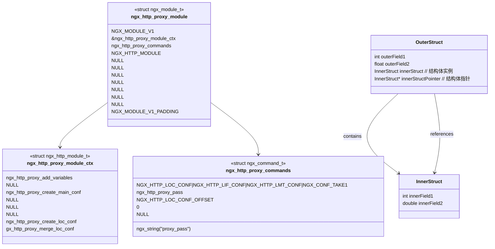

```mermaid
classDiagram
    class ngx_http_proxy_module{
        <<struct ngx_module_t>>
        NGX_MODULE_V1
        &ngx_http_proxy_module_ctx
        ngx_http_proxy_commands               
        NGX_HTTP_MODULE                       
        NULL                                  
        NULL                                  
        NULL                                  
        NULL                                  
        NULL                                  
        NULL                                  
        NULL                                  
        NGX_MODULE_V1_PADDING
    }

    class ngx_http_proxy_module_ctx {
        <<struct ngx_http_module_t>>
        ngx_http_proxy_add_variables         
        NULL                                  
        ngx_http_proxy_create_main_conf       
        NULL                                  
        NULL                                  
        NULL                                  
        ngx_http_proxy_create_loc_conf        
        gx_http_proxy_merge_loc_conf          
    }

    class ngx_http_proxy_commands {
        <<struct ngx_command_t>>
        ngx_string("proxy_pass")
        NGX_HTTP_LOC_CONF|NGX_HTTP_LIF_CONF|NGX_HTTP_LMT_CONF|NGX_CONF_TAKE1
        ngx_http_proxy_pass
        NGX_HTTP_LOC_CONF_OFFSET
        0
        NULL
    }

    ngx_http_proxy_module --> ngx_http_proxy_module_ctx
    ngx_http_proxy_module --> ngx_http_proxy_commands

    class OuterStruct {
        int outerField1
        float outerField2
        InnerStruct innerStruct  // 结构体实例
        InnerStruct* innerStructPointer  // 结构体指针
    }

    class InnerStruct {
        int innerField1
        double innerField2
    }

    OuterStruct --> InnerStruct : contains
    OuterStruct --> InnerStruct : references
```