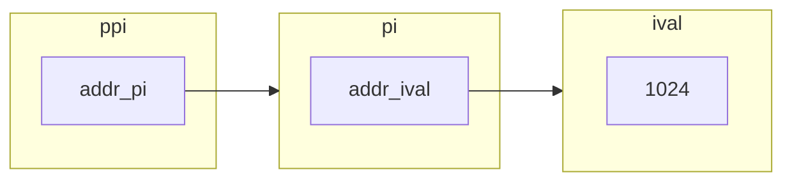

# 第 2 章 变量和基本类型

数据类型是程序的基础：它告诉我们数据的意义以及我们能在数据上执行的操作。

C++语言支持广泛的数据类型。它定义了几种基本的数据类型（如字符、整数、浮点数、），同时也为程序员提供了自定义数据类型的机制。基于此，C++标准库定义了一些更加复杂的数据类型，比如可变长字符串和向量等。

数据类型决定了程序中数据和操作的意义。

```c++
i = i + j;
```

其含义依赖于 i 和 j 的数据类型。如果 i 和 j 都是整数，那么这条语句执行的就是最普通的加法运算。然而，如果 i 和 j 是 Sales_item 类型的数据，则是把这两个对象的成分相加。

## 2.1 基本内置类型

C++定义了一套包括**算术类型**（arithmetic type）和**空类型**（void）在内的基本数据类型。其中算术类型包含了字符、整数、布尔和浮点数。空类型不对应具体的值，仅用于一些特殊场合，例如常见的是，当函数不返回任何值时使用空类型作为返回。

### 2.1.1 算术类型

算术类型分为两类：**整型**（integral type， 包括字符和布尔类型在内）和浮点型。

算术类型的大小在不同机器上时不同的，允许编译器赋予这些类型更大的大小

|    类型     |      含义      |   最小大小    |
| :---------: | :------------: | :-----------: |
|    bool     |    布尔类型    |    未定义     |
|    char     |      字符      |     8bit      |
|   wchar_t   |     宽字符     |     16bit     |
|  char16_t   |  Unicode 字符  |     16bit     |
|  char32_t   |  Unicode 字符  |     32bit     |
|    short    |     短整型     |     16bit     |
|     int     |      整型      |     16bit     |
|    long     |     长整型     |     32bit     |
|  long long  |     长整型     |     64bit     |
|    float    |  单精度浮点数  | 6 位有效数字  |
|   double    |  双精度浮点数  | 10 位有效数字 |
| long double | 扩展精度浮点数 | 10 为有效数字 |

布尔类型（bool）的取值是真（true）或假（false）

C++提供了几种字符类型，其中多数支持国际化。基本的字符类型是一个 char，一个 char 的空间确保可以存放机器基本字符集中的任意字符对应的数字值。也就是说，一个 char 的大小和一个机器字节一样。

其他字符类型用于扩展字符集，如 wchar_t、char16_t、char32_t、wchar_t 类型用于确保可以存放机器最大扩展字符集中的任意一个字符，类型 char16_t 和 char32_t 则为 Unicode 字符集服务。

除字符和布尔类型之外，其他整型用于表示（可能）不同大小的整数。c++语言规定一个 int 至少和一个 short 一样大，一个 long 至少和一个 int 一样大，一个 long long 至少和一个 long 一样大。

:::warning 内置类型的机器实现
计算机以 bit 序列存储数据，每个 bit 非 0 即 1，例如：

`00011011011100010110010000111011....`

大多数计算机以 2 的整数次幂个作为块来处理内存，可寻址的最小内存块为`字节（byte）`，存储的基本单元称为`字（word）`,它通常有几个字节组成，在 c++语言中，一个字节至少能容纳机器基本字符集中的字符。大多数机器的字节有 8bit 构成，字则有 32 或 64bit 构成，也就是 4 或 8 字节。

大多数计算机将内存的每个字节与一个数字（被称为“地址（address）”）关联起来，在一个字节为 8bit、字为 32bit 的机器上我们可能看到的一个字的内存区域如下所示：

`=> 0x00073546 [0,0,1,1,1,0,1,1]`

`   0x00073547 [0,0,0,1,1,0,1,1]`

`   0x00073548 [0,1,1,1,0,0,0,1]`

`   0x00073549 [0,1,1,0,0,1,0,0]`

其中，左侧是字节的地址，右侧是字节中 8bit 的具体内容。

我们使用某个地址来表示从这个地址开始的大小不同的二进制串，例如我们可能会说地址 73546 的那个字或地址 73549 那个字节。为了赋予内存某个地址明确的含义，必须首先知道存储在该地址的数据类型。类决定了该如何解读该二进制串。
:::

浮点型可表示单精度、双精度和扩展精度值。C++标准指定了一个浮点数的有效位数的最小值。然而大多数编译器都实现了更高精度。通常，float 以 1 个字（32bit）来表示，double 以 2 个字（64bit）来表示，long double 以 3 或 4 个字（96 或 128bit）来表示。一般来说，类型 float 和 double 分别有 7 和 16 个有效位；类型 long double 则常常被用于特殊浮点需求的硬件，它的具体实现不同，精度也各不相同。

#### 带符号类型和无符号类型

除去布尔型和扩展的字符型之外，其他整型可以划分为带符号的（signed）和无符号的（unsigned）两种。带符号类型可以表示整数、负数或 0，无符号类型则仅能表示大于等于 0 的值。

类型 int、short、long 和 long long 都是带符号的，通过在这些类型名前添加 unsigned 就可以得到无符号类型，例如 unsigned long。 unsigned int 可以缩写为 unsigned。

与其他类型不同，字符型被分为三种：char、signed char 和 unsigned char。 特别需要注意的是：类型 char 和类型 signed char 并不一样。尽管字符型有三种，但是字符的表现形式却只有两种：带符号的和无符号的。类型 char 实际上会表现为上述两种形式中的一种，具体是那种由编译器决定。

无符号类型中所有比特都用来存储值，例如，8bit 的 unsigned char 可以表示 0 至 255 区间内的值。

C++标准并没有规定带符号类型应如何表示，但是约定了在表示范围内的正值和负值的量应该平衡。因此，8bit 的 signed char 理论上应该是-127 至 127 区间内的值，大多数现代计算机将实际的表示范围定位-128 至 127。

:::tip 建议：如何选择类型
和 C 语言一样，C++和设计准则之一也是尽可能地接近硬件。C++的算术类型必须满足各种硬件特质，所以它们常常显得复杂而令人不知所措。事实上，大多数程序员能够（也应该）对数据类型的使用做出限定从而简化选择的过程。以下是选着类型的一些经验准则：

- 当明确知道数值不可能为负数时，选用无符号整型。
- 使用 int 执行整数运算。在实际应用中，short 常常显得太小而 long 一般和 int 有一样的大小。如果你的数值超过了 int 的表示范围，选用 long long。

在算术表达式中不要使用 char 或 bool，只有在存放字符或布尔值时才使用它们。因为类型 char 在一些机器上时有符号的，而在另一些机器上又是无符号的，所以如果使用 char 进行运算特别容易出现问题。如果你需要使用一个不大的整数，那么明确指定它的类型是 signed char 或者 unsigned char。

执行浮点数运算选用 double，这是因为 float 通常精度不够而且双精度浮点数和单精度浮点数的计算相差无几。事实上，对于某些机器来说，双精度运算甚至比单精度还快。long double 提供的精度在一般情况下是没有必要的，况且它带来的运行时消耗也不容易忽视。
:::

:::details 练习 2.1
类型 int、long、long long 和 short 的区别是什么？无符号类型和带符号类型的区别是什么？float 和 double 的区别是什么？
:::

:::detaile 练习 2.2
计算按揭贷款时，对于利率本金和付款分别应该选择何种数据类型？说明你的理由。
:::

### 2.1.2 类型转换 {#类型转换}

对象的类型定义了对象能包含的数据和能参与的运算，其中一种运算被大多数类型支持，就是将对象从一种给定的类型转换（convert）为另一种相关类型。

当在程序的某处我们使用了一种数据类型而其实对象应该取另一种类型时，程序会自动进行类型转换。有必要说明某种类型的对象强行赋了另一种值时，到底会发生什么。

当我们像下面这样把一种算术类型的值赋给另外一种类型时；

```C++
bool b = 42; // b为真
int i = b; // i=1
i=3.14      // i=3
double pi = i // pi = 3.0
unsigned char c = -1; //  假设char占8bit，c的值为255
singned char c2 = 256 // 假设char占8bit，c2的值是未定义的
```

类型所能表示的值的范围决定了转换的过程：

- 当我们把一个非布尔类型的算术赋值给布尔类型时，初始值为 0 则结果为 false，否则为 true。
- 当我们把一个布尔值赋给非布尔类型是，初始值为 false 则结果为 0，初始值为 true 则结果为 1.
- 当我们把一个浮点数赋值给整数类型时，进行近似处理。结果值将仅保留浮点数中小数点之前的部分。
- 当我们把一个整数赋值给浮点数时，小数部分标记为 0。如果该整数所占空间超过浮点类型的容量，精度可能有损失。
- 当我们赋给无符号类型一个超出它表示范围的值时，结果是初始值对无符号类型表示数值总数取模后的余数。例如，8bit 大小的 unsigned char 可以表示 0 至 255 区间内的值，如果我们赋了一个区间外的值，则实际的结果是该值对 256 取模后得到的余数。因此，把-1 赋给 8bit 大小的 unsigned char 所得的结果是 255。
- 当我们赋给带符号类型一个超出它表示范围的值时，结果是未定义的（undefined）。此时，程序可能继续工作、可能崩溃、也可能生成垃圾数据。

:::tip 建议：避免无法预知和依赖于实现环境的行为
无法预知的行为源于编译器无须（有时是不能）检测错误。即使代码编译通过了，如果程序执行了一条未定义的表达式，仍有可能产生错误。

不幸的是，在某些情况下和/或某些情况下，含有无法预知行为的程序也能正确执行。但我们无法保证同样一个程序在别的编译器下能正常工作，升值已经编译通过的代码再次执行也可能会出错。此外，也不能认为这样的程序对一组输入有效，对另一组输入就一定有效。

程序也应尽量不免依赖于实现环境。如果无门把 int 的大小看成是一个确定不变的已知值，那么这样的程序就称作不可移植的（nonportable），当程序移植到别的机器上后，依赖于实现环境的程序就可能发生错误。要从过去的代码中定位这类错误可不是一件轻松愉快的工作。

:::

当在程序的某处使用了一种算术类型的值而其实所需的是另外一种类型的值时，编译器同样会执行生疏的类型转换。例如，如果我们使用了一个非布尔值作为条件，那么它会被自动的转换为布尔值，这一做法和把非布尔值赋值给布尔变量时的错做完全一样：

```C++
    int i = 42;
    if(i)
        i = 0;
```

如果 i 的值为 0，则田间的值为 false；i 的所有其他值都将使条件为 true。

以此类推，如果我们把一个布尔值用在算术表达式里，则它的取值非 0 即 1，所以一般不宜在算术表达式里使用布尔值。

#### 含有无符号类型的表达式

尽管我们不会故意给无符号对象赋一个负值，却可能（特别容易）写出这么做的代码。例如，当一个算术表达式中既有无符号数又有 yint 值时，那个 int 值就会转换成无符号数。把 int 转换成无符号数的过程和把 int 直接赋给无符号变量一样：

```c++
    unsigned u = 10;
    int i = -42;
    std::cout << i+i <<std::endl; // 输出-84
    std::cout << u + i << std::endl; // 如果int占32位，输出4294967264
```

在第一个输出表达式里，两个（负）整数相加并得到了预期的结果。在第二个输出表达式里，相加前先把整数-42 转换成无符号数。把负数转换成无符号数类似于直接给无符号数赋一个负值，结果等于这个负数加上无符号数的模。

当从无符号数中减去一个值时，不管这个值是不是无符号数，我们都必须确保结果是一个负值：

```c++
    unsigned u1 = 42, u2 = 10;
    std::cout << u1 - u2 << std::endl; // 正确：输出32
    std::cout << u2 - u1 << std::endl; // 正确：不过，结果是取模后的值
```

:::warning unsigned & signed
以 一个 8 位的数字为例，
有符号数的最高位的表示符号
0000 0001 代表 1 相反数“取反+1” 为 1111 1111 = -1。
无符号的 0000 0001 同样代表 1 而 1111 1111 代表 255。
上面的例子 10 - 42 = -32 可以通过一系列的运算推出二进制的表示方法，
32 的二进制表示是 0010 0000，所以-32 的二进制表示为 1101 1111 + 1 = 1110 0000 的无符号十进制表示为 22，而 -32 取模 256 刚好是 224。
:::

无符号数不会小于 0 这一事实同样关系到循环的写法。例如在[练习 1](./第1章%20开始)中需要写一个循环，通过控制变量递减的方式把从 10 到 0 的数字降序输出。这个循环可能类似于下面的形式：

```c++
for(int i= 10 ; i >= 0; --i)
    std::cout << i << std::endl;
```

可能你会觉得反正也不打算输出负数，可以用无符号数来重写这个循环。然而，这个不经意的改变却意味着死循环：

```C++
for(unsigned u = 10; u>=0;--u)
    std::cout << u  << std::endl;
```

来看看当 u 等于 0 时发生了什么，这次迭代输出 0，然后继续执行 for 语句里的表达式。表达式--u 从 u 中减去 1，得到结果-1 并不满足无符号的要求，此时像所有表示范围之外的其他数字一样，-1 被自动的转换成一个合法的无符号数。假设 int 类型占 32 位，则当 u 等于 0 时，--u 的结果将会是 4234967295。

一种解决办法是，用 while 语句来代替 for 语句，因为前者让我们能够在输出变量之前（而非之后）先减去 1；

```c++
unsigned u = 11;
while (u > 0){
    --u;
    std::cout << u << std::endl;
}
```

改写后的循环先执行对循环变量减 1 的操作，这样最后一次迭代时，进入循环的 u 值为 1.此时将其减 1，则这次迭代输出的数就是 0：下一次再检验循环条件时，u 的值等于 0 而无法再进入循环。因为我们要先做减 1 的操作，所以初始化 u 的值应该比要输出的最大值大 1.这里，u 的初始化为 11，输出的最大数是 10。

:::warning 切勿混用带符号类型和无符号类型
如果表达式里既有带符号类型又有无符号类型，当带符号类型取值为负时会出现异常结果，这是因为外服好数会自动地转换成无符号数。例如，在一个形如 a\*b 的式子中，如果 a = -1， b = 1，而且 a 和 b 都是 int，则表达式的值显然为-1.然而，如果 a 时 int，而 b 是 unsigned，则结果须视在当前机器上 int 所占位数而定。在我们的环境里，结果是 4294967295。
:::

:::detaile 练习 2.3：读取程序写结果

```C++
    unsigned u = 10, u2 = 42;
    std::cout << u2 - u << std::endl;
    std::cout << u - u2 << std::endl;

    int i = 10. i2 =42;
    std::cout << i2 - i  << std::endl;
    std::cout << i - i2 << std::endl;
    std::cout << i - u  << std::endl;
    std::cout << u - i  << std::endl;
```

:::

### 2.1.3 字面值的常量

一个形如 42 的值被称为字面值常量（literal），这样的值一望而知。每个字面值常量都对应一种数据类型，字面值常量的形式和值决定了它的数据类型。

#### 整型和浮点型字面值

我们可以将整型字面值写作十进制、八进制或十六进制数的形式，以 0 开头的整数代表八进制数，以 0x 或 0X 开头的代表十六进制数。

整型字面值具体的数据类型由它的值和符号决定。默认情况下，十进制字面值的类型都是带符号数，八进制和十六进制字面值既可能是带符号的也可能是无符号的。十进制的字面类型是 int、long 和 long long 中最小的那个，当然前提是这种类型要能容纳下当前的值。八进制和十六进制字面值的类型是能容纳其数值的 int、unsigned int、long、unsigned long、long long 和 unsigned long long 中的最小者。如果一个字面值连与之关联的最大类型都放不下，将产生错误。类型 short 没有对应的字面值。

尽管整型字面值可以存储在带符号数据类型中，但严格来说，十进制字面值不会是负数。如果我们使用了一个形如-42 的负十进制字面值，那个符号并不在字面值之内，它的作用仅仅是对字面值取负值而已。

浮点型字面值表现为一个小数或以科学计数法表示的指数，其中指数部分用 E 或 e 标识：

`3.14159   3.14159E0   0.  0e0     .001`

默认的，浮点型字面值是一个 double。

#### 字符和字符串字面值

有单引号括起来的一个字符称为 char 型字面值，双引号括起来的零个或多个字符则构成字符串型字面值。

```C++
   'a' // 字符字面值
   "hello world" //字符传字面值
```

字符串字面值的类型实际上是由常量字符构成的数值（Array）。编译器在每个字符串的结尾处添加一个空字符（'\0'），因此，字符串字面值的实际长度要比它的内容多 1。例如，字面值'A'表示的就是单独的字符 A，而字符串"A"则代表了一个字符的数组，该数组包含了两个字符：一个是字母 A、另一个是空字符。

如果两个字符串字面值位置紧邻且仅有空格、缩进和换行符分割，则它们实际上是一个整体。当书写的字符串字面值较长，写在一行里不太合适，就可以采取分开书写的方式：

```C++
std::cout << "a really, really long string literal "
            "that spans two lines" << std::endl;
```

#### 转义序列

有两类字符程序员不能直接使用：一类是不可打印字符（nonprintalble）的字符，如退格或其他控制字符，因为它们没有可视的图符；另一类是在 C++语言中有特殊含义的字符（单引号、双引号、问好、反斜线）。在这些情况下需要用到转义序列（escape sequence），转移序列均以反斜线作为开始，C++语言规定的转移序列包括：

|    名称    | 字符 |    名称    | 字符 |      名称      | 字符 |
| :--------: | :--: | :--------: | :--: | :------------: | :--: |
|   换行符   |  \n  | 横向制表符 |  \t  | 报警（响铃）符 |  \a  |
| 纵向制表符 |  \v  |   退格符   |  \b  |     双引号     | \\"  |
|   反斜线   | \\\\ |    问号    | \\?  |     单引号     | \\'  |
|   回车符   |  \r  |   进纸符   |  \f  |

在程序中，上述转移序列被当作一个字符使用：

```C++
std::cout << '\n' << std::endl;
std::cout << "\tHi!\n" << std::endl;
```

我们也可以使用泛化的转移序列，其形式是\x 后紧跟 1 个或多个十六进制数字，或者\后紧跟 1 个、2 个或 3 个八进制数字，其中数字部分表示的是字符对应的数值。假设使用的是 Latin-1 字符集，一些示例：

`\7(响铃) \12（换行符）\40（空格）`

`\0（空字符）\115（字符M）\x4d(字符M)`

我们可以像使用普通字符那样使用 C++语言定义的转义序列：

```c++
    std::cout << "Hi \x4dO\115!\n"; // 输出Hi MOM
    std::cout << '\115' << std::endl;
```

注意，如果反斜线\后面跟着的八进制数字超过 3 个，只有前 3 个数字与\构成转移序列。例如，"\1234"表示 2 个字符，即八进制数 123 对应的字符及字符 4。相反，\x 要用到后面跟着的所有数字，例如，"\x1234"表示一个 16 位的字符，该字符由这 4 个十六进制数所对应的比特唯一确定。因为大多数机器的 char 型数据占据 8 位，所以上面这个例子可能会报错。一般来说，超过 8 位的十六进制字符都与表 2.2 中的某个前缀作为开头的扩展字符集一起使用的。

#### 指代字面值的类型

通过添加如表 2.2 中所列的前缀和后缀，可以改变整型、浮点型和字符型字面值的默认类型。

```C++
L'a'            // 宽字符型字面值，wchar_t
u8"hi!"         // utf-8字符串字面值
42ULL           // 无符号整型字面值 unsigned long long
1E-3F           // 单精度浮点型字面值 float
3.14159L        // 扩展精度浮点型字面值 long double
```

:::tip 最佳实践
当使用一个长整型字面值时，请使用大写字面 L 来标记，因为小写字母 l 和数字 1 太容易混淆了。
:::

:::warning 表 2.2:指定字面值的类型
**字符和字符串字面值**
|前缀|含义|类型|
|--|--|--|
|u|Unicode16 字符|char16_t|
|U|unicode32 字符|char32_t|
|L|宽字符|wchar_t|
|u8|UTF-8(仅适用于字符串字面常量)|char|

**整型字面值**
|后缀|最小匹配类型|
|--|--|
|u or U|unsignde|
|l or L|long|
|ll or LL|long long|

**浮点型字面值**
|后缀|类型|
|--|--|
|f or F|float|
|l or L| long double|
:::

对于一个整型字面值来说，我面能分别指定它是否带符号及占用多少空间。如果后缀中有 U，则该字面值属于无符号类型，也就是说，以 U 为后缀的十进制数、八进制数或十六进制数都将从 unsigned int、unsigned long 和 unsigned long long 中选择能匹配的空间最小的一个作为其数据类型。如果后缀中有 L，则字面值的类型至少是 long；如果后缀中有 LL，则字面值的类型将是 long long 和 unsigned long long 中的一种。显然我们可以将 U 与 L 或 LL 结合在一起使用。例如，以 UL 为后缀的字面值的数据类型将根据具体数值情况取 unsigned long 或者 unsigned long long。

布尔字面值和指针字面值：

```C++
bool test = false;
```

`nullptr`是指针字面值。

:::details 练习 2.5：指出下述字面值的数据类型并说明每一组内集中字面值的区别：

1. 'a',L'a',"a",L"a"
2. 10, 10u, 10L, 10uL, 012, 0xC
3. 3.15, 3.14f, 3.14L
4. 10, 10u, 10., 10e-2
   :::

:::details 练习 2.6：下面两组定义是否有区别，如果有，请叙述之：

```C++
int month = 9, day=7;
int month = 09, day =07;
```

:::

:::details 练习 2.7：下述字面值表示何种含义？它们各自的数据类型是什么？

1. "Who goes with F\145rgus?\012"
2. 3.14e1L
3. 1024f
4. 3.14L
   :::

:::details 练习 2.8：请利用转义序列编写一段程序，要求先输出 2M，然后转到新的一行。修改程序使其先输出 2，然后输出制表符，在输出 M，最后转到新的一行。

```C++
#include <iostream>
int main(int argc, char const *argv[])
{
    std::cout << "2M\n";
    std::cout << "2\tM\n";
    return 0;
}
```

:::

## 2.2 变量

变量提供一个具名的、可供程序操作的存储空间。C++中的每个变量都有其数据类型，数据类型决定着变量所占内存空间的大小和布局方式、该空间能存储的值的范围，以及变量能参与的运算。对 C++来说，“变量（variable）”和“对象（object）”一般可以互换使用。

### 2.2.1 变量定义

变量定义个基本形式是：首先是**类型说明符（type specifier）**，随后紧跟一个或多个变量名组成的列表，其中变量名以逗号分隔，最后以分号结束。列表中的每一个变量名的类型都由类型说明符指定，定义时还可以为一个或多个变量赋初值：

```C++
int sum = 0, value,
    units_sole = 0;
Sales_item item;
std::string book("0-201-78345-x"); // book通过一个string字面值初始化。
```

book 的定义用到了库类型 std::string, 像 iostream 一样，stirng 也是在命名空间 std 中定义的，我们将在第 3 章中对 string 类型做刚详细的介绍。眼下，只需了解 string 是一种表示可变长字符序列的数据类型就可以了。C++库提供了几种初始化 string 对象的方法，其中一种是吧字面值拷贝给 string 对象，因此在上例中，book 被初始化为 0-201-78345-x。

:::warning 术语：何为对象？
C++ 程序员在很多场合都会使用对象（object）这个名词。通常情况下，对象是指一块能存储数据并具有某种类型的内存空间。

一些人仅在与类有关的场景下才使用“对象”这个词。另一些人则把已命名的对象和为命名的对象区分开来，他们把命名的对象叫做变量。还有一些人把对象和值区分开来，其中对象值能被程序修改的数据，而值（value）指只读的数据。

本书遵循大多数人的习惯用法，即认为对象是具有某种数据类型的内存空间。我们在使用对象这个词时，并不严格区分是类还是内置类型，也不区分是否命名或是否只读。
:::

#### 初始值

当对象在创建时获得了一个特定的值，我们说这个对象被初始化（initialized）了，用与初始化的值可以是任意复杂的表达式。当一次定义了两个或多个变量时，对象的名字随着定义也就马上可以使用了。因此在同一条定义语句中，可以先定义变量的值去初始化后定义的其他变量。

```C++
double price = 109.99, discount = price * 0.16;
double salePrice = applyDiscount(price,discount);
```

在 C++语言中，初始化是一个异常复杂的问题，我们也将反复讨论这个问题。很多程序员对于用等号=来初始化变量的方式倍感困惑，这种方式容易让人认为初始化是赋值的一种。事实上在 C++语言中，初始化和赋值是两个完全不同的操作。然而在很多编程语言中二者的区别几乎可以忽略不计,即使在 C++语言中有时这种区别也无关紧要，所以人们特别容易把二者混为一谈。需要强调的是，这个概念至关重要，我们也将在后面不止一次提及这一点。

:::warning 警告
初始化不是赋值，初始化的含义是创建变量时赋予其一个初始值，而赋值的含义是把对象的当前值擦除，而以一个新值替代。
:::

#### 列表初始化

C++语言定义了初始化的好几种不同形式，这一世初始化问题复杂性的一个体现。例如，想要定义一个名为 units_sold 的 int 变量并初始化为 0，以下 4 条语句都可以做到这一点：

```C++
int units_sold = 0;
int units_sold = {0};
int units_sold{0};
int units_sold(0);
```

作为 C++11 新标准的用花括号来初始化变量得到了前面应用，而在此之前，这种初始化的形式仅在某些受限的场合下才能使用。出于[3.3.1]将要介绍原因，这种初始化的形式被称为列表初始化（list initialization）。现在，无论是初始化对象还是某些时候为对象赋新值，都可以使用这样一组由花括号括起来的初始值了。

当用于内置类型的变量时，这种初始化形式有一个重要特点：如果我们使用列表初始化且初始值存在丢失信息的风险，则编译器将报错：

```C++
long double ld = 3.1415926536

int a{ld}, b = {ld}; // 错误：转换未执行，因为存在信息丢失风险
int c(ld), d=ld;    // 正确，转换执行，且丢失了部分值

```

使用 long double 的值初始化 int 变量时可能丢失数据，所以编译器拒绝了 a 和 b 的初始化请求。其中至少 ld 的小数部分会丢失掉，而且 int 也可能存不下 ld 的整数部分。

刚刚所介绍的看起来无关紧要，毕竟我们不会故意用 long double 的值去初始化 int 变量。然而，像第 16 章介绍的一样，这种初始化有可能在不经意间发生。我们将在[3.2.1 节]和[3.3.1 节]对列表初始化做更多的介绍。

默认初始化

如果定义变量没有指定初值，则变量被默认初始化（default initialized），知识变量被赋予了“默认值”。默认值到底是什么由变量类型决定，同时定义变量的位置也会对此有影响。

如果是内置类型的变量未被显式初始化，它的值由定义的位置决定。定义于任何函数体之外的变量被初始化为 0。然而，一种另外情况是，定义在函数体内部的内置类型变量将不被初始化（uninitialized）。一个未被初始化的内置类型变量的值是[未定义](./第2章%20变量和基本类型.md#类型转换)的，如果试图拷贝或以其他形式访问此类值将引发错误。

每个类各自决定其初始化对象的方式，而且，是否允许不经初始化就定义对象也由类自己决定。如果类允许这种行为，他将决定对象的初始值到底是什么。

绝大多数类都支持无须显式初始化而定义对象，这样的类提供了一个合适的默认值。例如，以刚刚所见为例，string 类规定如果没有指定初始值则生成一个空串：

```C++
std::string empty   // empty 非显式地被初始化为一个空串
Sales_item item;    // 被默认初始化的Sales_item对象
```

一些类要求每个对象都显式初始化，此时如果创建了一个该类的对象而未对其做明确的初始化操作，将引发错误。

定义于函数体内的内置类型的对象如果没有初始化，则其值未定义。类的对象如果没有显式的初始化，则其值由类确定。

:::details 联系 2.9：解释下列定义的含义。对于非法的定义，请说明错在何处，并将其改正。
(a) std::cin >> int input_value; (b) int i = {3.14}; (c)double salary = wage = 999.99 (d)int i = 3.14;
:::

:::details 练习 2.10 下列变量的初值分别是什么？

```C++
std::string global_str;
int global_int;
int main()
{
    int local_int;
    std::string local_str;
}
```

:::

:::tip 未初始化变量引发运行时故障
未初始化的变量含有一个不确定的值，使用未初始化的变量的值是一种错误的编程行为并且很难调试。尽管大多数编译器都能对一部分使用未初始化的变量行为提出警告，但严格来说，编译器并未被要求检查此类错误。

使用未初始化的变量将带来无法预计的后果。有时我们足够幸运，一访问此类对象程序就崩溃并报错，此时只要找到崩溃的位置就很容易发现变量没有被初始化的问题。另外一些时候，程序一直执行完并产生错误的结果。更糟糕的情况是，程序结果时对时错、无法把握。而且，往无关的位置添加代码还会导致我们误以为程序对了，其实结果仍旧有错误。

建议初始化每一个内置类型的变量，虽然并非必须这么做，但如果我们不能确保出初始化后程序安全，那么这么做不失为一种简单可靠的方法。
:::

### 2.2.2 变量声明和定义的关系 {#变量声明和定义的关系}

为了允许把程序拆分成多个逻辑部分来编写，C++语言支持分离式编译（separate compilation）机制，该机制允许将程序分割为多个文件，每个文件可被独立编译。

如果将程序分为多个文件，则需要有在文件间共享代码的方法。例如，一个文件的代码可能需要使用另一个文件中定义的变量。一个实际的例子是 std::cout 和 std::cin，他们定义于标准库，却能被我们写的程序使用。

为了支持分离式编译，C++语言将声明和定义区分开来。声明（declaration）使得名字为程序所知，一个文件如果想使用别处定义的名字则必须包含对那个名字的声明。而定义（definition）负责创建与名字关联的实体。

变量声明规定了变量的类型和名字，在这一点上定义与之相同。但是除此之外，定义还申请存储空间，也可能会为变量赋一个值。

如果想声明一个变量而非定义它，就在变量前添加关键字 extern，而且不用显式的初始化变量：

```C++
    extern int i;
    int j ;
```

任何包含了显式初始化的声明即成为定义。我们能给由 extern 关键字标记的变量赋一个初始值，但是这么做也就抵消了 extern 的副作用。extern 语句如果包含初始值就不再是声明了，而变成了定义了

```C++
    extern double pi = 3.1415926;
```

在函数体内部，如果试图初始化一个由 extern 关键字标记的变量，将引发错误。

变量能且只能被定义一次，但是可以被多次声明。

声明和定义的区别看起来也许微不足道，但实际上却非常重要。如果要在多个文件中使用同一个变量，就必须将声明和定义分离。此时，变量的定义必须出现在且只能出现在一个文件中，而其他用到该变量的文件必须对其进行声明，却绝对不能重复定义。

关于 C++语言对分离式编译的支持我们将在[2.6.3 节]和[3.1.3 节]中做更详细的介绍。

:::details 练习 2.11：指出下面的语句是声明还是定义：

```C++
extern int ix = 1024;
int iy;
extern int iz;
```

:::

:::warning 关键概念：静态类型
C++是一种静态类型（statically typed）语言，其含义实在编译阶段检查类型。其中，检查类型的过程为类型检查（type checking）。

我们已经知道，对象的类型决定了对象所能参与的运算。在 C++语言中，编译器负责检查数据类型是否支持要执行的运算，如果试图执行类型不支持的运算，编译器将报错并且不会生成可执行文件。

程序越复杂，静态类型检查越有助于发现问题。然而，前提是编译器必须知道每一个实体对象的类型，这就要求我们在是一个某个变量之前必须声明其类型。
:::

### 2.2.3 标识符

C++的标识符（identifier）由字符、数字和下画线组成，其中必须以字母或下画线开头。标识符的长度没有限制，但对大小写字母敏感：

```C++
// 四个不同的变量
int somename,someName,SomeName,SOMENAME
```

如表 2.3 和 2.4 所示，C++语言保留了一些名字供语言本身使用，这些名字不能被用作标识符。

同时，C++也为标准库保留了一些名字，用户定义的标识符中不能连续出现两个下画线，也不能以下画线紧连大写字母开头。此外，定义在函数体外的标识符不能以下画线开头。

#### 变量命名规范

变量名有许多约定成俗的规范，下面的这些规范能有效提高程序的可读性：

- 标识符要能体现实际汉语。
- 变量名一般用小写字母，如 index，不要使用 Index 或 INDEX。
- 用户自定义的类名一般以大写字母开头，如 Sales_item。
- 如果标识符由多个单词组成，则单词间应有明显的区分，如 student_loan 或 studentLoan，不要使用 studentloan。

:::info 表 2.3：C++关键字
||||||
|--|--|--|--|--|
alignas | continue | friend | register | true
alignof | decltype | goto | reinterpret_cast | try
asm | default | if | return | typedef
auto | delete 　| inline | short | typeid
bool|do|int|signed|typename
break|double|long|sizeof|union
case|dynamic_case|mutable|static|unsigned
catch|else|namespace|static_assert|using
char|enum|new|static_cast|virtual
char16_t|explicit|noexcept|struct|void
char32_t|export|nullptr|switch|volatile
class|extern|operator|template|wchar_t
const|false|private|this|while
constexpr|float|protected|thread_local|
const_case|for|public|throw
:::

:::info 表 2.4：c++操作符替代名
|||||||
|--|--|--|--|--|--|
and|bitand|compl|not_eq|or_eq|xor_eq
and_eq|bitor|not|or|xor
:::

:::details 练习 2.12：请指出下面的名字中那些是非法的？

```C++
int double = 3.14;
int _;
int catch-22;
int 1_or_2 = 1;
double Double = 3.14
```

:::

### 2.2.4 名字的作用域

不论是在程序的什么位置，使用到的每个名字都会指向一个特定的实体：变量、函数、类型等。然而，同一个名字如果出现在程序的不同位置，也可能指向不同的实体。

作用域（scope）是程序的一部分，在其名字中有其特定的含义。C++语言中大多数作用域都以花括号分隔。

同一个名字在不同的作用域中可能指向不同的实体。名字的有效区域始于名字的声明语句，以声明语句所在的作用域末端为结束。

一个典型的示例：

```C++
#include <iostream>
int main()
{
    int sum = 0;
    for(int val = 1; val <= 10; ++val)
    {
        sum += val;
    }
    std::cout << "Sum of 1 to 10 inclusive is " << sum << std::endl;
    return 0;
}
```

这段程序定义了 3 个名字：main、sum、和 val，同时使用了命名空间 std，该空间提供了 2 个名字 cout 和 cin 工程序使用。

名字 main 定义于所有花括号之外，它和其他大多数定义在函数体之外的名字一样拥有全局作用域（global scope）。一旦声明后，全局作用域内的名字在整个函数程序的范围内都可以使用。名字宿命定义域 main 函数所限定的作用域之内，从声明 sum 开始直到 main 函数结束为止都可以访问它，但出了 main 函数所在的块就无法访问了，因此说变量 sum 拥有块作用域（block scope）。名字 val 定义于 for 语句内，在 for 语句之内可以访问 val，但是在 main 函数的其他部分就不能访问它了。

:::tip 建议：当你第一次使用变量时在定义它
一般来说，在对象第一次被使用的地方附近定义它时一种好的选择，因为这样做有助于更容易地找到变量的定义。更重要的是，当变量的定义与它第一次被使用的地方很近时，我们也会赋予它一个比较合理的初始值。
:::

#### 嵌套的作用域

作用域能彼此包含，被包含的作用域被称为内层作用域（inner scope），包含着别的作用域的作用域称为外层作用域（outer scope）。

作用域中一旦声明某个名字，他所嵌套着的所有作用域都能访问改名字。同时，允许在内层作用域中从新定义外层作用域已有的名字：

```C++
#include <iostream>
int reused = 42;
int main()
{
    int unique = 0;
    // 输出42 0
    std::cout << reused << " " << unique << std::endl;

    int reused = 0;
    // 输出0 0
    std::cout << reused << " " << unique << std::endl;

    // 显式地访问全局变量reused 输出42 0
    std::cout << ::reused << " " << unique << std::endl;
}
```

输出 1 出现在局部变量 reused 定义之前，使用全局作用域中定义的 reused；输出 2 发生在局部变量 reused 定义之后，局部变量 resued 在作用域内（in scope），使用局部变量。输出 3 使用了[作用域操作符]来覆盖默认的作用域规则，因为全局作用域本身没有名字，所以当使用作用域操作符的左侧为空时，想全局作用域发出请求获取作用域操作符右侧名字对应的变量。结果是，第三条输出语句使用全局变量 resused。

:::details 练习 2.13：下面程序中的 j 的值是多少？

```C++
int i = 42;
int main()
{
    int i = 100;
    int j = i;
}
```

:::

:::details 练习 2.14：下面的程序合法吗？如果合法，它将输出什么？

```C++
    int i = 100, sum = 0;
    for(int i = 0; i != 10; ++i)
        sum += i;
    std::cout << i << " " << sum << std::endl;
```

:::

## 2.3 复合类型

复合类型（compound type）是指基于其他类型定义的类型。C++语言有几种复合类型，本章将介绍其中的两种：引用和指针。

与我们已经掌握的变量声明相比，定义复合类型的变量要复杂很多。一条简单的声明语句由一个数据类型和紧随其后的一个变量名组成。其实更通用的描述是，一条声明语句由一个基本数据类型（base type）和紧随其后的一个声明符（declarator）列表组成。每个声明符命名了一个变量并指向该变量为与基本数据类型有关的某种类型。

目前为止，我们所接触的声明语句中，声明符其实就是变量名，此时变量的类型也就是声明的基本数据类型。其实还可能有更复杂的声明符，它基于基本的数据类型得到更复杂的类型，并把它指定给变量。

### 2.3.1 引用 {#引用}

C++11 中新增了一种引用：所谓的“右值引用（rvalue_reference）”，我们将在 13.6.1 节做更详细的介绍。这种引用主要用于内置类。严格来说，当我们使用术语“引用（reference）”时，指定其实是“左值引用（lvalue reference）”

引用（reference）为对象起了另外一个名字，引用类型引用（refers to）另外一种类型。通过将声明符写成&d 的形式来定义引用类型，其中 d 是声明的变量名：

```C++
int ival = 1024;
int &refVal = ival; // refVal指向ival（是ival的另一个名字）
int &refVal2；// 报错：引用必须被初始化
```

一般在初始化变量时，初始值会被拷贝到新建的对象中。然而定义引用时，程序把引用和它的初始值绑定（bind）在一起，而不是将初始值拷贝给引用。一旦初始化完成，引用将和它的初始值对象一种绑定在一起。因为无法零引用重新绑定到另外一个对象，因此引用必须初始化。

#### 引用即别名

引用并非对象，相反的，他只是为一个已经存在的对象所起的另外一个名字。

定义了一个引用之后对其进行的所有操作都是在与之绑定的对象上进行的：

```C++
    refVal = 2;
    int ii = refVal;
```

为引用赋值，实际上是把值付给了与引用绑定的对象。获取引用的值，实际上是获取了与引用绑定的对象的值。同理，以引用作为初始值，实际上是以引用绑定的对象作为初始值：

```C++
int &refVal3 = refVal;
int i = refVal;
```

因为引用本身不是一个对象，所以不能定义引用的引用。

#### 引用的定义

允许在一条语句中定义多个引用，其中马哥引用标识符都必须以符号&开头：

```C++
int i = 1024, i2 = 2048;
int &r = i, r2 = i2;
int i3 = 1024, &ri = i3;
int &r3 = i3, &r4 = i2;
```

除了 2.4.1 节和 15.2.3 节将要介绍的两种例外情况，其他所有引用的类型都要和与之绑定的对象严格匹配。而且，引用只能绑定在对象之上，而不能与字面值或某个表达式的计算结果绑定在一起相关的原因将在 2.4.1 节详述：

```C++
int &refVal4 = 10; // err:引用类型的初始值必须是一个对象
double dval = 3.14;
int &refVal = dval; // err:引用类型的初始值必须是int型
```

:::details 练习 2.15：下面的哪个定义是不合法的？为什么？

```C++

int ival = 1.01;
int &rval1 = 1.01;
int &rval2 = ival;
int &rval3;
```

:::

:::details 练习 2.16：考查下面的所有赋值然后回答：哪些赋值是不合法的？为什么？哪些赋值是合法的？他们执行了什么样的操作？

```C++
int i = 0, &r1 = i;
double d = 0, &r2 = d;

r2 = 3.14159;
r2 = r1;
i = r2;
r1 = d;
```

:::details 练习 2.17：执行下面的代码段将输出什么结果？

```C++
int i,&ri = i;
i = 5; ri = 10;
std::cout << i << " " << ri << std::endl;
```

:::

### 2.3.2 指针

指针（pointer）是“指向（point to）”另外一种类型的符合类型。与引用类似，指针也实现了对其他对象的间接访问。然而指针与引用相比又有很多不同点。其一，指针本身就是一个对象，允许对指针赋值和拷贝，而且在职真的生命周期内它可以先后指向几个不同的对象。其二，指针无须在定义时赋初值。和其他内置类型一样，在快的作用域内定义的指针如果没有被初始化，也将拥有一个不确定的值。

:::warning
指针通常难以理解，即使是有经验的程序员也常常因为调试指针引发的错误而备受折磨。
:::

定义指针类型的方法将声明符写成\*d 的形式，其中 d 是变量名。如果在；一条语句中定义了几个指针变量，每个变量前面都必须有符号\*：

```C++
int *ip1, *ip2;
double dp,*dp2;
```

#### 获取对象的地址

指针存放某个对象的地址，想要获取该地址，需要使用取地址符（操作符&）：

```C++
int ival = 42;
int *p = &ival;
```

第二条语句把 p 定义为一个指向 int 的指针，随后初始化 p 令其指向名为 val 的 int 对象。因为引用不是对象，没有实际地址，所以不能定义指向引用的指针。

除了 2.4.2 节和 12.2.3 节将要介绍两种例外情况，其他所有指针的类型都要和它所指向的对象严格匹配：{#指针对象严格匹配}

```C++
double dval;
double *pd= & dval;
double *pd2 = pd;

int *pi = id; // err
pi = &dval;     // err
```

因为在声明语句中指针的类型实际上被用于指定它所指向的对象的类型，我已二者必须匹配。如果指针指向了一个其他类型的对象，对该对象的操作将发生错误。

#### 指针值

指针的值（即地址）应属于下列４种状态之一：

1. 指向一个对象。
2. 指向紧邻对象所占空间的下一个位置。
3. 空指针，意味着没有指向任何对象。
4. 无效指针，也就是上述情况之外的其他值。

试图拷贝或以其他方式访问无效指针的值都将引发错误。编译器并不负责检查此类错误，这一点和试图使用未经初始化的变量是一样的。访问无效指针的后果无法预计，因此程序员必须清楚任意给定的指针是否有效。

尽管第 2 种和第 3 种形式的指针是有效的，但其实用同样受到限制。显然这些指针没有指向任何具体对象，所以试图访问此类指针（假定的）对象的行为不被允许。如果这样做了，后果也无法预计。

#### 利用指针访问对象

如果指针指向一个对象，则允许使用解引用符（操作符\*）来访问该对象：

```C++
int ival = 42;
int *p = &ival;
cout << *p; // 42
```

对指针解引用会得到所指的对象，因此如果给解引用的结果赋值，实际上也就是给指针所指的对象赋值：

```C++
*p = 0;
cout << *p; // 0
```

如上所述程序所示，为\*p 赋值实际上是为 p 所指向的对象赋值。

解引用操作仅适用于那些确定指向了某个对象的有效指针。

:::info 关键概念：某些符号有多重汉语
像&和\*这样的符号，既能用作表达式里的运算符，也能作为声明的一部分出现，符号的上下文决定了符号的意义：

```C++
int i = 42;
int &r = i;
int *p;
p = &i;
*p = i;
int &r2 = *p;
```

在声明语句中，&和\*用于组成复合类型；在表达式中，它们的角色又转变为运算符。在不同场景下出现的虽然是同一个符号，但是由于含义截然不同，所以我们完全可以把它当作不同的符号来看待。

#### 空指针

空指针（null pointer）不指向任何对象，在试图使用一个指针前代码可以首先检查它是否为空。以下列出几个生成空指针的方法：

```C++
int *p1 = nullptr; // int *p1 = 0;
int *p2 = 0;
int *p3 = NULL;
```

得到空指针的最直接的办法是使用字面值 nullptr 来初始化指针，这也是 C++11 新标准刚刚引入的一种方法。nullptr 是一种特殊的字面值，它可以被转换成任意其他的指针类型。另一种办法就 p2 的定义一样，也可以通过将指针初始化字面值 0 来生成空指针。

过去的程序还会用到一个名为 NULL 的预处理变量来给指针赋值，这个变量在头文件 cstdlib 中定义，它的值就是 0。

2.6.3 节将稍微介绍一点关于预处理器的知识，现在只要知道预处理器是运行于编译过程之前的一段程序就可以了。预处理变量不属于命名空间 std，它由预处理器负责管理，因此我们可以直接使用预处理变量而无需在前面加上 std::。

当用到一个预处理变量时，预处理器会自动地将它替换为实际值，因此用 NULL 初始化指针和用 0 初始化指针是一样的。在新标准下，现在的 C++程序最好使用 nullptr，同时尽量避免使用 NULL。

把 int 变量直接赋给指针是错误的操作，即使 int 变量的值恰好等于 0 也不行。

```C++
int zero = 0;
int * pi = zero; // err
```

:::tip 建议：初始化所有的指针

使用未经初始化的指针是引发运行时错误的一大原因。

和其他变量一样，访问未经初始化的指针所引发的后果也是无法预计的。通常这一行为将造成程序崩溃，而且一旦崩溃，要想定位到出错位置将是特别棘手的问题。

在大多数编译器环境下，如果使用了未经初始化的指针，则该指针所占内存空间的当前内容将被看作一个地址值。访问该指针，相当于去访问一个本不存在的对象。糟糕的时，如果指针所占用的内存空间恰好有内容，而这些内容又被当作了某个地址，我们就很难分清它到底是合法的还是非法的了。

因此建议初始化所有的指针，并且在可能的情况下，尽量等定义了对象之后在定义指向它的指针。如果实在不清楚指针应该直向何处，就把它初始化为 nullptr 或者 0，这样程序就能检测并知道它没有指向任何具体对象了。

:::

赋值和指针

指针和引用都能提供对其他对象的间接访问，然而在具体实现细节上二者有很大不同，其中最总要的一点就是引用本身并非一个对象。一旦定义了引用，就无法令其再绑定到另外的对象，之后每次使用这个引用都是访问它最初绑定的对象。

指针和它尊放的地址之间就没有这种限制了。和其他任何变量（只要不是引用）一样，给指针赋值就是令他存放一个新的地址，从而指向一个新的对象：

```C++
int i = 42;
int *pi = 0;
int *pi2 = &i;
int *pi3;

pi3 = pi2;
pi2 = 0;
```

有时候要想搞清楚一条赋值语句到底是改变了指针的值还是改变了指针所指的对象的值不太容易，最好的办法就是记住赋值永远改变的是等号左侧的对象。

```C++
pi = &ival;
```

意思是为 pi 赋一个新值，也就是改变了存放在 pi 内的地址值。相反的：

```C++
*pi = 0;
```

则\*pi（也就是指针 pi 指向的那个对象）发生了改变。

#### 其他指针操作

只要指针拥有一个合法值，就能将它用在条件表达式中。和彩云算法值作为条件遵循的规则类似，如果指针的值是 0，条件取 false：

```C++
int ival = 1024;
int *pi = 0;
int *pi2 = &ival;
if(pi)
    // pi 为false
if(pi2)
    // pi2 为true
```

任何非 0 指针对应的条件值都是 true。

对于两个类型相同的合法指针，可以用相等的操作符（==）或不相等的操作符（!=）来比较它们，比较的结果是布尔类型。如果两个指针的地址值相同（两个指针相等）有三种可能：它们都为空、都指向同一个对象、都指向同一个对象的下一个地址。需要注意的是，一个指针指向某个对象，同时另一个指针指向另外一个对象的下一个地址，此时也有可能出现这两个指针相同的情况。

因为上述操作要用到指针的值，所以不论是作为条件出现还是参与比较运算，都必须使用合法的指针，使用非法指针作为条件或进行比较都会引发不可预测的后果。

#### void\* 指针

void\*是一种特殊类型的指针，可用于存放任意对象的地址。一个 viod\*指针存放着一个地址，这一点和其他指针类似。不同的是，我们对该对象地址中到底是个什么类型的对象并不了解：

```C++
double obj = 3.14, *pd = &obj;
void *pv = &obj;
pv = pd;
```

利用 void\*指针能做的事儿比较有限：拿它和别的指针作比较、作为函数的输入或输出，或者赋给另外一个 void\*指针。不能像直接操作 void\*指针所指的对象，因为我们并不知道这个对象到底是什么类型，也就无法确定能在这个对象上做哪些操作。

概括说来，以 void\*的视角来看内存空间也就仅仅是内存空间，没办法访问空间中存储的对象，关于这点将在 19.1.1 节有更详细的介绍，4.11.3 节讲述获取 void\*指针所存地址的方法。

:::details 练习 2.18 编写代码分别更改指针的值及指针所指向对象的值。

```C++
int *p = nullptr;
int num = 123;
p = &num;
*p = 5;
```

:::

:::details 练习 2.19：说明指针和引用的主要区别。
:::

:::details 练习 2.20：请叙述下面这段代码的作用。

```C++
int i = 42;
int *p1 = &1;
*p1 = *p1 * *p1;
```

:::

:::details 练习 2.21：请解释下属定义。在这些定义中有非法的吗？如果有，为什么？

```C++
int i = 0;

double * dp = &i;
int *ip = i;
int *p = &i;
```

:::

:::details 练习 2.22：假设 p 是一个 int 型指针，请说明下述代码的含义。

```C++
if(p)
if(*p)
```

:::

:::details 练习2.23：给定指针p，你能知道它是否指向了一个合法的对象吗？如果能，叙述判断的思路，如果不能也请说明原因。

:::

:::details 练习2.24：在下面这段代码中为什么p合法而lp非法？
```C++
int i = 42;
void *p = &i;
long *lp = &i;
```
:::

### 2.3.3 理解复合类型声明

如前所述，变量的定义包括一个基本数据类型（base type）和一组声明符。在同一条定义语句中，虽然基本数据类型只有一个，但是声明符的形式却可以不同。也就是所，一条定义语句可能定义出不同类型的变量：
```C++
int i = 1024, *p = &i, &r = i;
```

:::warning 
很多程序员容易迷惑基于基本数据类型和类型修饰符的关系，其实后者不过是声明符的一部分罢了。
:::

#### 定义多个变量 

经常有一种观点会误认为，在定义语句中，类型修饰符（\*或&）作用于本次定义的全部变量。造成这种错误看法的原因有很多，其中之一是我们可以把空格写在类型修饰符和变量名中间：
```C++
    int* p;
```
我们说这种写法可能产生误导是因为int\*放在一起好像是这条语句中所以变量的共同类型一样。其实恰恰相反，基本数据类型是int 而非 int\*。\*仅仅是修饰了p而已，对该声明语句中的其他变量，它不产生任何作用：
```C++
    int* p1, p2;
```
涉及指针或引用的生命，一般有两种写法。第一种把修饰符和变量标识符写在一起：
```C++
int *p1, *p2;
```
这种形式着重强调变龙具有符合类型。第二种把修饰符和类型名写在一起，并且每条语句只定义一个变量：
```C++
int* p1;
int* p2;
```
这种形式着重强调本次声明定义了一种复合类型。

:::tip 提示
上述两种定义指针或引用的不同方法没有孰对孰错之分，关键是选着并坚持其中一种写法，不要总是变来变去。
:::

本书采用第一种写法，将\*（或是&）与变量名连在一起。

#### 指针的指针

一般来说，声明符中修饰符的个数并没有限制。当有多个修饰符连写在一起时，按照其逻辑关系相加解释即可。以指针为例，指针是内存对象，向其他对象一样也有自己的地址，因此也许把指针的地址再放到另一个指针中。

通过\*的个数可以区分指针的级别。也就是说，\*\*表示指针的指针，\*\*\*表示指针的指针的指针，以此类推：

```C++
int ival = 1024;
int *pi = &ival;
int **ppi = &pi;
```
此处pi是指向ival的指针，而ppi是指向ival的指针的指针：



解引用int类型指针会得到一个int类型的数,同样，解引用指针会得到一个指针。此时为了访问最原始那个对象，需要对指针的指针做两次解引用。

#### 指向指针的引用 

引用本身不是一个对象，因此不能定义指向引用的指针。但指针是对象，所以存在对指针的引用；
```C++
int i = 42;
int *p;
int *&r = p;

r = &i;
*r = 0;
```

要理解r的类型到底是什么，最简单的方法是从右向左阅读r的定义。离变量最近的符号（此例中是&r的符号&）对变量的类型有最直接的影响，一次r是一个引用。声明符的其余部分以确定r引用的类型是什么，此例中的符号\*说明r引用的是一个指针。最后，声明的基本数据类型部分指出r引用的是一个int指针。

:::tip 提示
面对一条比较复杂的指针或引用的声明语句时，从右向左阅读有助于弄清楚它的真实含义。
:::

:::details 联系2.25：说明下列变量的类型和值
```C++
int* ip,i &r=i;
int i, *ip = 0;
int* ip, ip2;
```
:::

## 2.4 const 限定符

有时我们希望定义这样的一种变量，它的值不能被改变。例如，用一个变量来表示缓冲区大小。使用变量的好处是当我们觉得缓冲区大小不合适时，很容易对其进行调整。另一方面，也应随时警惕防止程序一不小心改变了这个值。为了满足这一要求，可以用关键字const对变量加以限定：
```C++
const int bufSize = 512;
```

这样就把bufSize定义成了一个常量。任何试图为bufSize赋值的行为都将引发错误：
```C++
bufSize = 512;      //err
```
因为const对象一旦创建后其值就不能再改变，所以const对象必须初始化。一如既往，初始化值可以是任意复杂的表达式：
```C++
const int i = get_size();
const int j = 42;
const int k;    // err 
```

#### 初始化和const

正如之前反复提到的，对象的类型决定了其上的操作。与非const类型所能参与的操作相比，const类型的对象能完成其中大部分，但也不是所有的操作都适合。主要的限制是只能在const类型的对象上执行不改变其内容的操作。例如，const int 和 普通的int一样都能参与算术运算，也都能转换成一个布尔值。

在不改变const 对象的操作中还有一种是初始化，如果利用一个对象去初始化另外一个对象，则它们是不是const都无关紧要：

```C++
int i = 42;
const int ci = i;
int j= ci;
```

尽管ci是整型常量，但无论如何ci中的值还是一个整数。ci的常量特征仅仅在执行改变ci的操作时才会发挥作用。当用ci去初始化j时，根本无需在意ci是不是一个常量。拷贝一个对象的值并不会改变它，一旦拷贝完成，新的对象就和原来的对象没什么关系了。

#### 默认状态下，const对象仅在文件内有效

当以编译时初始化的方式定义一个const对象时，就如对bufSize的定义一样：
```C++
const int bufSize = 512;
```
编译器将在编译过程中把用到该变量的地方都替换对应的值。也就是说，编译器会找到代码中所有用到bufSize的地方，然后用512替换。

为了执行上述替换，编译器必须知道变量的初始值。如果程序包含多个文件，则每个用了const 对象的文件都必须得能访问到他的初始值才行。要做的这一点，就必须在每个用到变量的文件中都有对它的[定义](#变量声明和定义的关系)。为了支持这一用法，同时避免对同一变量的重复定义，const对象被设定为仅在文件内有效。当多个文件中出现了同名的const变量时，其实等同于在不同文件中分别定义了独立的变量。

某些时候有这样一种const变量，它的初始值不是一个常量表达式，但又确实有必要在文件间共享。这种情况下，我们不希望编译器为每一个文件分别生成独立的变量。相反，我们想让这类const对象像其他（非常量）对象一样工作，也就是说，只在一个文件中定义const，而在其他多个文件中声明并使用它。

解决办法是，对于const变量不管是声明还是定义都添加extern关键字，这样只需定义一次就可以：
```C++
// file1.c
extern const int bufSize = fcn();
// file1.h
extern const int bufSize;
```
如上述程序所示，file1.c定义并初始化了bufSize。因为这条语句包含了初始值，所以它是一次定义。然而，因为bufSize是一个常量，必须使用extern加以限定使其被其他文件使用。

file1.h头文件中的声明也由extern做了限定，其作用是指明bufSize并非本文件所独有，它的定义将在别处出现。

:::info note 
如果像在多寡文件之间共享const对象，必须在变量定义之前添加extern关键字。
:::

:::details 练习2.26：下面哪些句子使用合法的？
```C++
const int buf;
cint cnt = 0;
const int sz = cnt;
++cnt;++sz;
```

:::

### 2.4.1 const的引用 {#常量引用}

可以把引用绑定到const对象上，就像绑定到其他对象上一样，我们称之为对常量的引用（reference to const）。与普通引用不同的是，对常量的引用不能被用作修改它所绑定的对象：
```C++
const int ci = 1024;
const int &r1 = ci;
r1 = 42;
int &r2 =ci;
```

因为不允许直接为ci赋值，当然也就不能通过引用去改变ci。因此，对r2的初始化时错误的。假设该初始化合法，则可以通过r2来改变它引用对象的值，这显然时不正确的。

:::info 术语：常量引用是对const的引用
C++程序员们经常把词组“对const的引用”简称为“常量引用”，这一简称还是挺靠谱的，不过前提是你得时刻记得这个简称而已。

严格来说，并不存在常量引用。因为引用不是一个对象，所以我们没法让引用本身恒定不变。事实上，由于C++语言并不允许随意改变引用所绑定的对象，所以从这层意义上理解所有的引用又都算常量引用有都算常量。引用的对象是常量还是非常量可以决定其所能参与的操作，却无论如何都不会影响到引用和对象的绑定关系本身。

:::

### 初始化和对const的引用

[2.3.1节](#引用)提到，引用的类型必须与其所引用的对象的类型一致，但是有两个例外。第一种例外情况就是在初始化常量引用时允许任意表达式作为初始值，只要该表达式的结果能[转换](#类型转换)成引用的类型即可。尤其，允许为一个常量引用绑定非常量的对象、字面值，甚至是个表达式：
```C++
int i = 42;
const int &r1 = i;
const int &r2 = 42;
const int &r3 = r1 * 2;
int &r4 = r1 * 2;
```

要想理解这种例外情况的原因，最简单的办法是弄清楚当一个常量引用被绑定到另外一种类型上到底发生了什么：
```C++
double dval = 3.14;
const int &ri = dval;
```

此处ri引用了一个int型的数。对ri的操作应该是整数运算，但dval却是一个双精度浮点数而非整数。因此为了确保ri绑定一个整数，编译器把上述代码变成了如下形式：

```C++
const int temp = dval;
const int &ri = temp;
```

这种情况下，ri绑定了一个临时量（temporary）对象。所谓临时对象就是编译器需要一个空间来暂存表达式的求值结果时临时创建的一个未命名的对象。C++程序员们常常把临时变量对象简称临时量。

接下来探讨当ri不是常量时，如果执行了类似于上面的初始化过程将带来什么样的后果。如果ri不是常量，就允许对ri赋值这样就会改变ri所引用对象的值。注意，此时绑定的对象是一个临时量而非dval。程序员既然让ri引用dval，就肯定想通过ri改变dval的值，否则干什么要给ri赋值呢？如此看来，既然大家基本上不会想着把引用绑定到临时量上，C++语言也就把这种行为归为非法。

#### 对const的引用可能引用一个并非const的对象

必须认识到，常量引用仅对引用可参与的操作做出了限定，对于引用的对象本身是不是一个常量未作限定。因为对象也可能是一个非常量，所以允许通过其他途径改变它的值：

```C++
int i = 42;
int &r1 = i;
const int &r2 = i;

r1 = 0; // r1 同时修改了i的值，此r2=0
r2 = 0; // err 
```
r2绑定（非常量）整数i是合法的行为。然而，不允许通过r2修改i的值。尽管如此，i的值仍然允许通过其他途径修改，既可以直接给i赋值，也可以通过像r1一样绑定到其他引用来修改。

### 2.4.2 指针和const

与引用一样，也可以令指针指向常量或非常量。类似于[常量引用](#常量引用)，指向常量的指针（pointer to const）不能用于改变其所指对象的值。要想存放常量对象的地址，只能使用指向常量的指针：

```C++
const double pi = 3.14;
double *ptr = &pi; // err
const double *cptr = &pi;
*cptr = 42  // 不能赋值；
```
[指针的类型必须与其所指定的对象类型一致](#指针类型严格匹配)，但是有两个例外。第一种例外情况是允许一个指向常量的指针指向一个非常量的对象：
```C++
double dval = 3.14;
cptr = &dval;
```

长常量引用一样，指向常量的指针也没有规定其所指的对象必须是一个常量。所谓指向常量的指针仅仅要求不能通过该指针改变对象的值，而没有规定那个对象的值不能通过其他途径改变。

:::tip 
所谓指向常量的指针或引用，不过是指针或引用“自以为是”罢了，它们觉得自己指向了常量，所以自觉地不去改变所指对象的值。
:::

#### const 指针

指针是对象而引用不是，因此就像其他对象类型一样，允许把指针本身定位一个常量。常量指针（const pointer）必须初始化，而且一旦初始化完成，则他的值（也就是存放在指针中的那个地址）就不能再改变了。把\*放在const关键字之前用说明指针是一个常量，这样的书写形式隐含着一层意味，即不变的是指针本身的值而非指向的那个值：
```C++
int errNumb = 0;
int newNum = 32;
int *const curErr = &errNumb; // const curErr说明指针本身无法被改变，但此时*curErr指向的是一个int类型的变量是可以赋值的。
*curErr = 22;

curErr = &newNum;   // err 这里由于const的限定curErr无法重新指向一个新的地址。

const bouble pi = 3.14;
const double *const pip = &pi;
```
:::details 练习2.27：下面哪些初始化是合法的？
```C++
int i = -1,&r = 0;
int * const p2 = &i2;
const int i = -1, &r = 0;
const int *const p3 = = &i2;
const int *p1 = &i2；
const int &const r2;
const int i2 = i, &r = i;
```
:::

:::details 练习2.28：说明下面的这些定义是什么意思？
```C++
int i, *const cp;
int *p1, *const p2;
const int ic, &r = ic;
const int *const p3;
const int *p;
```
:::

:::details 练习2.28：假设已有上一个练习中定义的那些变量，则下面的语句哪些是合法的？
```C++
i = ic;
p1 = p3;
p1 = &ic;
p3 = &ic;
p2 = p1;
ic = *p3;
```
:::

### 2.4.3 顶层const

如前所述，指针本身是一个对象，它又可以指向另外一个对象。因此，指针本身是不是常量


